cola Report for Hierarchical Partitioning - 'TCGA_PAAD_methylation'
==================

**Date**: 2021-07-22 16:22:38 CEST, **cola version**: 1.9.4

----------------------------------------------------------------

<style type='text/css'>

body, td, th {
   font-family: Arial,Helvetica,sans-serif;
   background-color: white;
   font-size: 13px;
  max-width: 800px;
  margin: auto;
  margin-left:210px;
  padding: 0px 10px 0px 10px;
  border-left: 1px solid #EEEEEE;
  line-height: 150%;
}

tt, code, pre {
   font-family: 'DejaVu Sans Mono', 'Droid Sans Mono', 'Lucida Console', Consolas, Monaco, 

monospace;
}

h1 {
   font-size:2.2em;
}

h2 {
   font-size:1.8em;
}

h3 {
   font-size:1.4em;
}

h4 {
   font-size:1.0em;
}

h5 {
   font-size:0.9em;
}

h6 {
   font-size:0.8em;
}

a {
  text-decoration: none;
  color: #0366d6;
}

a:hover {
  text-decoration: underline;
}

a:visited {
   color: #0366d6;
}

pre, img {
  max-width: 100%;
}
pre {
  overflow-x: auto;
}
pre code {
   display: block; padding: 0.5em;
}

code {
  font-size: 92%;
  border: 1px solid #ccc;
}

code[class] {
  background-color: #F8F8F8;
}

table, td, th {
  border: 1px solid #ccc;
}

blockquote {
   color:#666666;
   margin:0;
   padding-left: 1em;
   border-left: 0.5em #EEE solid;
}

hr {
   height: 0px;
   border-bottom: none;
   border-top-width: thin;
   border-top-style: dotted;
   border-top-color: #999999;
}

@media print {
   * {
      background: transparent !important;
      color: black !important;
      filter:none !important;
      -ms-filter: none !important;
   }

   body {
      font-size:12pt;
      max-width:100%;
   }

   a, a:visited {
      text-decoration: underline;
   }

   hr {
      visibility: hidden;
      page-break-before: always;
   }

   pre, blockquote {
      padding-right: 1em;
      page-break-inside: avoid;
   }

   tr, img {
      page-break-inside: avoid;
   }

   img {
      max-width: 100% !important;
   }

   @page :left {
      margin: 15mm 20mm 15mm 10mm;
   }

   @page :right {
      margin: 15mm 10mm 15mm 20mm;
   }

   p, h2, h3 {
      orphans: 3; widows: 3;
   }

   h2, h3 {
      page-break-after: avoid;
   }
}
</style>


## Summary


First the variable is renamed to `res_rh`.


```r
res_rh = rh
```


The partition hierarchy and all available functions which can be applied to `res_rh` object.


```r
res_rh
```

```
#> A 'HierarchicalPartition' object with 4 combinations of top-value methods and partitioning methods.
#>   On a matrix with 375818 rows and 195 columns.
#>   Performed in total 33600 partitions.
#>   There are 18 groups under the following parameters:
#>     - min_samples: 6
#>     - mean_silhouette_cutoff: 0.9
#>     - min_n_signatures: 1000 (signatures are selected based on:)
#>       - fdr_cutoff: 0.05
#>       - group_diff: 0.25
#> 
#> Hierarchy of the partition:
#>   0, 195 cols
#>   |-- 01, 46 cols, 16956 signatures
#>   |   |-- 011, 16 cols, 282 signatures (c)
#>   |   |-- 012, 5 cols (b)
#>   |   |-- 013, 16 cols, 1333 signatures
#>   |   |   |-- 0131, 8 cols (b)
#>   |   |   |-- 0132, 5 cols (b)
#>   |   |   `-- 0133, 3 cols (b)
#>   |   `-- 014, 9 cols (b)
#>   |-- 02, 42 cols, 112 signatures (c)
#>   |-- 03, 29 cols, 37061 signatures
#>   |   |-- 031, 14 cols, 22 signatures (c)
#>   |   |-- 032, 6 cols (b)
#>   |   |-- 033, 4 cols (b)
#>   |   `-- 034, 5 cols (b)
#>   |-- 04, 39 cols, 4580 signatures
#>   |   |-- 041, 9 cols (b)
#>   |   |-- 042, 16 cols, 442 signatures (c)
#>   |   `-- 043, 14 cols, 0 signatures (c)
#>   `-- 05, 39 cols, 7539 signatures
#>       |-- 051, 13 cols, 89 signatures (c)
#>       |-- 052, 5 cols (b)
#>       |-- 053, 9 cols (b)
#>       `-- 054, 12 cols, 14 signatures (c)
#> Stop reason:
#>   b) Subgroup had too few columns.
#>   c) There were too few signatures.
#> 
#> Following methods can be applied to this 'HierarchicalPartition' object:
#>  [1] "all_leaves"            "all_nodes"             "cola_report"           "collect_classes"      
#>  [5] "colnames"              "compare_signatures"    "dimension_reduction"   "functional_enrichment"
#>  [9] "get_anno_col"          "get_anno"              "get_children_nodes"    "get_classes"          
#> [13] "get_matrix"            "get_signatures"        "is_leaf_node"          "max_depth"            
#> [17] "merge_node"            "ncol"                  "node_info"             "node_level"           
#> [21] "nrow"                  "rownames"              "show"                  "split_node"           
#> [25] "suggest_best_k"        "test_to_known_factors" "top_rows_heatmap"      "top_rows_overlap"     
#> 
#> You can get result for a single node by e.g. object["01"]
```

The call of `hierarchical_partition()` was:


```
#> hierarchical_partition(data = mat, top_n = 1000, top_value_method = c("SD", "ATC"), 
#>     partition_method = c("kmeans", "skmeans"), subset = 500, group_diff = 0.25, min_n_signatures = 1000, 
#>     filter_fun = function(mat) {
#>         s = rowSds(mat)
#>         order(-s)[1:30000]
#>     }, max_k = 8, scale_rows = FALSE, cores = 4)
```

Dimension of the input matrix:


```r
mat = get_matrix(res_rh)
dim(mat)
```

```
#> [1] 375818    195
```

All the methods that were tried:


```r
res_rh@param$combination_method
```

```
#> [[1]]
#> [1] "SD"     "kmeans"
#> 
#> [[2]]
#> [1] "ATC"    "kmeans"
#> 
#> [[3]]
#> [1] "SD"      "skmeans"
#> 
#> [[4]]
#> [1] "ATC"     "skmeans"
```

### Density distribution

The density distribution for each sample is visualized as one column in the following heatmap.
The clustering is based on the distance which is the Kolmogorov-Smirnov statistic between two distributions.


```r
library(ComplexHeatmap)
densityHeatmap(mat, ylab = "value", cluster_columns = TRUE, show_column_names = FALSE,
    mc.cores = 1)
```


Some values about the hierarchy:


```r
all_nodes(res_rh)
```

```
#>  [1] "0"    "01"   "011"  "012"  "013"  "0131" "0132" "0133" "014"  "02"   "03"   "031"  "032" 
#> [14] "033"  "034"  "04"   "041"  "042"  "043"  "05"   "051"  "052"  "053"  "054"
```

```r
all_leaves(res_rh)
```

```
#>  [1] "011"  "012"  "0131" "0132" "0133" "014"  "02"   "031"  "032"  "033"  "034"  "041"  "042" 
#> [14] "043"  "051"  "052"  "053"  "054"
```

```r
node_info(res_rh)
```

```
#>      id best_method depth best_k n_columns n_signatures p_signatures is_leaf
#> 1     0  SD:skmeans     1      5       195        18523     4.93e-02   FALSE
#> 2    01 ATC:skmeans     2      4        46        16956     4.51e-02   FALSE
#> 3   011  ATC:kmeans     3      2        16          282     7.50e-04    TRUE
#> 4   012 not applied     3     NA         5           NA           NA    TRUE
#> 5   013 ATC:skmeans     3      3        16         1333     3.55e-03   FALSE
#> 6  0131 not applied     4     NA         8           NA           NA    TRUE
#> 7  0132 not applied     4     NA         5           NA           NA    TRUE
#> 8  0133 not applied     4     NA         3           NA           NA    TRUE
#> 9   014 not applied     3     NA         9           NA           NA    TRUE
#> 10   02  ATC:kmeans     2      2        42          112     2.98e-04    TRUE
#> 11   03  SD:skmeans     2      4        29        37061     9.86e-02   FALSE
#> 12  031  ATC:kmeans     3      2        14           22     5.85e-05    TRUE
#> 13  032 not applied     3     NA         6           NA           NA    TRUE
#> 14  033 not applied     3     NA         4           NA           NA    TRUE
#> 15  034 not applied     3     NA         5           NA           NA    TRUE
#> 16   04   SD:kmeans     2      3        39         4580     1.22e-02   FALSE
#> 17  041 not applied     3     NA         9           NA           NA    TRUE
#> 18  042 ATC:skmeans     3      2        16          442     1.18e-03    TRUE
#> 19  043  ATC:kmeans     3      2        14            0     0.00e+00    TRUE
#> 20   05  ATC:kmeans     2      4        39         7539     2.01e-02   FALSE
#> 21  051   SD:kmeans     3      2        13           89     2.37e-04    TRUE
#> 22  052 not applied     3     NA         5           NA           NA    TRUE
#> 23  053 not applied     3     NA         9           NA           NA    TRUE
#> 24  054 ATC:skmeans     3      3        12           14     3.73e-05    TRUE
```

In the output from `node_info()`, there are the following columns:

- `id`: The node id.
- `best_method`: The best method selected.
- `depth`: Depth of the node in the hierarchy.
- `best_k`: Best number of groups of the partition on that node.
- `n_columns`: Number of columns in the submatrix.
- `n_signatures`: Number of signatures with the `best_k`.
- `p_signatures`: Proportion of hte signatures in total number of rows in the matrix.
- `is_leaf`: Whether the node is a leaf.

Labels of nodes are encoded in a special way. The number of digits
correspond to the depth of the node in the hierarchy and the value of the
digits correspond to the index of the subgroup in the current node, E.g. a label
of “012” means the node is the second subgroup of the partition which is the
first subgroup of the root node.

### Suggest the best k


Following table shows the best `k` (number of partitions) for each node in the
partition hierarchy. Clicking on the node name in the table goes to the
corresponding section for the partitioning on that node.

[The cola vignette](https://jokergoo.github.io/cola_vignettes/cola.html#toc_13)
explains the definition of the metrics used for determining the best
number of partitions.


```r
suggest_best_k(res_rh)
```


|Node                |Best method                                         |Is leaf   |Best k |1-PAC |Mean silhouette |Concordance | #samples|   |
|:-------------------|:---------------------------------------------------|:---------|:------|:-----|:---------------|:-----------|--------:|:--|
|[Node0](#Node0)     |SD:skmeans                                          |          |6      |0.91  |0.91            |0.94        |      195|*  |
|[Node01](#Node01)   |ATC:skmeans                                         |          |7      |0.92  |0.78            |0.88        |       46|*  |
|Node011-leaf        |ATC:kmeans                                          |✓ (&#99;) |2      |1.00  |1.00            |1.00        |       16|** |
|Node012-leaf        |<span style='color:grey;'><i>not applied</i></span> |✓ (b)     |       |      |                |            |        5|   |
|[Node013](#Node013) |ATC:skmeans                                         |          |3      |1.00  |0.99            |0.99        |       16|** |
|Node0131-leaf       |<span style='color:grey;'><i>not applied</i></span> |✓ (b)     |       |      |                |            |        8|   |
|Node0132-leaf       |<span style='color:grey;'><i>not applied</i></span> |✓ (b)     |       |      |                |            |        5|   |
|Node0133-leaf       |<span style='color:grey;'><i>not applied</i></span> |✓ (b)     |       |      |                |            |        3|   |
|Node014-leaf        |<span style='color:grey;'><i>not applied</i></span> |✓ (b)     |       |      |                |            |        9|   |
|Node02-leaf         |ATC:kmeans                                          |✓ (&#99;) |2      |1.00  |1.00            |1.00        |       42|** |
|[Node03](#Node03)   |SD:skmeans                                          |          |4      |1.00  |1.00            |1.00        |       29|** |
|Node031-leaf        |ATC:kmeans                                          |✓ (&#99;) |2      |1.00  |1.00            |1.00        |       14|** |
|Node032-leaf        |<span style='color:grey;'><i>not applied</i></span> |✓ (b)     |       |      |                |            |        6|   |
|Node033-leaf        |<span style='color:grey;'><i>not applied</i></span> |✓ (b)     |       |      |                |            |        4|   |
|Node034-leaf        |<span style='color:grey;'><i>not applied</i></span> |✓ (b)     |       |      |                |            |        5|   |
|[Node04](#Node04)   |SD:kmeans                                           |          |3      |1.00  |0.98            |0.98        |       39|** |
|Node041-leaf        |<span style='color:grey;'><i>not applied</i></span> |✓ (b)     |       |      |                |            |        9|   |
|Node042-leaf        |ATC:skmeans                                         |✓ (&#99;) |2      |1.00  |1.00            |1.00        |       16|** |
|Node043-leaf        |ATC:kmeans                                          |✓ (&#99;) |7      |0.90  |0.71            |0.92        |       14|*  |
|[Node05](#Node05)   |ATC:kmeans                                          |          |4      |0.92  |0.96            |0.96        |       39|*  |
|Node051-leaf        |SD:kmeans                                           |✓ (&#99;) |2      |1.00  |1.00            |1.00        |       13|** |
|Node052-leaf        |<span style='color:grey;'><i>not applied</i></span> |✓ (b)     |       |      |                |            |        5|   |
|Node053-leaf        |<span style='color:grey;'><i>not applied</i></span> |✓ (b)     |       |      |                |            |        9|   |
|Node054-leaf        |ATC:skmeans                                         |✓ (&#99;) |7      |0.91  |0.59            |0.94        |       12|*  |


Stop reason: b) Subgroup had too few columns. c) There were too few signatures. 

\*\*: 1-PAC > 0.95, \*: 1-PAC > 0.9


### Partition hierarchy

The nodes of the hierarchy can be merged by setting the `merge_node` parameters. Here we 
control the hierarchy with the `min_n_signatures` parameter. The value of `min_n_signatures` is
from `node_info()`.


<style type='text/css'>


.ui-helper-hidden {
	display: none;
}
.ui-helper-hidden-accessible {
	border: 0;
	clip: rect(0 0 0 0);
	height: 1px;
	margin: -1px;
	overflow: hidden;
	padding: 0;
	position: absolute;
	width: 1px;
}
.ui-helper-reset {
	margin: 0;
	padding: 0;
	border: 0;
	outline: 0;
	line-height: 1.3;
	text-decoration: none;
	font-size: 100%;
	list-style: none;
}
.ui-helper-clearfix:before,
.ui-helper-clearfix:after {
	content: "";
	display: table;
	border-collapse: collapse;
}
.ui-helper-clearfix:after {
	clear: both;
}
.ui-helper-zfix {
	width: 100%;
	height: 100%;
	top: 0;
	left: 0;
	position: absolute;
	opacity: 0;
	filter:Alpha(Opacity=0); 
}

.ui-front {
	z-index: 100;
}


.ui-state-disabled {
	cursor: default !important;
	pointer-events: none;
}


.ui-icon {
	display: inline-block;
	vertical-align: middle;
	margin-top: -.25em;
	position: relative;
	text-indent: -99999px;
	overflow: hidden;
	background-repeat: no-repeat;
}

.ui-widget-icon-block {
	left: 50%;
	margin-left: -8px;
	display: block;
}


.ui-widget-overlay {
	position: fixed;
	top: 0;
	left: 0;
	width: 100%;
	height: 100%;
}
.ui-accordion .ui-accordion-header {
	display: block;
	cursor: pointer;
	position: relative;
	margin: 2px 0 0 0;
	padding: .5em .5em .5em .7em;
	font-size: 100%;
}
.ui-accordion .ui-accordion-content {
	padding: 1em 2.2em;
	border-top: 0;
	overflow: auto;
}
.ui-autocomplete {
	position: absolute;
	top: 0;
	left: 0;
	cursor: default;
}
.ui-menu {
	list-style: none;
	padding: 0;
	margin: 0;
	display: block;
	outline: 0;
}
.ui-menu .ui-menu {
	position: absolute;
}
.ui-menu .ui-menu-item {
	margin: 0;
	cursor: pointer;
	
	list-style-image: url("data:image/gif;base64,R0lGODlhAQABAIAAAAAAAP///yH5BAEAAAAALAAAAAABAAEAAAIBRAA7");
}
.ui-menu .ui-menu-item-wrapper {
	position: relative;
	padding: 3px 1em 3px .4em;
}
.ui-menu .ui-menu-divider {
	margin: 5px 0;
	height: 0;
	font-size: 0;
	line-height: 0;
	border-width: 1px 0 0 0;
}
.ui-menu .ui-state-focus,
.ui-menu .ui-state-active {
	margin: -1px;
}


.ui-menu-icons {
	position: relative;
}
.ui-menu-icons .ui-menu-item-wrapper {
	padding-left: 2em;
}


.ui-menu .ui-icon {
	position: absolute;
	top: 0;
	bottom: 0;
	left: .2em;
	margin: auto 0;
}


.ui-menu .ui-menu-icon {
	left: auto;
	right: 0;
}
.ui-button {
	padding: .4em 1em;
	display: inline-block;
	position: relative;
	line-height: normal;
	margin-right: .1em;
	cursor: pointer;
	vertical-align: middle;
	text-align: center;
	-webkit-user-select: none;
	-moz-user-select: none;
	-ms-user-select: none;
	user-select: none;

	
	overflow: visible;
}

.ui-button,
.ui-button:link,
.ui-button:visited,
.ui-button:hover,
.ui-button:active {
	text-decoration: none;
}


.ui-button-icon-only {
	width: 2em;
	box-sizing: border-box;
	text-indent: -9999px;
	white-space: nowrap;
}


input.ui-button.ui-button-icon-only {
	text-indent: 0;
}


.ui-button-icon-only .ui-icon {
	position: absolute;
	top: 50%;
	left: 50%;
	margin-top: -8px;
	margin-left: -8px;
}

.ui-button.ui-icon-notext .ui-icon {
	padding: 0;
	width: 2.1em;
	height: 2.1em;
	text-indent: -9999px;
	white-space: nowrap;

}

input.ui-button.ui-icon-notext .ui-icon {
	width: auto;
	height: auto;
	text-indent: 0;
	white-space: normal;
	padding: .4em 1em;
}


input.ui-button::-moz-focus-inner,
button.ui-button::-moz-focus-inner {
	border: 0;
	padding: 0;
}
.ui-controlgroup {
	vertical-align: middle;
	display: inline-block;
}
.ui-controlgroup > .ui-controlgroup-item {
	float: left;
	margin-left: 0;
	margin-right: 0;
}
.ui-controlgroup > .ui-controlgroup-item:focus,
.ui-controlgroup > .ui-controlgroup-item.ui-visual-focus {
	z-index: 9999;
}
.ui-controlgroup-vertical > .ui-controlgroup-item {
	display: block;
	float: none;
	width: 100%;
	margin-top: 0;
	margin-bottom: 0;
	text-align: left;
}
.ui-controlgroup-vertical .ui-controlgroup-item {
	box-sizing: border-box;
}
.ui-controlgroup .ui-controlgroup-label {
	padding: .4em 1em;
}
.ui-controlgroup .ui-controlgroup-label span {
	font-size: 80%;
}
.ui-controlgroup-horizontal .ui-controlgroup-label + .ui-controlgroup-item {
	border-left: none;
}
.ui-controlgroup-vertical .ui-controlgroup-label + .ui-controlgroup-item {
	border-top: none;
}
.ui-controlgroup-horizontal .ui-controlgroup-label.ui-widget-content {
	border-right: none;
}
.ui-controlgroup-vertical .ui-controlgroup-label.ui-widget-content {
	border-bottom: none;
}


.ui-controlgroup-vertical .ui-spinner-input {

	
	width: 75%;
	width: calc( 100% - 2.4em );
}
.ui-controlgroup-vertical .ui-spinner .ui-spinner-up {
	border-top-style: solid;
}

.ui-checkboxradio-label .ui-icon-background {
	box-shadow: inset 1px 1px 1px #ccc;
	border-radius: .12em;
	border: none;
}
.ui-checkboxradio-radio-label .ui-icon-background {
	width: 16px;
	height: 16px;
	border-radius: 1em;
	overflow: visible;
	border: none;
}
.ui-checkboxradio-radio-label.ui-checkboxradio-checked .ui-icon,
.ui-checkboxradio-radio-label.ui-checkboxradio-checked:hover .ui-icon {
	background-image: none;
	width: 8px;
	height: 8px;
	border-width: 4px;
	border-style: solid;
}
.ui-checkboxradio-disabled {
	pointer-events: none;
}
.ui-datepicker {
	width: 17em;
	padding: .2em .2em 0;
	display: none;
}
.ui-datepicker .ui-datepicker-header {
	position: relative;
	padding: .2em 0;
}
.ui-datepicker .ui-datepicker-prev,
.ui-datepicker .ui-datepicker-next {
	position: absolute;
	top: 2px;
	width: 1.8em;
	height: 1.8em;
}
.ui-datepicker .ui-datepicker-prev-hover,
.ui-datepicker .ui-datepicker-next-hover {
	top: 1px;
}
.ui-datepicker .ui-datepicker-prev {
	left: 2px;
}
.ui-datepicker .ui-datepicker-next {
	right: 2px;
}
.ui-datepicker .ui-datepicker-prev-hover {
	left: 1px;
}
.ui-datepicker .ui-datepicker-next-hover {
	right: 1px;
}
.ui-datepicker .ui-datepicker-prev span,
.ui-datepicker .ui-datepicker-next span {
	display: block;
	position: absolute;
	left: 50%;
	margin-left: -8px;
	top: 50%;
	margin-top: -8px;
}
.ui-datepicker .ui-datepicker-title {
	margin: 0 2.3em;
	line-height: 1.8em;
	text-align: center;
}
.ui-datepicker .ui-datepicker-title select {
	font-size: 1em;
	margin: 1px 0;
}
.ui-datepicker select.ui-datepicker-month,
.ui-datepicker select.ui-datepicker-year {
	width: 45%;
}
.ui-datepicker table {
	width: 100%;
	font-size: .9em;
	border-collapse: collapse;
	margin: 0 0 .4em;
}
.ui-datepicker th {
	padding: .7em .3em;
	text-align: center;
	font-weight: bold;
	border: 0;
}
.ui-datepicker td {
	border: 0;
	padding: 1px;
}
.ui-datepicker td span,
.ui-datepicker td a {
	display: block;
	padding: .2em;
	text-align: right;
	text-decoration: none;
}
.ui-datepicker .ui-datepicker-buttonpane {
	background-image: none;
	margin: .7em 0 0 0;
	padding: 0 .2em;
	border-left: 0;
	border-right: 0;
	border-bottom: 0;
}
.ui-datepicker .ui-datepicker-buttonpane button {
	float: right;
	margin: .5em .2em .4em;
	cursor: pointer;
	padding: .2em .6em .3em .6em;
	width: auto;
	overflow: visible;
}
.ui-datepicker .ui-datepicker-buttonpane button.ui-datepicker-current {
	float: left;
}


.ui-datepicker.ui-datepicker-multi {
	width: auto;
}
.ui-datepicker-multi .ui-datepicker-group {
	float: left;
}
.ui-datepicker-multi .ui-datepicker-group table {
	width: 95%;
	margin: 0 auto .4em;
}
.ui-datepicker-multi-2 .ui-datepicker-group {
	width: 50%;
}
.ui-datepicker-multi-3 .ui-datepicker-group {
	width: 33.3%;
}
.ui-datepicker-multi-4 .ui-datepicker-group {
	width: 25%;
}
.ui-datepicker-multi .ui-datepicker-group-last .ui-datepicker-header,
.ui-datepicker-multi .ui-datepicker-group-middle .ui-datepicker-header {
	border-left-width: 0;
}
.ui-datepicker-multi .ui-datepicker-buttonpane {
	clear: left;
}
.ui-datepicker-row-break {
	clear: both;
	width: 100%;
	font-size: 0;
}


.ui-datepicker-rtl {
	direction: rtl;
}
.ui-datepicker-rtl .ui-datepicker-prev {
	right: 2px;
	left: auto;
}
.ui-datepicker-rtl .ui-datepicker-next {
	left: 2px;
	right: auto;
}
.ui-datepicker-rtl .ui-datepicker-prev:hover {
	right: 1px;
	left: auto;
}
.ui-datepicker-rtl .ui-datepicker-next:hover {
	left: 1px;
	right: auto;
}
.ui-datepicker-rtl .ui-datepicker-buttonpane {
	clear: right;
}
.ui-datepicker-rtl .ui-datepicker-buttonpane button {
	float: left;
}
.ui-datepicker-rtl .ui-datepicker-buttonpane button.ui-datepicker-current,
.ui-datepicker-rtl .ui-datepicker-group {
	float: right;
}
.ui-datepicker-rtl .ui-datepicker-group-last .ui-datepicker-header,
.ui-datepicker-rtl .ui-datepicker-group-middle .ui-datepicker-header {
	border-right-width: 0;
	border-left-width: 1px;
}


.ui-datepicker .ui-icon {
	display: block;
	text-indent: -99999px;
	overflow: hidden;
	background-repeat: no-repeat;
	left: .5em;
	top: .3em;
}
.ui-dialog {
	position: absolute;
	top: 0;
	left: 0;
	padding: .2em;
	outline: 0;
}
.ui-dialog .ui-dialog-titlebar {
	padding: .4em 1em;
	position: relative;
}
.ui-dialog .ui-dialog-title {
	float: left;
	margin: .1em 0;
	white-space: nowrap;
	width: 90%;
	overflow: hidden;
	text-overflow: ellipsis;
}
.ui-dialog .ui-dialog-titlebar-close {
	position: absolute;
	right: .3em;
	top: 50%;
	width: 20px;
	margin: -10px 0 0 0;
	padding: 1px;
	height: 20px;
}
.ui-dialog .ui-dialog-content {
	position: relative;
	border: 0;
	padding: .5em 1em;
	background: none;
	overflow: auto;
}
.ui-dialog .ui-dialog-buttonpane {
	text-align: left;
	border-width: 1px 0 0 0;
	background-image: none;
	margin-top: .5em;
	padding: .3em 1em .5em .4em;
}
.ui-dialog .ui-dialog-buttonpane .ui-dialog-buttonset {
	float: right;
}
.ui-dialog .ui-dialog-buttonpane button {
	margin: .5em .4em .5em 0;
	cursor: pointer;
}
.ui-dialog .ui-resizable-n {
	height: 2px;
	top: 0;
}
.ui-dialog .ui-resizable-e {
	width: 2px;
	right: 0;
}
.ui-dialog .ui-resizable-s {
	height: 2px;
	bottom: 0;
}
.ui-dialog .ui-resizable-w {
	width: 2px;
	left: 0;
}
.ui-dialog .ui-resizable-se,
.ui-dialog .ui-resizable-sw,
.ui-dialog .ui-resizable-ne,
.ui-dialog .ui-resizable-nw {
	width: 7px;
	height: 7px;
}
.ui-dialog .ui-resizable-se {
	right: 0;
	bottom: 0;
}
.ui-dialog .ui-resizable-sw {
	left: 0;
	bottom: 0;
}
.ui-dialog .ui-resizable-ne {
	right: 0;
	top: 0;
}
.ui-dialog .ui-resizable-nw {
	left: 0;
	top: 0;
}
.ui-draggable .ui-dialog-titlebar {
	cursor: move;
}
.ui-draggable-handle {
	-ms-touch-action: none;
	touch-action: none;
}
.ui-resizable {
	position: relative;
}
.ui-resizable-handle {
	position: absolute;
	font-size: 0.1px;
	display: block;
	-ms-touch-action: none;
	touch-action: none;
}
.ui-resizable-disabled .ui-resizable-handle,
.ui-resizable-autohide .ui-resizable-handle {
	display: none;
}
.ui-resizable-n {
	cursor: n-resize;
	height: 7px;
	width: 100%;
	top: -5px;
	left: 0;
}
.ui-resizable-s {
	cursor: s-resize;
	height: 7px;
	width: 100%;
	bottom: -5px;
	left: 0;
}
.ui-resizable-e {
	cursor: e-resize;
	width: 7px;
	right: -5px;
	top: 0;
	height: 100%;
}
.ui-resizable-w {
	cursor: w-resize;
	width: 7px;
	left: -5px;
	top: 0;
	height: 100%;
}
.ui-resizable-se {
	cursor: se-resize;
	width: 12px;
	height: 12px;
	right: 1px;
	bottom: 1px;
}
.ui-resizable-sw {
	cursor: sw-resize;
	width: 9px;
	height: 9px;
	left: -5px;
	bottom: -5px;
}
.ui-resizable-nw {
	cursor: nw-resize;
	width: 9px;
	height: 9px;
	left: -5px;
	top: -5px;
}
.ui-resizable-ne {
	cursor: ne-resize;
	width: 9px;
	height: 9px;
	right: -5px;
	top: -5px;
}
.ui-progressbar {
	height: 2em;
	text-align: left;
	overflow: hidden;
}
.ui-progressbar .ui-progressbar-value {
	margin: -1px;
	height: 100%;
}
.ui-progressbar .ui-progressbar-overlay {
	background: url("data:image/gif;base64,R0lGODlhKAAoAIABAAAAAP///yH/C05FVFNDQVBFMi4wAwEAAAAh+QQJAQABACwAAAAAKAAoAAACkYwNqXrdC52DS06a7MFZI+4FHBCKoDeWKXqymPqGqxvJrXZbMx7Ttc+w9XgU2FB3lOyQRWET2IFGiU9m1frDVpxZZc6bfHwv4c1YXP6k1Vdy292Fb6UkuvFtXpvWSzA+HycXJHUXiGYIiMg2R6W459gnWGfHNdjIqDWVqemH2ekpObkpOlppWUqZiqr6edqqWQAAIfkECQEAAQAsAAAAACgAKAAAApSMgZnGfaqcg1E2uuzDmmHUBR8Qil95hiPKqWn3aqtLsS18y7G1SzNeowWBENtQd+T1JktP05nzPTdJZlR6vUxNWWjV+vUWhWNkWFwxl9VpZRedYcflIOLafaa28XdsH/ynlcc1uPVDZxQIR0K25+cICCmoqCe5mGhZOfeYSUh5yJcJyrkZWWpaR8doJ2o4NYq62lAAACH5BAkBAAEALAAAAAAoACgAAAKVDI4Yy22ZnINRNqosw0Bv7i1gyHUkFj7oSaWlu3ovC8GxNso5fluz3qLVhBVeT/Lz7ZTHyxL5dDalQWPVOsQWtRnuwXaFTj9jVVh8pma9JjZ4zYSj5ZOyma7uuolffh+IR5aW97cHuBUXKGKXlKjn+DiHWMcYJah4N0lYCMlJOXipGRr5qdgoSTrqWSq6WFl2ypoaUAAAIfkECQEAAQAsAAAAACgAKAAAApaEb6HLgd/iO7FNWtcFWe+ufODGjRfoiJ2akShbueb0wtI50zm02pbvwfWEMWBQ1zKGlLIhskiEPm9R6vRXxV4ZzWT2yHOGpWMyorblKlNp8HmHEb/lCXjcW7bmtXP8Xt229OVWR1fod2eWqNfHuMjXCPkIGNileOiImVmCOEmoSfn3yXlJWmoHGhqp6ilYuWYpmTqKUgAAIfkECQEAAQAsAAAAACgAKAAAApiEH6kb58biQ3FNWtMFWW3eNVcojuFGfqnZqSebuS06w5V80/X02pKe8zFwP6EFWOT1lDFk8rGERh1TTNOocQ61Hm4Xm2VexUHpzjymViHrFbiELsefVrn6XKfnt2Q9G/+Xdie499XHd2g4h7ioOGhXGJboGAnXSBnoBwKYyfioubZJ2Hn0RuRZaflZOil56Zp6iioKSXpUAAAh+QQJAQABACwAAAAAKAAoAAACkoQRqRvnxuI7kU1a1UU5bd5tnSeOZXhmn5lWK3qNTWvRdQxP8qvaC+/yaYQzXO7BMvaUEmJRd3TsiMAgswmNYrSgZdYrTX6tSHGZO73ezuAw2uxuQ+BbeZfMxsexY35+/Qe4J1inV0g4x3WHuMhIl2jXOKT2Q+VU5fgoSUI52VfZyfkJGkha6jmY+aaYdirq+lQAACH5BAkBAAEALAAAAAAoACgAAAKWBIKpYe0L3YNKToqswUlvznigd4wiR4KhZrKt9Upqip61i9E3vMvxRdHlbEFiEXfk9YARYxOZZD6VQ2pUunBmtRXo1Lf8hMVVcNl8JafV38aM2/Fu5V16Bn63r6xt97j09+MXSFi4BniGFae3hzbH9+hYBzkpuUh5aZmHuanZOZgIuvbGiNeomCnaxxap2upaCZsq+1kAACH5BAkBAAEALAAAAAAoACgAAAKXjI8By5zf4kOxTVrXNVlv1X0d8IGZGKLnNpYtm8Lr9cqVeuOSvfOW79D9aDHizNhDJidFZhNydEahOaDH6nomtJjp1tutKoNWkvA6JqfRVLHU/QUfau9l2x7G54d1fl995xcIGAdXqMfBNadoYrhH+Mg2KBlpVpbluCiXmMnZ2Sh4GBqJ+ckIOqqJ6LmKSllZmsoq6wpQAAAh+QQJAQABACwAAAAAKAAoAAAClYx/oLvoxuJDkU1a1YUZbJ59nSd2ZXhWqbRa2/gF8Gu2DY3iqs7yrq+xBYEkYvFSM8aSSObE+ZgRl1BHFZNr7pRCavZ5BW2142hY3AN/zWtsmf12p9XxxFl2lpLn1rseztfXZjdIWIf2s5dItwjYKBgo9yg5pHgzJXTEeGlZuenpyPmpGQoKOWkYmSpaSnqKileI2FAAACH5BAkBAAEALAAAAAAoACgAAAKVjB+gu+jG4kORTVrVhRlsnn2dJ3ZleFaptFrb+CXmO9OozeL5VfP99HvAWhpiUdcwkpBH3825AwYdU8xTqlLGhtCosArKMpvfa1mMRae9VvWZfeB2XfPkeLmm18lUcBj+p5dnN8jXZ3YIGEhYuOUn45aoCDkp16hl5IjYJvjWKcnoGQpqyPlpOhr3aElaqrq56Bq7VAAAOw==");
	height: 100%;
	filter: alpha(opacity=25); 
	opacity: 0.25;
}
.ui-progressbar-indeterminate .ui-progressbar-value {
	background-image: none;
}
.ui-selectable {
	-ms-touch-action: none;
	touch-action: none;
}
.ui-selectable-helper {
	position: absolute;
	z-index: 100;
	border: 1px dotted black;
}
.ui-selectmenu-menu {
	padding: 0;
	margin: 0;
	position: absolute;
	top: 0;
	left: 0;
	display: none;
}
.ui-selectmenu-menu .ui-menu {
	overflow: auto;
	overflow-x: hidden;
	padding-bottom: 1px;
}
.ui-selectmenu-menu .ui-menu .ui-selectmenu-optgroup {
	font-size: 1em;
	font-weight: bold;
	line-height: 1.5;
	padding: 2px 0.4em;
	margin: 0.5em 0 0 0;
	height: auto;
	border: 0;
}
.ui-selectmenu-open {
	display: block;
}
.ui-selectmenu-text {
	display: block;
	margin-right: 20px;
	overflow: hidden;
	text-overflow: ellipsis;
}
.ui-selectmenu-button.ui-button {
	text-align: left;
	white-space: nowrap;
	width: 14em;
}
.ui-selectmenu-icon.ui-icon {
	float: right;
	margin-top: 0;
}
.ui-slider {
	position: relative;
	text-align: left;
}
.ui-slider .ui-slider-handle {
	position: absolute;
	z-index: 2;
	width: 1.2em;
	height: 1.2em;
	cursor: default;
	-ms-touch-action: none;
	touch-action: none;
}
.ui-slider .ui-slider-range {
	position: absolute;
	z-index: 1;
	font-size: .7em;
	display: block;
	border: 0;
	background-position: 0 0;
}


.ui-slider.ui-state-disabled .ui-slider-handle,
.ui-slider.ui-state-disabled .ui-slider-range {
	filter: inherit;
}

.ui-slider-horizontal {
	height: .8em;
}
.ui-slider-horizontal .ui-slider-handle {
	top: -.3em;
	margin-left: -.6em;
}
.ui-slider-horizontal .ui-slider-range {
	top: 0;
	height: 100%;
}
.ui-slider-horizontal .ui-slider-range-min {
	left: 0;
}
.ui-slider-horizontal .ui-slider-range-max {
	right: 0;
}

.ui-slider-vertical {
	width: .8em;
	height: 100px;
}
.ui-slider-vertical .ui-slider-handle {
	left: -.3em;
	margin-left: 0;
	margin-bottom: -.6em;
}
.ui-slider-vertical .ui-slider-range {
	left: 0;
	width: 100%;
}
.ui-slider-vertical .ui-slider-range-min {
	bottom: 0;
}
.ui-slider-vertical .ui-slider-range-max {
	top: 0;
}
.ui-sortable-handle {
	-ms-touch-action: none;
	touch-action: none;
}
.ui-spinner {
	position: relative;
	display: inline-block;
	overflow: hidden;
	padding: 0;
	vertical-align: middle;
}
.ui-spinner-input {
	border: none;
	background: none;
	color: inherit;
	padding: .222em 0;
	margin: .2em 0;
	vertical-align: middle;
	margin-left: .4em;
	margin-right: 2em;
}
.ui-spinner-button {
	width: 1.6em;
	height: 50%;
	font-size: .5em;
	padding: 0;
	margin: 0;
	text-align: center;
	position: absolute;
	cursor: default;
	display: block;
	overflow: hidden;
	right: 0;
}

.ui-spinner a.ui-spinner-button {
	border-top-style: none;
	border-bottom-style: none;
	border-right-style: none;
}
.ui-spinner-up {
	top: 0;
}
.ui-spinner-down {
	bottom: 0;
}
.ui-tabs {
	position: relative;
	padding: .2em;
}
.ui-tabs .ui-tabs-nav {
	margin: 0;
	padding: .2em .2em 0;
}
.ui-tabs .ui-tabs-nav li {
	list-style: none;
	float: left;
	position: relative;
	top: 0;
	margin: 1px .2em 0 0;
	border-bottom-width: 0;
	padding: 0;
	white-space: nowrap;
}
.ui-tabs .ui-tabs-nav .ui-tabs-anchor {
	float: left;
	padding: .5em 1em;
	text-decoration: none;
}
.ui-tabs .ui-tabs-nav li.ui-tabs-active {
	margin-bottom: -1px;
	padding-bottom: 1px;
}
.ui-tabs .ui-tabs-nav li.ui-tabs-active .ui-tabs-anchor,
.ui-tabs .ui-tabs-nav li.ui-state-disabled .ui-tabs-anchor,
.ui-tabs .ui-tabs-nav li.ui-tabs-loading .ui-tabs-anchor {
	cursor: text;
}
.ui-tabs-collapsible .ui-tabs-nav li.ui-tabs-active .ui-tabs-anchor {
	cursor: pointer;
}
.ui-tabs .ui-tabs-panel {
	display: block;
	border-width: 0;
	padding: 1em 1.4em;
	background: none;
}
.ui-tooltip {
	padding: 8px;
	position: absolute;
	z-index: 9999;
	max-width: 300px;
}
body .ui-tooltip {
	border-width: 2px;
}

.ui-widget {
	font-family: Arial,Helvetica,sans-serif;
	font-size: 1em;
}
.ui-widget .ui-widget {
	font-size: 1em;
}
.ui-widget input,
.ui-widget select,
.ui-widget textarea,
.ui-widget button {
	font-family: Arial,Helvetica,sans-serif;
	font-size: 1em;
}
.ui-widget.ui-widget-content {
	border: 1px solid #c5c5c5;
}
.ui-widget-content {
	border: 1px solid #dddddd;
	background: #ffffff;
	color: #333333;
}
.ui-widget-content a {
	color: #333333;
}
.ui-widget-header {
	border: 1px solid #dddddd;
	background: #e9e9e9;
	color: #333333;
	font-weight: bold;
}
.ui-widget-header a {
	color: #333333;
}


.ui-state-default,
.ui-widget-content .ui-state-default,
.ui-widget-header .ui-state-default,
.ui-button,


html .ui-button.ui-state-disabled:hover,
html .ui-button.ui-state-disabled:active {
	border: 1px solid #c5c5c5;
	background: #f6f6f6;
	font-weight: normal;
	color: #454545;
}
.ui-state-default a,
.ui-state-default a:link,
.ui-state-default a:visited,
a.ui-button,
a:link.ui-button,
a:visited.ui-button,
.ui-button {
	color: #454545;
	text-decoration: none;
}
.ui-state-hover,
.ui-widget-content .ui-state-hover,
.ui-widget-header .ui-state-hover,
.ui-state-focus,
.ui-widget-content .ui-state-focus,
.ui-widget-header .ui-state-focus,
.ui-button:hover,
.ui-button:focus {
	border: 1px solid #cccccc;
	background: #ededed;
	font-weight: normal;
	color: #2b2b2b;
}
.ui-state-hover a,
.ui-state-hover a:hover,
.ui-state-hover a:link,
.ui-state-hover a:visited,
.ui-state-focus a,
.ui-state-focus a:hover,
.ui-state-focus a:link,
.ui-state-focus a:visited,
a.ui-button:hover,
a.ui-button:focus {
	color: #2b2b2b;
	text-decoration: none;
}

.ui-visual-focus {
	box-shadow: 0 0 3px 1px rgb(94, 158, 214);
}
.ui-state-active,
.ui-widget-content .ui-state-active,
.ui-widget-header .ui-state-active,
a.ui-button:active,
.ui-button:active,
.ui-button.ui-state-active:hover {
	border: 1px solid #003eff;
	background: #007fff;
	font-weight: normal;
	color: #ffffff;
}
.ui-icon-background,
.ui-state-active .ui-icon-background {
	border: #003eff;
	background-color: #ffffff;
}
.ui-state-active a,
.ui-state-active a:link,
.ui-state-active a:visited {
	color: #ffffff;
	text-decoration: none;
}


.ui-state-highlight,
.ui-widget-content .ui-state-highlight,
.ui-widget-header .ui-state-highlight {
	border: 1px solid #dad55e;
	background: #fffa90;
	color: #777620;
}
.ui-state-checked {
	border: 1px solid #dad55e;
	background: #fffa90;
}
.ui-state-highlight a,
.ui-widget-content .ui-state-highlight a,
.ui-widget-header .ui-state-highlight a {
	color: #777620;
}
.ui-state-error,
.ui-widget-content .ui-state-error,
.ui-widget-header .ui-state-error {
	border: 1px solid #f1a899;
	background: #fddfdf;
	color: #5f3f3f;
}
.ui-state-error a,
.ui-widget-content .ui-state-error a,
.ui-widget-header .ui-state-error a {
	color: #5f3f3f;
}
.ui-state-error-text,
.ui-widget-content .ui-state-error-text,
.ui-widget-header .ui-state-error-text {
	color: #5f3f3f;
}
.ui-priority-primary,
.ui-widget-content .ui-priority-primary,
.ui-widget-header .ui-priority-primary {
	font-weight: bold;
}
.ui-priority-secondary,
.ui-widget-content .ui-priority-secondary,
.ui-widget-header .ui-priority-secondary {
	opacity: .7;
	filter:Alpha(Opacity=70); 
	font-weight: normal;
}
.ui-state-disabled,
.ui-widget-content .ui-state-disabled,
.ui-widget-header .ui-state-disabled {
	opacity: .35;
	filter:Alpha(Opacity=35); 
	background-image: none;
}
.ui-state-disabled .ui-icon {
	filter:Alpha(Opacity=35); 
}


.ui-icon {
	width: 16px;
	height: 16px;
}
.ui-icon,
.ui-widget-content .ui-icon {
	background-image: url("images/ui-icons_444444_256x240.png");
}
.ui-widget-header .ui-icon {
	background-image: url("images/ui-icons_444444_256x240.png");
}
.ui-state-hover .ui-icon,
.ui-state-focus .ui-icon,
.ui-button:hover .ui-icon,
.ui-button:focus .ui-icon {
	background-image: url("images/ui-icons_555555_256x240.png");
}
.ui-state-active .ui-icon,
.ui-button:active .ui-icon {
	background-image: url("images/ui-icons_ffffff_256x240.png");
}
.ui-state-highlight .ui-icon,
.ui-button .ui-state-highlight.ui-icon {
	background-image: url("images/ui-icons_777620_256x240.png");
}
.ui-state-error .ui-icon,
.ui-state-error-text .ui-icon {
	background-image: url("images/ui-icons_cc0000_256x240.png");
}
.ui-button .ui-icon {
	background-image: url("images/ui-icons_777777_256x240.png");
}


.ui-icon-blank { background-position: 16px 16px; }
.ui-icon-caret-1-n { background-position: 0 0; }
.ui-icon-caret-1-ne { background-position: -16px 0; }
.ui-icon-caret-1-e { background-position: -32px 0; }
.ui-icon-caret-1-se { background-position: -48px 0; }
.ui-icon-caret-1-s { background-position: -65px 0; }
.ui-icon-caret-1-sw { background-position: -80px 0; }
.ui-icon-caret-1-w { background-position: -96px 0; }
.ui-icon-caret-1-nw { background-position: -112px 0; }
.ui-icon-caret-2-n-s { background-position: -128px 0; }
.ui-icon-caret-2-e-w { background-position: -144px 0; }
.ui-icon-triangle-1-n { background-position: 0 -16px; }
.ui-icon-triangle-1-ne { background-position: -16px -16px; }
.ui-icon-triangle-1-e { background-position: -32px -16px; }
.ui-icon-triangle-1-se { background-position: -48px -16px; }
.ui-icon-triangle-1-s { background-position: -65px -16px; }
.ui-icon-triangle-1-sw { background-position: -80px -16px; }
.ui-icon-triangle-1-w { background-position: -96px -16px; }
.ui-icon-triangle-1-nw { background-position: -112px -16px; }
.ui-icon-triangle-2-n-s { background-position: -128px -16px; }
.ui-icon-triangle-2-e-w { background-position: -144px -16px; }
.ui-icon-arrow-1-n { background-position: 0 -32px; }
.ui-icon-arrow-1-ne { background-position: -16px -32px; }
.ui-icon-arrow-1-e { background-position: -32px -32px; }
.ui-icon-arrow-1-se { background-position: -48px -32px; }
.ui-icon-arrow-1-s { background-position: -65px -32px; }
.ui-icon-arrow-1-sw { background-position: -80px -32px; }
.ui-icon-arrow-1-w { background-position: -96px -32px; }
.ui-icon-arrow-1-nw { background-position: -112px -32px; }
.ui-icon-arrow-2-n-s { background-position: -128px -32px; }
.ui-icon-arrow-2-ne-sw { background-position: -144px -32px; }
.ui-icon-arrow-2-e-w { background-position: -160px -32px; }
.ui-icon-arrow-2-se-nw { background-position: -176px -32px; }
.ui-icon-arrowstop-1-n { background-position: -192px -32px; }
.ui-icon-arrowstop-1-e { background-position: -208px -32px; }
.ui-icon-arrowstop-1-s { background-position: -224px -32px; }
.ui-icon-arrowstop-1-w { background-position: -240px -32px; }
.ui-icon-arrowthick-1-n { background-position: 1px -48px; }
.ui-icon-arrowthick-1-ne { background-position: -16px -48px; }
.ui-icon-arrowthick-1-e { background-position: -32px -48px; }
.ui-icon-arrowthick-1-se { background-position: -48px -48px; }
.ui-icon-arrowthick-1-s { background-position: -64px -48px; }
.ui-icon-arrowthick-1-sw { background-position: -80px -48px; }
.ui-icon-arrowthick-1-w { background-position: -96px -48px; }
.ui-icon-arrowthick-1-nw { background-position: -112px -48px; }
.ui-icon-arrowthick-2-n-s { background-position: -128px -48px; }
.ui-icon-arrowthick-2-ne-sw { background-position: -144px -48px; }
.ui-icon-arrowthick-2-e-w { background-position: -160px -48px; }
.ui-icon-arrowthick-2-se-nw { background-position: -176px -48px; }
.ui-icon-arrowthickstop-1-n { background-position: -192px -48px; }
.ui-icon-arrowthickstop-1-e { background-position: -208px -48px; }
.ui-icon-arrowthickstop-1-s { background-position: -224px -48px; }
.ui-icon-arrowthickstop-1-w { background-position: -240px -48px; }
.ui-icon-arrowreturnthick-1-w { background-position: 0 -64px; }
.ui-icon-arrowreturnthick-1-n { background-position: -16px -64px; }
.ui-icon-arrowreturnthick-1-e { background-position: -32px -64px; }
.ui-icon-arrowreturnthick-1-s { background-position: -48px -64px; }
.ui-icon-arrowreturn-1-w { background-position: -64px -64px; }
.ui-icon-arrowreturn-1-n { background-position: -80px -64px; }
.ui-icon-arrowreturn-1-e { background-position: -96px -64px; }
.ui-icon-arrowreturn-1-s { background-position: -112px -64px; }
.ui-icon-arrowrefresh-1-w { background-position: -128px -64px; }
.ui-icon-arrowrefresh-1-n { background-position: -144px -64px; }
.ui-icon-arrowrefresh-1-e { background-position: -160px -64px; }
.ui-icon-arrowrefresh-1-s { background-position: -176px -64px; }
.ui-icon-arrow-4 { background-position: 0 -80px; }
.ui-icon-arrow-4-diag { background-position: -16px -80px; }
.ui-icon-extlink { background-position: -32px -80px; }
.ui-icon-newwin { background-position: -48px -80px; }
.ui-icon-refresh { background-position: -64px -80px; }
.ui-icon-shuffle { background-position: -80px -80px; }
.ui-icon-transfer-e-w { background-position: -96px -80px; }
.ui-icon-transferthick-e-w { background-position: -112px -80px; }
.ui-icon-folder-collapsed { background-position: 0 -96px; }
.ui-icon-folder-open { background-position: -16px -96px; }
.ui-icon-document { background-position: -32px -96px; }
.ui-icon-document-b { background-position: -48px -96px; }
.ui-icon-note { background-position: -64px -96px; }
.ui-icon-mail-closed { background-position: -80px -96px; }
.ui-icon-mail-open { background-position: -96px -96px; }
.ui-icon-suitcase { background-position: -112px -96px; }
.ui-icon-comment { background-position: -128px -96px; }
.ui-icon-person { background-position: -144px -96px; }
.ui-icon-print { background-position: -160px -96px; }
.ui-icon-trash { background-position: -176px -96px; }
.ui-icon-locked { background-position: -192px -96px; }
.ui-icon-unlocked { background-position: -208px -96px; }
.ui-icon-bookmark { background-position: -224px -96px; }
.ui-icon-tag { background-position: -240px -96px; }
.ui-icon-home { background-position: 0 -112px; }
.ui-icon-flag { background-position: -16px -112px; }
.ui-icon-calendar { background-position: -32px -112px; }
.ui-icon-cart { background-position: -48px -112px; }
.ui-icon-pencil { background-position: -64px -112px; }
.ui-icon-clock { background-position: -80px -112px; }
.ui-icon-disk { background-position: -96px -112px; }
.ui-icon-calculator { background-position: -112px -112px; }
.ui-icon-zoomin { background-position: -128px -112px; }
.ui-icon-zoomout { background-position: -144px -112px; }
.ui-icon-search { background-position: -160px -112px; }
.ui-icon-wrench { background-position: -176px -112px; }
.ui-icon-gear { background-position: -192px -112px; }
.ui-icon-heart { background-position: -208px -112px; }
.ui-icon-star { background-position: -224px -112px; }
.ui-icon-link { background-position: -240px -112px; }
.ui-icon-cancel { background-position: 0 -128px; }
.ui-icon-plus { background-position: -16px -128px; }
.ui-icon-plusthick { background-position: -32px -128px; }
.ui-icon-minus { background-position: -48px -128px; }
.ui-icon-minusthick { background-position: -64px -128px; }
.ui-icon-close { background-position: -80px -128px; }
.ui-icon-closethick { background-position: -96px -128px; }
.ui-icon-key { background-position: -112px -128px; }
.ui-icon-lightbulb { background-position: -128px -128px; }
.ui-icon-scissors { background-position: -144px -128px; }
.ui-icon-clipboard { background-position: -160px -128px; }
.ui-icon-copy { background-position: -176px -128px; }
.ui-icon-contact { background-position: -192px -128px; }
.ui-icon-image { background-position: -208px -128px; }
.ui-icon-video { background-position: -224px -128px; }
.ui-icon-script { background-position: -240px -128px; }
.ui-icon-alert { background-position: 0 -144px; }
.ui-icon-info { background-position: -16px -144px; }
.ui-icon-notice { background-position: -32px -144px; }
.ui-icon-help { background-position: -48px -144px; }
.ui-icon-check { background-position: -64px -144px; }
.ui-icon-bullet { background-position: -80px -144px; }
.ui-icon-radio-on { background-position: -96px -144px; }
.ui-icon-radio-off { background-position: -112px -144px; }
.ui-icon-pin-w { background-position: -128px -144px; }
.ui-icon-pin-s { background-position: -144px -144px; }
.ui-icon-play { background-position: 0 -160px; }
.ui-icon-pause { background-position: -16px -160px; }
.ui-icon-seek-next { background-position: -32px -160px; }
.ui-icon-seek-prev { background-position: -48px -160px; }
.ui-icon-seek-end { background-position: -64px -160px; }
.ui-icon-seek-start { background-position: -80px -160px; }

.ui-icon-seek-first { background-position: -80px -160px; }
.ui-icon-stop { background-position: -96px -160px; }
.ui-icon-eject { background-position: -112px -160px; }
.ui-icon-volume-off { background-position: -128px -160px; }
.ui-icon-volume-on { background-position: -144px -160px; }
.ui-icon-power { background-position: 0 -176px; }
.ui-icon-signal-diag { background-position: -16px -176px; }
.ui-icon-signal { background-position: -32px -176px; }
.ui-icon-battery-0 { background-position: -48px -176px; }
.ui-icon-battery-1 { background-position: -64px -176px; }
.ui-icon-battery-2 { background-position: -80px -176px; }
.ui-icon-battery-3 { background-position: -96px -176px; }
.ui-icon-circle-plus { background-position: 0 -192px; }
.ui-icon-circle-minus { background-position: -16px -192px; }
.ui-icon-circle-close { background-position: -32px -192px; }
.ui-icon-circle-triangle-e { background-position: -48px -192px; }
.ui-icon-circle-triangle-s { background-position: -64px -192px; }
.ui-icon-circle-triangle-w { background-position: -80px -192px; }
.ui-icon-circle-triangle-n { background-position: -96px -192px; }
.ui-icon-circle-arrow-e { background-position: -112px -192px; }
.ui-icon-circle-arrow-s { background-position: -128px -192px; }
.ui-icon-circle-arrow-w { background-position: -144px -192px; }
.ui-icon-circle-arrow-n { background-position: -160px -192px; }
.ui-icon-circle-zoomin { background-position: -176px -192px; }
.ui-icon-circle-zoomout { background-position: -192px -192px; }
.ui-icon-circle-check { background-position: -208px -192px; }
.ui-icon-circlesmall-plus { background-position: 0 -208px; }
.ui-icon-circlesmall-minus { background-position: -16px -208px; }
.ui-icon-circlesmall-close { background-position: -32px -208px; }
.ui-icon-squaresmall-plus { background-position: -48px -208px; }
.ui-icon-squaresmall-minus { background-position: -64px -208px; }
.ui-icon-squaresmall-close { background-position: -80px -208px; }
.ui-icon-grip-dotted-vertical { background-position: 0 -224px; }
.ui-icon-grip-dotted-horizontal { background-position: -16px -224px; }
.ui-icon-grip-solid-vertical { background-position: -32px -224px; }
.ui-icon-grip-solid-horizontal { background-position: -48px -224px; }
.ui-icon-gripsmall-diagonal-se { background-position: -64px -224px; }
.ui-icon-grip-diagonal-se { background-position: -80px -224px; }


.ui-corner-all,
.ui-corner-top,
.ui-corner-left,
.ui-corner-tl {
	border-top-left-radius: 3px;
}
.ui-corner-all,
.ui-corner-top,
.ui-corner-right,
.ui-corner-tr {
	border-top-right-radius: 3px;
}
.ui-corner-all,
.ui-corner-bottom,
.ui-corner-left,
.ui-corner-bl {
	border-bottom-left-radius: 3px;
}
.ui-corner-all,
.ui-corner-bottom,
.ui-corner-right,
.ui-corner-br {
	border-bottom-right-radius: 3px;
}


.ui-widget-overlay {
	background: #aaaaaa;
	opacity: .3;
	filter: Alpha(Opacity=30); 
}
.ui-widget-shadow {
	-webkit-box-shadow: 0px 0px 5px #666666;
	box-shadow: 0px 0px 5px #666666;
} 
</style>
<script src='js/jquery-1.12.4.js'></script>
<script src='js/jquery-ui.js'></script>

<script>
$( function() {
	$( '#tabs-collect-classes-from-hierarchical-partition' ).tabs();
} );
</script>
<div id='tabs-collect-classes-from-hierarchical-partition'>
<ul>
<li><a href='#tab-collect-classes-from-hierarchical-partition-1'>n_signatures ≥ 1333</a></li>
<li><a href='#tab-collect-classes-from-hierarchical-partition-2'>n_signatures ≥ 4580</a></li>
<li><a href='#tab-collect-classes-from-hierarchical-partition-3'>n_signatures ≥ 7539</a></li>
<li><a href='#tab-collect-classes-from-hierarchical-partition-4'>n_signatures ≥ 16956</a></li>
<li><a href='#tab-collect-classes-from-hierarchical-partition-5'>n_signatures ≥ 18523</a></li>
<li><a href='#tab-collect-classes-from-hierarchical-partition-6'>n_signatures ≥ 37061</a></li>
</ul>
<div id='tab-collect-classes-from-hierarchical-partition-1'>
<pre><code class="r">collect_classes(res_rh, merge_node = merge_node_param(min_n_signatures = 1333))
</code></pre>

<p></p>

</div>
<div id='tab-collect-classes-from-hierarchical-partition-2'>
<pre><code class="r">collect_classes(res_rh, merge_node = merge_node_param(min_n_signatures = 4580))
</code></pre>

<p></p>

</div>
<div id='tab-collect-classes-from-hierarchical-partition-3'>
<pre><code class="r">collect_classes(res_rh, merge_node = merge_node_param(min_n_signatures = 7539))
</code></pre>

<p></p>

</div>
<div id='tab-collect-classes-from-hierarchical-partition-4'>
<pre><code class="r">collect_classes(res_rh, merge_node = merge_node_param(min_n_signatures = 16956))
</code></pre>

<p></p>

</div>
<div id='tab-collect-classes-from-hierarchical-partition-5'>
<pre><code class="r">collect_classes(res_rh, merge_node = merge_node_param(min_n_signatures = 18523))
</code></pre>

<p></p>

</div>
<div id='tab-collect-classes-from-hierarchical-partition-6'>
<pre><code class="r">collect_classes(res_rh, merge_node = merge_node_param(min_n_signatures = 37061))
</code></pre>

<pre><code>#&gt; Error in max(children_height): invalid &#39;type&#39; (list) of argument
</code></pre>

</div>
</div>

Following shows the table of the partitions (You need to click the **show/hide
code output** link to see it).


<script>
$( function() {
	$( '#tabs-get-classes-from-hierarchical-partition' ).tabs();
} );
</script>
<div id='tabs-get-classes-from-hierarchical-partition'>
<ul>
<li><a href='#tab-get-classes-from-hierarchical-partition-1'>n_signatures ≥ 1333</a></li>
<li><a href='#tab-get-classes-from-hierarchical-partition-2'>n_signatures ≥ 4580</a></li>
<li><a href='#tab-get-classes-from-hierarchical-partition-3'>n_signatures ≥ 7539</a></li>
<li><a href='#tab-get-classes-from-hierarchical-partition-4'>n_signatures ≥ 16956</a></li>
<li><a href='#tab-get-classes-from-hierarchical-partition-5'>n_signatures ≥ 18523</a></li>
<li><a href='#tab-get-classes-from-hierarchical-partition-6'>n_signatures ≥ 37061</a></li>
</ul>

<div id='tab-get-classes-from-hierarchical-partition-1'>
<p><a id='tab-get-classes-from-hierarchical-partition-1-a' style='color:#0366d6' href='#'>show/hide code output</a></p>
<pre><code class="r">get_classes(res_rh, merge_node = merge_node_param(min_n_signatures = 1333))
</code></pre>

<pre><code>#&gt; TCGA.S4.A8RP.01 TCGA.IB.A6UG.01 TCGA.US.A776.01 TCGA.FZ.5926.01 TCGA.HZ.A8P1.01 TCGA.HZ.8636.01 
#&gt;           &quot;043&quot;            &quot;02&quot;           &quot;052&quot;           &quot;014&quot;            &quot;02&quot;           &quot;042&quot; 
#&gt; TCGA.IB.AAUO.01 TCGA.RL.AAAS.01 TCGA.IB.7887.01 TCGA.IB.AAUS.01 TCGA.Q3.AA2A.01 TCGA.IB.7885.01 
#&gt;           &quot;043&quot;          &quot;0132&quot;           &quot;011&quot;           &quot;011&quot;           &quot;042&quot;           &quot;011&quot; 
#&gt; TCGA.YY.A8LH.01 TCGA.FB.AAPS.01 TCGA.H6.8124.11 TCGA.FZ.5923.11 TCGA.3E.AAAZ.01 TCGA.YB.A89D.01 
#&gt;           &quot;041&quot;           &quot;011&quot;          &quot;0131&quot;           &quot;033&quot;            &quot;02&quot;           &quot;054&quot; 
#&gt; TCGA.FZ.5926.11 TCGA.2L.AAQL.01 TCGA.3A.A9IL.01 TCGA.HV.A7OP.01 TCGA.IB.7651.01 TCGA.FZ.5922.11 
#&gt;           &quot;012&quot;            &quot;02&quot;           &quot;012&quot;            &quot;02&quot;           &quot;043&quot;           &quot;031&quot; 
#&gt; TCGA.HZ.8637.01 TCGA.YB.A89D.11 TCGA.FZ.5920.01 TCGA.HZ.7922.01 TCGA.FZ.5924.11 TCGA.IB.AAUU.01 
#&gt;           &quot;011&quot;           &quot;051&quot;            &quot;02&quot;           &quot;042&quot;           &quot;031&quot;            &quot;02&quot; 
#&gt; TCGA.HZ.7918.01 TCGA.2L.AAQA.01 TCGA.FZ.5923.01 TCGA.IB.7644.01 TCGA.IB.AAUN.01 TCGA.F2.A8YN.01 
#&gt;           &quot;031&quot;            &quot;02&quot;            &quot;02&quot;           &quot;042&quot;           &quot;041&quot;            &quot;02&quot; 
#&gt; TCGA.F2.6879.01 TCGA.IB.7654.01 TCGA.IB.7888.01 TCGA.IB.7646.01 TCGA.IB.AAUT.01 TCGA.IB.A6UF.01 
#&gt;            &quot;02&quot;           &quot;054&quot;           &quot;011&quot;            &quot;02&quot;           &quot;031&quot;            &quot;02&quot; 
#&gt; TCGA.S4.A8RO.01 TCGA.3A.A9IC.01 TCGA.3A.A9IO.01 TCGA.IB.AAUM.01 TCGA.F2.7276.01 TCGA.IB.7889.01 
#&gt;           &quot;041&quot;           &quot;042&quot;           &quot;032&quot;           &quot;031&quot;           &quot;031&quot;           &quot;043&quot; 
#&gt; TCGA.HZ.8317.01 TCGA.HZ.8519.01 TCGA.HV.A7OL.01 TCGA.HZ.8638.01 TCGA.HZ.7919.01 TCGA.3A.A9I9.01 
#&gt;           &quot;014&quot;           &quot;032&quot;            &quot;02&quot;           &quot;014&quot;           &quot;043&quot;           &quot;053&quot; 
#&gt; TCGA.FB.A7DR.01 TCGA.S4.A8RM.01 TCGA.HZ.A77O.01 TCGA.HZ.8315.01 TCGA.LB.A9Q5.01 TCGA.HZ.7289.01 
#&gt;           &quot;051&quot;            &quot;02&quot;           &quot;014&quot;           &quot;042&quot;           &quot;014&quot;           &quot;052&quot; 
#&gt; TCGA.IB.A7M4.01 TCGA.HZ.7924.01 TCGA.IB.7649.01 TCGA.3A.A9I7.01 TCGA.F2.A7TX.01 TCGA.FZ.5920.11 
#&gt;            &quot;02&quot;           &quot;014&quot;           &quot;014&quot;           &quot;054&quot;           &quot;053&quot;           &quot;033&quot; 
#&gt; TCGA.IB.7647.01 TCGA.RB.A7B8.01 TCGA.IB.AAUP.01 TCGA.XN.A8T5.01 TCGA.XN.A8T3.01 TCGA.H6.8124.01 
#&gt;           &quot;051&quot;           &quot;043&quot;           &quot;051&quot;           &quot;011&quot;           &quot;053&quot;           &quot;042&quot; 
#&gt; TCGA.IB.7886.01 TCGA.F2.6880.01 TCGA.L1.A7W4.01 TCGA.3A.A9I5.01 TCGA.IB.AAUR.01 TCGA.HZ.A77P.01 
#&gt;            &quot;02&quot;           &quot;033&quot;           &quot;042&quot;           &quot;051&quot;           &quot;034&quot;           &quot;051&quot; 
#&gt; TCGA.F2.7273.01 TCGA.3E.AAAY.01 TCGA.FZ.5922.01 TCGA.2L.AAQM.01 TCGA.IB.AAUV.01 TCGA.HZ.7926.01 
#&gt;           &quot;031&quot;           &quot;051&quot;           &quot;051&quot;           &quot;032&quot;           &quot;034&quot;           &quot;051&quot; 
#&gt; TCGA.FZ.5919.11 TCGA.IB.AAUW.01 TCGA.IB.8127.01 TCGA.HZ.A8P0.01 TCGA.IB.A7LX.01 TCGA.LB.A7SX.01 
#&gt;           &quot;012&quot;          &quot;0132&quot;            &quot;02&quot;           &quot;053&quot;            &quot;02&quot;           &quot;042&quot; 
#&gt; TCGA.HZ.A77Q.01 TCGA.3A.A9IR.01 TCGA.FZ.5924.01 TCGA.FZ.5919.01 TCGA.HZ.7925.01 TCGA.IB.7652.01 
#&gt;           &quot;043&quot;           &quot;012&quot;           &quot;053&quot;           &quot;011&quot;           &quot;051&quot;           &quot;043&quot; 
#&gt; TCGA.YH.A8SY.01 TCGA.LB.A8F3.01 TCGA.IB.8126.01 TCGA.HZ.7923.01 TCGA.US.A77E.01 TCGA.FB.AAQ0.01 
#&gt;           &quot;042&quot;           &quot;043&quot;          &quot;0131&quot;           &quot;034&quot;            &quot;02&quot;            &quot;02&quot; 
#&gt; TCGA.RB.AA9M.01 TCGA.FB.AAQ6.01 TCGA.HZ.A9TJ.01 TCGA.HZ.8001.01 TCGA.H6.A45N.01 TCGA.H8.A6C1.01 
#&gt;           &quot;031&quot;            &quot;02&quot;            &quot;02&quot;           &quot;051&quot;          &quot;0131&quot;           &quot;053&quot; 
#&gt; TCGA.US.A774.01 TCGA.HV.A5A5.01 TCGA.2J.AABI.01 TCGA.3A.A9IU.01 TCGA.FB.A4P6.01 TCGA.2J.AABU.01 
#&gt;          &quot;0132&quot;          &quot;0131&quot;           &quot;041&quot;           &quot;052&quot;           &quot;031&quot;           &quot;052&quot; 
#&gt; TCGA.HV.A5A3.11 TCGA.IB.A5SP.01 TCGA.HZ.A49H.01 TCGA.FB.AAPZ.01 TCGA.2J.AAB6.01 TCGA.2J.AABP.01 
#&gt;           &quot;031&quot;            &quot;02&quot;          &quot;0131&quot;            &quot;02&quot;            &quot;02&quot;           &quot;011&quot; 
#&gt; TCGA.2J.AABV.01 TCGA.3A.A9J0.01 TCGA.US.A77J.01 TCGA.IB.AAUQ.01 TCGA.IB.A5SS.01 TCGA.3A.A9IV.01 
#&gt;           &quot;033&quot;            &quot;02&quot;           &quot;011&quot;           &quot;053&quot;           &quot;042&quot;           &quot;032&quot; 
#&gt; TCGA.IB.A5SO.01 TCGA.FB.A4P5.01 TCGA.OE.A75W.01 TCGA.IB.A5SQ.01 TCGA.F2.A44H.01 TCGA.2L.AAQE.01 
#&gt;           &quot;051&quot;           &quot;011&quot;            &quot;02&quot;          &quot;0132&quot;           &quot;031&quot;            &quot;02&quot; 
#&gt; TCGA.HZ.A49G.01 TCGA.XD.AAUI.01 TCGA.XD.AAUH.01 TCGA.HV.AA8X.01 TCGA.2J.AABT.01 TCGA.XD.AAUG.01 
#&gt;           &quot;014&quot;          &quot;0133&quot;           &quot;011&quot;           &quot;043&quot;          &quot;0133&quot;          &quot;0133&quot; 
#&gt; TCGA.FB.AAPY.01 TCGA.US.A77G.01 TCGA.2L.AAQJ.01 TCGA.2J.AAB4.01 TCGA.H6.A45N.11 TCGA.2J.AAB1.01 
#&gt;           &quot;054&quot;            &quot;02&quot;           &quot;041&quot;           &quot;054&quot;           &quot;011&quot;            &quot;02&quot; 
#&gt; TCGA.HZ.A4BK.01 TCGA.3A.A9IB.01 TCGA.HV.A5A6.01 TCGA.2J.AABK.01 TCGA.PZ.A5RE.01 TCGA.HV.A5A3.01 
#&gt;           &quot;054&quot;           &quot;042&quot;           &quot;042&quot;           &quot;054&quot;           &quot;042&quot;            &quot;02&quot; 
#&gt; TCGA.FB.A545.01 TCGA.IB.7890.01 TCGA.FB.AAPP.01 TCGA.XD.AAUL.01 TCGA.FB.A5VM.01 TCGA.HZ.A9TJ.06 
#&gt;           &quot;041&quot;            &quot;02&quot;            &quot;02&quot;           &quot;053&quot;            &quot;02&quot;            &quot;02&quot; 
#&gt; TCGA.IB.7897.01 TCGA.2J.AAB8.01 TCGA.3A.A9IN.01 TCGA.Q3.A5QY.01 TCGA.FB.AAPQ.01 TCGA.HZ.7920.01 
#&gt;          &quot;0131&quot;            &quot;02&quot;           &quot;012&quot;           &quot;034&quot;            &quot;02&quot;           &quot;034&quot; 
#&gt; TCGA.2J.AABH.01 TCGA.FB.AAPU.01 TCGA.F2.A44G.01 TCGA.2J.AABO.01 TCGA.HZ.8002.01 TCGA.FB.AAQ1.01 
#&gt;            &quot;02&quot;           &quot;043&quot;           &quot;042&quot;            &quot;02&quot;           &quot;031&quot;            &quot;02&quot; 
#&gt; TCGA.3A.A9IJ.01 TCGA.2J.AAB9.01 TCGA.FB.AAQ3.01 TCGA.2J.AABF.01 TCGA.FB.AAQ2.01 TCGA.2J.AABA.01 
#&gt;           &quot;032&quot;           &quot;014&quot;           &quot;043&quot;           &quot;054&quot;           &quot;041&quot;           &quot;053&quot; 
#&gt; TCGA.HZ.8003.01 TCGA.FB.A78T.01 TCGA.HZ.A4BH.01 TCGA.3A.A9IZ.01 TCGA.US.A779.01 TCGA.2J.AABR.01 
#&gt;          &quot;0131&quot;           &quot;041&quot;           &quot;054&quot;           &quot;052&quot;           &quot;043&quot;          &quot;0132&quot; 
#&gt; TCGA.HZ.A49I.01 TCGA.HV.AA8V.01 TCGA.3A.A9IX.01 TCGA.3A.A9IS.01 TCGA.IB.7891.01 TCGA.3A.A9IH.01 
#&gt;           &quot;051&quot;           &quot;031&quot;           &quot;031&quot;           &quot;032&quot;          &quot;0131&quot;           &quot;043&quot; 
#&gt; TCGA.2L.AAQI.01 TCGA.2J.AABE.01 TCGA.IB.A5ST.01 TCGA.IB.7645.01 TCGA.M8.A5N4.01 TCGA.IB.7893.01 
#&gt;           &quot;054&quot;           &quot;054&quot;           &quot;011&quot;           &quot;011&quot;           &quot;042&quot;           &quot;054&quot; 
#&gt; TCGA.HV.A5A4.01 TCGA.HZ.8005.01 TCGA.Z5.AAPL.01 
#&gt;           &quot;041&quot;            &quot;02&quot;           &quot;011&quot;
</code></pre>

<script>
$('#tab-get-classes-from-hierarchical-partition-1-a').parent().next().next().hide();
$('#tab-get-classes-from-hierarchical-partition-1-a').click(function(){
  $('#tab-get-classes-from-hierarchical-partition-1-a').parent().next().next().toggle();
  return(false);
});
</script>
</div>

<div id='tab-get-classes-from-hierarchical-partition-2'>
<p><a id='tab-get-classes-from-hierarchical-partition-2-a' style='color:#0366d6' href='#'>show/hide code output</a></p>
<pre><code class="r">get_classes(res_rh, merge_node = merge_node_param(min_n_signatures = 4580))
</code></pre>

<pre><code>#&gt; TCGA.S4.A8RP.01 TCGA.IB.A6UG.01 TCGA.US.A776.01 TCGA.FZ.5926.01 TCGA.HZ.A8P1.01 TCGA.HZ.8636.01 
#&gt;           &quot;043&quot;            &quot;02&quot;           &quot;052&quot;           &quot;014&quot;            &quot;02&quot;           &quot;042&quot; 
#&gt; TCGA.IB.AAUO.01 TCGA.RL.AAAS.01 TCGA.IB.7887.01 TCGA.IB.AAUS.01 TCGA.Q3.AA2A.01 TCGA.IB.7885.01 
#&gt;           &quot;043&quot;           &quot;013&quot;           &quot;011&quot;           &quot;011&quot;           &quot;042&quot;           &quot;011&quot; 
#&gt; TCGA.YY.A8LH.01 TCGA.FB.AAPS.01 TCGA.H6.8124.11 TCGA.FZ.5923.11 TCGA.3E.AAAZ.01 TCGA.YB.A89D.01 
#&gt;           &quot;041&quot;           &quot;011&quot;           &quot;013&quot;           &quot;033&quot;            &quot;02&quot;           &quot;054&quot; 
#&gt; TCGA.FZ.5926.11 TCGA.2L.AAQL.01 TCGA.3A.A9IL.01 TCGA.HV.A7OP.01 TCGA.IB.7651.01 TCGA.FZ.5922.11 
#&gt;           &quot;012&quot;            &quot;02&quot;           &quot;012&quot;            &quot;02&quot;           &quot;043&quot;           &quot;031&quot; 
#&gt; TCGA.HZ.8637.01 TCGA.YB.A89D.11 TCGA.FZ.5920.01 TCGA.HZ.7922.01 TCGA.FZ.5924.11 TCGA.IB.AAUU.01 
#&gt;           &quot;011&quot;           &quot;051&quot;            &quot;02&quot;           &quot;042&quot;           &quot;031&quot;            &quot;02&quot; 
#&gt; TCGA.HZ.7918.01 TCGA.2L.AAQA.01 TCGA.FZ.5923.01 TCGA.IB.7644.01 TCGA.IB.AAUN.01 TCGA.F2.A8YN.01 
#&gt;           &quot;031&quot;            &quot;02&quot;            &quot;02&quot;           &quot;042&quot;           &quot;041&quot;            &quot;02&quot; 
#&gt; TCGA.F2.6879.01 TCGA.IB.7654.01 TCGA.IB.7888.01 TCGA.IB.7646.01 TCGA.IB.AAUT.01 TCGA.IB.A6UF.01 
#&gt;            &quot;02&quot;           &quot;054&quot;           &quot;011&quot;            &quot;02&quot;           &quot;031&quot;            &quot;02&quot; 
#&gt; TCGA.S4.A8RO.01 TCGA.3A.A9IC.01 TCGA.3A.A9IO.01 TCGA.IB.AAUM.01 TCGA.F2.7276.01 TCGA.IB.7889.01 
#&gt;           &quot;041&quot;           &quot;042&quot;           &quot;032&quot;           &quot;031&quot;           &quot;031&quot;           &quot;043&quot; 
#&gt; TCGA.HZ.8317.01 TCGA.HZ.8519.01 TCGA.HV.A7OL.01 TCGA.HZ.8638.01 TCGA.HZ.7919.01 TCGA.3A.A9I9.01 
#&gt;           &quot;014&quot;           &quot;032&quot;            &quot;02&quot;           &quot;014&quot;           &quot;043&quot;           &quot;053&quot; 
#&gt; TCGA.FB.A7DR.01 TCGA.S4.A8RM.01 TCGA.HZ.A77O.01 TCGA.HZ.8315.01 TCGA.LB.A9Q5.01 TCGA.HZ.7289.01 
#&gt;           &quot;051&quot;            &quot;02&quot;           &quot;014&quot;           &quot;042&quot;           &quot;014&quot;           &quot;052&quot; 
#&gt; TCGA.IB.A7M4.01 TCGA.HZ.7924.01 TCGA.IB.7649.01 TCGA.3A.A9I7.01 TCGA.F2.A7TX.01 TCGA.FZ.5920.11 
#&gt;            &quot;02&quot;           &quot;014&quot;           &quot;014&quot;           &quot;054&quot;           &quot;053&quot;           &quot;033&quot; 
#&gt; TCGA.IB.7647.01 TCGA.RB.A7B8.01 TCGA.IB.AAUP.01 TCGA.XN.A8T5.01 TCGA.XN.A8T3.01 TCGA.H6.8124.01 
#&gt;           &quot;051&quot;           &quot;043&quot;           &quot;051&quot;           &quot;011&quot;           &quot;053&quot;           &quot;042&quot; 
#&gt; TCGA.IB.7886.01 TCGA.F2.6880.01 TCGA.L1.A7W4.01 TCGA.3A.A9I5.01 TCGA.IB.AAUR.01 TCGA.HZ.A77P.01 
#&gt;            &quot;02&quot;           &quot;033&quot;           &quot;042&quot;           &quot;051&quot;           &quot;034&quot;           &quot;051&quot; 
#&gt; TCGA.F2.7273.01 TCGA.3E.AAAY.01 TCGA.FZ.5922.01 TCGA.2L.AAQM.01 TCGA.IB.AAUV.01 TCGA.HZ.7926.01 
#&gt;           &quot;031&quot;           &quot;051&quot;           &quot;051&quot;           &quot;032&quot;           &quot;034&quot;           &quot;051&quot; 
#&gt; TCGA.FZ.5919.11 TCGA.IB.AAUW.01 TCGA.IB.8127.01 TCGA.HZ.A8P0.01 TCGA.IB.A7LX.01 TCGA.LB.A7SX.01 
#&gt;           &quot;012&quot;           &quot;013&quot;            &quot;02&quot;           &quot;053&quot;            &quot;02&quot;           &quot;042&quot; 
#&gt; TCGA.HZ.A77Q.01 TCGA.3A.A9IR.01 TCGA.FZ.5924.01 TCGA.FZ.5919.01 TCGA.HZ.7925.01 TCGA.IB.7652.01 
#&gt;           &quot;043&quot;           &quot;012&quot;           &quot;053&quot;           &quot;011&quot;           &quot;051&quot;           &quot;043&quot; 
#&gt; TCGA.YH.A8SY.01 TCGA.LB.A8F3.01 TCGA.IB.8126.01 TCGA.HZ.7923.01 TCGA.US.A77E.01 TCGA.FB.AAQ0.01 
#&gt;           &quot;042&quot;           &quot;043&quot;           &quot;013&quot;           &quot;034&quot;            &quot;02&quot;            &quot;02&quot; 
#&gt; TCGA.RB.AA9M.01 TCGA.FB.AAQ6.01 TCGA.HZ.A9TJ.01 TCGA.HZ.8001.01 TCGA.H6.A45N.01 TCGA.H8.A6C1.01 
#&gt;           &quot;031&quot;            &quot;02&quot;            &quot;02&quot;           &quot;051&quot;           &quot;013&quot;           &quot;053&quot; 
#&gt; TCGA.US.A774.01 TCGA.HV.A5A5.01 TCGA.2J.AABI.01 TCGA.3A.A9IU.01 TCGA.FB.A4P6.01 TCGA.2J.AABU.01 
#&gt;           &quot;013&quot;           &quot;013&quot;           &quot;041&quot;           &quot;052&quot;           &quot;031&quot;           &quot;052&quot; 
#&gt; TCGA.HV.A5A3.11 TCGA.IB.A5SP.01 TCGA.HZ.A49H.01 TCGA.FB.AAPZ.01 TCGA.2J.AAB6.01 TCGA.2J.AABP.01 
#&gt;           &quot;031&quot;            &quot;02&quot;           &quot;013&quot;            &quot;02&quot;            &quot;02&quot;           &quot;011&quot; 
#&gt; TCGA.2J.AABV.01 TCGA.3A.A9J0.01 TCGA.US.A77J.01 TCGA.IB.AAUQ.01 TCGA.IB.A5SS.01 TCGA.3A.A9IV.01 
#&gt;           &quot;033&quot;            &quot;02&quot;           &quot;011&quot;           &quot;053&quot;           &quot;042&quot;           &quot;032&quot; 
#&gt; TCGA.IB.A5SO.01 TCGA.FB.A4P5.01 TCGA.OE.A75W.01 TCGA.IB.A5SQ.01 TCGA.F2.A44H.01 TCGA.2L.AAQE.01 
#&gt;           &quot;051&quot;           &quot;011&quot;            &quot;02&quot;           &quot;013&quot;           &quot;031&quot;            &quot;02&quot; 
#&gt; TCGA.HZ.A49G.01 TCGA.XD.AAUI.01 TCGA.XD.AAUH.01 TCGA.HV.AA8X.01 TCGA.2J.AABT.01 TCGA.XD.AAUG.01 
#&gt;           &quot;014&quot;           &quot;013&quot;           &quot;011&quot;           &quot;043&quot;           &quot;013&quot;           &quot;013&quot; 
#&gt; TCGA.FB.AAPY.01 TCGA.US.A77G.01 TCGA.2L.AAQJ.01 TCGA.2J.AAB4.01 TCGA.H6.A45N.11 TCGA.2J.AAB1.01 
#&gt;           &quot;054&quot;            &quot;02&quot;           &quot;041&quot;           &quot;054&quot;           &quot;011&quot;            &quot;02&quot; 
#&gt; TCGA.HZ.A4BK.01 TCGA.3A.A9IB.01 TCGA.HV.A5A6.01 TCGA.2J.AABK.01 TCGA.PZ.A5RE.01 TCGA.HV.A5A3.01 
#&gt;           &quot;054&quot;           &quot;042&quot;           &quot;042&quot;           &quot;054&quot;           &quot;042&quot;            &quot;02&quot; 
#&gt; TCGA.FB.A545.01 TCGA.IB.7890.01 TCGA.FB.AAPP.01 TCGA.XD.AAUL.01 TCGA.FB.A5VM.01 TCGA.HZ.A9TJ.06 
#&gt;           &quot;041&quot;            &quot;02&quot;            &quot;02&quot;           &quot;053&quot;            &quot;02&quot;            &quot;02&quot; 
#&gt; TCGA.IB.7897.01 TCGA.2J.AAB8.01 TCGA.3A.A9IN.01 TCGA.Q3.A5QY.01 TCGA.FB.AAPQ.01 TCGA.HZ.7920.01 
#&gt;           &quot;013&quot;            &quot;02&quot;           &quot;012&quot;           &quot;034&quot;            &quot;02&quot;           &quot;034&quot; 
#&gt; TCGA.2J.AABH.01 TCGA.FB.AAPU.01 TCGA.F2.A44G.01 TCGA.2J.AABO.01 TCGA.HZ.8002.01 TCGA.FB.AAQ1.01 
#&gt;            &quot;02&quot;           &quot;043&quot;           &quot;042&quot;            &quot;02&quot;           &quot;031&quot;            &quot;02&quot; 
#&gt; TCGA.3A.A9IJ.01 TCGA.2J.AAB9.01 TCGA.FB.AAQ3.01 TCGA.2J.AABF.01 TCGA.FB.AAQ2.01 TCGA.2J.AABA.01 
#&gt;           &quot;032&quot;           &quot;014&quot;           &quot;043&quot;           &quot;054&quot;           &quot;041&quot;           &quot;053&quot; 
#&gt; TCGA.HZ.8003.01 TCGA.FB.A78T.01 TCGA.HZ.A4BH.01 TCGA.3A.A9IZ.01 TCGA.US.A779.01 TCGA.2J.AABR.01 
#&gt;           &quot;013&quot;           &quot;041&quot;           &quot;054&quot;           &quot;052&quot;           &quot;043&quot;           &quot;013&quot; 
#&gt; TCGA.HZ.A49I.01 TCGA.HV.AA8V.01 TCGA.3A.A9IX.01 TCGA.3A.A9IS.01 TCGA.IB.7891.01 TCGA.3A.A9IH.01 
#&gt;           &quot;051&quot;           &quot;031&quot;           &quot;031&quot;           &quot;032&quot;           &quot;013&quot;           &quot;043&quot; 
#&gt; TCGA.2L.AAQI.01 TCGA.2J.AABE.01 TCGA.IB.A5ST.01 TCGA.IB.7645.01 TCGA.M8.A5N4.01 TCGA.IB.7893.01 
#&gt;           &quot;054&quot;           &quot;054&quot;           &quot;011&quot;           &quot;011&quot;           &quot;042&quot;           &quot;054&quot; 
#&gt; TCGA.HV.A5A4.01 TCGA.HZ.8005.01 TCGA.Z5.AAPL.01 
#&gt;           &quot;041&quot;            &quot;02&quot;           &quot;011&quot;
</code></pre>

<script>
$('#tab-get-classes-from-hierarchical-partition-2-a').parent().next().next().hide();
$('#tab-get-classes-from-hierarchical-partition-2-a').click(function(){
  $('#tab-get-classes-from-hierarchical-partition-2-a').parent().next().next().toggle();
  return(false);
});
</script>
</div>

<div id='tab-get-classes-from-hierarchical-partition-3'>
<p><a id='tab-get-classes-from-hierarchical-partition-3-a' style='color:#0366d6' href='#'>show/hide code output</a></p>
<pre><code class="r">get_classes(res_rh, merge_node = merge_node_param(min_n_signatures = 7539))
</code></pre>

<pre><code>#&gt; TCGA.S4.A8RP.01 TCGA.IB.A6UG.01 TCGA.US.A776.01 TCGA.FZ.5926.01 TCGA.HZ.A8P1.01 TCGA.HZ.8636.01 
#&gt;            &quot;04&quot;            &quot;02&quot;           &quot;052&quot;           &quot;014&quot;            &quot;02&quot;            &quot;04&quot; 
#&gt; TCGA.IB.AAUO.01 TCGA.RL.AAAS.01 TCGA.IB.7887.01 TCGA.IB.AAUS.01 TCGA.Q3.AA2A.01 TCGA.IB.7885.01 
#&gt;            &quot;04&quot;           &quot;013&quot;           &quot;011&quot;           &quot;011&quot;            &quot;04&quot;           &quot;011&quot; 
#&gt; TCGA.YY.A8LH.01 TCGA.FB.AAPS.01 TCGA.H6.8124.11 TCGA.FZ.5923.11 TCGA.3E.AAAZ.01 TCGA.YB.A89D.01 
#&gt;            &quot;04&quot;           &quot;011&quot;           &quot;013&quot;           &quot;033&quot;            &quot;02&quot;           &quot;054&quot; 
#&gt; TCGA.FZ.5926.11 TCGA.2L.AAQL.01 TCGA.3A.A9IL.01 TCGA.HV.A7OP.01 TCGA.IB.7651.01 TCGA.FZ.5922.11 
#&gt;           &quot;012&quot;            &quot;02&quot;           &quot;012&quot;            &quot;02&quot;            &quot;04&quot;           &quot;031&quot; 
#&gt; TCGA.HZ.8637.01 TCGA.YB.A89D.11 TCGA.FZ.5920.01 TCGA.HZ.7922.01 TCGA.FZ.5924.11 TCGA.IB.AAUU.01 
#&gt;           &quot;011&quot;           &quot;051&quot;            &quot;02&quot;            &quot;04&quot;           &quot;031&quot;            &quot;02&quot; 
#&gt; TCGA.HZ.7918.01 TCGA.2L.AAQA.01 TCGA.FZ.5923.01 TCGA.IB.7644.01 TCGA.IB.AAUN.01 TCGA.F2.A8YN.01 
#&gt;           &quot;031&quot;            &quot;02&quot;            &quot;02&quot;            &quot;04&quot;            &quot;04&quot;            &quot;02&quot; 
#&gt; TCGA.F2.6879.01 TCGA.IB.7654.01 TCGA.IB.7888.01 TCGA.IB.7646.01 TCGA.IB.AAUT.01 TCGA.IB.A6UF.01 
#&gt;            &quot;02&quot;           &quot;054&quot;           &quot;011&quot;            &quot;02&quot;           &quot;031&quot;            &quot;02&quot; 
#&gt; TCGA.S4.A8RO.01 TCGA.3A.A9IC.01 TCGA.3A.A9IO.01 TCGA.IB.AAUM.01 TCGA.F2.7276.01 TCGA.IB.7889.01 
#&gt;            &quot;04&quot;            &quot;04&quot;           &quot;032&quot;           &quot;031&quot;           &quot;031&quot;            &quot;04&quot; 
#&gt; TCGA.HZ.8317.01 TCGA.HZ.8519.01 TCGA.HV.A7OL.01 TCGA.HZ.8638.01 TCGA.HZ.7919.01 TCGA.3A.A9I9.01 
#&gt;           &quot;014&quot;           &quot;032&quot;            &quot;02&quot;           &quot;014&quot;            &quot;04&quot;           &quot;053&quot; 
#&gt; TCGA.FB.A7DR.01 TCGA.S4.A8RM.01 TCGA.HZ.A77O.01 TCGA.HZ.8315.01 TCGA.LB.A9Q5.01 TCGA.HZ.7289.01 
#&gt;           &quot;051&quot;            &quot;02&quot;           &quot;014&quot;            &quot;04&quot;           &quot;014&quot;           &quot;052&quot; 
#&gt; TCGA.IB.A7M4.01 TCGA.HZ.7924.01 TCGA.IB.7649.01 TCGA.3A.A9I7.01 TCGA.F2.A7TX.01 TCGA.FZ.5920.11 
#&gt;            &quot;02&quot;           &quot;014&quot;           &quot;014&quot;           &quot;054&quot;           &quot;053&quot;           &quot;033&quot; 
#&gt; TCGA.IB.7647.01 TCGA.RB.A7B8.01 TCGA.IB.AAUP.01 TCGA.XN.A8T5.01 TCGA.XN.A8T3.01 TCGA.H6.8124.01 
#&gt;           &quot;051&quot;            &quot;04&quot;           &quot;051&quot;           &quot;011&quot;           &quot;053&quot;            &quot;04&quot; 
#&gt; TCGA.IB.7886.01 TCGA.F2.6880.01 TCGA.L1.A7W4.01 TCGA.3A.A9I5.01 TCGA.IB.AAUR.01 TCGA.HZ.A77P.01 
#&gt;            &quot;02&quot;           &quot;033&quot;            &quot;04&quot;           &quot;051&quot;           &quot;034&quot;           &quot;051&quot; 
#&gt; TCGA.F2.7273.01 TCGA.3E.AAAY.01 TCGA.FZ.5922.01 TCGA.2L.AAQM.01 TCGA.IB.AAUV.01 TCGA.HZ.7926.01 
#&gt;           &quot;031&quot;           &quot;051&quot;           &quot;051&quot;           &quot;032&quot;           &quot;034&quot;           &quot;051&quot; 
#&gt; TCGA.FZ.5919.11 TCGA.IB.AAUW.01 TCGA.IB.8127.01 TCGA.HZ.A8P0.01 TCGA.IB.A7LX.01 TCGA.LB.A7SX.01 
#&gt;           &quot;012&quot;           &quot;013&quot;            &quot;02&quot;           &quot;053&quot;            &quot;02&quot;            &quot;04&quot; 
#&gt; TCGA.HZ.A77Q.01 TCGA.3A.A9IR.01 TCGA.FZ.5924.01 TCGA.FZ.5919.01 TCGA.HZ.7925.01 TCGA.IB.7652.01 
#&gt;            &quot;04&quot;           &quot;012&quot;           &quot;053&quot;           &quot;011&quot;           &quot;051&quot;            &quot;04&quot; 
#&gt; TCGA.YH.A8SY.01 TCGA.LB.A8F3.01 TCGA.IB.8126.01 TCGA.HZ.7923.01 TCGA.US.A77E.01 TCGA.FB.AAQ0.01 
#&gt;            &quot;04&quot;            &quot;04&quot;           &quot;013&quot;           &quot;034&quot;            &quot;02&quot;            &quot;02&quot; 
#&gt; TCGA.RB.AA9M.01 TCGA.FB.AAQ6.01 TCGA.HZ.A9TJ.01 TCGA.HZ.8001.01 TCGA.H6.A45N.01 TCGA.H8.A6C1.01 
#&gt;           &quot;031&quot;            &quot;02&quot;            &quot;02&quot;           &quot;051&quot;           &quot;013&quot;           &quot;053&quot; 
#&gt; TCGA.US.A774.01 TCGA.HV.A5A5.01 TCGA.2J.AABI.01 TCGA.3A.A9IU.01 TCGA.FB.A4P6.01 TCGA.2J.AABU.01 
#&gt;           &quot;013&quot;           &quot;013&quot;            &quot;04&quot;           &quot;052&quot;           &quot;031&quot;           &quot;052&quot; 
#&gt; TCGA.HV.A5A3.11 TCGA.IB.A5SP.01 TCGA.HZ.A49H.01 TCGA.FB.AAPZ.01 TCGA.2J.AAB6.01 TCGA.2J.AABP.01 
#&gt;           &quot;031&quot;            &quot;02&quot;           &quot;013&quot;            &quot;02&quot;            &quot;02&quot;           &quot;011&quot; 
#&gt; TCGA.2J.AABV.01 TCGA.3A.A9J0.01 TCGA.US.A77J.01 TCGA.IB.AAUQ.01 TCGA.IB.A5SS.01 TCGA.3A.A9IV.01 
#&gt;           &quot;033&quot;            &quot;02&quot;           &quot;011&quot;           &quot;053&quot;            &quot;04&quot;           &quot;032&quot; 
#&gt; TCGA.IB.A5SO.01 TCGA.FB.A4P5.01 TCGA.OE.A75W.01 TCGA.IB.A5SQ.01 TCGA.F2.A44H.01 TCGA.2L.AAQE.01 
#&gt;           &quot;051&quot;           &quot;011&quot;            &quot;02&quot;           &quot;013&quot;           &quot;031&quot;            &quot;02&quot; 
#&gt; TCGA.HZ.A49G.01 TCGA.XD.AAUI.01 TCGA.XD.AAUH.01 TCGA.HV.AA8X.01 TCGA.2J.AABT.01 TCGA.XD.AAUG.01 
#&gt;           &quot;014&quot;           &quot;013&quot;           &quot;011&quot;            &quot;04&quot;           &quot;013&quot;           &quot;013&quot; 
#&gt; TCGA.FB.AAPY.01 TCGA.US.A77G.01 TCGA.2L.AAQJ.01 TCGA.2J.AAB4.01 TCGA.H6.A45N.11 TCGA.2J.AAB1.01 
#&gt;           &quot;054&quot;            &quot;02&quot;            &quot;04&quot;           &quot;054&quot;           &quot;011&quot;            &quot;02&quot; 
#&gt; TCGA.HZ.A4BK.01 TCGA.3A.A9IB.01 TCGA.HV.A5A6.01 TCGA.2J.AABK.01 TCGA.PZ.A5RE.01 TCGA.HV.A5A3.01 
#&gt;           &quot;054&quot;            &quot;04&quot;            &quot;04&quot;           &quot;054&quot;            &quot;04&quot;            &quot;02&quot; 
#&gt; TCGA.FB.A545.01 TCGA.IB.7890.01 TCGA.FB.AAPP.01 TCGA.XD.AAUL.01 TCGA.FB.A5VM.01 TCGA.HZ.A9TJ.06 
#&gt;            &quot;04&quot;            &quot;02&quot;            &quot;02&quot;           &quot;053&quot;            &quot;02&quot;            &quot;02&quot; 
#&gt; TCGA.IB.7897.01 TCGA.2J.AAB8.01 TCGA.3A.A9IN.01 TCGA.Q3.A5QY.01 TCGA.FB.AAPQ.01 TCGA.HZ.7920.01 
#&gt;           &quot;013&quot;            &quot;02&quot;           &quot;012&quot;           &quot;034&quot;            &quot;02&quot;           &quot;034&quot; 
#&gt; TCGA.2J.AABH.01 TCGA.FB.AAPU.01 TCGA.F2.A44G.01 TCGA.2J.AABO.01 TCGA.HZ.8002.01 TCGA.FB.AAQ1.01 
#&gt;            &quot;02&quot;            &quot;04&quot;            &quot;04&quot;            &quot;02&quot;           &quot;031&quot;            &quot;02&quot; 
#&gt; TCGA.3A.A9IJ.01 TCGA.2J.AAB9.01 TCGA.FB.AAQ3.01 TCGA.2J.AABF.01 TCGA.FB.AAQ2.01 TCGA.2J.AABA.01 
#&gt;           &quot;032&quot;           &quot;014&quot;            &quot;04&quot;           &quot;054&quot;            &quot;04&quot;           &quot;053&quot; 
#&gt; TCGA.HZ.8003.01 TCGA.FB.A78T.01 TCGA.HZ.A4BH.01 TCGA.3A.A9IZ.01 TCGA.US.A779.01 TCGA.2J.AABR.01 
#&gt;           &quot;013&quot;            &quot;04&quot;           &quot;054&quot;           &quot;052&quot;            &quot;04&quot;           &quot;013&quot; 
#&gt; TCGA.HZ.A49I.01 TCGA.HV.AA8V.01 TCGA.3A.A9IX.01 TCGA.3A.A9IS.01 TCGA.IB.7891.01 TCGA.3A.A9IH.01 
#&gt;           &quot;051&quot;           &quot;031&quot;           &quot;031&quot;           &quot;032&quot;           &quot;013&quot;            &quot;04&quot; 
#&gt; TCGA.2L.AAQI.01 TCGA.2J.AABE.01 TCGA.IB.A5ST.01 TCGA.IB.7645.01 TCGA.M8.A5N4.01 TCGA.IB.7893.01 
#&gt;           &quot;054&quot;           &quot;054&quot;           &quot;011&quot;           &quot;011&quot;            &quot;04&quot;           &quot;054&quot; 
#&gt; TCGA.HV.A5A4.01 TCGA.HZ.8005.01 TCGA.Z5.AAPL.01 
#&gt;            &quot;04&quot;            &quot;02&quot;           &quot;011&quot;
</code></pre>

<script>
$('#tab-get-classes-from-hierarchical-partition-3-a').parent().next().next().hide();
$('#tab-get-classes-from-hierarchical-partition-3-a').click(function(){
  $('#tab-get-classes-from-hierarchical-partition-3-a').parent().next().next().toggle();
  return(false);
});
</script>
</div>

<div id='tab-get-classes-from-hierarchical-partition-4'>
<p><a id='tab-get-classes-from-hierarchical-partition-4-a' style='color:#0366d6' href='#'>show/hide code output</a></p>
<pre><code class="r">get_classes(res_rh, merge_node = merge_node_param(min_n_signatures = 16956))
</code></pre>

<pre><code>#&gt; TCGA.S4.A8RP.01 TCGA.IB.A6UG.01 TCGA.US.A776.01 TCGA.FZ.5926.01 TCGA.HZ.A8P1.01 TCGA.HZ.8636.01 
#&gt;            &quot;04&quot;            &quot;02&quot;            &quot;05&quot;           &quot;014&quot;            &quot;02&quot;            &quot;04&quot; 
#&gt; TCGA.IB.AAUO.01 TCGA.RL.AAAS.01 TCGA.IB.7887.01 TCGA.IB.AAUS.01 TCGA.Q3.AA2A.01 TCGA.IB.7885.01 
#&gt;            &quot;04&quot;           &quot;013&quot;           &quot;011&quot;           &quot;011&quot;            &quot;04&quot;           &quot;011&quot; 
#&gt; TCGA.YY.A8LH.01 TCGA.FB.AAPS.01 TCGA.H6.8124.11 TCGA.FZ.5923.11 TCGA.3E.AAAZ.01 TCGA.YB.A89D.01 
#&gt;            &quot;04&quot;           &quot;011&quot;           &quot;013&quot;           &quot;033&quot;            &quot;02&quot;            &quot;05&quot; 
#&gt; TCGA.FZ.5926.11 TCGA.2L.AAQL.01 TCGA.3A.A9IL.01 TCGA.HV.A7OP.01 TCGA.IB.7651.01 TCGA.FZ.5922.11 
#&gt;           &quot;012&quot;            &quot;02&quot;           &quot;012&quot;            &quot;02&quot;            &quot;04&quot;           &quot;031&quot; 
#&gt; TCGA.HZ.8637.01 TCGA.YB.A89D.11 TCGA.FZ.5920.01 TCGA.HZ.7922.01 TCGA.FZ.5924.11 TCGA.IB.AAUU.01 
#&gt;           &quot;011&quot;            &quot;05&quot;            &quot;02&quot;            &quot;04&quot;           &quot;031&quot;            &quot;02&quot; 
#&gt; TCGA.HZ.7918.01 TCGA.2L.AAQA.01 TCGA.FZ.5923.01 TCGA.IB.7644.01 TCGA.IB.AAUN.01 TCGA.F2.A8YN.01 
#&gt;           &quot;031&quot;            &quot;02&quot;            &quot;02&quot;            &quot;04&quot;            &quot;04&quot;            &quot;02&quot; 
#&gt; TCGA.F2.6879.01 TCGA.IB.7654.01 TCGA.IB.7888.01 TCGA.IB.7646.01 TCGA.IB.AAUT.01 TCGA.IB.A6UF.01 
#&gt;            &quot;02&quot;            &quot;05&quot;           &quot;011&quot;            &quot;02&quot;           &quot;031&quot;            &quot;02&quot; 
#&gt; TCGA.S4.A8RO.01 TCGA.3A.A9IC.01 TCGA.3A.A9IO.01 TCGA.IB.AAUM.01 TCGA.F2.7276.01 TCGA.IB.7889.01 
#&gt;            &quot;04&quot;            &quot;04&quot;           &quot;032&quot;           &quot;031&quot;           &quot;031&quot;            &quot;04&quot; 
#&gt; TCGA.HZ.8317.01 TCGA.HZ.8519.01 TCGA.HV.A7OL.01 TCGA.HZ.8638.01 TCGA.HZ.7919.01 TCGA.3A.A9I9.01 
#&gt;           &quot;014&quot;           &quot;032&quot;            &quot;02&quot;           &quot;014&quot;            &quot;04&quot;            &quot;05&quot; 
#&gt; TCGA.FB.A7DR.01 TCGA.S4.A8RM.01 TCGA.HZ.A77O.01 TCGA.HZ.8315.01 TCGA.LB.A9Q5.01 TCGA.HZ.7289.01 
#&gt;            &quot;05&quot;            &quot;02&quot;           &quot;014&quot;            &quot;04&quot;           &quot;014&quot;            &quot;05&quot; 
#&gt; TCGA.IB.A7M4.01 TCGA.HZ.7924.01 TCGA.IB.7649.01 TCGA.3A.A9I7.01 TCGA.F2.A7TX.01 TCGA.FZ.5920.11 
#&gt;            &quot;02&quot;           &quot;014&quot;           &quot;014&quot;            &quot;05&quot;            &quot;05&quot;           &quot;033&quot; 
#&gt; TCGA.IB.7647.01 TCGA.RB.A7B8.01 TCGA.IB.AAUP.01 TCGA.XN.A8T5.01 TCGA.XN.A8T3.01 TCGA.H6.8124.01 
#&gt;            &quot;05&quot;            &quot;04&quot;            &quot;05&quot;           &quot;011&quot;            &quot;05&quot;            &quot;04&quot; 
#&gt; TCGA.IB.7886.01 TCGA.F2.6880.01 TCGA.L1.A7W4.01 TCGA.3A.A9I5.01 TCGA.IB.AAUR.01 TCGA.HZ.A77P.01 
#&gt;            &quot;02&quot;           &quot;033&quot;            &quot;04&quot;            &quot;05&quot;           &quot;034&quot;            &quot;05&quot; 
#&gt; TCGA.F2.7273.01 TCGA.3E.AAAY.01 TCGA.FZ.5922.01 TCGA.2L.AAQM.01 TCGA.IB.AAUV.01 TCGA.HZ.7926.01 
#&gt;           &quot;031&quot;            &quot;05&quot;            &quot;05&quot;           &quot;032&quot;           &quot;034&quot;            &quot;05&quot; 
#&gt; TCGA.FZ.5919.11 TCGA.IB.AAUW.01 TCGA.IB.8127.01 TCGA.HZ.A8P0.01 TCGA.IB.A7LX.01 TCGA.LB.A7SX.01 
#&gt;           &quot;012&quot;           &quot;013&quot;            &quot;02&quot;            &quot;05&quot;            &quot;02&quot;            &quot;04&quot; 
#&gt; TCGA.HZ.A77Q.01 TCGA.3A.A9IR.01 TCGA.FZ.5924.01 TCGA.FZ.5919.01 TCGA.HZ.7925.01 TCGA.IB.7652.01 
#&gt;            &quot;04&quot;           &quot;012&quot;            &quot;05&quot;           &quot;011&quot;            &quot;05&quot;            &quot;04&quot; 
#&gt; TCGA.YH.A8SY.01 TCGA.LB.A8F3.01 TCGA.IB.8126.01 TCGA.HZ.7923.01 TCGA.US.A77E.01 TCGA.FB.AAQ0.01 
#&gt;            &quot;04&quot;            &quot;04&quot;           &quot;013&quot;           &quot;034&quot;            &quot;02&quot;            &quot;02&quot; 
#&gt; TCGA.RB.AA9M.01 TCGA.FB.AAQ6.01 TCGA.HZ.A9TJ.01 TCGA.HZ.8001.01 TCGA.H6.A45N.01 TCGA.H8.A6C1.01 
#&gt;           &quot;031&quot;            &quot;02&quot;            &quot;02&quot;            &quot;05&quot;           &quot;013&quot;            &quot;05&quot; 
#&gt; TCGA.US.A774.01 TCGA.HV.A5A5.01 TCGA.2J.AABI.01 TCGA.3A.A9IU.01 TCGA.FB.A4P6.01 TCGA.2J.AABU.01 
#&gt;           &quot;013&quot;           &quot;013&quot;            &quot;04&quot;            &quot;05&quot;           &quot;031&quot;            &quot;05&quot; 
#&gt; TCGA.HV.A5A3.11 TCGA.IB.A5SP.01 TCGA.HZ.A49H.01 TCGA.FB.AAPZ.01 TCGA.2J.AAB6.01 TCGA.2J.AABP.01 
#&gt;           &quot;031&quot;            &quot;02&quot;           &quot;013&quot;            &quot;02&quot;            &quot;02&quot;           &quot;011&quot; 
#&gt; TCGA.2J.AABV.01 TCGA.3A.A9J0.01 TCGA.US.A77J.01 TCGA.IB.AAUQ.01 TCGA.IB.A5SS.01 TCGA.3A.A9IV.01 
#&gt;           &quot;033&quot;            &quot;02&quot;           &quot;011&quot;            &quot;05&quot;            &quot;04&quot;           &quot;032&quot; 
#&gt; TCGA.IB.A5SO.01 TCGA.FB.A4P5.01 TCGA.OE.A75W.01 TCGA.IB.A5SQ.01 TCGA.F2.A44H.01 TCGA.2L.AAQE.01 
#&gt;            &quot;05&quot;           &quot;011&quot;            &quot;02&quot;           &quot;013&quot;           &quot;031&quot;            &quot;02&quot; 
#&gt; TCGA.HZ.A49G.01 TCGA.XD.AAUI.01 TCGA.XD.AAUH.01 TCGA.HV.AA8X.01 TCGA.2J.AABT.01 TCGA.XD.AAUG.01 
#&gt;           &quot;014&quot;           &quot;013&quot;           &quot;011&quot;            &quot;04&quot;           &quot;013&quot;           &quot;013&quot; 
#&gt; TCGA.FB.AAPY.01 TCGA.US.A77G.01 TCGA.2L.AAQJ.01 TCGA.2J.AAB4.01 TCGA.H6.A45N.11 TCGA.2J.AAB1.01 
#&gt;            &quot;05&quot;            &quot;02&quot;            &quot;04&quot;            &quot;05&quot;           &quot;011&quot;            &quot;02&quot; 
#&gt; TCGA.HZ.A4BK.01 TCGA.3A.A9IB.01 TCGA.HV.A5A6.01 TCGA.2J.AABK.01 TCGA.PZ.A5RE.01 TCGA.HV.A5A3.01 
#&gt;            &quot;05&quot;            &quot;04&quot;            &quot;04&quot;            &quot;05&quot;            &quot;04&quot;            &quot;02&quot; 
#&gt; TCGA.FB.A545.01 TCGA.IB.7890.01 TCGA.FB.AAPP.01 TCGA.XD.AAUL.01 TCGA.FB.A5VM.01 TCGA.HZ.A9TJ.06 
#&gt;            &quot;04&quot;            &quot;02&quot;            &quot;02&quot;            &quot;05&quot;            &quot;02&quot;            &quot;02&quot; 
#&gt; TCGA.IB.7897.01 TCGA.2J.AAB8.01 TCGA.3A.A9IN.01 TCGA.Q3.A5QY.01 TCGA.FB.AAPQ.01 TCGA.HZ.7920.01 
#&gt;           &quot;013&quot;            &quot;02&quot;           &quot;012&quot;           &quot;034&quot;            &quot;02&quot;           &quot;034&quot; 
#&gt; TCGA.2J.AABH.01 TCGA.FB.AAPU.01 TCGA.F2.A44G.01 TCGA.2J.AABO.01 TCGA.HZ.8002.01 TCGA.FB.AAQ1.01 
#&gt;            &quot;02&quot;            &quot;04&quot;            &quot;04&quot;            &quot;02&quot;           &quot;031&quot;            &quot;02&quot; 
#&gt; TCGA.3A.A9IJ.01 TCGA.2J.AAB9.01 TCGA.FB.AAQ3.01 TCGA.2J.AABF.01 TCGA.FB.AAQ2.01 TCGA.2J.AABA.01 
#&gt;           &quot;032&quot;           &quot;014&quot;            &quot;04&quot;            &quot;05&quot;            &quot;04&quot;            &quot;05&quot; 
#&gt; TCGA.HZ.8003.01 TCGA.FB.A78T.01 TCGA.HZ.A4BH.01 TCGA.3A.A9IZ.01 TCGA.US.A779.01 TCGA.2J.AABR.01 
#&gt;           &quot;013&quot;            &quot;04&quot;            &quot;05&quot;            &quot;05&quot;            &quot;04&quot;           &quot;013&quot; 
#&gt; TCGA.HZ.A49I.01 TCGA.HV.AA8V.01 TCGA.3A.A9IX.01 TCGA.3A.A9IS.01 TCGA.IB.7891.01 TCGA.3A.A9IH.01 
#&gt;            &quot;05&quot;           &quot;031&quot;           &quot;031&quot;           &quot;032&quot;           &quot;013&quot;            &quot;04&quot; 
#&gt; TCGA.2L.AAQI.01 TCGA.2J.AABE.01 TCGA.IB.A5ST.01 TCGA.IB.7645.01 TCGA.M8.A5N4.01 TCGA.IB.7893.01 
#&gt;            &quot;05&quot;            &quot;05&quot;           &quot;011&quot;           &quot;011&quot;            &quot;04&quot;            &quot;05&quot; 
#&gt; TCGA.HV.A5A4.01 TCGA.HZ.8005.01 TCGA.Z5.AAPL.01 
#&gt;            &quot;04&quot;            &quot;02&quot;           &quot;011&quot;
</code></pre>

<script>
$('#tab-get-classes-from-hierarchical-partition-4-a').parent().next().next().hide();
$('#tab-get-classes-from-hierarchical-partition-4-a').click(function(){
  $('#tab-get-classes-from-hierarchical-partition-4-a').parent().next().next().toggle();
  return(false);
});
</script>
</div>

<div id='tab-get-classes-from-hierarchical-partition-5'>
<p><a id='tab-get-classes-from-hierarchical-partition-5-a' style='color:#0366d6' href='#'>show/hide code output</a></p>
<pre><code class="r">get_classes(res_rh, merge_node = merge_node_param(min_n_signatures = 18523))
</code></pre>

<pre><code>#&gt; TCGA.S4.A8RP.01 TCGA.IB.A6UG.01 TCGA.US.A776.01 TCGA.FZ.5926.01 TCGA.HZ.A8P1.01 TCGA.HZ.8636.01 
#&gt;            &quot;04&quot;            &quot;02&quot;            &quot;05&quot;            &quot;01&quot;            &quot;02&quot;            &quot;04&quot; 
#&gt; TCGA.IB.AAUO.01 TCGA.RL.AAAS.01 TCGA.IB.7887.01 TCGA.IB.AAUS.01 TCGA.Q3.AA2A.01 TCGA.IB.7885.01 
#&gt;            &quot;04&quot;            &quot;01&quot;            &quot;01&quot;            &quot;01&quot;            &quot;04&quot;            &quot;01&quot; 
#&gt; TCGA.YY.A8LH.01 TCGA.FB.AAPS.01 TCGA.H6.8124.11 TCGA.FZ.5923.11 TCGA.3E.AAAZ.01 TCGA.YB.A89D.01 
#&gt;            &quot;04&quot;            &quot;01&quot;            &quot;01&quot;           &quot;033&quot;            &quot;02&quot;            &quot;05&quot; 
#&gt; TCGA.FZ.5926.11 TCGA.2L.AAQL.01 TCGA.3A.A9IL.01 TCGA.HV.A7OP.01 TCGA.IB.7651.01 TCGA.FZ.5922.11 
#&gt;            &quot;01&quot;            &quot;02&quot;            &quot;01&quot;            &quot;02&quot;            &quot;04&quot;           &quot;031&quot; 
#&gt; TCGA.HZ.8637.01 TCGA.YB.A89D.11 TCGA.FZ.5920.01 TCGA.HZ.7922.01 TCGA.FZ.5924.11 TCGA.IB.AAUU.01 
#&gt;            &quot;01&quot;            &quot;05&quot;            &quot;02&quot;            &quot;04&quot;           &quot;031&quot;            &quot;02&quot; 
#&gt; TCGA.HZ.7918.01 TCGA.2L.AAQA.01 TCGA.FZ.5923.01 TCGA.IB.7644.01 TCGA.IB.AAUN.01 TCGA.F2.A8YN.01 
#&gt;           &quot;031&quot;            &quot;02&quot;            &quot;02&quot;            &quot;04&quot;            &quot;04&quot;            &quot;02&quot; 
#&gt; TCGA.F2.6879.01 TCGA.IB.7654.01 TCGA.IB.7888.01 TCGA.IB.7646.01 TCGA.IB.AAUT.01 TCGA.IB.A6UF.01 
#&gt;            &quot;02&quot;            &quot;05&quot;            &quot;01&quot;            &quot;02&quot;           &quot;031&quot;            &quot;02&quot; 
#&gt; TCGA.S4.A8RO.01 TCGA.3A.A9IC.01 TCGA.3A.A9IO.01 TCGA.IB.AAUM.01 TCGA.F2.7276.01 TCGA.IB.7889.01 
#&gt;            &quot;04&quot;            &quot;04&quot;           &quot;032&quot;           &quot;031&quot;           &quot;031&quot;            &quot;04&quot; 
#&gt; TCGA.HZ.8317.01 TCGA.HZ.8519.01 TCGA.HV.A7OL.01 TCGA.HZ.8638.01 TCGA.HZ.7919.01 TCGA.3A.A9I9.01 
#&gt;            &quot;01&quot;           &quot;032&quot;            &quot;02&quot;            &quot;01&quot;            &quot;04&quot;            &quot;05&quot; 
#&gt; TCGA.FB.A7DR.01 TCGA.S4.A8RM.01 TCGA.HZ.A77O.01 TCGA.HZ.8315.01 TCGA.LB.A9Q5.01 TCGA.HZ.7289.01 
#&gt;            &quot;05&quot;            &quot;02&quot;            &quot;01&quot;            &quot;04&quot;            &quot;01&quot;            &quot;05&quot; 
#&gt; TCGA.IB.A7M4.01 TCGA.HZ.7924.01 TCGA.IB.7649.01 TCGA.3A.A9I7.01 TCGA.F2.A7TX.01 TCGA.FZ.5920.11 
#&gt;            &quot;02&quot;            &quot;01&quot;            &quot;01&quot;            &quot;05&quot;            &quot;05&quot;           &quot;033&quot; 
#&gt; TCGA.IB.7647.01 TCGA.RB.A7B8.01 TCGA.IB.AAUP.01 TCGA.XN.A8T5.01 TCGA.XN.A8T3.01 TCGA.H6.8124.01 
#&gt;            &quot;05&quot;            &quot;04&quot;            &quot;05&quot;            &quot;01&quot;            &quot;05&quot;            &quot;04&quot; 
#&gt; TCGA.IB.7886.01 TCGA.F2.6880.01 TCGA.L1.A7W4.01 TCGA.3A.A9I5.01 TCGA.IB.AAUR.01 TCGA.HZ.A77P.01 
#&gt;            &quot;02&quot;           &quot;033&quot;            &quot;04&quot;            &quot;05&quot;           &quot;034&quot;            &quot;05&quot; 
#&gt; TCGA.F2.7273.01 TCGA.3E.AAAY.01 TCGA.FZ.5922.01 TCGA.2L.AAQM.01 TCGA.IB.AAUV.01 TCGA.HZ.7926.01 
#&gt;           &quot;031&quot;            &quot;05&quot;            &quot;05&quot;           &quot;032&quot;           &quot;034&quot;            &quot;05&quot; 
#&gt; TCGA.FZ.5919.11 TCGA.IB.AAUW.01 TCGA.IB.8127.01 TCGA.HZ.A8P0.01 TCGA.IB.A7LX.01 TCGA.LB.A7SX.01 
#&gt;            &quot;01&quot;            &quot;01&quot;            &quot;02&quot;            &quot;05&quot;            &quot;02&quot;            &quot;04&quot; 
#&gt; TCGA.HZ.A77Q.01 TCGA.3A.A9IR.01 TCGA.FZ.5924.01 TCGA.FZ.5919.01 TCGA.HZ.7925.01 TCGA.IB.7652.01 
#&gt;            &quot;04&quot;            &quot;01&quot;            &quot;05&quot;            &quot;01&quot;            &quot;05&quot;            &quot;04&quot; 
#&gt; TCGA.YH.A8SY.01 TCGA.LB.A8F3.01 TCGA.IB.8126.01 TCGA.HZ.7923.01 TCGA.US.A77E.01 TCGA.FB.AAQ0.01 
#&gt;            &quot;04&quot;            &quot;04&quot;            &quot;01&quot;           &quot;034&quot;            &quot;02&quot;            &quot;02&quot; 
#&gt; TCGA.RB.AA9M.01 TCGA.FB.AAQ6.01 TCGA.HZ.A9TJ.01 TCGA.HZ.8001.01 TCGA.H6.A45N.01 TCGA.H8.A6C1.01 
#&gt;           &quot;031&quot;            &quot;02&quot;            &quot;02&quot;            &quot;05&quot;            &quot;01&quot;            &quot;05&quot; 
#&gt; TCGA.US.A774.01 TCGA.HV.A5A5.01 TCGA.2J.AABI.01 TCGA.3A.A9IU.01 TCGA.FB.A4P6.01 TCGA.2J.AABU.01 
#&gt;            &quot;01&quot;            &quot;01&quot;            &quot;04&quot;            &quot;05&quot;           &quot;031&quot;            &quot;05&quot; 
#&gt; TCGA.HV.A5A3.11 TCGA.IB.A5SP.01 TCGA.HZ.A49H.01 TCGA.FB.AAPZ.01 TCGA.2J.AAB6.01 TCGA.2J.AABP.01 
#&gt;           &quot;031&quot;            &quot;02&quot;            &quot;01&quot;            &quot;02&quot;            &quot;02&quot;            &quot;01&quot; 
#&gt; TCGA.2J.AABV.01 TCGA.3A.A9J0.01 TCGA.US.A77J.01 TCGA.IB.AAUQ.01 TCGA.IB.A5SS.01 TCGA.3A.A9IV.01 
#&gt;           &quot;033&quot;            &quot;02&quot;            &quot;01&quot;            &quot;05&quot;            &quot;04&quot;           &quot;032&quot; 
#&gt; TCGA.IB.A5SO.01 TCGA.FB.A4P5.01 TCGA.OE.A75W.01 TCGA.IB.A5SQ.01 TCGA.F2.A44H.01 TCGA.2L.AAQE.01 
#&gt;            &quot;05&quot;            &quot;01&quot;            &quot;02&quot;            &quot;01&quot;           &quot;031&quot;            &quot;02&quot; 
#&gt; TCGA.HZ.A49G.01 TCGA.XD.AAUI.01 TCGA.XD.AAUH.01 TCGA.HV.AA8X.01 TCGA.2J.AABT.01 TCGA.XD.AAUG.01 
#&gt;            &quot;01&quot;            &quot;01&quot;            &quot;01&quot;            &quot;04&quot;            &quot;01&quot;            &quot;01&quot; 
#&gt; TCGA.FB.AAPY.01 TCGA.US.A77G.01 TCGA.2L.AAQJ.01 TCGA.2J.AAB4.01 TCGA.H6.A45N.11 TCGA.2J.AAB1.01 
#&gt;            &quot;05&quot;            &quot;02&quot;            &quot;04&quot;            &quot;05&quot;            &quot;01&quot;            &quot;02&quot; 
#&gt; TCGA.HZ.A4BK.01 TCGA.3A.A9IB.01 TCGA.HV.A5A6.01 TCGA.2J.AABK.01 TCGA.PZ.A5RE.01 TCGA.HV.A5A3.01 
#&gt;            &quot;05&quot;            &quot;04&quot;            &quot;04&quot;            &quot;05&quot;            &quot;04&quot;            &quot;02&quot; 
#&gt; TCGA.FB.A545.01 TCGA.IB.7890.01 TCGA.FB.AAPP.01 TCGA.XD.AAUL.01 TCGA.FB.A5VM.01 TCGA.HZ.A9TJ.06 
#&gt;            &quot;04&quot;            &quot;02&quot;            &quot;02&quot;            &quot;05&quot;            &quot;02&quot;            &quot;02&quot; 
#&gt; TCGA.IB.7897.01 TCGA.2J.AAB8.01 TCGA.3A.A9IN.01 TCGA.Q3.A5QY.01 TCGA.FB.AAPQ.01 TCGA.HZ.7920.01 
#&gt;            &quot;01&quot;            &quot;02&quot;            &quot;01&quot;           &quot;034&quot;            &quot;02&quot;           &quot;034&quot; 
#&gt; TCGA.2J.AABH.01 TCGA.FB.AAPU.01 TCGA.F2.A44G.01 TCGA.2J.AABO.01 TCGA.HZ.8002.01 TCGA.FB.AAQ1.01 
#&gt;            &quot;02&quot;            &quot;04&quot;            &quot;04&quot;            &quot;02&quot;           &quot;031&quot;            &quot;02&quot; 
#&gt; TCGA.3A.A9IJ.01 TCGA.2J.AAB9.01 TCGA.FB.AAQ3.01 TCGA.2J.AABF.01 TCGA.FB.AAQ2.01 TCGA.2J.AABA.01 
#&gt;           &quot;032&quot;            &quot;01&quot;            &quot;04&quot;            &quot;05&quot;            &quot;04&quot;            &quot;05&quot; 
#&gt; TCGA.HZ.8003.01 TCGA.FB.A78T.01 TCGA.HZ.A4BH.01 TCGA.3A.A9IZ.01 TCGA.US.A779.01 TCGA.2J.AABR.01 
#&gt;            &quot;01&quot;            &quot;04&quot;            &quot;05&quot;            &quot;05&quot;            &quot;04&quot;            &quot;01&quot; 
#&gt; TCGA.HZ.A49I.01 TCGA.HV.AA8V.01 TCGA.3A.A9IX.01 TCGA.3A.A9IS.01 TCGA.IB.7891.01 TCGA.3A.A9IH.01 
#&gt;            &quot;05&quot;           &quot;031&quot;           &quot;031&quot;           &quot;032&quot;            &quot;01&quot;            &quot;04&quot; 
#&gt; TCGA.2L.AAQI.01 TCGA.2J.AABE.01 TCGA.IB.A5ST.01 TCGA.IB.7645.01 TCGA.M8.A5N4.01 TCGA.IB.7893.01 
#&gt;            &quot;05&quot;            &quot;05&quot;            &quot;01&quot;            &quot;01&quot;            &quot;04&quot;            &quot;05&quot; 
#&gt; TCGA.HV.A5A4.01 TCGA.HZ.8005.01 TCGA.Z5.AAPL.01 
#&gt;            &quot;04&quot;            &quot;02&quot;            &quot;01&quot;
</code></pre>

<script>
$('#tab-get-classes-from-hierarchical-partition-5-a').parent().next().next().hide();
$('#tab-get-classes-from-hierarchical-partition-5-a').click(function(){
  $('#tab-get-classes-from-hierarchical-partition-5-a').parent().next().next().toggle();
  return(false);
});
</script>
</div>

<div id='tab-get-classes-from-hierarchical-partition-6'>
<p><a id='tab-get-classes-from-hierarchical-partition-6-a' style='color:#0366d6' href='#'>show/hide code output</a></p>
<pre><code class="r">get_classes(res_rh, merge_node = merge_node_param(min_n_signatures = 37061))
</code></pre>

<pre><code>#&gt; TCGA.S4.A8RP.01 TCGA.IB.A6UG.01 TCGA.US.A776.01 TCGA.FZ.5926.01 TCGA.HZ.A8P1.01 TCGA.HZ.8636.01 
#&gt;              NA              NA              NA              NA              NA              NA 
#&gt; TCGA.IB.AAUO.01 TCGA.RL.AAAS.01 TCGA.IB.7887.01 TCGA.IB.AAUS.01 TCGA.Q3.AA2A.01 TCGA.IB.7885.01 
#&gt;              NA              NA              NA              NA              NA              NA 
#&gt; TCGA.YY.A8LH.01 TCGA.FB.AAPS.01 TCGA.H6.8124.11 TCGA.FZ.5923.11 TCGA.3E.AAAZ.01 TCGA.YB.A89D.01 
#&gt;              NA              NA              NA              NA              NA              NA 
#&gt; TCGA.FZ.5926.11 TCGA.2L.AAQL.01 TCGA.3A.A9IL.01 TCGA.HV.A7OP.01 TCGA.IB.7651.01 TCGA.FZ.5922.11 
#&gt;              NA              NA              NA              NA              NA              NA 
#&gt; TCGA.HZ.8637.01 TCGA.YB.A89D.11 TCGA.FZ.5920.01 TCGA.HZ.7922.01 TCGA.FZ.5924.11 TCGA.IB.AAUU.01 
#&gt;              NA              NA              NA              NA              NA              NA 
#&gt; TCGA.HZ.7918.01 TCGA.2L.AAQA.01 TCGA.FZ.5923.01 TCGA.IB.7644.01 TCGA.IB.AAUN.01 TCGA.F2.A8YN.01 
#&gt;              NA              NA              NA              NA              NA              NA 
#&gt; TCGA.F2.6879.01 TCGA.IB.7654.01 TCGA.IB.7888.01 TCGA.IB.7646.01 TCGA.IB.AAUT.01 TCGA.IB.A6UF.01 
#&gt;              NA              NA              NA              NA              NA              NA 
#&gt; TCGA.S4.A8RO.01 TCGA.3A.A9IC.01 TCGA.3A.A9IO.01 TCGA.IB.AAUM.01 TCGA.F2.7276.01 TCGA.IB.7889.01 
#&gt;              NA              NA              NA              NA              NA              NA 
#&gt; TCGA.HZ.8317.01 TCGA.HZ.8519.01 TCGA.HV.A7OL.01 TCGA.HZ.8638.01 TCGA.HZ.7919.01 TCGA.3A.A9I9.01 
#&gt;              NA              NA              NA              NA              NA              NA 
#&gt; TCGA.FB.A7DR.01 TCGA.S4.A8RM.01 TCGA.HZ.A77O.01 TCGA.HZ.8315.01 TCGA.LB.A9Q5.01 TCGA.HZ.7289.01 
#&gt;              NA              NA              NA              NA              NA              NA 
#&gt; TCGA.IB.A7M4.01 TCGA.HZ.7924.01 TCGA.IB.7649.01 TCGA.3A.A9I7.01 TCGA.F2.A7TX.01 TCGA.FZ.5920.11 
#&gt;              NA              NA              NA              NA              NA              NA 
#&gt; TCGA.IB.7647.01 TCGA.RB.A7B8.01 TCGA.IB.AAUP.01 TCGA.XN.A8T5.01 TCGA.XN.A8T3.01 TCGA.H6.8124.01 
#&gt;              NA              NA              NA              NA              NA              NA 
#&gt; TCGA.IB.7886.01 TCGA.F2.6880.01 TCGA.L1.A7W4.01 TCGA.3A.A9I5.01 TCGA.IB.AAUR.01 TCGA.HZ.A77P.01 
#&gt;              NA              NA              NA              NA              NA              NA 
#&gt; TCGA.F2.7273.01 TCGA.3E.AAAY.01 TCGA.FZ.5922.01 TCGA.2L.AAQM.01 TCGA.IB.AAUV.01 TCGA.HZ.7926.01 
#&gt;              NA              NA              NA              NA              NA              NA 
#&gt; TCGA.FZ.5919.11 TCGA.IB.AAUW.01 TCGA.IB.8127.01 TCGA.HZ.A8P0.01 TCGA.IB.A7LX.01 TCGA.LB.A7SX.01 
#&gt;              NA              NA              NA              NA              NA              NA 
#&gt; TCGA.HZ.A77Q.01 TCGA.3A.A9IR.01 TCGA.FZ.5924.01 TCGA.FZ.5919.01 TCGA.HZ.7925.01 TCGA.IB.7652.01 
#&gt;              NA              NA              NA              NA              NA              NA 
#&gt; TCGA.YH.A8SY.01 TCGA.LB.A8F3.01 TCGA.IB.8126.01 TCGA.HZ.7923.01 TCGA.US.A77E.01 TCGA.FB.AAQ0.01 
#&gt;              NA              NA              NA              NA              NA              NA 
#&gt; TCGA.RB.AA9M.01 TCGA.FB.AAQ6.01 TCGA.HZ.A9TJ.01 TCGA.HZ.8001.01 TCGA.H6.A45N.01 TCGA.H8.A6C1.01 
#&gt;              NA              NA              NA              NA              NA              NA 
#&gt; TCGA.US.A774.01 TCGA.HV.A5A5.01 TCGA.2J.AABI.01 TCGA.3A.A9IU.01 TCGA.FB.A4P6.01 TCGA.2J.AABU.01 
#&gt;              NA              NA              NA              NA              NA              NA 
#&gt; TCGA.HV.A5A3.11 TCGA.IB.A5SP.01 TCGA.HZ.A49H.01 TCGA.FB.AAPZ.01 TCGA.2J.AAB6.01 TCGA.2J.AABP.01 
#&gt;              NA              NA              NA              NA              NA              NA 
#&gt; TCGA.2J.AABV.01 TCGA.3A.A9J0.01 TCGA.US.A77J.01 TCGA.IB.AAUQ.01 TCGA.IB.A5SS.01 TCGA.3A.A9IV.01 
#&gt;              NA              NA              NA              NA              NA              NA 
#&gt; TCGA.IB.A5SO.01 TCGA.FB.A4P5.01 TCGA.OE.A75W.01 TCGA.IB.A5SQ.01 TCGA.F2.A44H.01 TCGA.2L.AAQE.01 
#&gt;              NA              NA              NA              NA              NA              NA 
#&gt; TCGA.HZ.A49G.01 TCGA.XD.AAUI.01 TCGA.XD.AAUH.01 TCGA.HV.AA8X.01 TCGA.2J.AABT.01 TCGA.XD.AAUG.01 
#&gt;              NA              NA              NA              NA              NA              NA 
#&gt; TCGA.FB.AAPY.01 TCGA.US.A77G.01 TCGA.2L.AAQJ.01 TCGA.2J.AAB4.01 TCGA.H6.A45N.11 TCGA.2J.AAB1.01 
#&gt;              NA              NA              NA              NA              NA              NA 
#&gt; TCGA.HZ.A4BK.01 TCGA.3A.A9IB.01 TCGA.HV.A5A6.01 TCGA.2J.AABK.01 TCGA.PZ.A5RE.01 TCGA.HV.A5A3.01 
#&gt;              NA              NA              NA              NA              NA              NA 
#&gt; TCGA.FB.A545.01 TCGA.IB.7890.01 TCGA.FB.AAPP.01 TCGA.XD.AAUL.01 TCGA.FB.A5VM.01 TCGA.HZ.A9TJ.06 
#&gt;              NA              NA              NA              NA              NA              NA 
#&gt; TCGA.IB.7897.01 TCGA.2J.AAB8.01 TCGA.3A.A9IN.01 TCGA.Q3.A5QY.01 TCGA.FB.AAPQ.01 TCGA.HZ.7920.01 
#&gt;              NA              NA              NA              NA              NA              NA 
#&gt; TCGA.2J.AABH.01 TCGA.FB.AAPU.01 TCGA.F2.A44G.01 TCGA.2J.AABO.01 TCGA.HZ.8002.01 TCGA.FB.AAQ1.01 
#&gt;              NA              NA              NA              NA              NA              NA 
#&gt; TCGA.3A.A9IJ.01 TCGA.2J.AAB9.01 TCGA.FB.AAQ3.01 TCGA.2J.AABF.01 TCGA.FB.AAQ2.01 TCGA.2J.AABA.01 
#&gt;              NA              NA              NA              NA              NA              NA 
#&gt; TCGA.HZ.8003.01 TCGA.FB.A78T.01 TCGA.HZ.A4BH.01 TCGA.3A.A9IZ.01 TCGA.US.A779.01 TCGA.2J.AABR.01 
#&gt;              NA              NA              NA              NA              NA              NA 
#&gt; TCGA.HZ.A49I.01 TCGA.HV.AA8V.01 TCGA.3A.A9IX.01 TCGA.3A.A9IS.01 TCGA.IB.7891.01 TCGA.3A.A9IH.01 
#&gt;              NA              NA              NA              NA              NA              NA 
#&gt; TCGA.2L.AAQI.01 TCGA.2J.AABE.01 TCGA.IB.A5ST.01 TCGA.IB.7645.01 TCGA.M8.A5N4.01 TCGA.IB.7893.01 
#&gt;              NA              NA              NA              NA              NA              NA 
#&gt; TCGA.HV.A5A4.01 TCGA.HZ.8005.01 TCGA.Z5.AAPL.01 
#&gt;              NA              NA              NA
</code></pre>

<script>
$('#tab-get-classes-from-hierarchical-partition-6-a').parent().next().next().hide();
$('#tab-get-classes-from-hierarchical-partition-6-a').click(function(){
  $('#tab-get-classes-from-hierarchical-partition-6-a').parent().next().next().toggle();
  return(false);
});
</script>
</div>
</div>


### Top rows heatmap

Heatmaps of the top rows:


```r
top_rows_heatmap(res_rh)
```


```
#> Error in h(simpleError(msg, call)) : 
#>   error in evaluating the argument 'object' in selecting a method for function 'draw': no applicable method for 'height' applied to an object of class "list"
```

Top rows on each node:


```r
top_rows_overlap(res_rh, method = "upset")
```


### UMAP plot

UMAP plot which shows how samples are separated.


<script>
$( function() {
	$( '#tabs-dimension-reduction-by-depth' ).tabs();
} );
</script>
<div id='tabs-dimension-reduction-by-depth'>
<ul>
<li><a href='#tab-dimension-reduction-by-depth-1'>n_signatures ≥ 1333</a></li>
<li><a href='#tab-dimension-reduction-by-depth-2'>n_signatures ≥ 4580</a></li>
<li><a href='#tab-dimension-reduction-by-depth-3'>n_signatures ≥ 7539</a></li>
<li><a href='#tab-dimension-reduction-by-depth-4'>n_signatures ≥ 16956</a></li>
<li><a href='#tab-dimension-reduction-by-depth-5'>n_signatures ≥ 18523</a></li>
<li><a href='#tab-dimension-reduction-by-depth-6'>n_signatures ≥ 37061</a></li>
</ul>
<div id='tab-dimension-reduction-by-depth-1'>
<pre><code class="r">par(mfrow = c(1, 2))
dimension_reduction(res_rh, merge_node = merge_node_param(min_n_signatures = 1333),
    method = &quot;UMAP&quot;, top_value_method = &quot;SD&quot;, top_n = 40000, scale_rows = FALSE)
dimension_reduction(res_rh, merge_node = merge_node_param(min_n_signatures = 1333),
    method = &quot;UMAP&quot;, top_value_method = &quot;ATC&quot;, top_n = 40000, scale_rows = TRUE)
</code></pre>

<p></p>

</div>
<div id='tab-dimension-reduction-by-depth-2'>
<pre><code class="r">par(mfrow = c(1, 2))
dimension_reduction(res_rh, merge_node = merge_node_param(min_n_signatures = 4580),
    method = &quot;UMAP&quot;, top_value_method = &quot;SD&quot;, top_n = 40000, scale_rows = FALSE)
dimension_reduction(res_rh, merge_node = merge_node_param(min_n_signatures = 4580),
    method = &quot;UMAP&quot;, top_value_method = &quot;ATC&quot;, top_n = 40000, scale_rows = TRUE)
</code></pre>

<p></p>

</div>
<div id='tab-dimension-reduction-by-depth-3'>
<pre><code class="r">par(mfrow = c(1, 2))
dimension_reduction(res_rh, merge_node = merge_node_param(min_n_signatures = 7539),
    method = &quot;UMAP&quot;, top_value_method = &quot;SD&quot;, top_n = 40000, scale_rows = FALSE)
dimension_reduction(res_rh, merge_node = merge_node_param(min_n_signatures = 7539),
    method = &quot;UMAP&quot;, top_value_method = &quot;ATC&quot;, top_n = 40000, scale_rows = TRUE)
</code></pre>

<p></p>

</div>
<div id='tab-dimension-reduction-by-depth-4'>
<pre><code class="r">par(mfrow = c(1, 2))
dimension_reduction(res_rh, merge_node = merge_node_param(min_n_signatures = 16956),
    method = &quot;UMAP&quot;, top_value_method = &quot;SD&quot;, top_n = 40000, scale_rows = FALSE)
dimension_reduction(res_rh, merge_node = merge_node_param(min_n_signatures = 16956),
    method = &quot;UMAP&quot;, top_value_method = &quot;ATC&quot;, top_n = 40000, scale_rows = TRUE)
</code></pre>

<p></p>

</div>
<div id='tab-dimension-reduction-by-depth-5'>
<pre><code class="r">par(mfrow = c(1, 2))
dimension_reduction(res_rh, merge_node = merge_node_param(min_n_signatures = 18523),
    method = &quot;UMAP&quot;, top_value_method = &quot;SD&quot;, top_n = 40000, scale_rows = FALSE)
dimension_reduction(res_rh, merge_node = merge_node_param(min_n_signatures = 18523),
    method = &quot;UMAP&quot;, top_value_method = &quot;ATC&quot;, top_n = 40000, scale_rows = TRUE)
</code></pre>

<p></p>

</div>
<div id='tab-dimension-reduction-by-depth-6'>
<pre><code class="r">par(mfrow = c(1, 2))
dimension_reduction(res_rh, merge_node = merge_node_param(min_n_signatures = 37061),
    method = &quot;UMAP&quot;, top_value_method = &quot;SD&quot;, top_n = 40000, scale_rows = FALSE)
dimension_reduction(res_rh, merge_node = merge_node_param(min_n_signatures = 37061),
    method = &quot;UMAP&quot;, top_value_method = &quot;ATC&quot;, top_n = 40000, scale_rows = TRUE)
</code></pre>

<p></p>

</div>
</div>


### Signature heatmap

Signatures on the heatmap are the union of all signatures found on every node
on the hierarchy. The number of k-means on rows are automatically selected by the function.


<script>
$( function() {
	$( '#tabs-get-signatures-from-hierarchical-partition' ).tabs();
} );
</script>
<div id='tabs-get-signatures-from-hierarchical-partition'>
<ul>
<li><a href='#tab-get-signatures-from-hierarchical-partition-1'>n_signatures ≥ 1333</a></li>
<li><a href='#tab-get-signatures-from-hierarchical-partition-2'>n_signatures ≥ 4580</a></li>
<li><a href='#tab-get-signatures-from-hierarchical-partition-3'>n_signatures ≥ 7539</a></li>
<li><a href='#tab-get-signatures-from-hierarchical-partition-4'>n_signatures ≥ 16956</a></li>
<li><a href='#tab-get-signatures-from-hierarchical-partition-5'>n_signatures ≥ 18523</a></li>
<li><a href='#tab-get-signatures-from-hierarchical-partition-6'>n_signatures ≥ 37061</a></li>
</ul>
<div id='tab-get-signatures-from-hierarchical-partition-1'>
<pre><code class="r">get_signatures(res_rh, merge_node = merge_node_param(min_n_signatures = 1333))
</code></pre>

<p></p>

</div>
<div id='tab-get-signatures-from-hierarchical-partition-2'>
<pre><code class="r">get_signatures(res_rh, merge_node = merge_node_param(min_n_signatures = 4580))
</code></pre>

<p></p>

</div>
<div id='tab-get-signatures-from-hierarchical-partition-3'>
<pre><code class="r">get_signatures(res_rh, merge_node = merge_node_param(min_n_signatures = 7539))
</code></pre>

<p></p>

</div>
<div id='tab-get-signatures-from-hierarchical-partition-4'>
<pre><code class="r">get_signatures(res_rh, merge_node = merge_node_param(min_n_signatures = 16956))
</code></pre>

<p></p>

</div>
<div id='tab-get-signatures-from-hierarchical-partition-5'>
<pre><code class="r">get_signatures(res_rh, merge_node = merge_node_param(min_n_signatures = 18523))
</code></pre>

<p></p>

</div>
<div id='tab-get-signatures-from-hierarchical-partition-6'>
<pre><code class="r">get_signatures(res_rh, merge_node = merge_node_param(min_n_signatures = 37061))
</code></pre>

<pre><code>#&gt; Error in names(x) &lt;- value: &#39;names&#39; attribute [1] must be the same length as the vector [0]
</code></pre>

</div>
</div>


Compare signatures from different nodes:


```r
compare_signatures(res_rh, verbose = FALSE)
```


If there are too many signatures, `top_signatures = ...` can be set to only show the 
signatures with the highest FDRs. Note it only works on every node and the final signatures
are the union of all signatures of all nodes.


```r
# code only for demonstration
# e.g. to show the top 500 most significant rows on each node.
tb = get_signature(res_rh, top_signatures = 500)
```


## Results for each node


---------------------------------------------------


### Node0


Child nodes: 
                [Node01](#Node01)
        ,
                Node02-leaf
        ,
                [Node03](#Node03)
        ,
                [Node04](#Node04)
        ,
                [Node05](#Node05)
        .


The object with results only for a single top-value method and a single partitioning method 
can be extracted as:

```r
res = res_rh["0"]
```

A summary of `res` and all the functions that can be applied to it:

```r
res
```

```
#> A 'ConsensusPartition' object with k = 2, 3, 4, 5, 6, 7, 8.
#>   On a matrix with 30000 rows and 195 columns.
#>   Top rows (1000) are extracted by 'SD' method.
#>   Subgroups are detected by 'skmeans' method.
#>   Performed in total 350 partitions by row resampling.
#>   Best k for subgroups seems to be 6.
#> 
#> Following methods can be applied to this 'ConsensusPartition' object:
#>  [1] "cola_report"             "collect_classes"         "collect_plots"          
#>  [4] "collect_stats"           "colnames"                "compare_partitions"     
#>  [7] "compare_signatures"      "consensus_heatmap"       "dimension_reduction"    
#> [10] "functional_enrichment"   "get_anno_col"            "get_anno"               
#> [13] "get_classes"             "get_consensus"           "get_matrix"             
#> [16] "get_membership"          "get_param"               "get_signatures"         
#> [19] "get_stats"               "is_best_k"               "is_stable_k"            
#> [22] "membership_heatmap"      "ncol"                    "nrow"                   
#> [25] "plot_ecdf"               "predict_classes"         "rownames"               
#> [28] "select_partition_number" "show"                    "suggest_best_k"         
#> [31] "test_to_known_factors"   "top_rows_heatmap"
```

`collect_plots()` function collects all the plots made from `res` for all `k` (number of subgroups)
into one single page to provide an easy and fast comparison between different `k`.

```r
collect_plots(res)
```


The plots are:

- The first row: a plot of the eCDF (empirical cumulative distribution
  function) curves of the consensus matrix for each `k` and the heatmap of
  predicted classes for each `k`.
- The second row: heatmaps of the consensus matrix for each `k`.
- The third row: heatmaps of the membership matrix for each `k`.
- The fouth row: heatmaps of the signatures for each `k`.

All the plots in panels can be made by individual functions and they are
plotted later in this section.

`select_partition_number()` produces several plots showing different
statistics for choosing "optimized" `k`. There are following statistics:

- eCDF curves of the consensus matrix for each `k`;
- 1-PAC. [The PAC score](https://en.wikipedia.org/wiki/Consensus_clustering#Over-interpretation_potential_of_consensus_clustering)
  measures the proportion of the ambiguous subgrouping.
- Mean silhouette score.
- Concordance. The mean probability of fiting the consensus subgroup labels in all
  partitions.
- Area increased. Denote $A_k$ as the area under the eCDF curve for current
  `k`, the area increased is defined as $A_k - A_{k-1}$.
- Rand index. The percent of pairs of samples that are both in a same cluster
  or both are not in a same cluster in the partition of k and k-1.
- Jaccard index. The ratio of pairs of samples are both in a same cluster in
  the partition of k and k-1 and the pairs of samples are both in a same
  cluster in the partition k or k-1.

The detailed explanations of these statistics can be found in [the _cola_
vignette](https://jokergoo.github.io/cola_vignettes/cola.html#toc_13).

Generally speaking, higher 1-PAC score, higher mean silhouette score or higher
concordance corresponds to better partition. Rand index and Jaccard index
measure how similar the current partition is compared to partition with `k-1`.
If they are too similar, we won't accept `k` is better than `k-1`.

```r
select_partition_number(res)
```


The numeric values for all these statistics can be obtained by `get_stats()`.

```r
get_stats(res)
```

```
#>   k 1-PAC mean_silhouette concordance area_increased  Rand Jaccard
#> 2 2 1.000           1.000       1.000        0.49482 0.506   0.506
#> 3 3 1.000           0.999       1.000        0.28442 0.859   0.721
#> 4 4 1.000           0.988       0.989        0.14828 0.905   0.740
#> 5 5 1.000           0.975       0.979        0.09431 0.906   0.668
#> 6 6 0.910           0.910       0.942        0.03640 0.944   0.737
#> 7 7 0.908           0.878       0.919        0.01827 0.993   0.957
#> 8 8 0.846           0.644       0.823        0.00865 0.969   0.820
```

`suggest_best_k()` suggests the best $k$ based on these statistics. The rules are as follows:

- All $k$ with Jaccard index larger than 0.95 are removed because increasing
  $k$ does not provide enough extra information. If all $k$ are removed, it is
  marked as no subgroup is detected.
- For all $k$ with 1-PAC score larger than 0.9, the maximal $k$ is taken as
  the best $k$, and other $k$ are marked as optional $k$.
- If it does not fit the second rule. The $k$ with the maximal vote of the
  highest 1-PAC score, highest mean silhouette, and highest concordance is
  taken as the best $k$.

```r
suggest_best_k(res)
```

```
#> [1] 6
#> attr(,"optional")
#> [1] 2 3 4 5
```

There is also optional best $k$ = 2 3 4 5 that is worth to check.

Following is the table of the partitions (You need to click the **show/hide
code output** link to see it). The membership matrix (columns with name `p*`)
is inferred by
[`clue::cl_consensus()`](https://www.rdocumentation.org/link/cl_consensus?package=clue)
function with the `SE` method. Basically the value in the membership matrix
represents the probability to belong to a certain group. The finall subgroup
label for an item is determined with the group with highest probability it
belongs to.

In `get_classes()` function, the entropy is calculated from the membership
matrix and the silhouette score is calculated from the consensus matrix.


<script>
$( function() {
	$( '#tabs-node-0-get-classes' ).tabs();
} );
</script>
<div id='tabs-node-0-get-classes'>
<ul>
<li><a href='#tab-node-0-get-classes-1'>k = 2</a></li>
<li><a href='#tab-node-0-get-classes-2'>k = 3</a></li>
<li><a href='#tab-node-0-get-classes-3'>k = 4</a></li>
<li><a href='#tab-node-0-get-classes-4'>k = 5</a></li>
<li><a href='#tab-node-0-get-classes-5'>k = 6</a></li>
<li><a href='#tab-node-0-get-classes-6'>k = 7</a></li>
<li><a href='#tab-node-0-get-classes-7'>k = 8</a></li>
</ul>

<div id='tab-node-0-get-classes-1'>
<p><a id='tab-node-0-get-classes-1-a' style='color:#0366d6' href='#'>show/hide code output</a></p>
<pre><code class="r">cbind(get_classes(res, k = 2), get_membership(res, k = 2))
</code></pre>

<pre><code>#&gt;                 class entropy silhouette p1 p2
#&gt; TCGA.S4.A8RP.01     1       0          1  1  0
#&gt; TCGA.IB.A6UG.01     2       0          1  0  1
#&gt; TCGA.US.A776.01     2       0          1  0  1
#&gt; TCGA.FZ.5926.01     1       0          1  1  0
#&gt; TCGA.HZ.A8P1.01     2       0          1  0  1
#&gt; TCGA.HZ.8636.01     1       0          1  1  0
#&gt; TCGA.IB.AAUO.01     1       0          1  1  0
#&gt; TCGA.RL.AAAS.01     1       0          1  1  0
#&gt; TCGA.IB.7887.01     1       0          1  1  0
#&gt; TCGA.IB.AAUS.01     1       0          1  1  0
#&gt; TCGA.Q3.AA2A.01     1       0          1  1  0
#&gt; TCGA.IB.7885.01     1       0          1  1  0
#&gt; TCGA.YY.A8LH.01     1       0          1  1  0
#&gt; TCGA.FB.AAPS.01     1       0          1  1  0
#&gt; TCGA.H6.8124.11     1       0          1  1  0
#&gt; TCGA.FZ.5923.11     2       0          1  0  1
#&gt; TCGA.3E.AAAZ.01     2       0          1  0  1
#&gt; TCGA.YB.A89D.01     2       0          1  0  1
#&gt; TCGA.FZ.5926.11     1       0          1  1  0
#&gt; TCGA.2L.AAQL.01     2       0          1  0  1
#&gt; TCGA.3A.A9IL.01     1       0          1  1  0
#&gt; TCGA.HV.A7OP.01     2       0          1  0  1
#&gt; TCGA.IB.7651.01     1       0          1  1  0
#&gt; TCGA.FZ.5922.11     2       0          1  0  1
#&gt; TCGA.HZ.8637.01     1       0          1  1  0
#&gt; TCGA.YB.A89D.11     2       0          1  0  1
#&gt; TCGA.FZ.5920.01     2       0          1  0  1
#&gt; TCGA.HZ.7922.01     1       0          1  1  0
#&gt; TCGA.FZ.5924.11     2       0          1  0  1
#&gt; TCGA.IB.AAUU.01     2       0          1  0  1
#&gt; TCGA.HZ.7918.01     2       0          1  0  1
#&gt; TCGA.2L.AAQA.01     2       0          1  0  1
#&gt; TCGA.FZ.5923.01     2       0          1  0  1
#&gt; TCGA.IB.7644.01     1       0          1  1  0
#&gt; TCGA.IB.AAUN.01     1       0          1  1  0
#&gt; TCGA.F2.A8YN.01     2       0          1  0  1
#&gt; TCGA.F2.6879.01     2       0          1  0  1
#&gt; TCGA.IB.7654.01     2       0          1  0  1
#&gt; TCGA.IB.7888.01     1       0          1  1  0
#&gt; TCGA.IB.7646.01     2       0          1  0  1
#&gt; TCGA.IB.AAUT.01     2       0          1  0  1
#&gt; TCGA.IB.A6UF.01     2       0          1  0  1
#&gt; TCGA.S4.A8RO.01     1       0          1  1  0
#&gt; TCGA.3A.A9IC.01     1       0          1  1  0
#&gt; TCGA.3A.A9IO.01     2       0          1  0  1
#&gt; TCGA.IB.AAUM.01     2       0          1  0  1
#&gt; TCGA.F2.7276.01     2       0          1  0  1
#&gt; TCGA.IB.7889.01     1       0          1  1  0
#&gt; TCGA.HZ.8317.01     1       0          1  1  0
#&gt; TCGA.HZ.8519.01     2       0          1  0  1
#&gt; TCGA.HV.A7OL.01     2       0          1  0  1
#&gt; TCGA.HZ.8638.01     1       0          1  1  0
#&gt; TCGA.HZ.7919.01     1       0          1  1  0
#&gt; TCGA.3A.A9I9.01     2       0          1  0  1
#&gt; TCGA.FB.A7DR.01     2       0          1  0  1
#&gt; TCGA.S4.A8RM.01     2       0          1  0  1
#&gt; TCGA.HZ.A77O.01     1       0          1  1  0
#&gt; TCGA.HZ.8315.01     1       0          1  1  0
#&gt; TCGA.LB.A9Q5.01     1       0          1  1  0
#&gt; TCGA.HZ.7289.01     2       0          1  0  1
#&gt; TCGA.IB.A7M4.01     2       0          1  0  1
#&gt; TCGA.HZ.7924.01     1       0          1  1  0
#&gt; TCGA.IB.7649.01     1       0          1  1  0
#&gt; TCGA.3A.A9I7.01     2       0          1  0  1
#&gt; TCGA.F2.A7TX.01     2       0          1  0  1
#&gt; TCGA.FZ.5920.11     2       0          1  0  1
#&gt; TCGA.IB.7647.01     2       0          1  0  1
#&gt; TCGA.RB.A7B8.01     1       0          1  1  0
#&gt; TCGA.IB.AAUP.01     2       0          1  0  1
#&gt; TCGA.XN.A8T5.01     1       0          1  1  0
#&gt; TCGA.XN.A8T3.01     2       0          1  0  1
#&gt; TCGA.H6.8124.01     1       0          1  1  0
#&gt; TCGA.IB.7886.01     2       0          1  0  1
#&gt; TCGA.F2.6880.01     2       0          1  0  1
#&gt; TCGA.L1.A7W4.01     1       0          1  1  0
#&gt; TCGA.3A.A9I5.01     2       0          1  0  1
#&gt; TCGA.IB.AAUR.01     2       0          1  0  1
#&gt; TCGA.HZ.A77P.01     2       0          1  0  1
#&gt; TCGA.F2.7273.01     2       0          1  0  1
#&gt; TCGA.3E.AAAY.01     2       0          1  0  1
#&gt; TCGA.FZ.5922.01     2       0          1  0  1
#&gt; TCGA.2L.AAQM.01     2       0          1  0  1
#&gt; TCGA.IB.AAUV.01     2       0          1  0  1
#&gt; TCGA.HZ.7926.01     2       0          1  0  1
#&gt; TCGA.FZ.5919.11     1       0          1  1  0
#&gt; TCGA.IB.AAUW.01     1       0          1  1  0
#&gt; TCGA.IB.8127.01     2       0          1  0  1
#&gt; TCGA.HZ.A8P0.01     2       0          1  0  1
#&gt; TCGA.IB.A7LX.01     2       0          1  0  1
#&gt; TCGA.LB.A7SX.01     1       0          1  1  0
#&gt; TCGA.HZ.A77Q.01     1       0          1  1  0
#&gt; TCGA.3A.A9IR.01     1       0          1  1  0
#&gt; TCGA.FZ.5924.01     2       0          1  0  1
#&gt; TCGA.FZ.5919.01     1       0          1  1  0
#&gt; TCGA.HZ.7925.01     2       0          1  0  1
#&gt; TCGA.IB.7652.01     1       0          1  1  0
#&gt; TCGA.YH.A8SY.01     1       0          1  1  0
#&gt; TCGA.LB.A8F3.01     1       0          1  1  0
#&gt; TCGA.IB.8126.01     1       0          1  1  0
#&gt; TCGA.HZ.7923.01     2       0          1  0  1
#&gt; TCGA.US.A77E.01     2       0          1  0  1
#&gt; TCGA.FB.AAQ0.01     2       0          1  0  1
#&gt; TCGA.RB.AA9M.01     2       0          1  0  1
#&gt; TCGA.FB.AAQ6.01     2       0          1  0  1
#&gt; TCGA.HZ.A9TJ.01     2       0          1  0  1
#&gt; TCGA.HZ.8001.01     2       0          1  0  1
#&gt; TCGA.H6.A45N.01     1       0          1  1  0
#&gt; TCGA.H8.A6C1.01     2       0          1  0  1
#&gt; TCGA.US.A774.01     1       0          1  1  0
#&gt; TCGA.HV.A5A5.01     1       0          1  1  0
#&gt; TCGA.2J.AABI.01     1       0          1  1  0
#&gt; TCGA.3A.A9IU.01     2       0          1  0  1
#&gt; TCGA.FB.A4P6.01     2       0          1  0  1
#&gt; TCGA.2J.AABU.01     2       0          1  0  1
#&gt; TCGA.HV.A5A3.11     2       0          1  0  1
#&gt; TCGA.IB.A5SP.01     2       0          1  0  1
#&gt; TCGA.HZ.A49H.01     1       0          1  1  0
#&gt; TCGA.FB.AAPZ.01     2       0          1  0  1
#&gt; TCGA.2J.AAB6.01     2       0          1  0  1
#&gt; TCGA.2J.AABP.01     1       0          1  1  0
#&gt; TCGA.2J.AABV.01     2       0          1  0  1
#&gt; TCGA.3A.A9J0.01     2       0          1  0  1
#&gt; TCGA.US.A77J.01     1       0          1  1  0
#&gt; TCGA.IB.AAUQ.01     2       0          1  0  1
#&gt; TCGA.IB.A5SS.01     1       0          1  1  0
#&gt; TCGA.3A.A9IV.01     2       0          1  0  1
#&gt; TCGA.IB.A5SO.01     2       0          1  0  1
#&gt; TCGA.FB.A4P5.01     1       0          1  1  0
#&gt; TCGA.OE.A75W.01     2       0          1  0  1
#&gt; TCGA.IB.A5SQ.01     1       0          1  1  0
#&gt; TCGA.F2.A44H.01     2       0          1  0  1
#&gt; TCGA.2L.AAQE.01     2       0          1  0  1
#&gt; TCGA.HZ.A49G.01     1       0          1  1  0
#&gt; TCGA.XD.AAUI.01     1       0          1  1  0
#&gt; TCGA.XD.AAUH.01     1       0          1  1  0
#&gt; TCGA.HV.AA8X.01     1       0          1  1  0
#&gt; TCGA.2J.AABT.01     1       0          1  1  0
#&gt; TCGA.XD.AAUG.01     1       0          1  1  0
#&gt; TCGA.FB.AAPY.01     2       0          1  0  1
#&gt; TCGA.US.A77G.01     2       0          1  0  1
#&gt; TCGA.2L.AAQJ.01     1       0          1  1  0
#&gt; TCGA.2J.AAB4.01     2       0          1  0  1
#&gt; TCGA.H6.A45N.11     1       0          1  1  0
#&gt; TCGA.2J.AAB1.01     2       0          1  0  1
#&gt; TCGA.HZ.A4BK.01     2       0          1  0  1
#&gt; TCGA.3A.A9IB.01     1       0          1  1  0
#&gt; TCGA.HV.A5A6.01     1       0          1  1  0
#&gt; TCGA.2J.AABK.01     2       0          1  0  1
#&gt; TCGA.PZ.A5RE.01     1       0          1  1  0
#&gt; TCGA.HV.A5A3.01     2       0          1  0  1
#&gt; TCGA.FB.A545.01     1       0          1  1  0
#&gt; TCGA.IB.7890.01     2       0          1  0  1
#&gt; TCGA.FB.AAPP.01     2       0          1  0  1
#&gt; TCGA.XD.AAUL.01     2       0          1  0  1
#&gt; TCGA.FB.A5VM.01     2       0          1  0  1
#&gt; TCGA.HZ.A9TJ.06     2       0          1  0  1
#&gt; TCGA.IB.7897.01     1       0          1  1  0
#&gt; TCGA.2J.AAB8.01     2       0          1  0  1
#&gt; TCGA.3A.A9IN.01     1       0          1  1  0
#&gt; TCGA.Q3.A5QY.01     2       0          1  0  1
#&gt; TCGA.FB.AAPQ.01     2       0          1  0  1
#&gt; TCGA.HZ.7920.01     2       0          1  0  1
#&gt; TCGA.2J.AABH.01     2       0          1  0  1
#&gt; TCGA.FB.AAPU.01     1       0          1  1  0
#&gt; TCGA.F2.A44G.01     1       0          1  1  0
#&gt; TCGA.2J.AABO.01     2       0          1  0  1
#&gt; TCGA.HZ.8002.01     2       0          1  0  1
#&gt; TCGA.FB.AAQ1.01     2       0          1  0  1
#&gt; TCGA.3A.A9IJ.01     2       0          1  0  1
#&gt; TCGA.2J.AAB9.01     1       0          1  1  0
#&gt; TCGA.FB.AAQ3.01     1       0          1  1  0
#&gt; TCGA.2J.AABF.01     2       0          1  0  1
#&gt; TCGA.FB.AAQ2.01     1       0          1  1  0
#&gt; TCGA.2J.AABA.01     2       0          1  0  1
#&gt; TCGA.HZ.8003.01     1       0          1  1  0
#&gt; TCGA.FB.A78T.01     1       0          1  1  0
#&gt; TCGA.HZ.A4BH.01     2       0          1  0  1
#&gt; TCGA.3A.A9IZ.01     2       0          1  0  1
#&gt; TCGA.US.A779.01     1       0          1  1  0
#&gt; TCGA.2J.AABR.01     1       0          1  1  0
#&gt; TCGA.HZ.A49I.01     2       0          1  0  1
#&gt; TCGA.HV.AA8V.01     2       0          1  0  1
#&gt; TCGA.3A.A9IX.01     2       0          1  0  1
#&gt; TCGA.3A.A9IS.01     2       0          1  0  1
#&gt; TCGA.IB.7891.01     1       0          1  1  0
#&gt; TCGA.3A.A9IH.01     1       0          1  1  0
#&gt; TCGA.2L.AAQI.01     2       0          1  0  1
#&gt; TCGA.2J.AABE.01     2       0          1  0  1
#&gt; TCGA.IB.A5ST.01     1       0          1  1  0
#&gt; TCGA.IB.7645.01     1       0          1  1  0
#&gt; TCGA.M8.A5N4.01     1       0          1  1  0
#&gt; TCGA.IB.7893.01     2       0          1  0  1
#&gt; TCGA.HV.A5A4.01     1       0          1  1  0
#&gt; TCGA.HZ.8005.01     2       0          1  0  1
#&gt; TCGA.Z5.AAPL.01     1       0          1  1  0
</code></pre>

<script>
$('#tab-node-0-get-classes-1-a').parent().next().next().hide();
$('#tab-node-0-get-classes-1-a').click(function(){
  $('#tab-node-0-get-classes-1-a').parent().next().next().toggle();
  return(false);
});
</script>
</div>

<div id='tab-node-0-get-classes-2'>
<p><a id='tab-node-0-get-classes-2-a' style='color:#0366d6' href='#'>show/hide code output</a></p>
<pre><code class="r">cbind(get_classes(res, k = 3), get_membership(res, k = 3))
</code></pre>

<pre><code>#&gt;                 class entropy silhouette p1   p2   p3
#&gt; TCGA.S4.A8RP.01     1  0.0000      1.000  1 0.00 0.00
#&gt; TCGA.IB.A6UG.01     2  0.0000      0.999  0 1.00 0.00
#&gt; TCGA.US.A776.01     2  0.0000      0.999  0 1.00 0.00
#&gt; TCGA.FZ.5926.01     1  0.0000      1.000  1 0.00 0.00
#&gt; TCGA.HZ.A8P1.01     2  0.0000      0.999  0 1.00 0.00
#&gt; TCGA.HZ.8636.01     1  0.0000      1.000  1 0.00 0.00
#&gt; TCGA.IB.AAUO.01     1  0.0000      1.000  1 0.00 0.00
#&gt; TCGA.RL.AAAS.01     1  0.0000      1.000  1 0.00 0.00
#&gt; TCGA.IB.7887.01     1  0.0000      1.000  1 0.00 0.00
#&gt; TCGA.IB.AAUS.01     1  0.0000      1.000  1 0.00 0.00
#&gt; TCGA.Q3.AA2A.01     1  0.0000      1.000  1 0.00 0.00
#&gt; TCGA.IB.7885.01     1  0.0000      1.000  1 0.00 0.00
#&gt; TCGA.YY.A8LH.01     1  0.0000      1.000  1 0.00 0.00
#&gt; TCGA.FB.AAPS.01     1  0.0000      1.000  1 0.00 0.00
#&gt; TCGA.H6.8124.11     1  0.0000      1.000  1 0.00 0.00
#&gt; TCGA.FZ.5923.11     3  0.0000      0.999  0 0.00 1.00
#&gt; TCGA.3E.AAAZ.01     2  0.0000      0.999  0 1.00 0.00
#&gt; TCGA.YB.A89D.01     2  0.0000      0.999  0 1.00 0.00
#&gt; TCGA.FZ.5926.11     1  0.0000      1.000  1 0.00 0.00
#&gt; TCGA.2L.AAQL.01     2  0.0000      0.999  0 1.00 0.00
#&gt; TCGA.3A.A9IL.01     1  0.0000      1.000  1 0.00 0.00
#&gt; TCGA.HV.A7OP.01     2  0.0000      0.999  0 1.00 0.00
#&gt; TCGA.IB.7651.01     1  0.0000      1.000  1 0.00 0.00
#&gt; TCGA.FZ.5922.11     3  0.0000      0.999  0 0.00 1.00
#&gt; TCGA.HZ.8637.01     1  0.0000      1.000  1 0.00 0.00
#&gt; TCGA.YB.A89D.11     3  0.0000      0.999  0 0.00 1.00
#&gt; TCGA.FZ.5920.01     2  0.0000      0.999  0 1.00 0.00
#&gt; TCGA.HZ.7922.01     1  0.0000      1.000  1 0.00 0.00
#&gt; TCGA.FZ.5924.11     3  0.0000      0.999  0 0.00 1.00
#&gt; TCGA.IB.AAUU.01     2  0.0000      0.999  0 1.00 0.00
#&gt; TCGA.HZ.7918.01     3  0.0000      0.999  0 0.00 1.00
#&gt; TCGA.2L.AAQA.01     2  0.0000      0.999  0 1.00 0.00
#&gt; TCGA.FZ.5923.01     2  0.0000      0.999  0 1.00 0.00
#&gt; TCGA.IB.7644.01     1  0.0000      1.000  1 0.00 0.00
#&gt; TCGA.IB.AAUN.01     1  0.0000      1.000  1 0.00 0.00
#&gt; TCGA.F2.A8YN.01     2  0.0000      0.999  0 1.00 0.00
#&gt; TCGA.F2.6879.01     2  0.0000      0.999  0 1.00 0.00
#&gt; TCGA.IB.7654.01     2  0.0000      0.999  0 1.00 0.00
#&gt; TCGA.IB.7888.01     1  0.0000      1.000  1 0.00 0.00
#&gt; TCGA.IB.7646.01     2  0.0000      0.999  0 1.00 0.00
#&gt; TCGA.IB.AAUT.01     3  0.0000      0.999  0 0.00 1.00
#&gt; TCGA.IB.A6UF.01     2  0.0000      0.999  0 1.00 0.00
#&gt; TCGA.S4.A8RO.01     1  0.0000      1.000  1 0.00 0.00
#&gt; TCGA.3A.A9IC.01     1  0.0000      1.000  1 0.00 0.00
#&gt; TCGA.3A.A9IO.01     3  0.0000      0.999  0 0.00 1.00
#&gt; TCGA.IB.AAUM.01     3  0.0000      0.999  0 0.00 1.00
#&gt; TCGA.F2.7276.01     3  0.0000      0.999  0 0.00 1.00
#&gt; TCGA.IB.7889.01     1  0.0000      1.000  1 0.00 0.00
#&gt; TCGA.HZ.8317.01     1  0.0000      1.000  1 0.00 0.00
#&gt; TCGA.HZ.8519.01     3  0.0000      0.999  0 0.00 1.00
#&gt; TCGA.HV.A7OL.01     2  0.0000      0.999  0 1.00 0.00
#&gt; TCGA.HZ.8638.01     1  0.0000      1.000  1 0.00 0.00
#&gt; TCGA.HZ.7919.01     1  0.0000      1.000  1 0.00 0.00
#&gt; TCGA.3A.A9I9.01     2  0.0000      0.999  0 1.00 0.00
#&gt; TCGA.FB.A7DR.01     2  0.0000      0.999  0 1.00 0.00
#&gt; TCGA.S4.A8RM.01     2  0.0000      0.999  0 1.00 0.00
#&gt; TCGA.HZ.A77O.01     1  0.0000      1.000  1 0.00 0.00
#&gt; TCGA.HZ.8315.01     1  0.0000      1.000  1 0.00 0.00
#&gt; TCGA.LB.A9Q5.01     1  0.0000      1.000  1 0.00 0.00
#&gt; TCGA.HZ.7289.01     2  0.0000      0.999  0 1.00 0.00
#&gt; TCGA.IB.A7M4.01     2  0.0000      0.999  0 1.00 0.00
#&gt; TCGA.HZ.7924.01     1  0.0000      1.000  1 0.00 0.00
#&gt; TCGA.IB.7649.01     1  0.0000      1.000  1 0.00 0.00
#&gt; TCGA.3A.A9I7.01     3  0.0000      0.999  0 0.00 1.00
#&gt; TCGA.F2.A7TX.01     2  0.0000      0.999  0 1.00 0.00
#&gt; TCGA.FZ.5920.11     3  0.0000      0.999  0 0.00 1.00
#&gt; TCGA.IB.7647.01     2  0.0000      0.999  0 1.00 0.00
#&gt; TCGA.RB.A7B8.01     1  0.0000      1.000  1 0.00 0.00
#&gt; TCGA.IB.AAUP.01     2  0.1529      0.958  0 0.96 0.04
#&gt; TCGA.XN.A8T5.01     1  0.0000      1.000  1 0.00 0.00
#&gt; TCGA.XN.A8T3.01     2  0.0000      0.999  0 1.00 0.00
#&gt; TCGA.H6.8124.01     1  0.0000      1.000  1 0.00 0.00
#&gt; TCGA.IB.7886.01     2  0.0000      0.999  0 1.00 0.00
#&gt; TCGA.F2.6880.01     3  0.0000      0.999  0 0.00 1.00
#&gt; TCGA.L1.A7W4.01     1  0.0000      1.000  1 0.00 0.00
#&gt; TCGA.3A.A9I5.01     2  0.0000      0.999  0 1.00 0.00
#&gt; TCGA.IB.AAUR.01     3  0.0000      0.999  0 0.00 1.00
#&gt; TCGA.HZ.A77P.01     2  0.0000      0.999  0 1.00 0.00
#&gt; TCGA.F2.7273.01     3  0.0000      0.999  0 0.00 1.00
#&gt; TCGA.3E.AAAY.01     3  0.0000      0.999  0 0.00 1.00
#&gt; TCGA.FZ.5922.01     3  0.0892      0.980  0 0.02 0.98
#&gt; TCGA.2L.AAQM.01     3  0.0000      0.999  0 0.00 1.00
#&gt; TCGA.IB.AAUV.01     3  0.0000      0.999  0 0.00 1.00
#&gt; TCGA.HZ.7926.01     2  0.0000      0.999  0 1.00 0.00
#&gt; TCGA.FZ.5919.11     1  0.0000      1.000  1 0.00 0.00
#&gt; TCGA.IB.AAUW.01     1  0.0000      1.000  1 0.00 0.00
#&gt; TCGA.IB.8127.01     2  0.0000      0.999  0 1.00 0.00
#&gt; TCGA.HZ.A8P0.01     2  0.0000      0.999  0 1.00 0.00
#&gt; TCGA.IB.A7LX.01     2  0.0000      0.999  0 1.00 0.00
#&gt; TCGA.LB.A7SX.01     1  0.0000      1.000  1 0.00 0.00
#&gt; TCGA.HZ.A77Q.01     1  0.0000      1.000  1 0.00 0.00
#&gt; TCGA.3A.A9IR.01     1  0.0000      1.000  1 0.00 0.00
#&gt; TCGA.FZ.5924.01     2  0.0000      0.999  0 1.00 0.00
#&gt; TCGA.FZ.5919.01     1  0.0000      1.000  1 0.00 0.00
#&gt; TCGA.HZ.7925.01     2  0.0000      0.999  0 1.00 0.00
#&gt; TCGA.IB.7652.01     1  0.0000      1.000  1 0.00 0.00
#&gt; TCGA.YH.A8SY.01     1  0.0000      1.000  1 0.00 0.00
#&gt; TCGA.LB.A8F3.01     1  0.0000      1.000  1 0.00 0.00
#&gt; TCGA.IB.8126.01     1  0.0000      1.000  1 0.00 0.00
#&gt; TCGA.HZ.7923.01     3  0.0000      0.999  0 0.00 1.00
#&gt; TCGA.US.A77E.01     2  0.0000      0.999  0 1.00 0.00
#&gt; TCGA.FB.AAQ0.01     2  0.0000      0.999  0 1.00 0.00
#&gt; TCGA.RB.AA9M.01     3  0.0000      0.999  0 0.00 1.00
#&gt; TCGA.FB.AAQ6.01     2  0.0000      0.999  0 1.00 0.00
#&gt; TCGA.HZ.A9TJ.01     2  0.0000      0.999  0 1.00 0.00
#&gt; TCGA.HZ.8001.01     2  0.0000      0.999  0 1.00 0.00
#&gt; TCGA.H6.A45N.01     1  0.0000      1.000  1 0.00 0.00
#&gt; TCGA.H8.A6C1.01     2  0.0000      0.999  0 1.00 0.00
#&gt; TCGA.US.A774.01     1  0.0000      1.000  1 0.00 0.00
#&gt; TCGA.HV.A5A5.01     1  0.0000      1.000  1 0.00 0.00
#&gt; TCGA.2J.AABI.01     1  0.0000      1.000  1 0.00 0.00
#&gt; TCGA.3A.A9IU.01     2  0.0000      0.999  0 1.00 0.00
#&gt; TCGA.FB.A4P6.01     3  0.0000      0.999  0 0.00 1.00
#&gt; TCGA.2J.AABU.01     2  0.0000      0.999  0 1.00 0.00
#&gt; TCGA.HV.A5A3.11     3  0.0000      0.999  0 0.00 1.00
#&gt; TCGA.IB.A5SP.01     2  0.0000      0.999  0 1.00 0.00
#&gt; TCGA.HZ.A49H.01     1  0.0000      1.000  1 0.00 0.00
#&gt; TCGA.FB.AAPZ.01     2  0.0000      0.999  0 1.00 0.00
#&gt; TCGA.2J.AAB6.01     2  0.0000      0.999  0 1.00 0.00
#&gt; TCGA.2J.AABP.01     1  0.0000      1.000  1 0.00 0.00
#&gt; TCGA.2J.AABV.01     3  0.0000      0.999  0 0.00 1.00
#&gt; TCGA.3A.A9J0.01     2  0.0000      0.999  0 1.00 0.00
#&gt; TCGA.US.A77J.01     1  0.0000      1.000  1 0.00 0.00
#&gt; TCGA.IB.AAUQ.01     2  0.0000      0.999  0 1.00 0.00
#&gt; TCGA.IB.A5SS.01     1  0.0000      1.000  1 0.00 0.00
#&gt; TCGA.3A.A9IV.01     3  0.0000      0.999  0 0.00 1.00
#&gt; TCGA.IB.A5SO.01     3  0.0000      0.999  0 0.00 1.00
#&gt; TCGA.FB.A4P5.01     1  0.0000      1.000  1 0.00 0.00
#&gt; TCGA.OE.A75W.01     2  0.0000      0.999  0 1.00 0.00
#&gt; TCGA.IB.A5SQ.01     1  0.0000      1.000  1 0.00 0.00
#&gt; TCGA.F2.A44H.01     3  0.0000      0.999  0 0.00 1.00
#&gt; TCGA.2L.AAQE.01     2  0.0000      0.999  0 1.00 0.00
#&gt; TCGA.HZ.A49G.01     1  0.0000      1.000  1 0.00 0.00
#&gt; TCGA.XD.AAUI.01     1  0.0000      1.000  1 0.00 0.00
#&gt; TCGA.XD.AAUH.01     1  0.0000      1.000  1 0.00 0.00
#&gt; TCGA.HV.AA8X.01     1  0.0000      1.000  1 0.00 0.00
#&gt; TCGA.2J.AABT.01     1  0.0000      1.000  1 0.00 0.00
#&gt; TCGA.XD.AAUG.01     1  0.0000      1.000  1 0.00 0.00
#&gt; TCGA.FB.AAPY.01     2  0.0000      0.999  0 1.00 0.00
#&gt; TCGA.US.A77G.01     2  0.0000      0.999  0 1.00 0.00
#&gt; TCGA.2L.AAQJ.01     1  0.0000      1.000  1 0.00 0.00
#&gt; TCGA.2J.AAB4.01     3  0.0000      0.999  0 0.00 1.00
#&gt; TCGA.H6.A45N.11     1  0.0000      1.000  1 0.00 0.00
#&gt; TCGA.2J.AAB1.01     2  0.0000      0.999  0 1.00 0.00
#&gt; TCGA.HZ.A4BK.01     2  0.0000      0.999  0 1.00 0.00
#&gt; TCGA.3A.A9IB.01     1  0.0000      1.000  1 0.00 0.00
#&gt; TCGA.HV.A5A6.01     1  0.0000      1.000  1 0.00 0.00
#&gt; TCGA.2J.AABK.01     2  0.0000      0.999  0 1.00 0.00
#&gt; TCGA.PZ.A5RE.01     1  0.0000      1.000  1 0.00 0.00
#&gt; TCGA.HV.A5A3.01     2  0.0000      0.999  0 1.00 0.00
#&gt; TCGA.FB.A545.01     1  0.0000      1.000  1 0.00 0.00
#&gt; TCGA.IB.7890.01     2  0.0000      0.999  0 1.00 0.00
#&gt; TCGA.FB.AAPP.01     2  0.0000      0.999  0 1.00 0.00
#&gt; TCGA.XD.AAUL.01     3  0.0000      0.999  0 0.00 1.00
#&gt; TCGA.FB.A5VM.01     2  0.0000      0.999  0 1.00 0.00
#&gt; TCGA.HZ.A9TJ.06     2  0.0000      0.999  0 1.00 0.00
#&gt; TCGA.IB.7897.01     1  0.0000      1.000  1 0.00 0.00
#&gt; TCGA.2J.AAB8.01     2  0.0000      0.999  0 1.00 0.00
#&gt; TCGA.3A.A9IN.01     1  0.0000      1.000  1 0.00 0.00
#&gt; TCGA.Q3.A5QY.01     3  0.0000      0.999  0 0.00 1.00
#&gt; TCGA.FB.AAPQ.01     2  0.0000      0.999  0 1.00 0.00
#&gt; TCGA.HZ.7920.01     3  0.0000      0.999  0 0.00 1.00
#&gt; TCGA.2J.AABH.01     2  0.0000      0.999  0 1.00 0.00
#&gt; TCGA.FB.AAPU.01     1  0.0000      1.000  1 0.00 0.00
#&gt; TCGA.F2.A44G.01     1  0.0000      1.000  1 0.00 0.00
#&gt; TCGA.2J.AABO.01     2  0.0000      0.999  0 1.00 0.00
#&gt; TCGA.HZ.8002.01     3  0.0000      0.999  0 0.00 1.00
#&gt; TCGA.FB.AAQ1.01     2  0.0000      0.999  0 1.00 0.00
#&gt; TCGA.3A.A9IJ.01     3  0.0000      0.999  0 0.00 1.00
#&gt; TCGA.2J.AAB9.01     1  0.0000      1.000  1 0.00 0.00
#&gt; TCGA.FB.AAQ3.01     1  0.0000      1.000  1 0.00 0.00
#&gt; TCGA.2J.AABF.01     2  0.0000      0.999  0 1.00 0.00
#&gt; TCGA.FB.AAQ2.01     1  0.0000      1.000  1 0.00 0.00
#&gt; TCGA.2J.AABA.01     2  0.0000      0.999  0 1.00 0.00
#&gt; TCGA.HZ.8003.01     1  0.0000      1.000  1 0.00 0.00
#&gt; TCGA.FB.A78T.01     1  0.0000      1.000  1 0.00 0.00
#&gt; TCGA.HZ.A4BH.01     2  0.0000      0.999  0 1.00 0.00
#&gt; TCGA.3A.A9IZ.01     2  0.0000      0.999  0 1.00 0.00
#&gt; TCGA.US.A779.01     1  0.0000      1.000  1 0.00 0.00
#&gt; TCGA.2J.AABR.01     1  0.0000      1.000  1 0.00 0.00
#&gt; TCGA.HZ.A49I.01     2  0.0000      0.999  0 1.00 0.00
#&gt; TCGA.HV.AA8V.01     3  0.0000      0.999  0 0.00 1.00
#&gt; TCGA.3A.A9IX.01     3  0.0000      0.999  0 0.00 1.00
#&gt; TCGA.3A.A9IS.01     3  0.0000      0.999  0 0.00 1.00
#&gt; TCGA.IB.7891.01     1  0.0000      1.000  1 0.00 0.00
#&gt; TCGA.3A.A9IH.01     1  0.0000      1.000  1 0.00 0.00
#&gt; TCGA.2L.AAQI.01     2  0.0000      0.999  0 1.00 0.00
#&gt; TCGA.2J.AABE.01     2  0.0000      0.999  0 1.00 0.00
#&gt; TCGA.IB.A5ST.01     1  0.0000      1.000  1 0.00 0.00
#&gt; TCGA.IB.7645.01     1  0.0000      1.000  1 0.00 0.00
#&gt; TCGA.M8.A5N4.01     1  0.0000      1.000  1 0.00 0.00
#&gt; TCGA.IB.7893.01     2  0.0000      0.999  0 1.00 0.00
#&gt; TCGA.HV.A5A4.01     1  0.0000      1.000  1 0.00 0.00
#&gt; TCGA.HZ.8005.01     2  0.0000      0.999  0 1.00 0.00
#&gt; TCGA.Z5.AAPL.01     1  0.0000      1.000  1 0.00 0.00
</code></pre>

<script>
$('#tab-node-0-get-classes-2-a').parent().next().next().hide();
$('#tab-node-0-get-classes-2-a').click(function(){
  $('#tab-node-0-get-classes-2-a').parent().next().next().toggle();
  return(false);
});
</script>
</div>

<div id='tab-node-0-get-classes-3'>
<p><a id='tab-node-0-get-classes-3-a' style='color:#0366d6' href='#'>show/hide code output</a></p>
<pre><code class="r">cbind(get_classes(res, k = 4), get_membership(res, k = 4))
</code></pre>

<pre><code>#&gt;                 class entropy silhouette   p1   p2   p3   p4
#&gt; TCGA.S4.A8RP.01     4  0.0707      0.989 0.02 0.00 0.00 0.98
#&gt; TCGA.IB.A6UG.01     2  0.0000      0.992 0.00 1.00 0.00 0.00
#&gt; TCGA.US.A776.01     2  0.0707      0.989 0.00 0.98 0.00 0.02
#&gt; TCGA.FZ.5926.01     1  0.0000      0.997 1.00 0.00 0.00 0.00
#&gt; TCGA.HZ.A8P1.01     2  0.0000      0.992 0.00 1.00 0.00 0.00
#&gt; TCGA.HZ.8636.01     4  0.0707      0.989 0.02 0.00 0.00 0.98
#&gt; TCGA.IB.AAUO.01     4  0.0707      0.989 0.02 0.00 0.00 0.98
#&gt; TCGA.RL.AAAS.01     1  0.0000      0.997 1.00 0.00 0.00 0.00
#&gt; TCGA.IB.7887.01     1  0.0000      0.997 1.00 0.00 0.00 0.00
#&gt; TCGA.IB.AAUS.01     1  0.0000      0.997 1.00 0.00 0.00 0.00
#&gt; TCGA.Q3.AA2A.01     4  0.2345      0.907 0.10 0.00 0.00 0.90
#&gt; TCGA.IB.7885.01     1  0.0000      0.997 1.00 0.00 0.00 0.00
#&gt; TCGA.YY.A8LH.01     4  0.0707      0.989 0.02 0.00 0.00 0.98
#&gt; TCGA.FB.AAPS.01     1  0.0000      0.997 1.00 0.00 0.00 0.00
#&gt; TCGA.H6.8124.11     1  0.0000      0.997 1.00 0.00 0.00 0.00
#&gt; TCGA.FZ.5923.11     3  0.0000      0.996 0.00 0.00 1.00 0.00
#&gt; TCGA.3E.AAAZ.01     2  0.0000      0.992 0.00 1.00 0.00 0.00
#&gt; TCGA.YB.A89D.01     2  0.0707      0.989 0.00 0.98 0.00 0.02
#&gt; TCGA.FZ.5926.11     1  0.0000      0.997 1.00 0.00 0.00 0.00
#&gt; TCGA.2L.AAQL.01     2  0.0000      0.992 0.00 1.00 0.00 0.00
#&gt; TCGA.3A.A9IL.01     1  0.0000      0.997 1.00 0.00 0.00 0.00
#&gt; TCGA.HV.A7OP.01     2  0.0000      0.992 0.00 1.00 0.00 0.00
#&gt; TCGA.IB.7651.01     4  0.0707      0.989 0.02 0.00 0.00 0.98
#&gt; TCGA.FZ.5922.11     3  0.0000      0.996 0.00 0.00 1.00 0.00
#&gt; TCGA.HZ.8637.01     1  0.0000      0.997 1.00 0.00 0.00 0.00
#&gt; TCGA.YB.A89D.11     3  0.0707      0.983 0.00 0.00 0.98 0.02
#&gt; TCGA.FZ.5920.01     2  0.0000      0.992 0.00 1.00 0.00 0.00
#&gt; TCGA.HZ.7922.01     4  0.0707      0.989 0.02 0.00 0.00 0.98
#&gt; TCGA.FZ.5924.11     3  0.0000      0.996 0.00 0.00 1.00 0.00
#&gt; TCGA.IB.AAUU.01     2  0.0000      0.992 0.00 1.00 0.00 0.00
#&gt; TCGA.HZ.7918.01     3  0.0000      0.996 0.00 0.00 1.00 0.00
#&gt; TCGA.2L.AAQA.01     2  0.0000      0.992 0.00 1.00 0.00 0.00
#&gt; TCGA.FZ.5923.01     2  0.0000      0.992 0.00 1.00 0.00 0.00
#&gt; TCGA.IB.7644.01     4  0.0707      0.989 0.02 0.00 0.00 0.98
#&gt; TCGA.IB.AAUN.01     4  0.0707      0.989 0.02 0.00 0.00 0.98
#&gt; TCGA.F2.A8YN.01     2  0.0000      0.992 0.00 1.00 0.00 0.00
#&gt; TCGA.F2.6879.01     2  0.0000      0.992 0.00 1.00 0.00 0.00
#&gt; TCGA.IB.7654.01     2  0.0707      0.989 0.00 0.98 0.00 0.02
#&gt; TCGA.IB.7888.01     1  0.0000      0.997 1.00 0.00 0.00 0.00
#&gt; TCGA.IB.7646.01     2  0.0000      0.992 0.00 1.00 0.00 0.00
#&gt; TCGA.IB.AAUT.01     3  0.0000      0.996 0.00 0.00 1.00 0.00
#&gt; TCGA.IB.A6UF.01     2  0.0000      0.992 0.00 1.00 0.00 0.00
#&gt; TCGA.S4.A8RO.01     4  0.0707      0.989 0.02 0.00 0.00 0.98
#&gt; TCGA.3A.A9IC.01     4  0.0707      0.989 0.02 0.00 0.00 0.98
#&gt; TCGA.3A.A9IO.01     3  0.0000      0.996 0.00 0.00 1.00 0.00
#&gt; TCGA.IB.AAUM.01     3  0.0000      0.996 0.00 0.00 1.00 0.00
#&gt; TCGA.F2.7276.01     3  0.0000      0.996 0.00 0.00 1.00 0.00
#&gt; TCGA.IB.7889.01     4  0.0707      0.989 0.02 0.00 0.00 0.98
#&gt; TCGA.HZ.8317.01     1  0.0000      0.997 1.00 0.00 0.00 0.00
#&gt; TCGA.HZ.8519.01     3  0.0000      0.996 0.00 0.00 1.00 0.00
#&gt; TCGA.HV.A7OL.01     2  0.0000      0.992 0.00 1.00 0.00 0.00
#&gt; TCGA.HZ.8638.01     1  0.0000      0.997 1.00 0.00 0.00 0.00
#&gt; TCGA.HZ.7919.01     4  0.0707      0.989 0.02 0.00 0.00 0.98
#&gt; TCGA.3A.A9I9.01     2  0.0707      0.989 0.00 0.98 0.00 0.02
#&gt; TCGA.FB.A7DR.01     2  0.0707      0.989 0.00 0.98 0.00 0.02
#&gt; TCGA.S4.A8RM.01     2  0.0000      0.992 0.00 1.00 0.00 0.00
#&gt; TCGA.HZ.A77O.01     1  0.0000      0.997 1.00 0.00 0.00 0.00
#&gt; TCGA.HZ.8315.01     4  0.0707      0.989 0.02 0.00 0.00 0.98
#&gt; TCGA.LB.A9Q5.01     1  0.0000      0.997 1.00 0.00 0.00 0.00
#&gt; TCGA.HZ.7289.01     2  0.0707      0.989 0.00 0.98 0.00 0.02
#&gt; TCGA.IB.A7M4.01     2  0.0000      0.992 0.00 1.00 0.00 0.00
#&gt; TCGA.HZ.7924.01     1  0.0000      0.997 1.00 0.00 0.00 0.00
#&gt; TCGA.IB.7649.01     1  0.0000      0.997 1.00 0.00 0.00 0.00
#&gt; TCGA.3A.A9I7.01     3  0.0707      0.983 0.00 0.00 0.98 0.02
#&gt; TCGA.F2.A7TX.01     2  0.0707      0.989 0.00 0.98 0.00 0.02
#&gt; TCGA.FZ.5920.11     3  0.0000      0.996 0.00 0.00 1.00 0.00
#&gt; TCGA.IB.7647.01     2  0.0707      0.989 0.00 0.98 0.00 0.02
#&gt; TCGA.RB.A7B8.01     4  0.0707      0.989 0.02 0.00 0.00 0.98
#&gt; TCGA.IB.AAUP.01     2  0.2335      0.932 0.00 0.92 0.06 0.02
#&gt; TCGA.XN.A8T5.01     1  0.0000      0.997 1.00 0.00 0.00 0.00
#&gt; TCGA.XN.A8T3.01     2  0.0707      0.989 0.00 0.98 0.00 0.02
#&gt; TCGA.H6.8124.01     4  0.0707      0.989 0.02 0.00 0.00 0.98
#&gt; TCGA.IB.7886.01     2  0.0000      0.992 0.00 1.00 0.00 0.00
#&gt; TCGA.F2.6880.01     3  0.0000      0.996 0.00 0.00 1.00 0.00
#&gt; TCGA.L1.A7W4.01     4  0.0707      0.989 0.02 0.00 0.00 0.98
#&gt; TCGA.3A.A9I5.01     2  0.0707      0.989 0.00 0.98 0.00 0.02
#&gt; TCGA.IB.AAUR.01     3  0.0000      0.996 0.00 0.00 1.00 0.00
#&gt; TCGA.HZ.A77P.01     2  0.0707      0.989 0.00 0.98 0.00 0.02
#&gt; TCGA.F2.7273.01     3  0.0000      0.996 0.00 0.00 1.00 0.00
#&gt; TCGA.3E.AAAY.01     3  0.0707      0.983 0.00 0.00 0.98 0.02
#&gt; TCGA.FZ.5922.01     3  0.1411      0.962 0.00 0.02 0.96 0.02
#&gt; TCGA.2L.AAQM.01     3  0.0000      0.996 0.00 0.00 1.00 0.00
#&gt; TCGA.IB.AAUV.01     3  0.0000      0.996 0.00 0.00 1.00 0.00
#&gt; TCGA.HZ.7926.01     2  0.0707      0.989 0.00 0.98 0.00 0.02
#&gt; TCGA.FZ.5919.11     1  0.0000      0.997 1.00 0.00 0.00 0.00
#&gt; TCGA.IB.AAUW.01     1  0.0000      0.997 1.00 0.00 0.00 0.00
#&gt; TCGA.IB.8127.01     2  0.0000      0.992 0.00 1.00 0.00 0.00
#&gt; TCGA.HZ.A8P0.01     2  0.0707      0.989 0.00 0.98 0.00 0.02
#&gt; TCGA.IB.A7LX.01     2  0.0000      0.992 0.00 1.00 0.00 0.00
#&gt; TCGA.LB.A7SX.01     4  0.0707      0.989 0.02 0.00 0.00 0.98
#&gt; TCGA.HZ.A77Q.01     4  0.0707      0.989 0.02 0.00 0.00 0.98
#&gt; TCGA.3A.A9IR.01     1  0.0000      0.997 1.00 0.00 0.00 0.00
#&gt; TCGA.FZ.5924.01     2  0.0707      0.989 0.00 0.98 0.00 0.02
#&gt; TCGA.FZ.5919.01     1  0.0707      0.977 0.98 0.00 0.00 0.02
#&gt; TCGA.HZ.7925.01     2  0.0707      0.989 0.00 0.98 0.00 0.02
#&gt; TCGA.IB.7652.01     4  0.0707      0.989 0.02 0.00 0.00 0.98
#&gt; TCGA.YH.A8SY.01     4  0.0707      0.989 0.02 0.00 0.00 0.98
#&gt; TCGA.LB.A8F3.01     4  0.0707      0.989 0.02 0.00 0.00 0.98
#&gt; TCGA.IB.8126.01     1  0.0000      0.997 1.00 0.00 0.00 0.00
#&gt; TCGA.HZ.7923.01     3  0.0000      0.996 0.00 0.00 1.00 0.00
#&gt; TCGA.US.A77E.01     2  0.0000      0.992 0.00 1.00 0.00 0.00
#&gt; TCGA.FB.AAQ0.01     2  0.0000      0.992 0.00 1.00 0.00 0.00
#&gt; TCGA.RB.AA9M.01     3  0.0000      0.996 0.00 0.00 1.00 0.00
#&gt; TCGA.FB.AAQ6.01     2  0.0000      0.992 0.00 1.00 0.00 0.00
#&gt; TCGA.HZ.A9TJ.01     2  0.0000      0.992 0.00 1.00 0.00 0.00
#&gt; TCGA.HZ.8001.01     2  0.0707      0.989 0.00 0.98 0.00 0.02
#&gt; TCGA.H6.A45N.01     1  0.0000      0.997 1.00 0.00 0.00 0.00
#&gt; TCGA.H8.A6C1.01     2  0.0707      0.989 0.00 0.98 0.00 0.02
#&gt; TCGA.US.A774.01     1  0.0000      0.997 1.00 0.00 0.00 0.00
#&gt; TCGA.HV.A5A5.01     1  0.0000      0.997 1.00 0.00 0.00 0.00
#&gt; TCGA.2J.AABI.01     4  0.0707      0.989 0.02 0.00 0.00 0.98
#&gt; TCGA.3A.A9IU.01     2  0.0707      0.989 0.00 0.98 0.00 0.02
#&gt; TCGA.FB.A4P6.01     3  0.0000      0.996 0.00 0.00 1.00 0.00
#&gt; TCGA.2J.AABU.01     2  0.0707      0.989 0.00 0.98 0.00 0.02
#&gt; TCGA.HV.A5A3.11     3  0.0000      0.996 0.00 0.00 1.00 0.00
#&gt; TCGA.IB.A5SP.01     2  0.0000      0.992 0.00 1.00 0.00 0.00
#&gt; TCGA.HZ.A49H.01     1  0.0000      0.997 1.00 0.00 0.00 0.00
#&gt; TCGA.FB.AAPZ.01     2  0.0000      0.992 0.00 1.00 0.00 0.00
#&gt; TCGA.2J.AAB6.01     2  0.0000      0.992 0.00 1.00 0.00 0.00
#&gt; TCGA.2J.AABP.01     1  0.0000      0.997 1.00 0.00 0.00 0.00
#&gt; TCGA.2J.AABV.01     3  0.0000      0.996 0.00 0.00 1.00 0.00
#&gt; TCGA.3A.A9J0.01     2  0.0000      0.992 0.00 1.00 0.00 0.00
#&gt; TCGA.US.A77J.01     1  0.0000      0.997 1.00 0.00 0.00 0.00
#&gt; TCGA.IB.AAUQ.01     2  0.0707      0.989 0.00 0.98 0.00 0.02
#&gt; TCGA.IB.A5SS.01     4  0.0707      0.989 0.02 0.00 0.00 0.98
#&gt; TCGA.3A.A9IV.01     3  0.0000      0.996 0.00 0.00 1.00 0.00
#&gt; TCGA.IB.A5SO.01     3  0.0707      0.983 0.00 0.00 0.98 0.02
#&gt; TCGA.FB.A4P5.01     1  0.0000      0.997 1.00 0.00 0.00 0.00
#&gt; TCGA.OE.A75W.01     2  0.0000      0.992 0.00 1.00 0.00 0.00
#&gt; TCGA.IB.A5SQ.01     1  0.0000      0.997 1.00 0.00 0.00 0.00
#&gt; TCGA.F2.A44H.01     3  0.0000      0.996 0.00 0.00 1.00 0.00
#&gt; TCGA.2L.AAQE.01     2  0.0000      0.992 0.00 1.00 0.00 0.00
#&gt; TCGA.HZ.A49G.01     1  0.2647      0.859 0.88 0.00 0.00 0.12
#&gt; TCGA.XD.AAUI.01     1  0.0000      0.997 1.00 0.00 0.00 0.00
#&gt; TCGA.XD.AAUH.01     1  0.0000      0.997 1.00 0.00 0.00 0.00
#&gt; TCGA.HV.AA8X.01     4  0.0707      0.989 0.02 0.00 0.00 0.98
#&gt; TCGA.2J.AABT.01     1  0.0000      0.997 1.00 0.00 0.00 0.00
#&gt; TCGA.XD.AAUG.01     1  0.0000      0.997 1.00 0.00 0.00 0.00
#&gt; TCGA.FB.AAPY.01     2  0.0707      0.989 0.00 0.98 0.00 0.02
#&gt; TCGA.US.A77G.01     2  0.0000      0.992 0.00 1.00 0.00 0.00
#&gt; TCGA.2L.AAQJ.01     4  0.0707      0.989 0.02 0.00 0.00 0.98
#&gt; TCGA.2J.AAB4.01     3  0.0707      0.983 0.00 0.00 0.98 0.02
#&gt; TCGA.H6.A45N.11     1  0.0000      0.997 1.00 0.00 0.00 0.00
#&gt; TCGA.2J.AAB1.01     2  0.0000      0.992 0.00 1.00 0.00 0.00
#&gt; TCGA.HZ.A4BK.01     2  0.0707      0.989 0.00 0.98 0.00 0.02
#&gt; TCGA.3A.A9IB.01     4  0.0707      0.989 0.02 0.00 0.00 0.98
#&gt; TCGA.HV.A5A6.01     4  0.0707      0.989 0.02 0.00 0.00 0.98
#&gt; TCGA.2J.AABK.01     2  0.0707      0.989 0.00 0.98 0.00 0.02
#&gt; TCGA.PZ.A5RE.01     4  0.0707      0.989 0.02 0.00 0.00 0.98
#&gt; TCGA.HV.A5A3.01     2  0.0000      0.992 0.00 1.00 0.00 0.00
#&gt; TCGA.FB.A545.01     4  0.0707      0.964 0.00 0.02 0.00 0.98
#&gt; TCGA.IB.7890.01     2  0.0000      0.992 0.00 1.00 0.00 0.00
#&gt; TCGA.FB.AAPP.01     2  0.0000      0.992 0.00 1.00 0.00 0.00
#&gt; TCGA.XD.AAUL.01     3  0.0707      0.983 0.00 0.00 0.98 0.02
#&gt; TCGA.FB.A5VM.01     2  0.0000      0.992 0.00 1.00 0.00 0.00
#&gt; TCGA.HZ.A9TJ.06     2  0.0000      0.992 0.00 1.00 0.00 0.00
#&gt; TCGA.IB.7897.01     1  0.0000      0.997 1.00 0.00 0.00 0.00
#&gt; TCGA.2J.AAB8.01     2  0.0000      0.992 0.00 1.00 0.00 0.00
#&gt; TCGA.3A.A9IN.01     1  0.0000      0.997 1.00 0.00 0.00 0.00
#&gt; TCGA.Q3.A5QY.01     3  0.0000      0.996 0.00 0.00 1.00 0.00
#&gt; TCGA.FB.AAPQ.01     2  0.0000      0.992 0.00 1.00 0.00 0.00
#&gt; TCGA.HZ.7920.01     3  0.0000      0.996 0.00 0.00 1.00 0.00
#&gt; TCGA.2J.AABH.01     2  0.0000      0.992 0.00 1.00 0.00 0.00
#&gt; TCGA.FB.AAPU.01     4  0.0707      0.989 0.02 0.00 0.00 0.98
#&gt; TCGA.F2.A44G.01     4  0.0707      0.989 0.02 0.00 0.00 0.98
#&gt; TCGA.2J.AABO.01     2  0.0000      0.992 0.00 1.00 0.00 0.00
#&gt; TCGA.HZ.8002.01     3  0.0000      0.996 0.00 0.00 1.00 0.00
#&gt; TCGA.FB.AAQ1.01     2  0.0000      0.992 0.00 1.00 0.00 0.00
#&gt; TCGA.3A.A9IJ.01     3  0.0000      0.996 0.00 0.00 1.00 0.00
#&gt; TCGA.2J.AAB9.01     1  0.0000      0.997 1.00 0.00 0.00 0.00
#&gt; TCGA.FB.AAQ3.01     4  0.0707      0.989 0.02 0.00 0.00 0.98
#&gt; TCGA.2J.AABF.01     2  0.0707      0.989 0.00 0.98 0.00 0.02
#&gt; TCGA.FB.AAQ2.01     4  0.0707      0.989 0.02 0.00 0.00 0.98
#&gt; TCGA.2J.AABA.01     2  0.0707      0.989 0.00 0.98 0.00 0.02
#&gt; TCGA.HZ.8003.01     1  0.0000      0.997 1.00 0.00 0.00 0.00
#&gt; TCGA.FB.A78T.01     4  0.0707      0.989 0.02 0.00 0.00 0.98
#&gt; TCGA.HZ.A4BH.01     2  0.0707      0.989 0.00 0.98 0.00 0.02
#&gt; TCGA.3A.A9IZ.01     2  0.0707      0.989 0.00 0.98 0.00 0.02
#&gt; TCGA.US.A779.01     4  0.0707      0.989 0.02 0.00 0.00 0.98
#&gt; TCGA.2J.AABR.01     1  0.0000      0.997 1.00 0.00 0.00 0.00
#&gt; TCGA.HZ.A49I.01     2  0.0707      0.989 0.00 0.98 0.00 0.02
#&gt; TCGA.HV.AA8V.01     3  0.0000      0.996 0.00 0.00 1.00 0.00
#&gt; TCGA.3A.A9IX.01     3  0.0000      0.996 0.00 0.00 1.00 0.00
#&gt; TCGA.3A.A9IS.01     3  0.0000      0.996 0.00 0.00 1.00 0.00
#&gt; TCGA.IB.7891.01     1  0.0000      0.997 1.00 0.00 0.00 0.00
#&gt; TCGA.3A.A9IH.01     4  0.0707      0.989 0.02 0.00 0.00 0.98
#&gt; TCGA.2L.AAQI.01     2  0.0707      0.989 0.00 0.98 0.00 0.02
#&gt; TCGA.2J.AABE.01     2  0.0707      0.989 0.00 0.98 0.00 0.02
#&gt; TCGA.IB.A5ST.01     1  0.0000      0.997 1.00 0.00 0.00 0.00
#&gt; TCGA.IB.7645.01     1  0.0000      0.997 1.00 0.00 0.00 0.00
#&gt; TCGA.M8.A5N4.01     4  0.4406      0.602 0.30 0.00 0.00 0.70
#&gt; TCGA.IB.7893.01     2  0.0707      0.989 0.00 0.98 0.00 0.02
#&gt; TCGA.HV.A5A4.01     4  0.0707      0.989 0.02 0.00 0.00 0.98
#&gt; TCGA.HZ.8005.01     2  0.0000      0.992 0.00 1.00 0.00 0.00
#&gt; TCGA.Z5.AAPL.01     1  0.0000      0.997 1.00 0.00 0.00 0.00
</code></pre>

<script>
$('#tab-node-0-get-classes-3-a').parent().next().next().hide();
$('#tab-node-0-get-classes-3-a').click(function(){
  $('#tab-node-0-get-classes-3-a').parent().next().next().toggle();
  return(false);
});
</script>
</div>

<div id='tab-node-0-get-classes-4'>
<p><a id='tab-node-0-get-classes-4-a' style='color:#0366d6' href='#'>show/hide code output</a></p>
<pre><code class="r">cbind(get_classes(res, k = 5), get_membership(res, k = 5))
</code></pre>

<pre><code>#&gt;                 class entropy silhouette   p1   p2   p3   p4   p5
#&gt; TCGA.S4.A8RP.01     4  0.0000      0.974 0.00 0.00 0.00 1.00 0.00
#&gt; TCGA.IB.A6UG.01     2  0.0000      0.990 0.00 1.00 0.00 0.00 0.00
#&gt; TCGA.US.A776.01     5  0.1043      0.984 0.00 0.04 0.00 0.00 0.96
#&gt; TCGA.FZ.5926.01     1  0.1043      0.973 0.96 0.00 0.00 0.00 0.04
#&gt; TCGA.HZ.A8P1.01     2  0.0000      0.990 0.00 1.00 0.00 0.00 0.00
#&gt; TCGA.HZ.8636.01     4  0.1043      0.961 0.00 0.00 0.00 0.96 0.04
#&gt; TCGA.IB.AAUO.01     4  0.0000      0.974 0.00 0.00 0.00 1.00 0.00
#&gt; TCGA.RL.AAAS.01     1  0.0000      0.984 1.00 0.00 0.00 0.00 0.00
#&gt; TCGA.IB.7887.01     1  0.1043      0.973 0.96 0.00 0.00 0.00 0.04
#&gt; TCGA.IB.AAUS.01     1  0.0000      0.984 1.00 0.00 0.00 0.00 0.00
#&gt; TCGA.Q3.AA2A.01     4  0.3037      0.864 0.10 0.00 0.00 0.86 0.04
#&gt; TCGA.IB.7885.01     1  0.1043      0.973 0.96 0.00 0.00 0.00 0.04
#&gt; TCGA.YY.A8LH.01     4  0.0000      0.974 0.00 0.00 0.00 1.00 0.00
#&gt; TCGA.FB.AAPS.01     1  0.1043      0.973 0.96 0.00 0.00 0.00 0.04
#&gt; TCGA.H6.8124.11     1  0.0000      0.984 1.00 0.00 0.00 0.00 0.00
#&gt; TCGA.FZ.5923.11     3  0.0000      0.999 0.00 0.00 1.00 0.00 0.00
#&gt; TCGA.3E.AAAZ.01     2  0.0000      0.990 0.00 1.00 0.00 0.00 0.00
#&gt; TCGA.YB.A89D.01     5  0.1043      0.984 0.00 0.04 0.00 0.00 0.96
#&gt; TCGA.FZ.5926.11     1  0.0000      0.984 1.00 0.00 0.00 0.00 0.00
#&gt; TCGA.2L.AAQL.01     2  0.0000      0.990 0.00 1.00 0.00 0.00 0.00
#&gt; TCGA.3A.A9IL.01     1  0.0000      0.984 1.00 0.00 0.00 0.00 0.00
#&gt; TCGA.HV.A7OP.01     2  0.0000      0.990 0.00 1.00 0.00 0.00 0.00
#&gt; TCGA.IB.7651.01     4  0.0000      0.974 0.00 0.00 0.00 1.00 0.00
#&gt; TCGA.FZ.5922.11     3  0.0000      0.999 0.00 0.00 1.00 0.00 0.00
#&gt; TCGA.HZ.8637.01     1  0.1043      0.973 0.96 0.00 0.00 0.00 0.04
#&gt; TCGA.YB.A89D.11     5  0.1043      0.948 0.00 0.00 0.04 0.00 0.96
#&gt; TCGA.FZ.5920.01     2  0.0000      0.990 0.00 1.00 0.00 0.00 0.00
#&gt; TCGA.HZ.7922.01     4  0.0000      0.974 0.00 0.00 0.00 1.00 0.00
#&gt; TCGA.FZ.5924.11     3  0.0000      0.999 0.00 0.00 1.00 0.00 0.00
#&gt; TCGA.IB.AAUU.01     2  0.0000      0.990 0.00 1.00 0.00 0.00 0.00
#&gt; TCGA.HZ.7918.01     3  0.0000      0.999 0.00 0.00 1.00 0.00 0.00
#&gt; TCGA.2L.AAQA.01     2  0.0000      0.990 0.00 1.00 0.00 0.00 0.00
#&gt; TCGA.FZ.5923.01     2  0.3274      0.712 0.00 0.78 0.00 0.00 0.22
#&gt; TCGA.IB.7644.01     4  0.1043      0.961 0.00 0.00 0.00 0.96 0.04
#&gt; TCGA.IB.AAUN.01     4  0.0000      0.974 0.00 0.00 0.00 1.00 0.00
#&gt; TCGA.F2.A8YN.01     2  0.0000      0.990 0.00 1.00 0.00 0.00 0.00
#&gt; TCGA.F2.6879.01     2  0.0000      0.990 0.00 1.00 0.00 0.00 0.00
#&gt; TCGA.IB.7654.01     5  0.1043      0.984 0.00 0.04 0.00 0.00 0.96
#&gt; TCGA.IB.7888.01     1  0.1043      0.973 0.96 0.00 0.00 0.00 0.04
#&gt; TCGA.IB.7646.01     2  0.0000      0.990 0.00 1.00 0.00 0.00 0.00
#&gt; TCGA.IB.AAUT.01     3  0.0000      0.999 0.00 0.00 1.00 0.00 0.00
#&gt; TCGA.IB.A6UF.01     2  0.0000      0.990 0.00 1.00 0.00 0.00 0.00
#&gt; TCGA.S4.A8RO.01     4  0.0000      0.974 0.00 0.00 0.00 1.00 0.00
#&gt; TCGA.3A.A9IC.01     4  0.1043      0.961 0.00 0.00 0.00 0.96 0.04
#&gt; TCGA.3A.A9IO.01     3  0.0000      0.999 0.00 0.00 1.00 0.00 0.00
#&gt; TCGA.IB.AAUM.01     3  0.0000      0.999 0.00 0.00 1.00 0.00 0.00
#&gt; TCGA.F2.7276.01     3  0.0000      0.999 0.00 0.00 1.00 0.00 0.00
#&gt; TCGA.IB.7889.01     4  0.1043      0.961 0.00 0.00 0.00 0.96 0.04
#&gt; TCGA.HZ.8317.01     1  0.0000      0.984 1.00 0.00 0.00 0.00 0.00
#&gt; TCGA.HZ.8519.01     3  0.0000      0.999 0.00 0.00 1.00 0.00 0.00
#&gt; TCGA.HV.A7OL.01     2  0.0000      0.990 0.00 1.00 0.00 0.00 0.00
#&gt; TCGA.HZ.8638.01     1  0.0000      0.984 1.00 0.00 0.00 0.00 0.00
#&gt; TCGA.HZ.7919.01     4  0.0000      0.974 0.00 0.00 0.00 1.00 0.00
#&gt; TCGA.3A.A9I9.01     5  0.1043      0.984 0.00 0.04 0.00 0.00 0.96
#&gt; TCGA.FB.A7DR.01     5  0.1043      0.984 0.00 0.04 0.00 0.00 0.96
#&gt; TCGA.S4.A8RM.01     2  0.0000      0.990 0.00 1.00 0.00 0.00 0.00
#&gt; TCGA.HZ.A77O.01     1  0.1043      0.973 0.96 0.00 0.00 0.00 0.04
#&gt; TCGA.HZ.8315.01     4  0.1648      0.947 0.02 0.00 0.00 0.94 0.04
#&gt; TCGA.LB.A9Q5.01     1  0.0000      0.984 1.00 0.00 0.00 0.00 0.00
#&gt; TCGA.HZ.7289.01     5  0.1043      0.984 0.00 0.04 0.00 0.00 0.96
#&gt; TCGA.IB.A7M4.01     2  0.0000      0.990 0.00 1.00 0.00 0.00 0.00
#&gt; TCGA.HZ.7924.01     1  0.0000      0.984 1.00 0.00 0.00 0.00 0.00
#&gt; TCGA.IB.7649.01     1  0.1043      0.973 0.96 0.00 0.00 0.00 0.04
#&gt; TCGA.3A.A9I7.01     5  0.2929      0.794 0.00 0.00 0.18 0.00 0.82
#&gt; TCGA.F2.A7TX.01     5  0.1043      0.984 0.00 0.04 0.00 0.00 0.96
#&gt; TCGA.FZ.5920.11     3  0.0000      0.999 0.00 0.00 1.00 0.00 0.00
#&gt; TCGA.IB.7647.01     5  0.1043      0.984 0.00 0.04 0.00 0.00 0.96
#&gt; TCGA.RB.A7B8.01     4  0.1043      0.961 0.00 0.00 0.00 0.96 0.04
#&gt; TCGA.IB.AAUP.01     5  0.1043      0.984 0.00 0.04 0.00 0.00 0.96
#&gt; TCGA.XN.A8T5.01     1  0.0000      0.984 1.00 0.00 0.00 0.00 0.00
#&gt; TCGA.XN.A8T3.01     5  0.1043      0.984 0.00 0.04 0.00 0.00 0.96
#&gt; TCGA.H6.8124.01     4  0.0000      0.974 0.00 0.00 0.00 1.00 0.00
#&gt; TCGA.IB.7886.01     2  0.0000      0.990 0.00 1.00 0.00 0.00 0.00
#&gt; TCGA.F2.6880.01     3  0.0000      0.999 0.00 0.00 1.00 0.00 0.00
#&gt; TCGA.L1.A7W4.01     4  0.0000      0.974 0.00 0.00 0.00 1.00 0.00
#&gt; TCGA.3A.A9I5.01     5  0.1043      0.984 0.00 0.04 0.00 0.00 0.96
#&gt; TCGA.IB.AAUR.01     3  0.0000      0.999 0.00 0.00 1.00 0.00 0.00
#&gt; TCGA.HZ.A77P.01     5  0.1043      0.984 0.00 0.04 0.00 0.00 0.96
#&gt; TCGA.F2.7273.01     3  0.0000      0.999 0.00 0.00 1.00 0.00 0.00
#&gt; TCGA.3E.AAAY.01     5  0.2732      0.821 0.00 0.00 0.16 0.00 0.84
#&gt; TCGA.FZ.5922.01     5  0.1043      0.948 0.00 0.00 0.04 0.00 0.96
#&gt; TCGA.2L.AAQM.01     3  0.0000      0.999 0.00 0.00 1.00 0.00 0.00
#&gt; TCGA.IB.AAUV.01     3  0.0000      0.999 0.00 0.00 1.00 0.00 0.00
#&gt; TCGA.HZ.7926.01     5  0.1043      0.984 0.00 0.04 0.00 0.00 0.96
#&gt; TCGA.FZ.5919.11     1  0.0000      0.984 1.00 0.00 0.00 0.00 0.00
#&gt; TCGA.IB.AAUW.01     1  0.0000      0.984 1.00 0.00 0.00 0.00 0.00
#&gt; TCGA.IB.8127.01     2  0.0000      0.990 0.00 1.00 0.00 0.00 0.00
#&gt; TCGA.HZ.A8P0.01     5  0.1043      0.984 0.00 0.04 0.00 0.00 0.96
#&gt; TCGA.IB.A7LX.01     2  0.0000      0.990 0.00 1.00 0.00 0.00 0.00
#&gt; TCGA.LB.A7SX.01     4  0.0000      0.974 0.00 0.00 0.00 1.00 0.00
#&gt; TCGA.HZ.A77Q.01     4  0.1043      0.961 0.00 0.00 0.00 0.96 0.04
#&gt; TCGA.3A.A9IR.01     1  0.0000      0.984 1.00 0.00 0.00 0.00 0.00
#&gt; TCGA.FZ.5924.01     5  0.1043      0.984 0.00 0.04 0.00 0.00 0.96
#&gt; TCGA.FZ.5919.01     1  0.1648      0.958 0.94 0.00 0.00 0.02 0.04
#&gt; TCGA.HZ.7925.01     5  0.1043      0.984 0.00 0.04 0.00 0.00 0.96
#&gt; TCGA.IB.7652.01     4  0.1648      0.947 0.02 0.00 0.00 0.94 0.04
#&gt; TCGA.YH.A8SY.01     4  0.1043      0.961 0.00 0.00 0.00 0.96 0.04
#&gt; TCGA.LB.A8F3.01     4  0.1043      0.961 0.00 0.00 0.00 0.96 0.04
#&gt; TCGA.IB.8126.01     1  0.1043      0.973 0.96 0.00 0.00 0.00 0.04
#&gt; TCGA.HZ.7923.01     3  0.0000      0.999 0.00 0.00 1.00 0.00 0.00
#&gt; TCGA.US.A77E.01     2  0.0000      0.990 0.00 1.00 0.00 0.00 0.00
#&gt; TCGA.FB.AAQ0.01     2  0.0000      0.990 0.00 1.00 0.00 0.00 0.00
#&gt; TCGA.RB.AA9M.01     3  0.0000      0.999 0.00 0.00 1.00 0.00 0.00
#&gt; TCGA.FB.AAQ6.01     2  0.0000      0.990 0.00 1.00 0.00 0.00 0.00
#&gt; TCGA.HZ.A9TJ.01     2  0.0000      0.990 0.00 1.00 0.00 0.00 0.00
#&gt; TCGA.HZ.8001.01     5  0.1043      0.984 0.00 0.04 0.00 0.00 0.96
#&gt; TCGA.H6.A45N.01     1  0.0000      0.984 1.00 0.00 0.00 0.00 0.00
#&gt; TCGA.H8.A6C1.01     5  0.1043      0.984 0.00 0.04 0.00 0.00 0.96
#&gt; TCGA.US.A774.01     1  0.0000      0.984 1.00 0.00 0.00 0.00 0.00
#&gt; TCGA.HV.A5A5.01     1  0.1043      0.973 0.96 0.00 0.00 0.00 0.04
#&gt; TCGA.2J.AABI.01     4  0.0000      0.974 0.00 0.00 0.00 1.00 0.00
#&gt; TCGA.3A.A9IU.01     5  0.1043      0.984 0.00 0.04 0.00 0.00 0.96
#&gt; TCGA.FB.A4P6.01     3  0.0000      0.999 0.00 0.00 1.00 0.00 0.00
#&gt; TCGA.2J.AABU.01     5  0.1043      0.984 0.00 0.04 0.00 0.00 0.96
#&gt; TCGA.HV.A5A3.11     3  0.0000      0.999 0.00 0.00 1.00 0.00 0.00
#&gt; TCGA.IB.A5SP.01     2  0.0000      0.990 0.00 1.00 0.00 0.00 0.00
#&gt; TCGA.HZ.A49H.01     1  0.0000      0.984 1.00 0.00 0.00 0.00 0.00
#&gt; TCGA.FB.AAPZ.01     2  0.0000      0.990 0.00 1.00 0.00 0.00 0.00
#&gt; TCGA.2J.AAB6.01     2  0.0000      0.990 0.00 1.00 0.00 0.00 0.00
#&gt; TCGA.2J.AABP.01     1  0.0000      0.984 1.00 0.00 0.00 0.00 0.00
#&gt; TCGA.2J.AABV.01     3  0.0000      0.999 0.00 0.00 1.00 0.00 0.00
#&gt; TCGA.3A.A9J0.01     2  0.0000      0.990 0.00 1.00 0.00 0.00 0.00
#&gt; TCGA.US.A77J.01     1  0.0000      0.984 1.00 0.00 0.00 0.00 0.00
#&gt; TCGA.IB.AAUQ.01     5  0.1043      0.984 0.00 0.04 0.00 0.00 0.96
#&gt; TCGA.IB.A5SS.01     4  0.0000      0.974 0.00 0.00 0.00 1.00 0.00
#&gt; TCGA.3A.A9IV.01     3  0.0000      0.999 0.00 0.00 1.00 0.00 0.00
#&gt; TCGA.IB.A5SO.01     5  0.1043      0.948 0.00 0.00 0.04 0.00 0.96
#&gt; TCGA.FB.A4P5.01     1  0.1043      0.973 0.96 0.00 0.00 0.00 0.04
#&gt; TCGA.OE.A75W.01     2  0.0000      0.990 0.00 1.00 0.00 0.00 0.00
#&gt; TCGA.IB.A5SQ.01     1  0.1043      0.973 0.96 0.00 0.00 0.00 0.04
#&gt; TCGA.F2.A44H.01     3  0.0000      0.999 0.00 0.00 1.00 0.00 0.00
#&gt; TCGA.2L.AAQE.01     2  0.0000      0.990 0.00 1.00 0.00 0.00 0.00
#&gt; TCGA.HZ.A49G.01     1  0.3291      0.843 0.84 0.00 0.00 0.12 0.04
#&gt; TCGA.XD.AAUI.01     1  0.1043      0.973 0.96 0.00 0.00 0.00 0.04
#&gt; TCGA.XD.AAUH.01     1  0.0000      0.984 1.00 0.00 0.00 0.00 0.00
#&gt; TCGA.HV.AA8X.01     4  0.0000      0.974 0.00 0.00 0.00 1.00 0.00
#&gt; TCGA.2J.AABT.01     1  0.0000      0.984 1.00 0.00 0.00 0.00 0.00
#&gt; TCGA.XD.AAUG.01     1  0.0000      0.984 1.00 0.00 0.00 0.00 0.00
#&gt; TCGA.FB.AAPY.01     5  0.1043      0.984 0.00 0.04 0.00 0.00 0.96
#&gt; TCGA.US.A77G.01     2  0.0000      0.990 0.00 1.00 0.00 0.00 0.00
#&gt; TCGA.2L.AAQJ.01     4  0.0000      0.974 0.00 0.00 0.00 1.00 0.00
#&gt; TCGA.2J.AAB4.01     5  0.1043      0.948 0.00 0.00 0.04 0.00 0.96
#&gt; TCGA.H6.A45N.11     1  0.0000      0.984 1.00 0.00 0.00 0.00 0.00
#&gt; TCGA.2J.AAB1.01     2  0.0000      0.990 0.00 1.00 0.00 0.00 0.00
#&gt; TCGA.HZ.A4BK.01     5  0.1043      0.984 0.00 0.04 0.00 0.00 0.96
#&gt; TCGA.3A.A9IB.01     4  0.1043      0.961 0.00 0.00 0.00 0.96 0.04
#&gt; TCGA.HV.A5A6.01     4  0.0000      0.974 0.00 0.00 0.00 1.00 0.00
#&gt; TCGA.2J.AABK.01     5  0.1043      0.984 0.00 0.04 0.00 0.00 0.96
#&gt; TCGA.PZ.A5RE.01     4  0.0000      0.974 0.00 0.00 0.00 1.00 0.00
#&gt; TCGA.HV.A5A3.01     2  0.0000      0.990 0.00 1.00 0.00 0.00 0.00
#&gt; TCGA.FB.A545.01     4  0.0000      0.974 0.00 0.00 0.00 1.00 0.00
#&gt; TCGA.IB.7890.01     2  0.0000      0.990 0.00 1.00 0.00 0.00 0.00
#&gt; TCGA.FB.AAPP.01     2  0.0000      0.990 0.00 1.00 0.00 0.00 0.00
#&gt; TCGA.XD.AAUL.01     5  0.1043      0.948 0.00 0.00 0.04 0.00 0.96
#&gt; TCGA.FB.A5VM.01     2  0.2020      0.886 0.00 0.90 0.00 0.00 0.10
#&gt; TCGA.HZ.A9TJ.06     2  0.0000      0.990 0.00 1.00 0.00 0.00 0.00
#&gt; TCGA.IB.7897.01     1  0.0000      0.984 1.00 0.00 0.00 0.00 0.00
#&gt; TCGA.2J.AAB8.01     2  0.0609      0.972 0.00 0.98 0.00 0.00 0.02
#&gt; TCGA.3A.A9IN.01     1  0.0000      0.984 1.00 0.00 0.00 0.00 0.00
#&gt; TCGA.Q3.A5QY.01     3  0.0000      0.999 0.00 0.00 1.00 0.00 0.00
#&gt; TCGA.FB.AAPQ.01     2  0.0000      0.990 0.00 1.00 0.00 0.00 0.00
#&gt; TCGA.HZ.7920.01     3  0.0000      0.999 0.00 0.00 1.00 0.00 0.00
#&gt; TCGA.2J.AABH.01     2  0.0000      0.990 0.00 1.00 0.00 0.00 0.00
#&gt; TCGA.FB.AAPU.01     4  0.0000      0.974 0.00 0.00 0.00 1.00 0.00
#&gt; TCGA.F2.A44G.01     4  0.1043      0.961 0.00 0.00 0.00 0.96 0.04
#&gt; TCGA.2J.AABO.01     2  0.0000      0.990 0.00 1.00 0.00 0.00 0.00
#&gt; TCGA.HZ.8002.01     3  0.0000      0.999 0.00 0.00 1.00 0.00 0.00
#&gt; TCGA.FB.AAQ1.01     2  0.1043      0.953 0.00 0.96 0.00 0.00 0.04
#&gt; TCGA.3A.A9IJ.01     3  0.0000      0.999 0.00 0.00 1.00 0.00 0.00
#&gt; TCGA.2J.AAB9.01     1  0.0000      0.984 1.00 0.00 0.00 0.00 0.00
#&gt; TCGA.FB.AAQ3.01     4  0.0000      0.974 0.00 0.00 0.00 1.00 0.00
#&gt; TCGA.2J.AABF.01     5  0.1043      0.984 0.00 0.04 0.00 0.00 0.96
#&gt; TCGA.FB.AAQ2.01     4  0.0000      0.974 0.00 0.00 0.00 1.00 0.00
#&gt; TCGA.2J.AABA.01     5  0.1043      0.984 0.00 0.04 0.00 0.00 0.96
#&gt; TCGA.HZ.8003.01     1  0.0000      0.984 1.00 0.00 0.00 0.00 0.00
#&gt; TCGA.FB.A78T.01     4  0.0000      0.974 0.00 0.00 0.00 1.00 0.00
#&gt; TCGA.HZ.A4BH.01     5  0.1043      0.984 0.00 0.04 0.00 0.00 0.96
#&gt; TCGA.3A.A9IZ.01     5  0.1043      0.984 0.00 0.04 0.00 0.00 0.96
#&gt; TCGA.US.A779.01     4  0.0000      0.974 0.00 0.00 0.00 1.00 0.00
#&gt; TCGA.2J.AABR.01     1  0.0000      0.984 1.00 0.00 0.00 0.00 0.00
#&gt; TCGA.HZ.A49I.01     5  0.1043      0.984 0.00 0.04 0.00 0.00 0.96
#&gt; TCGA.HV.AA8V.01     3  0.0609      0.979 0.00 0.00 0.98 0.00 0.02
#&gt; TCGA.3A.A9IX.01     3  0.0000      0.999 0.00 0.00 1.00 0.00 0.00
#&gt; TCGA.3A.A9IS.01     3  0.0000      0.999 0.00 0.00 1.00 0.00 0.00
#&gt; TCGA.IB.7891.01     1  0.1043      0.973 0.96 0.00 0.00 0.00 0.04
#&gt; TCGA.3A.A9IH.01     4  0.0000      0.974 0.00 0.00 0.00 1.00 0.00
#&gt; TCGA.2L.AAQI.01     5  0.1043      0.984 0.00 0.04 0.00 0.00 0.96
#&gt; TCGA.2J.AABE.01     5  0.1043      0.984 0.00 0.04 0.00 0.00 0.96
#&gt; TCGA.IB.A5ST.01     1  0.0000      0.984 1.00 0.00 0.00 0.00 0.00
#&gt; TCGA.IB.7645.01     1  0.1043      0.973 0.96 0.00 0.00 0.00 0.04
#&gt; TCGA.M8.A5N4.01     4  0.4921      0.447 0.34 0.00 0.00 0.62 0.04
#&gt; TCGA.IB.7893.01     5  0.1043      0.984 0.00 0.04 0.00 0.00 0.96
#&gt; TCGA.HV.A5A4.01     4  0.0000      0.974 0.00 0.00 0.00 1.00 0.00
#&gt; TCGA.HZ.8005.01     2  0.0000      0.990 0.00 1.00 0.00 0.00 0.00
#&gt; TCGA.Z5.AAPL.01     1  0.0000      0.984 1.00 0.00 0.00 0.00 0.00
</code></pre>

<script>
$('#tab-node-0-get-classes-4-a').parent().next().next().hide();
$('#tab-node-0-get-classes-4-a').click(function(){
  $('#tab-node-0-get-classes-4-a').parent().next().next().toggle();
  return(false);
});
</script>
</div>

<div id='tab-node-0-get-classes-5'>
<p><a id='tab-node-0-get-classes-5-a' style='color:#0366d6' href='#'>show/hide code output</a></p>
<pre><code class="r">cbind(get_classes(res, k = 6), get_membership(res, k = 6))
</code></pre>

<pre><code>#&gt;                 class entropy silhouette   p1   p2   p3   p4   p5   p6
#&gt; TCGA.S4.A8RP.01     4  0.3499      0.629 0.00 0.00 0.00 0.68 0.00 0.32
#&gt; TCGA.IB.A6UG.01     2  0.0000      0.977 0.00 1.00 0.00 0.00 0.00 0.00
#&gt; TCGA.US.A776.01     5  0.1814      0.929 0.00 0.00 0.00 0.00 0.90 0.10
#&gt; TCGA.FZ.5926.01     6  0.2631      0.849 0.18 0.00 0.00 0.00 0.00 0.82
#&gt; TCGA.HZ.A8P1.01     2  0.0000      0.977 0.00 1.00 0.00 0.00 0.00 0.00
#&gt; TCGA.HZ.8636.01     6  0.2454      0.807 0.00 0.00 0.00 0.16 0.00 0.84
#&gt; TCGA.IB.AAUO.01     4  0.0000      0.865 0.00 0.00 0.00 1.00 0.00 0.00
#&gt; TCGA.RL.AAAS.01     1  0.0000      0.974 1.00 0.00 0.00 0.00 0.00 0.00
#&gt; TCGA.IB.7887.01     6  0.2454      0.866 0.16 0.00 0.00 0.00 0.00 0.84
#&gt; TCGA.IB.AAUS.01     1  0.0000      0.974 1.00 0.00 0.00 0.00 0.00 0.00
#&gt; TCGA.Q3.AA2A.01     6  0.2956      0.834 0.04 0.00 0.00 0.12 0.00 0.84
#&gt; TCGA.IB.7885.01     6  0.2454      0.866 0.16 0.00 0.00 0.00 0.00 0.84
#&gt; TCGA.YY.A8LH.01     4  0.0000      0.865 0.00 0.00 0.00 1.00 0.00 0.00
#&gt; TCGA.FB.AAPS.01     6  0.3864      0.235 0.48 0.00 0.00 0.00 0.00 0.52
#&gt; TCGA.H6.8124.11     1  0.0000      0.974 1.00 0.00 0.00 0.00 0.00 0.00
#&gt; TCGA.FZ.5923.11     3  0.0000      0.997 0.00 0.00 1.00 0.00 0.00 0.00
#&gt; TCGA.3E.AAAZ.01     2  0.0000      0.977 0.00 1.00 0.00 0.00 0.00 0.00
#&gt; TCGA.YB.A89D.01     5  0.0000      0.963 0.00 0.00 0.00 0.00 1.00 0.00
#&gt; TCGA.FZ.5926.11     1  0.0000      0.974 1.00 0.00 0.00 0.00 0.00 0.00
#&gt; TCGA.2L.AAQL.01     2  0.0000      0.977 0.00 1.00 0.00 0.00 0.00 0.00
#&gt; TCGA.3A.A9IL.01     1  0.0937      0.941 0.96 0.00 0.00 0.00 0.00 0.04
#&gt; TCGA.HV.A7OP.01     2  0.0000      0.977 0.00 1.00 0.00 0.00 0.00 0.00
#&gt; TCGA.IB.7651.01     4  0.0000      0.865 0.00 0.00 0.00 1.00 0.00 0.00
#&gt; TCGA.FZ.5922.11     3  0.0000      0.997 0.00 0.00 1.00 0.00 0.00 0.00
#&gt; TCGA.HZ.8637.01     6  0.2454      0.866 0.16 0.00 0.00 0.00 0.00 0.84
#&gt; TCGA.YB.A89D.11     5  0.0000      0.963 0.00 0.00 0.00 0.00 1.00 0.00
#&gt; TCGA.FZ.5920.01     2  0.0000      0.977 0.00 1.00 0.00 0.00 0.00 0.00
#&gt; TCGA.HZ.7922.01     4  0.0000      0.865 0.00 0.00 0.00 1.00 0.00 0.00
#&gt; TCGA.FZ.5924.11     3  0.0000      0.997 0.00 0.00 1.00 0.00 0.00 0.00
#&gt; TCGA.IB.AAUU.01     2  0.3045      0.838 0.00 0.84 0.00 0.00 0.06 0.10
#&gt; TCGA.HZ.7918.01     3  0.0000      0.997 0.00 0.00 1.00 0.00 0.00 0.00
#&gt; TCGA.2L.AAQA.01     2  0.0000      0.977 0.00 1.00 0.00 0.00 0.00 0.00
#&gt; TCGA.FZ.5923.01     2  0.3578      0.515 0.00 0.66 0.00 0.00 0.34 0.00
#&gt; TCGA.IB.7644.01     6  0.2454      0.807 0.00 0.00 0.00 0.16 0.00 0.84
#&gt; TCGA.IB.AAUN.01     4  0.0000      0.865 0.00 0.00 0.00 1.00 0.00 0.00
#&gt; TCGA.F2.A8YN.01     2  0.0547      0.963 0.00 0.98 0.00 0.00 0.00 0.02
#&gt; TCGA.F2.6879.01     2  0.0000      0.977 0.00 1.00 0.00 0.00 0.00 0.00
#&gt; TCGA.IB.7654.01     5  0.0000      0.963 0.00 0.00 0.00 0.00 1.00 0.00
#&gt; TCGA.IB.7888.01     6  0.2454      0.866 0.16 0.00 0.00 0.00 0.00 0.84
#&gt; TCGA.IB.7646.01     2  0.0000      0.977 0.00 1.00 0.00 0.00 0.00 0.00
#&gt; TCGA.IB.AAUT.01     3  0.0000      0.997 0.00 0.00 1.00 0.00 0.00 0.00
#&gt; TCGA.IB.A6UF.01     2  0.0000      0.977 0.00 1.00 0.00 0.00 0.00 0.00
#&gt; TCGA.S4.A8RO.01     4  0.0000      0.865 0.00 0.00 0.00 1.00 0.00 0.00
#&gt; TCGA.3A.A9IC.01     6  0.2454      0.807 0.00 0.00 0.00 0.16 0.00 0.84
#&gt; TCGA.3A.A9IO.01     3  0.0000      0.997 0.00 0.00 1.00 0.00 0.00 0.00
#&gt; TCGA.IB.AAUM.01     3  0.0000      0.997 0.00 0.00 1.00 0.00 0.00 0.00
#&gt; TCGA.F2.7276.01     3  0.0000      0.997 0.00 0.00 1.00 0.00 0.00 0.00
#&gt; TCGA.IB.7889.01     6  0.2454      0.807 0.00 0.00 0.00 0.16 0.00 0.84
#&gt; TCGA.HZ.8317.01     1  0.0000      0.974 1.00 0.00 0.00 0.00 0.00 0.00
#&gt; TCGA.HZ.8519.01     3  0.0000      0.997 0.00 0.00 1.00 0.00 0.00 0.00
#&gt; TCGA.HV.A7OL.01     2  0.0000      0.977 0.00 1.00 0.00 0.00 0.00 0.00
#&gt; TCGA.HZ.8638.01     1  0.0000      0.974 1.00 0.00 0.00 0.00 0.00 0.00
#&gt; TCGA.HZ.7919.01     4  0.3409      0.660 0.00 0.00 0.00 0.70 0.00 0.30
#&gt; TCGA.3A.A9I9.01     5  0.0000      0.963 0.00 0.00 0.00 0.00 1.00 0.00
#&gt; TCGA.FB.A7DR.01     5  0.0000      0.963 0.00 0.00 0.00 0.00 1.00 0.00
#&gt; TCGA.S4.A8RM.01     2  0.0000      0.977 0.00 1.00 0.00 0.00 0.00 0.00
#&gt; TCGA.HZ.A77O.01     6  0.2454      0.866 0.16 0.00 0.00 0.00 0.00 0.84
#&gt; TCGA.HZ.8315.01     6  0.2790      0.822 0.02 0.00 0.00 0.14 0.00 0.84
#&gt; TCGA.LB.A9Q5.01     1  0.0000      0.974 1.00 0.00 0.00 0.00 0.00 0.00
#&gt; TCGA.HZ.7289.01     5  0.1556      0.937 0.00 0.00 0.00 0.00 0.92 0.08
#&gt; TCGA.IB.A7M4.01     2  0.0547      0.963 0.00 0.98 0.00 0.00 0.00 0.02
#&gt; TCGA.HZ.7924.01     1  0.0000      0.974 1.00 0.00 0.00 0.00 0.00 0.00
#&gt; TCGA.IB.7649.01     6  0.2454      0.866 0.16 0.00 0.00 0.00 0.00 0.84
#&gt; TCGA.3A.A9I7.01     5  0.3711      0.659 0.00 0.00 0.26 0.00 0.72 0.02
#&gt; TCGA.F2.A7TX.01     5  0.0000      0.963 0.00 0.00 0.00 0.00 1.00 0.00
#&gt; TCGA.FZ.5920.11     3  0.0000      0.997 0.00 0.00 1.00 0.00 0.00 0.00
#&gt; TCGA.IB.7647.01     5  0.0000      0.963 0.00 0.00 0.00 0.00 1.00 0.00
#&gt; TCGA.RB.A7B8.01     6  0.2454      0.807 0.00 0.00 0.00 0.16 0.00 0.84
#&gt; TCGA.IB.AAUP.01     5  0.0000      0.963 0.00 0.00 0.00 0.00 1.00 0.00
#&gt; TCGA.XN.A8T5.01     1  0.0000      0.974 1.00 0.00 0.00 0.00 0.00 0.00
#&gt; TCGA.XN.A8T3.01     5  0.0000      0.963 0.00 0.00 0.00 0.00 1.00 0.00
#&gt; TCGA.H6.8124.01     4  0.3309      0.686 0.00 0.00 0.00 0.72 0.00 0.28
#&gt; TCGA.IB.7886.01     2  0.0000      0.977 0.00 1.00 0.00 0.00 0.00 0.00
#&gt; TCGA.F2.6880.01     3  0.0000      0.997 0.00 0.00 1.00 0.00 0.00 0.00
#&gt; TCGA.L1.A7W4.01     4  0.3309      0.686 0.00 0.00 0.00 0.72 0.00 0.28
#&gt; TCGA.3A.A9I5.01     5  0.0000      0.963 0.00 0.00 0.00 0.00 1.00 0.00
#&gt; TCGA.IB.AAUR.01     3  0.0000      0.997 0.00 0.00 1.00 0.00 0.00 0.00
#&gt; TCGA.HZ.A77P.01     5  0.0000      0.963 0.00 0.00 0.00 0.00 1.00 0.00
#&gt; TCGA.F2.7273.01     3  0.0000      0.997 0.00 0.00 1.00 0.00 0.00 0.00
#&gt; TCGA.3E.AAAY.01     5  0.2793      0.754 0.00 0.00 0.20 0.00 0.80 0.00
#&gt; TCGA.FZ.5922.01     5  0.0000      0.963 0.00 0.00 0.00 0.00 1.00 0.00
#&gt; TCGA.2L.AAQM.01     3  0.0000      0.997 0.00 0.00 1.00 0.00 0.00 0.00
#&gt; TCGA.IB.AAUV.01     3  0.0000      0.997 0.00 0.00 1.00 0.00 0.00 0.00
#&gt; TCGA.HZ.7926.01     5  0.0937      0.933 0.00 0.04 0.00 0.00 0.96 0.00
#&gt; TCGA.FZ.5919.11     1  0.0000      0.974 1.00 0.00 0.00 0.00 0.00 0.00
#&gt; TCGA.IB.AAUW.01     1  0.0000      0.974 1.00 0.00 0.00 0.00 0.00 0.00
#&gt; TCGA.IB.8127.01     2  0.0000      0.977 0.00 1.00 0.00 0.00 0.00 0.00
#&gt; TCGA.HZ.A8P0.01     5  0.0937      0.952 0.00 0.00 0.00 0.00 0.96 0.04
#&gt; TCGA.IB.A7LX.01     2  0.0000      0.977 0.00 1.00 0.00 0.00 0.00 0.00
#&gt; TCGA.LB.A7SX.01     4  0.2793      0.764 0.00 0.00 0.00 0.80 0.00 0.20
#&gt; TCGA.HZ.A77Q.01     6  0.2454      0.807 0.00 0.00 0.00 0.16 0.00 0.84
#&gt; TCGA.3A.A9IR.01     1  0.0937      0.941 0.96 0.00 0.00 0.00 0.00 0.04
#&gt; TCGA.FZ.5924.01     5  0.1814      0.929 0.00 0.00 0.00 0.00 0.90 0.10
#&gt; TCGA.FZ.5919.01     6  0.2454      0.866 0.16 0.00 0.00 0.00 0.00 0.84
#&gt; TCGA.HZ.7925.01     5  0.0000      0.963 0.00 0.00 0.00 0.00 1.00 0.00
#&gt; TCGA.IB.7652.01     6  0.2956      0.834 0.04 0.00 0.00 0.12 0.00 0.84
#&gt; TCGA.YH.A8SY.01     6  0.2454      0.807 0.00 0.00 0.00 0.16 0.00 0.84
#&gt; TCGA.LB.A8F3.01     6  0.2631      0.786 0.00 0.00 0.00 0.18 0.00 0.82
#&gt; TCGA.IB.8126.01     6  0.3309      0.721 0.28 0.00 0.00 0.00 0.00 0.72
#&gt; TCGA.HZ.7923.01     3  0.0000      0.997 0.00 0.00 1.00 0.00 0.00 0.00
#&gt; TCGA.US.A77E.01     2  0.0000      0.977 0.00 1.00 0.00 0.00 0.00 0.00
#&gt; TCGA.FB.AAQ0.01     2  0.0000      0.977 0.00 1.00 0.00 0.00 0.00 0.00
#&gt; TCGA.RB.AA9M.01     3  0.0000      0.997 0.00 0.00 1.00 0.00 0.00 0.00
#&gt; TCGA.FB.AAQ6.01     2  0.0000      0.977 0.00 1.00 0.00 0.00 0.00 0.00
#&gt; TCGA.HZ.A9TJ.01     2  0.0000      0.977 0.00 1.00 0.00 0.00 0.00 0.00
#&gt; TCGA.HZ.8001.01     5  0.0000      0.963 0.00 0.00 0.00 0.00 1.00 0.00
#&gt; TCGA.H6.A45N.01     1  0.0000      0.974 1.00 0.00 0.00 0.00 0.00 0.00
#&gt; TCGA.H8.A6C1.01     5  0.1814      0.929 0.00 0.00 0.00 0.00 0.90 0.10
#&gt; TCGA.US.A774.01     1  0.0547      0.955 0.98 0.00 0.00 0.00 0.00 0.02
#&gt; TCGA.HV.A5A5.01     6  0.2631      0.849 0.18 0.00 0.00 0.00 0.00 0.82
#&gt; TCGA.2J.AABI.01     4  0.0000      0.865 0.00 0.00 0.00 1.00 0.00 0.00
#&gt; TCGA.3A.A9IU.01     5  0.2048      0.918 0.00 0.00 0.00 0.00 0.88 0.12
#&gt; TCGA.FB.A4P6.01     3  0.0000      0.997 0.00 0.00 1.00 0.00 0.00 0.00
#&gt; TCGA.2J.AABU.01     5  0.2048      0.918 0.00 0.00 0.00 0.00 0.88 0.12
#&gt; TCGA.HV.A5A3.11     3  0.0000      0.997 0.00 0.00 1.00 0.00 0.00 0.00
#&gt; TCGA.IB.A5SP.01     2  0.0000      0.977 0.00 1.00 0.00 0.00 0.00 0.00
#&gt; TCGA.HZ.A49H.01     1  0.0000      0.974 1.00 0.00 0.00 0.00 0.00 0.00
#&gt; TCGA.FB.AAPZ.01     2  0.0000      0.977 0.00 1.00 0.00 0.00 0.00 0.00
#&gt; TCGA.2J.AAB6.01     2  0.0000      0.977 0.00 1.00 0.00 0.00 0.00 0.00
#&gt; TCGA.2J.AABP.01     1  0.0000      0.974 1.00 0.00 0.00 0.00 0.00 0.00
#&gt; TCGA.2J.AABV.01     3  0.0000      0.997 0.00 0.00 1.00 0.00 0.00 0.00
#&gt; TCGA.3A.A9J0.01     2  0.0000      0.977 0.00 1.00 0.00 0.00 0.00 0.00
#&gt; TCGA.US.A77J.01     1  0.0000      0.974 1.00 0.00 0.00 0.00 0.00 0.00
#&gt; TCGA.IB.AAUQ.01     5  0.0000      0.963 0.00 0.00 0.00 0.00 1.00 0.00
#&gt; TCGA.IB.A5SS.01     4  0.0000      0.865 0.00 0.00 0.00 1.00 0.00 0.00
#&gt; TCGA.3A.A9IV.01     3  0.0937      0.967 0.00 0.00 0.96 0.00 0.00 0.04
#&gt; TCGA.IB.A5SO.01     5  0.0547      0.958 0.00 0.00 0.00 0.00 0.98 0.02
#&gt; TCGA.FB.A4P5.01     1  0.3869     -0.218 0.50 0.00 0.00 0.00 0.00 0.50
#&gt; TCGA.OE.A75W.01     2  0.0000      0.977 0.00 1.00 0.00 0.00 0.00 0.00
#&gt; TCGA.IB.A5SQ.01     6  0.2454      0.866 0.16 0.00 0.00 0.00 0.00 0.84
#&gt; TCGA.F2.A44H.01     3  0.0000      0.997 0.00 0.00 1.00 0.00 0.00 0.00
#&gt; TCGA.2L.AAQE.01     2  0.0000      0.977 0.00 1.00 0.00 0.00 0.00 0.00
#&gt; TCGA.HZ.A49G.01     6  0.2454      0.866 0.16 0.00 0.00 0.00 0.00 0.84
#&gt; TCGA.XD.AAUI.01     6  0.2454      0.866 0.16 0.00 0.00 0.00 0.00 0.84
#&gt; TCGA.XD.AAUH.01     1  0.0000      0.974 1.00 0.00 0.00 0.00 0.00 0.00
#&gt; TCGA.HV.AA8X.01     4  0.0000      0.865 0.00 0.00 0.00 1.00 0.00 0.00
#&gt; TCGA.2J.AABT.01     1  0.0547      0.955 0.98 0.00 0.00 0.00 0.00 0.02
#&gt; TCGA.XD.AAUG.01     1  0.0000      0.974 1.00 0.00 0.00 0.00 0.00 0.00
#&gt; TCGA.FB.AAPY.01     5  0.0547      0.958 0.00 0.00 0.00 0.00 0.98 0.02
#&gt; TCGA.US.A77G.01     2  0.0000      0.977 0.00 1.00 0.00 0.00 0.00 0.00
#&gt; TCGA.2L.AAQJ.01     4  0.0000      0.865 0.00 0.00 0.00 1.00 0.00 0.00
#&gt; TCGA.2J.AAB4.01     5  0.0547      0.958 0.00 0.00 0.00 0.00 0.98 0.02
#&gt; TCGA.H6.A45N.11     1  0.0000      0.974 1.00 0.00 0.00 0.00 0.00 0.00
#&gt; TCGA.2J.AAB1.01     2  0.0000      0.977 0.00 1.00 0.00 0.00 0.00 0.00
#&gt; TCGA.HZ.A4BK.01     5  0.0000      0.963 0.00 0.00 0.00 0.00 1.00 0.00
#&gt; TCGA.3A.A9IB.01     6  0.2631      0.784 0.00 0.00 0.00 0.18 0.00 0.82
#&gt; TCGA.HV.A5A6.01     4  0.3647      0.556 0.00 0.00 0.00 0.64 0.00 0.36
#&gt; TCGA.2J.AABK.01     5  0.0000      0.963 0.00 0.00 0.00 0.00 1.00 0.00
#&gt; TCGA.PZ.A5RE.01     4  0.3578      0.595 0.00 0.00 0.00 0.66 0.00 0.34
#&gt; TCGA.HV.A5A3.01     2  0.0000      0.977 0.00 1.00 0.00 0.00 0.00 0.00
#&gt; TCGA.FB.A545.01     4  0.0000      0.865 0.00 0.00 0.00 1.00 0.00 0.00
#&gt; TCGA.IB.7890.01     2  0.0000      0.977 0.00 1.00 0.00 0.00 0.00 0.00
#&gt; TCGA.FB.AAPP.01     2  0.0000      0.977 0.00 1.00 0.00 0.00 0.00 0.00
#&gt; TCGA.XD.AAUL.01     5  0.1814      0.927 0.00 0.00 0.00 0.00 0.90 0.10
#&gt; TCGA.FB.A5VM.01     2  0.2941      0.729 0.00 0.78 0.00 0.00 0.22 0.00
#&gt; TCGA.HZ.A9TJ.06     2  0.0000      0.977 0.00 1.00 0.00 0.00 0.00 0.00
#&gt; TCGA.IB.7897.01     1  0.0000      0.974 1.00 0.00 0.00 0.00 0.00 0.00
#&gt; TCGA.2J.AAB8.01     2  0.0547      0.960 0.00 0.98 0.00 0.00 0.02 0.00
#&gt; TCGA.3A.A9IN.01     1  0.0937      0.941 0.96 0.00 0.00 0.00 0.00 0.04
#&gt; TCGA.Q3.A5QY.01     3  0.0000      0.997 0.00 0.00 1.00 0.00 0.00 0.00
#&gt; TCGA.FB.AAPQ.01     2  0.0000      0.977 0.00 1.00 0.00 0.00 0.00 0.00
#&gt; TCGA.HZ.7920.01     3  0.0000      0.997 0.00 0.00 1.00 0.00 0.00 0.00
#&gt; TCGA.2J.AABH.01     2  0.0000      0.977 0.00 1.00 0.00 0.00 0.00 0.00
#&gt; TCGA.FB.AAPU.01     4  0.2454      0.792 0.00 0.00 0.00 0.84 0.00 0.16
#&gt; TCGA.F2.A44G.01     6  0.2454      0.807 0.00 0.00 0.00 0.16 0.00 0.84
#&gt; TCGA.2J.AABO.01     2  0.0000      0.977 0.00 1.00 0.00 0.00 0.00 0.00
#&gt; TCGA.HZ.8002.01     3  0.0000      0.997 0.00 0.00 1.00 0.00 0.00 0.00
#&gt; TCGA.FB.AAQ1.01     2  0.1814      0.881 0.00 0.90 0.00 0.00 0.10 0.00
#&gt; TCGA.3A.A9IJ.01     3  0.0000      0.997 0.00 0.00 1.00 0.00 0.00 0.00
#&gt; TCGA.2J.AAB9.01     1  0.0000      0.974 1.00 0.00 0.00 0.00 0.00 0.00
#&gt; TCGA.FB.AAQ3.01     4  0.2454      0.792 0.00 0.00 0.00 0.84 0.00 0.16
#&gt; TCGA.2J.AABF.01     5  0.0000      0.963 0.00 0.00 0.00 0.00 1.00 0.00
#&gt; TCGA.FB.AAQ2.01     4  0.0000      0.865 0.00 0.00 0.00 1.00 0.00 0.00
#&gt; TCGA.2J.AABA.01     5  0.0000      0.963 0.00 0.00 0.00 0.00 1.00 0.00
#&gt; TCGA.HZ.8003.01     1  0.0000      0.974 1.00 0.00 0.00 0.00 0.00 0.00
#&gt; TCGA.FB.A78T.01     4  0.0000      0.865 0.00 0.00 0.00 1.00 0.00 0.00
#&gt; TCGA.HZ.A4BH.01     5  0.0547      0.958 0.00 0.00 0.00 0.00 0.98 0.02
#&gt; TCGA.3A.A9IZ.01     5  0.2048      0.918 0.00 0.00 0.00 0.00 0.88 0.12
#&gt; TCGA.US.A779.01     4  0.3756      0.459 0.00 0.00 0.00 0.60 0.00 0.40
#&gt; TCGA.2J.AABR.01     1  0.0000      0.974 1.00 0.00 0.00 0.00 0.00 0.00
#&gt; TCGA.HZ.A49I.01     5  0.0000      0.963 0.00 0.00 0.00 0.00 1.00 0.00
#&gt; TCGA.HV.AA8V.01     3  0.1092      0.960 0.00 0.00 0.96 0.00 0.02 0.02
#&gt; TCGA.3A.A9IX.01     3  0.0000      0.997 0.00 0.00 1.00 0.00 0.00 0.00
#&gt; TCGA.3A.A9IS.01     3  0.0000      0.997 0.00 0.00 1.00 0.00 0.00 0.00
#&gt; TCGA.IB.7891.01     6  0.2454      0.866 0.16 0.00 0.00 0.00 0.00 0.84
#&gt; TCGA.3A.A9IH.01     4  0.0000      0.865 0.00 0.00 0.00 1.00 0.00 0.00
#&gt; TCGA.2L.AAQI.01     5  0.0000      0.963 0.00 0.00 0.00 0.00 1.00 0.00
#&gt; TCGA.2J.AABE.01     5  0.0937      0.952 0.00 0.00 0.00 0.00 0.96 0.04
#&gt; TCGA.IB.A5ST.01     1  0.0000      0.974 1.00 0.00 0.00 0.00 0.00 0.00
#&gt; TCGA.IB.7645.01     6  0.2454      0.866 0.16 0.00 0.00 0.00 0.00 0.84
#&gt; TCGA.M8.A5N4.01     6  0.3045      0.854 0.10 0.00 0.00 0.06 0.00 0.84
#&gt; TCGA.IB.7893.01     5  0.2048      0.918 0.00 0.00 0.00 0.00 0.88 0.12
#&gt; TCGA.HV.A5A4.01     4  0.0000      0.865 0.00 0.00 0.00 1.00 0.00 0.00
#&gt; TCGA.HZ.8005.01     2  0.0000      0.977 0.00 1.00 0.00 0.00 0.00 0.00
#&gt; TCGA.Z5.AAPL.01     1  0.0000      0.974 1.00 0.00 0.00 0.00 0.00 0.00
</code></pre>

<script>
$('#tab-node-0-get-classes-5-a').parent().next().next().hide();
$('#tab-node-0-get-classes-5-a').click(function(){
  $('#tab-node-0-get-classes-5-a').parent().next().next().toggle();
  return(false);
});
</script>
</div>

<div id='tab-node-0-get-classes-6'>
<p><a id='tab-node-0-get-classes-6-a' style='color:#0366d6' href='#'>show/hide code output</a></p>
<pre><code class="r">cbind(get_classes(res, k = 7), get_membership(res, k = 7))
</code></pre>

<pre><code>#&gt;                 class entropy silhouette   p1   p2   p3   p4   p5   p6   p7
#&gt; TCGA.S4.A8RP.01     4  0.4248   0.680822 0.00 0.08 0.00 0.66 0.00 0.26 0.00
#&gt; TCGA.IB.A6UG.01     7  0.0504   0.948919 0.00 0.02 0.00 0.00 0.00 0.00 0.98
#&gt; TCGA.US.A776.01     5  0.3546   0.616502 0.00 0.46 0.00 0.00 0.54 0.00 0.00
#&gt; TCGA.FZ.5926.01     6  0.0504   0.928749 0.02 0.00 0.00 0.00 0.00 0.98 0.00
#&gt; TCGA.HZ.A8P1.01     7  0.0000   0.960759 0.00 0.00 0.00 0.00 0.00 0.00 1.00
#&gt; TCGA.HZ.8636.01     6  0.1928   0.886994 0.00 0.08 0.00 0.02 0.00 0.90 0.00
#&gt; TCGA.IB.AAUO.01     4  0.0000   0.864569 0.00 0.00 0.00 1.00 0.00 0.00 0.00
#&gt; TCGA.RL.AAAS.01     1  0.0000   0.995537 1.00 0.00 0.00 0.00 0.00 0.00 0.00
#&gt; TCGA.IB.7887.01     6  0.0504   0.928749 0.02 0.00 0.00 0.00 0.00 0.98 0.00
#&gt; TCGA.IB.AAUS.01     1  0.0000   0.995537 1.00 0.00 0.00 0.00 0.00 0.00 0.00
#&gt; TCGA.Q3.AA2A.01     6  0.1928   0.886994 0.00 0.08 0.00 0.02 0.00 0.90 0.00
#&gt; TCGA.IB.7885.01     6  0.0504   0.928749 0.02 0.00 0.00 0.00 0.00 0.98 0.00
#&gt; TCGA.YY.A8LH.01     4  0.0000   0.864569 0.00 0.00 0.00 1.00 0.00 0.00 0.00
#&gt; TCGA.FB.AAPS.01     6  0.3221   0.536637 0.32 0.00 0.00 0.00 0.00 0.68 0.00
#&gt; TCGA.H6.8124.11     1  0.0000   0.995537 1.00 0.00 0.00 0.00 0.00 0.00 0.00
#&gt; TCGA.FZ.5923.11     3  0.0000   0.947008 0.00 0.00 1.00 0.00 0.00 0.00 0.00
#&gt; TCGA.3E.AAAZ.01     7  0.1928   0.883159 0.00 0.02 0.00 0.00 0.08 0.00 0.90
#&gt; TCGA.YB.A89D.01     5  0.1166   0.854493 0.00 0.06 0.00 0.00 0.94 0.00 0.00
#&gt; TCGA.FZ.5926.11     1  0.0000   0.995537 1.00 0.00 0.00 0.00 0.00 0.00 0.00
#&gt; TCGA.2L.AAQL.01     7  0.0000   0.960759 0.00 0.00 0.00 0.00 0.00 0.00 1.00
#&gt; TCGA.3A.A9IL.01     1  0.1006   0.967488 0.96 0.02 0.00 0.00 0.00 0.02 0.00
#&gt; TCGA.HV.A7OP.01     7  0.0000   0.960759 0.00 0.00 0.00 0.00 0.00 0.00 1.00
#&gt; TCGA.IB.7651.01     4  0.0000   0.864569 0.00 0.00 0.00 1.00 0.00 0.00 0.00
#&gt; TCGA.FZ.5922.11     3  0.0000   0.947008 0.00 0.00 1.00 0.00 0.00 0.00 0.00
#&gt; TCGA.HZ.8637.01     6  0.0504   0.928749 0.02 0.00 0.00 0.00 0.00 0.98 0.00
#&gt; TCGA.YB.A89D.11     5  0.2832   0.773492 0.00 0.24 0.00 0.00 0.76 0.00 0.00
#&gt; TCGA.FZ.5920.01     7  0.0504   0.948919 0.00 0.02 0.00 0.00 0.00 0.00 0.98
#&gt; TCGA.HZ.7922.01     4  0.0000   0.864569 0.00 0.00 0.00 1.00 0.00 0.00 0.00
#&gt; TCGA.FZ.5924.11     3  0.0000   0.947008 0.00 0.00 1.00 0.00 0.00 0.00 0.00
#&gt; TCGA.IB.AAUU.01     7  0.4204   0.671120 0.00 0.14 0.00 0.00 0.16 0.00 0.70
#&gt; TCGA.HZ.7918.01     3  0.1886   0.907414 0.00 0.12 0.88 0.00 0.00 0.00 0.00
#&gt; TCGA.2L.AAQA.01     7  0.0000   0.960759 0.00 0.00 0.00 0.00 0.00 0.00 1.00
#&gt; TCGA.FZ.5923.01     5  0.4514   0.000836 0.00 0.06 0.00 0.00 0.48 0.00 0.46
#&gt; TCGA.IB.7644.01     6  0.1928   0.886994 0.00 0.08 0.00 0.02 0.00 0.90 0.00
#&gt; TCGA.IB.AAUN.01     4  0.0000   0.864569 0.00 0.00 0.00 1.00 0.00 0.00 0.00
#&gt; TCGA.F2.A8YN.01     7  0.2163   0.877188 0.00 0.10 0.00 0.00 0.02 0.00 0.88
#&gt; TCGA.F2.6879.01     7  0.0000   0.960759 0.00 0.00 0.00 0.00 0.00 0.00 1.00
#&gt; TCGA.IB.7654.01     5  0.0504   0.862089 0.00 0.02 0.00 0.00 0.98 0.00 0.00
#&gt; TCGA.IB.7888.01     6  0.0504   0.928749 0.02 0.00 0.00 0.00 0.00 0.98 0.00
#&gt; TCGA.IB.7646.01     7  0.0000   0.960759 0.00 0.00 0.00 0.00 0.00 0.00 1.00
#&gt; TCGA.IB.AAUT.01     3  0.0000   0.947008 0.00 0.00 1.00 0.00 0.00 0.00 0.00
#&gt; TCGA.IB.A6UF.01     7  0.0000   0.960759 0.00 0.00 0.00 0.00 0.00 0.00 1.00
#&gt; TCGA.S4.A8RO.01     4  0.0000   0.864569 0.00 0.00 0.00 1.00 0.00 0.00 0.00
#&gt; TCGA.3A.A9IC.01     6  0.1928   0.886994 0.00 0.08 0.00 0.02 0.00 0.90 0.00
#&gt; TCGA.3A.A9IO.01     3  0.1671   0.907147 0.00 0.10 0.90 0.00 0.00 0.00 0.00
#&gt; TCGA.IB.AAUM.01     3  0.0504   0.944824 0.00 0.02 0.98 0.00 0.00 0.00 0.00
#&gt; TCGA.F2.7276.01     3  0.0000   0.947008 0.00 0.00 1.00 0.00 0.00 0.00 0.00
#&gt; TCGA.IB.7889.01     6  0.0504   0.921819 0.00 0.00 0.00 0.02 0.00 0.98 0.00
#&gt; TCGA.HZ.8317.01     1  0.0504   0.978475 0.98 0.00 0.00 0.00 0.00 0.02 0.00
#&gt; TCGA.HZ.8519.01     3  0.2081   0.905342 0.00 0.14 0.86 0.00 0.00 0.00 0.00
#&gt; TCGA.HV.A7OL.01     7  0.0000   0.960759 0.00 0.00 0.00 0.00 0.00 0.00 1.00
#&gt; TCGA.HZ.8638.01     1  0.0000   0.995537 1.00 0.00 0.00 0.00 0.00 0.00 0.00
#&gt; TCGA.HZ.7919.01     4  0.4146   0.703178 0.00 0.08 0.00 0.68 0.00 0.24 0.00
#&gt; TCGA.3A.A9I9.01     5  0.0863   0.863342 0.00 0.04 0.00 0.00 0.96 0.00 0.00
#&gt; TCGA.FB.A7DR.01     5  0.1671   0.847622 0.00 0.10 0.00 0.00 0.90 0.00 0.00
#&gt; TCGA.S4.A8RM.01     7  0.0000   0.960759 0.00 0.00 0.00 0.00 0.00 0.00 1.00
#&gt; TCGA.HZ.A77O.01     6  0.1006   0.924448 0.02 0.02 0.00 0.00 0.00 0.96 0.00
#&gt; TCGA.HZ.8315.01     6  0.1363   0.908197 0.00 0.04 0.00 0.02 0.00 0.94 0.00
#&gt; TCGA.LB.A9Q5.01     1  0.0000   0.995537 1.00 0.00 0.00 0.00 0.00 0.00 0.00
#&gt; TCGA.HZ.7289.01     5  0.3496   0.654101 0.00 0.42 0.00 0.00 0.58 0.00 0.00
#&gt; TCGA.IB.A7M4.01     7  0.3086   0.776225 0.00 0.04 0.00 0.00 0.16 0.00 0.80
#&gt; TCGA.HZ.7924.01     1  0.0000   0.995537 1.00 0.00 0.00 0.00 0.00 0.00 0.00
#&gt; TCGA.IB.7649.01     6  0.0504   0.928749 0.02 0.00 0.00 0.00 0.00 0.98 0.00
#&gt; TCGA.3A.A9I7.01     5  0.5546   0.239830 0.00 0.26 0.32 0.00 0.42 0.00 0.00
#&gt; TCGA.F2.A7TX.01     5  0.0863   0.862939 0.00 0.04 0.00 0.00 0.96 0.00 0.00
#&gt; TCGA.FZ.5920.11     3  0.0000   0.947008 0.00 0.00 1.00 0.00 0.00 0.00 0.00
#&gt; TCGA.IB.7647.01     5  0.1664   0.850174 0.00 0.06 0.00 0.00 0.92 0.00 0.02
#&gt; TCGA.RB.A7B8.01     6  0.2278   0.868839 0.00 0.08 0.00 0.04 0.00 0.88 0.00
#&gt; TCGA.IB.AAUP.01     5  0.2422   0.812124 0.00 0.18 0.00 0.00 0.82 0.00 0.00
#&gt; TCGA.XN.A8T5.01     1  0.0000   0.995537 1.00 0.00 0.00 0.00 0.00 0.00 0.00
#&gt; TCGA.XN.A8T3.01     5  0.0504   0.860862 0.00 0.02 0.00 0.00 0.98 0.00 0.00
#&gt; TCGA.H6.8124.01     4  0.4248   0.679734 0.00 0.08 0.00 0.66 0.00 0.26 0.00
#&gt; TCGA.IB.7886.01     7  0.0000   0.960759 0.00 0.00 0.00 0.00 0.00 0.00 1.00
#&gt; TCGA.F2.6880.01     3  0.0000   0.947008 0.00 0.00 1.00 0.00 0.00 0.00 0.00
#&gt; TCGA.L1.A7W4.01     4  0.4146   0.703178 0.00 0.08 0.00 0.68 0.00 0.24 0.00
#&gt; TCGA.3A.A9I5.01     5  0.1166   0.854493 0.00 0.06 0.00 0.00 0.94 0.00 0.00
#&gt; TCGA.IB.AAUR.01     3  0.2422   0.867611 0.00 0.18 0.82 0.00 0.00 0.00 0.00
#&gt; TCGA.HZ.A77P.01     5  0.0000   0.861790 0.00 0.00 0.00 0.00 1.00 0.00 0.00
#&gt; TCGA.F2.7273.01     3  0.0504   0.944824 0.00 0.02 0.98 0.00 0.00 0.00 0.00
#&gt; TCGA.3E.AAAY.01     5  0.4970   0.559093 0.00 0.24 0.18 0.00 0.58 0.00 0.00
#&gt; TCGA.FZ.5922.01     5  0.2708   0.801430 0.00 0.22 0.00 0.00 0.78 0.00 0.00
#&gt; TCGA.2L.AAQM.01     3  0.2081   0.885384 0.00 0.14 0.86 0.00 0.00 0.00 0.00
#&gt; TCGA.IB.AAUV.01     3  0.0000   0.947008 0.00 0.00 1.00 0.00 0.00 0.00 0.00
#&gt; TCGA.HZ.7926.01     5  0.2016   0.840063 0.00 0.06 0.00 0.00 0.90 0.00 0.04
#&gt; TCGA.FZ.5919.11     1  0.0000   0.995537 1.00 0.00 0.00 0.00 0.00 0.00 0.00
#&gt; TCGA.IB.AAUW.01     1  0.0000   0.995537 1.00 0.00 0.00 0.00 0.00 0.00 0.00
#&gt; TCGA.IB.8127.01     7  0.0000   0.960759 0.00 0.00 0.00 0.00 0.00 0.00 1.00
#&gt; TCGA.HZ.A8P0.01     5  0.1433   0.854022 0.00 0.08 0.00 0.00 0.92 0.00 0.00
#&gt; TCGA.IB.A7LX.01     7  0.0000   0.960759 0.00 0.00 0.00 0.00 0.00 0.00 1.00
#&gt; TCGA.LB.A7SX.01     4  0.3770   0.755646 0.00 0.08 0.00 0.74 0.00 0.18 0.00
#&gt; TCGA.HZ.A77Q.01     6  0.0504   0.921819 0.00 0.00 0.00 0.02 0.00 0.98 0.00
#&gt; TCGA.3A.A9IR.01     1  0.1006   0.967488 0.96 0.02 0.00 0.00 0.00 0.02 0.00
#&gt; TCGA.FZ.5924.01     5  0.2832   0.794955 0.00 0.24 0.00 0.00 0.76 0.00 0.00
#&gt; TCGA.FZ.5919.01     6  0.0504   0.928749 0.02 0.00 0.00 0.00 0.00 0.98 0.00
#&gt; TCGA.HZ.7925.01     5  0.0504   0.862334 0.00 0.02 0.00 0.00 0.98 0.00 0.00
#&gt; TCGA.IB.7652.01     6  0.0504   0.921819 0.00 0.00 0.00 0.02 0.00 0.98 0.00
#&gt; TCGA.YH.A8SY.01     6  0.1928   0.886994 0.00 0.08 0.00 0.02 0.00 0.90 0.00
#&gt; TCGA.LB.A8F3.01     6  0.1166   0.897487 0.00 0.00 0.00 0.06 0.00 0.94 0.00
#&gt; TCGA.IB.8126.01     6  0.2081   0.804485 0.14 0.00 0.00 0.00 0.00 0.86 0.00
#&gt; TCGA.HZ.7923.01     3  0.0000   0.947008 0.00 0.00 1.00 0.00 0.00 0.00 0.00
#&gt; TCGA.US.A77E.01     7  0.0000   0.960759 0.00 0.00 0.00 0.00 0.00 0.00 1.00
#&gt; TCGA.FB.AAQ0.01     7  0.0000   0.960759 0.00 0.00 0.00 0.00 0.00 0.00 1.00
#&gt; TCGA.RB.AA9M.01     3  0.2259   0.883987 0.00 0.16 0.84 0.00 0.00 0.00 0.00
#&gt; TCGA.FB.AAQ6.01     7  0.0000   0.960759 0.00 0.00 0.00 0.00 0.00 0.00 1.00
#&gt; TCGA.HZ.A9TJ.01     7  0.0000   0.960759 0.00 0.00 0.00 0.00 0.00 0.00 1.00
#&gt; TCGA.HZ.8001.01     5  0.1671   0.847622 0.00 0.10 0.00 0.00 0.90 0.00 0.00
#&gt; TCGA.H6.A45N.01     1  0.0000   0.995537 1.00 0.00 0.00 0.00 0.00 0.00 0.00
#&gt; TCGA.H8.A6C1.01     5  0.2422   0.823117 0.00 0.18 0.00 0.00 0.82 0.00 0.00
#&gt; TCGA.US.A774.01     1  0.0504   0.978283 0.98 0.00 0.00 0.00 0.00 0.02 0.00
#&gt; TCGA.HV.A5A5.01     6  0.0504   0.928749 0.02 0.00 0.00 0.00 0.00 0.98 0.00
#&gt; TCGA.2J.AABI.01     4  0.0000   0.864569 0.00 0.00 0.00 1.00 0.00 0.00 0.00
#&gt; TCGA.3A.A9IU.01     5  0.3047   0.773079 0.00 0.28 0.00 0.00 0.72 0.00 0.00
#&gt; TCGA.FB.A4P6.01     3  0.0504   0.944824 0.00 0.02 0.98 0.00 0.00 0.00 0.00
#&gt; TCGA.2J.AABU.01     5  0.3047   0.773079 0.00 0.28 0.00 0.00 0.72 0.00 0.00
#&gt; TCGA.HV.A5A3.11     3  0.0000   0.947008 0.00 0.00 1.00 0.00 0.00 0.00 0.00
#&gt; TCGA.IB.A5SP.01     7  0.0000   0.960759 0.00 0.00 0.00 0.00 0.00 0.00 1.00
#&gt; TCGA.HZ.A49H.01     1  0.0000   0.995537 1.00 0.00 0.00 0.00 0.00 0.00 0.00
#&gt; TCGA.FB.AAPZ.01     7  0.0000   0.960759 0.00 0.00 0.00 0.00 0.00 0.00 1.00
#&gt; TCGA.2J.AAB6.01     7  0.0000   0.960759 0.00 0.00 0.00 0.00 0.00 0.00 1.00
#&gt; TCGA.2J.AABP.01     1  0.0000   0.995537 1.00 0.00 0.00 0.00 0.00 0.00 0.00
#&gt; TCGA.2J.AABV.01     3  0.0504   0.944824 0.00 0.02 0.98 0.00 0.00 0.00 0.00
#&gt; TCGA.3A.A9J0.01     7  0.0000   0.960759 0.00 0.00 0.00 0.00 0.00 0.00 1.00
#&gt; TCGA.US.A77J.01     1  0.0000   0.995537 1.00 0.00 0.00 0.00 0.00 0.00 0.00
#&gt; TCGA.IB.AAUQ.01     5  0.0000   0.861790 0.00 0.00 0.00 0.00 1.00 0.00 0.00
#&gt; TCGA.IB.A5SS.01     4  0.0863   0.854590 0.00 0.04 0.00 0.96 0.00 0.00 0.00
#&gt; TCGA.3A.A9IV.01     3  0.3052   0.846116 0.00 0.20 0.78 0.00 0.00 0.02 0.00
#&gt; TCGA.IB.A5SO.01     5  0.3047   0.778126 0.00 0.28 0.00 0.00 0.72 0.00 0.00
#&gt; TCGA.FB.A4P5.01     6  0.3459   0.350129 0.40 0.00 0.00 0.00 0.00 0.60 0.00
#&gt; TCGA.OE.A75W.01     7  0.0000   0.960759 0.00 0.00 0.00 0.00 0.00 0.00 1.00
#&gt; TCGA.IB.A5SQ.01     6  0.0504   0.928749 0.02 0.00 0.00 0.00 0.00 0.98 0.00
#&gt; TCGA.F2.A44H.01     3  0.1433   0.926378 0.00 0.08 0.92 0.00 0.00 0.00 0.00
#&gt; TCGA.2L.AAQE.01     7  0.0504   0.946985 0.00 0.00 0.00 0.00 0.02 0.00 0.98
#&gt; TCGA.HZ.A49G.01     6  0.0504   0.928749 0.02 0.00 0.00 0.00 0.00 0.98 0.00
#&gt; TCGA.XD.AAUI.01     6  0.0504   0.928749 0.02 0.00 0.00 0.00 0.00 0.98 0.00
#&gt; TCGA.XD.AAUH.01     1  0.0000   0.995537 1.00 0.00 0.00 0.00 0.00 0.00 0.00
#&gt; TCGA.HV.AA8X.01     4  0.0000   0.864569 0.00 0.00 0.00 1.00 0.00 0.00 0.00
#&gt; TCGA.2J.AABT.01     1  0.0000   0.995537 1.00 0.00 0.00 0.00 0.00 0.00 0.00
#&gt; TCGA.XD.AAUG.01     1  0.0000   0.995537 1.00 0.00 0.00 0.00 0.00 0.00 0.00
#&gt; TCGA.FB.AAPY.01     5  0.1166   0.857481 0.00 0.06 0.00 0.00 0.94 0.00 0.00
#&gt; TCGA.US.A77G.01     7  0.0000   0.960759 0.00 0.00 0.00 0.00 0.00 0.00 1.00
#&gt; TCGA.2L.AAQJ.01     4  0.0000   0.864569 0.00 0.00 0.00 1.00 0.00 0.00 0.00
#&gt; TCGA.2J.AAB4.01     5  0.2832   0.785732 0.00 0.24 0.00 0.00 0.76 0.00 0.00
#&gt; TCGA.H6.A45N.11     1  0.0000   0.995537 1.00 0.00 0.00 0.00 0.00 0.00 0.00
#&gt; TCGA.2J.AAB1.01     7  0.0000   0.960759 0.00 0.00 0.00 0.00 0.00 0.00 1.00
#&gt; TCGA.HZ.A4BK.01     5  0.0504   0.862261 0.00 0.02 0.00 0.00 0.98 0.00 0.00
#&gt; TCGA.3A.A9IB.01     6  0.2829   0.821692 0.00 0.08 0.00 0.08 0.00 0.84 0.00
#&gt; TCGA.HV.A5A6.01     4  0.4597   0.507262 0.00 0.08 0.00 0.56 0.00 0.36 0.00
#&gt; TCGA.2J.AABK.01     5  0.1166   0.854493 0.00 0.06 0.00 0.00 0.94 0.00 0.00
#&gt; TCGA.PZ.A5RE.01     4  0.4418   0.620336 0.00 0.08 0.00 0.62 0.00 0.30 0.00
#&gt; TCGA.HV.A5A3.01     7  0.0000   0.960759 0.00 0.00 0.00 0.00 0.00 0.00 1.00
#&gt; TCGA.FB.A545.01     4  0.0000   0.864569 0.00 0.00 0.00 1.00 0.00 0.00 0.00
#&gt; TCGA.IB.7890.01     7  0.0000   0.960759 0.00 0.00 0.00 0.00 0.00 0.00 1.00
#&gt; TCGA.FB.AAPP.01     7  0.0000   0.960759 0.00 0.00 0.00 0.00 0.00 0.00 1.00
#&gt; TCGA.XD.AAUL.01     5  0.3221   0.758879 0.00 0.32 0.00 0.00 0.68 0.00 0.00
#&gt; TCGA.FB.A5VM.01     7  0.3815   0.438168 0.00 0.02 0.00 0.00 0.36 0.00 0.62
#&gt; TCGA.HZ.A9TJ.06     7  0.0000   0.960759 0.00 0.00 0.00 0.00 0.00 0.00 1.00
#&gt; TCGA.IB.7897.01     1  0.0000   0.995537 1.00 0.00 0.00 0.00 0.00 0.00 0.00
#&gt; TCGA.2J.AAB8.01     7  0.2906   0.774677 0.00 0.02 0.00 0.00 0.18 0.00 0.80
#&gt; TCGA.3A.A9IN.01     1  0.0504   0.983484 0.98 0.02 0.00 0.00 0.00 0.00 0.00
#&gt; TCGA.Q3.A5QY.01     3  0.2422   0.867611 0.00 0.18 0.82 0.00 0.00 0.00 0.00
#&gt; TCGA.FB.AAPQ.01     7  0.0000   0.960759 0.00 0.00 0.00 0.00 0.00 0.00 1.00
#&gt; TCGA.HZ.7920.01     3  0.0000   0.947008 0.00 0.00 1.00 0.00 0.00 0.00 0.00
#&gt; TCGA.2J.AABH.01     7  0.0000   0.960759 0.00 0.00 0.00 0.00 0.00 0.00 1.00
#&gt; TCGA.FB.AAPU.01     4  0.3263   0.795910 0.00 0.08 0.00 0.80 0.00 0.12 0.00
#&gt; TCGA.F2.A44G.01     6  0.0504   0.921819 0.00 0.00 0.00 0.02 0.00 0.98 0.00
#&gt; TCGA.2J.AABO.01     7  0.0000   0.960759 0.00 0.00 0.00 0.00 0.00 0.00 1.00
#&gt; TCGA.HZ.8002.01     3  0.0000   0.947008 0.00 0.00 1.00 0.00 0.00 0.00 0.00
#&gt; TCGA.FB.AAQ1.01     7  0.3052   0.745300 0.00 0.02 0.00 0.00 0.20 0.00 0.78
#&gt; TCGA.3A.A9IJ.01     3  0.1671   0.907147 0.00 0.10 0.90 0.00 0.00 0.00 0.00
#&gt; TCGA.2J.AAB9.01     1  0.0000   0.995537 1.00 0.00 0.00 0.00 0.00 0.00 0.00
#&gt; TCGA.FB.AAQ3.01     4  0.2912   0.798335 0.00 0.04 0.00 0.82 0.00 0.14 0.00
#&gt; TCGA.2J.AABF.01     5  0.0000   0.861790 0.00 0.00 0.00 0.00 1.00 0.00 0.00
#&gt; TCGA.FB.AAQ2.01     4  0.0000   0.864569 0.00 0.00 0.00 1.00 0.00 0.00 0.00
#&gt; TCGA.2J.AABA.01     5  0.0863   0.860560 0.00 0.04 0.00 0.00 0.96 0.00 0.00
#&gt; TCGA.HZ.8003.01     1  0.0000   0.995537 1.00 0.00 0.00 0.00 0.00 0.00 0.00
#&gt; TCGA.FB.A78T.01     4  0.0000   0.864569 0.00 0.00 0.00 1.00 0.00 0.00 0.00
#&gt; TCGA.HZ.A4BH.01     5  0.1664   0.856360 0.00 0.06 0.00 0.00 0.92 0.00 0.02
#&gt; TCGA.3A.A9IZ.01     5  0.3047   0.773079 0.00 0.28 0.00 0.00 0.72 0.00 0.00
#&gt; TCGA.US.A779.01     4  0.4692   0.356692 0.00 0.08 0.00 0.50 0.00 0.42 0.00
#&gt; TCGA.2J.AABR.01     1  0.0000   0.995537 1.00 0.00 0.00 0.00 0.00 0.00 0.00
#&gt; TCGA.HZ.A49I.01     5  0.0863   0.861427 0.00 0.04 0.00 0.00 0.96 0.00 0.00
#&gt; TCGA.HV.AA8V.01     3  0.2572   0.855215 0.00 0.20 0.80 0.00 0.00 0.00 0.00
#&gt; TCGA.3A.A9IX.01     3  0.0504   0.944824 0.00 0.02 0.98 0.00 0.00 0.00 0.00
#&gt; TCGA.3A.A9IS.01     3  0.2259   0.880033 0.00 0.16 0.84 0.00 0.00 0.00 0.00
#&gt; TCGA.IB.7891.01     6  0.0504   0.928749 0.02 0.00 0.00 0.00 0.00 0.98 0.00
#&gt; TCGA.3A.A9IH.01     4  0.0000   0.864569 0.00 0.00 0.00 1.00 0.00 0.00 0.00
#&gt; TCGA.2L.AAQI.01     5  0.1166   0.854493 0.00 0.06 0.00 0.00 0.94 0.00 0.00
#&gt; TCGA.2J.AABE.01     5  0.1671   0.850503 0.00 0.10 0.00 0.00 0.90 0.00 0.00
#&gt; TCGA.IB.A5ST.01     1  0.0000   0.995537 1.00 0.00 0.00 0.00 0.00 0.00 0.00
#&gt; TCGA.IB.7645.01     6  0.0504   0.928749 0.02 0.00 0.00 0.00 0.00 0.98 0.00
#&gt; TCGA.M8.A5N4.01     6  0.0504   0.928749 0.02 0.00 0.00 0.00 0.00 0.98 0.00
#&gt; TCGA.IB.7893.01     5  0.3139   0.774967 0.00 0.30 0.00 0.00 0.70 0.00 0.00
#&gt; TCGA.HV.A5A4.01     4  0.0000   0.864569 0.00 0.00 0.00 1.00 0.00 0.00 0.00
#&gt; TCGA.HZ.8005.01     7  0.0000   0.960759 0.00 0.00 0.00 0.00 0.00 0.00 1.00
#&gt; TCGA.Z5.AAPL.01     1  0.0000   0.995537 1.00 0.00 0.00 0.00 0.00 0.00 0.00
</code></pre>

<script>
$('#tab-node-0-get-classes-6-a').parent().next().next().hide();
$('#tab-node-0-get-classes-6-a').click(function(){
  $('#tab-node-0-get-classes-6-a').parent().next().next().toggle();
  return(false);
});
</script>
</div>

<div id='tab-node-0-get-classes-7'>
<p><a id='tab-node-0-get-classes-7-a' style='color:#0366d6' href='#'>show/hide code output</a></p>
<pre><code class="r">cbind(get_classes(res, k = 8), get_membership(res, k = 8))
</code></pre>

<pre><code>#&gt;                 class entropy silhouette   p1   p2   p3   p4   p5   p6   p7   p8
#&gt; TCGA.S4.A8RP.01     4  0.4199   5.79e-01 0.00 0.08 0.00 0.60 0.00 0.32 0.00 0.00
#&gt; TCGA.IB.A6UG.01     7  0.0808   9.14e-01 0.00 0.00 0.00 0.00 0.00 0.00 0.96 0.04
#&gt; TCGA.US.A776.01     5  0.5088   2.16e-01 0.00 0.22 0.00 0.00 0.56 0.02 0.00 0.20
#&gt; TCGA.FZ.5926.01     6  0.2404   8.43e-01 0.14 0.00 0.00 0.00 0.00 0.84 0.00 0.02
#&gt; TCGA.HZ.A8P1.01     7  0.0000   9.41e-01 0.00 0.00 0.00 0.00 0.00 0.00 1.00 0.00
#&gt; TCGA.HZ.8636.01     6  0.3385   7.12e-01 0.00 0.08 0.00 0.16 0.00 0.76 0.00 0.00
#&gt; TCGA.IB.AAUO.01     4  0.0000   8.02e-01 0.00 0.00 0.00 1.00 0.00 0.00 0.00 0.00
#&gt; TCGA.RL.AAAS.01     1  0.0000   9.61e-01 1.00 0.00 0.00 0.00 0.00 0.00 0.00 0.00
#&gt; TCGA.IB.7887.01     6  0.1563   8.76e-01 0.10 0.00 0.00 0.00 0.00 0.90 0.00 0.00
#&gt; TCGA.IB.AAUS.01     1  0.0000   9.61e-01 1.00 0.00 0.00 0.00 0.00 0.00 0.00 0.00
#&gt; TCGA.Q3.AA2A.01     6  0.2591   8.42e-01 0.02 0.04 0.00 0.08 0.00 0.86 0.00 0.00
#&gt; TCGA.IB.7885.01     6  0.2025   8.77e-01 0.10 0.00 0.00 0.00 0.00 0.88 0.00 0.02
#&gt; TCGA.YY.A8LH.01     4  0.0000   8.02e-01 0.00 0.00 0.00 1.00 0.00 0.00 0.00 0.00
#&gt; TCGA.FB.AAPS.01     6  0.3318   2.26e-01 0.46 0.00 0.00 0.00 0.00 0.54 0.00 0.00
#&gt; TCGA.H6.8124.11     1  0.0000   9.61e-01 1.00 0.00 0.00 0.00 0.00 0.00 0.00 0.00
#&gt; TCGA.FZ.5923.11     3  0.0471   7.18e-01 0.00 0.00 0.98 0.00 0.00 0.00 0.00 0.02
#&gt; TCGA.3E.AAAZ.01     7  0.1947   8.21e-01 0.00 0.00 0.00 0.00 0.00 0.00 0.86 0.14
#&gt; TCGA.YB.A89D.01     8  0.3714   3.52e-01 0.00 0.02 0.00 0.00 0.44 0.00 0.00 0.54
#&gt; TCGA.FZ.5926.11     1  0.0000   9.61e-01 1.00 0.00 0.00 0.00 0.00 0.00 0.00 0.00
#&gt; TCGA.2L.AAQL.01     7  0.0000   9.41e-01 0.00 0.00 0.00 0.00 0.00 0.00 1.00 0.00
#&gt; TCGA.3A.A9IL.01     1  0.2569   8.04e-01 0.82 0.16 0.00 0.00 0.00 0.00 0.00 0.02
#&gt; TCGA.HV.A7OP.01     7  0.0000   9.41e-01 0.00 0.00 0.00 0.00 0.00 0.00 1.00 0.00
#&gt; TCGA.IB.7651.01     4  0.0000   8.02e-01 0.00 0.00 0.00 1.00 0.00 0.00 0.00 0.00
#&gt; TCGA.FZ.5922.11     3  0.0000   7.31e-01 0.00 0.00 1.00 0.00 0.00 0.00 0.00 0.00
#&gt; TCGA.HZ.8637.01     6  0.2025   8.77e-01 0.10 0.00 0.00 0.00 0.00 0.88 0.00 0.02
#&gt; TCGA.YB.A89D.11     8  0.5332   1.69e-01 0.00 0.08 0.00 0.00 0.32 0.08 0.00 0.52
#&gt; TCGA.FZ.5920.01     7  0.1341   8.82e-01 0.00 0.00 0.00 0.00 0.00 0.00 0.92 0.08
#&gt; TCGA.HZ.7922.01     4  0.0000   8.02e-01 0.00 0.00 0.00 1.00 0.00 0.00 0.00 0.00
#&gt; TCGA.FZ.5924.11     3  0.0000   7.31e-01 0.00 0.00 1.00 0.00 0.00 0.00 0.00 0.00
#&gt; TCGA.IB.AAUU.01     7  0.4466   4.75e-01 0.00 0.04 0.00 0.00 0.32 0.00 0.60 0.04
#&gt; TCGA.HZ.7918.01     3  0.2862   5.79e-01 0.00 0.00 0.82 0.00 0.00 0.08 0.00 0.10
#&gt; TCGA.2L.AAQA.01     7  0.0000   9.41e-01 0.00 0.00 0.00 0.00 0.00 0.00 1.00 0.00
#&gt; TCGA.FZ.5923.01     8  0.4832   1.91e-01 0.00 0.00 0.00 0.00 0.26 0.00 0.20 0.54
#&gt; TCGA.IB.7644.01     6  0.2862   7.97e-01 0.00 0.08 0.00 0.10 0.00 0.82 0.00 0.00
#&gt; TCGA.IB.AAUN.01     4  0.0000   8.02e-01 0.00 0.00 0.00 1.00 0.00 0.00 0.00 0.00
#&gt; TCGA.F2.A8YN.01     7  0.2547   8.05e-01 0.00 0.00 0.00 0.00 0.12 0.00 0.84 0.04
#&gt; TCGA.F2.6879.01     7  0.0000   9.41e-01 0.00 0.00 0.00 0.00 0.00 0.00 1.00 0.00
#&gt; TCGA.IB.7654.01     5  0.3299  -8.01e-02 0.00 0.00 0.00 0.00 0.56 0.00 0.00 0.44
#&gt; TCGA.IB.7888.01     6  0.2025   8.77e-01 0.10 0.00 0.00 0.00 0.00 0.88 0.00 0.02
#&gt; TCGA.IB.7646.01     7  0.0000   9.41e-01 0.00 0.00 0.00 0.00 0.00 0.00 1.00 0.00
#&gt; TCGA.IB.AAUT.01     3  0.0000   7.31e-01 0.00 0.00 1.00 0.00 0.00 0.00 0.00 0.00
#&gt; TCGA.IB.A6UF.01     7  0.0000   9.41e-01 0.00 0.00 0.00 0.00 0.00 0.00 1.00 0.00
#&gt; TCGA.S4.A8RO.01     4  0.0000   8.02e-01 0.00 0.00 0.00 1.00 0.00 0.00 0.00 0.00
#&gt; TCGA.3A.A9IC.01     6  0.2862   7.97e-01 0.00 0.08 0.00 0.10 0.00 0.82 0.00 0.00
#&gt; TCGA.3A.A9IO.01     3  0.2852   6.03e-02 0.00 0.28 0.72 0.00 0.00 0.00 0.00 0.00
#&gt; TCGA.IB.AAUM.01     3  0.0000   7.31e-01 0.00 0.00 1.00 0.00 0.00 0.00 0.00 0.00
#&gt; TCGA.F2.7276.01     3  0.0000   7.31e-01 0.00 0.00 1.00 0.00 0.00 0.00 0.00 0.00
#&gt; TCGA.IB.7889.01     6  0.2025   8.46e-01 0.00 0.00 0.00 0.10 0.00 0.88 0.00 0.02
#&gt; TCGA.HZ.8317.01     1  0.0471   9.42e-01 0.98 0.00 0.00 0.00 0.00 0.02 0.00 0.00
#&gt; TCGA.HZ.8519.01     3  0.3986   4.91e-01 0.00 0.04 0.74 0.00 0.00 0.08 0.00 0.14
#&gt; TCGA.HV.A7OL.01     7  0.1341   8.82e-01 0.00 0.00 0.00 0.00 0.00 0.00 0.92 0.08
#&gt; TCGA.HZ.8638.01     1  0.0000   9.61e-01 1.00 0.00 0.00 0.00 0.00 0.00 0.00 0.00
#&gt; TCGA.HZ.7919.01     4  0.3991   5.92e-01 0.00 0.06 0.00 0.62 0.00 0.32 0.00 0.00
#&gt; TCGA.3A.A9I9.01     5  0.3329  -2.01e-01 0.00 0.00 0.00 0.00 0.52 0.00 0.00 0.48
#&gt; TCGA.FB.A7DR.01     8  0.3272   3.96e-01 0.00 0.00 0.00 0.00 0.42 0.00 0.00 0.58
#&gt; TCGA.S4.A8RM.01     7  0.0000   9.41e-01 0.00 0.00 0.00 0.00 0.00 0.00 1.00 0.00
#&gt; TCGA.HZ.A77O.01     6  0.1563   8.76e-01 0.10 0.00 0.00 0.00 0.00 0.90 0.00 0.00
#&gt; TCGA.HZ.8315.01     6  0.1563   8.43e-01 0.00 0.00 0.00 0.10 0.00 0.90 0.00 0.00
#&gt; TCGA.LB.A9Q5.01     1  0.0000   9.61e-01 1.00 0.00 0.00 0.00 0.00 0.00 0.00 0.00
#&gt; TCGA.HZ.7289.01     5  0.5261   2.12e-01 0.00 0.22 0.00 0.00 0.52 0.02 0.00 0.24
#&gt; TCGA.IB.A7M4.01     7  0.2888   7.48e-01 0.00 0.00 0.00 0.00 0.16 0.00 0.80 0.04
#&gt; TCGA.HZ.7924.01     1  0.0000   9.61e-01 1.00 0.00 0.00 0.00 0.00 0.00 0.00 0.00
#&gt; TCGA.IB.7649.01     6  0.2025   8.77e-01 0.10 0.00 0.00 0.00 0.00 0.88 0.00 0.02
#&gt; TCGA.3A.A9I7.01     3  0.6837  -9.78e-02 0.00 0.06 0.36 0.00 0.20 0.08 0.00 0.30
#&gt; TCGA.F2.A7TX.01     5  0.3618  -2.99e-06 0.00 0.00 0.00 0.00 0.60 0.02 0.00 0.38
#&gt; TCGA.FZ.5920.11     3  0.0471   7.18e-01 0.00 0.00 0.98 0.00 0.00 0.00 0.00 0.02
#&gt; TCGA.IB.7647.01     8  0.3272   3.96e-01 0.00 0.00 0.00 0.00 0.42 0.00 0.00 0.58
#&gt; TCGA.RB.A7B8.01     6  0.2547   8.06e-01 0.00 0.04 0.00 0.12 0.00 0.84 0.00 0.00
#&gt; TCGA.IB.AAUP.01     8  0.4233   2.72e-01 0.00 0.04 0.00 0.00 0.34 0.02 0.00 0.60
#&gt; TCGA.XN.A8T5.01     1  0.0000   9.61e-01 1.00 0.00 0.00 0.00 0.00 0.00 0.00 0.00
#&gt; TCGA.XN.A8T3.01     5  0.3333  -2.62e-01 0.00 0.00 0.00 0.00 0.50 0.00 0.00 0.50
#&gt; TCGA.H6.8124.01     4  0.4199   5.79e-01 0.00 0.08 0.00 0.60 0.00 0.32 0.00 0.00
#&gt; TCGA.IB.7886.01     7  0.0000   9.41e-01 0.00 0.00 0.00 0.00 0.00 0.00 1.00 0.00
#&gt; TCGA.F2.6880.01     3  0.0471   7.18e-01 0.00 0.00 0.98 0.00 0.00 0.00 0.00 0.02
#&gt; TCGA.L1.A7W4.01     4  0.4134   6.07e-01 0.00 0.08 0.00 0.62 0.00 0.30 0.00 0.00
#&gt; TCGA.3A.A9I5.01     8  0.3272   3.96e-01 0.00 0.00 0.00 0.00 0.42 0.00 0.00 0.58
#&gt; TCGA.IB.AAUR.01     3  0.4529   4.11e-01 0.00 0.06 0.68 0.00 0.00 0.08 0.00 0.18
#&gt; TCGA.HZ.A77P.01     8  0.3318   3.17e-01 0.00 0.00 0.00 0.00 0.46 0.00 0.00 0.54
#&gt; TCGA.F2.7273.01     3  0.0000   7.31e-01 0.00 0.00 1.00 0.00 0.00 0.00 0.00 0.00
#&gt; TCGA.3E.AAAY.01     8  0.6290   1.15e-01 0.00 0.06 0.14 0.00 0.20 0.08 0.00 0.52
#&gt; TCGA.FZ.5922.01     8  0.3943   1.91e-01 0.00 0.00 0.00 0.00 0.40 0.04 0.00 0.56
#&gt; TCGA.2L.AAQM.01     3  0.3237  -4.33e-01 0.00 0.40 0.60 0.00 0.00 0.00 0.00 0.00
#&gt; TCGA.IB.AAUV.01     3  0.0000   7.31e-01 0.00 0.00 1.00 0.00 0.00 0.00 0.00 0.00
#&gt; TCGA.HZ.7926.01     8  0.3272   3.96e-01 0.00 0.00 0.00 0.00 0.42 0.00 0.00 0.58
#&gt; TCGA.FZ.5919.11     1  0.0000   9.61e-01 1.00 0.00 0.00 0.00 0.00 0.00 0.00 0.00
#&gt; TCGA.IB.AAUW.01     1  0.0000   9.61e-01 1.00 0.00 0.00 0.00 0.00 0.00 0.00 0.00
#&gt; TCGA.IB.8127.01     7  0.0000   9.41e-01 0.00 0.00 0.00 0.00 0.00 0.00 1.00 0.00
#&gt; TCGA.HZ.A8P0.01     5  0.2938   1.63e-01 0.00 0.00 0.00 0.00 0.70 0.00 0.00 0.30
#&gt; TCGA.IB.A7LX.01     7  0.0000   9.41e-01 0.00 0.00 0.00 0.00 0.00 0.00 1.00 0.00
#&gt; TCGA.LB.A7SX.01     4  0.3774   6.93e-01 0.00 0.08 0.00 0.70 0.00 0.22 0.00 0.00
#&gt; TCGA.HZ.A77Q.01     6  0.2025   8.46e-01 0.00 0.00 0.00 0.10 0.00 0.88 0.00 0.02
#&gt; TCGA.3A.A9IR.01     1  0.2404   8.24e-01 0.84 0.14 0.00 0.00 0.00 0.00 0.00 0.02
#&gt; TCGA.FZ.5924.01     5  0.2132   3.36e-01 0.00 0.04 0.00 0.00 0.88 0.00 0.00 0.08
#&gt; TCGA.FZ.5919.01     6  0.1804   8.77e-01 0.08 0.00 0.00 0.02 0.00 0.90 0.00 0.00
#&gt; TCGA.HZ.7925.01     5  0.3737  -1.86e-01 0.00 0.00 0.00 0.00 0.50 0.02 0.00 0.48
#&gt; TCGA.IB.7652.01     6  0.1563   8.43e-01 0.00 0.00 0.00 0.10 0.00 0.90 0.00 0.00
#&gt; TCGA.YH.A8SY.01     6  0.2862   7.97e-01 0.00 0.08 0.00 0.10 0.00 0.82 0.00 0.00
#&gt; TCGA.LB.A8F3.01     6  0.2224   8.35e-01 0.00 0.00 0.00 0.12 0.00 0.86 0.00 0.02
#&gt; TCGA.IB.8126.01     6  0.2981   7.42e-01 0.22 0.00 0.00 0.00 0.00 0.76 0.00 0.02
#&gt; TCGA.HZ.7923.01     3  0.0000   7.31e-01 0.00 0.00 1.00 0.00 0.00 0.00 0.00 0.00
#&gt; TCGA.US.A77E.01     7  0.0000   9.41e-01 0.00 0.00 0.00 0.00 0.00 0.00 1.00 0.00
#&gt; TCGA.FB.AAQ0.01     7  0.0000   9.41e-01 0.00 0.00 0.00 0.00 0.00 0.00 1.00 0.00
#&gt; TCGA.RB.AA9M.01     3  0.4831   4.10e-01 0.00 0.06 0.68 0.00 0.02 0.08 0.00 0.16
#&gt; TCGA.FB.AAQ6.01     7  0.0000   9.41e-01 0.00 0.00 0.00 0.00 0.00 0.00 1.00 0.00
#&gt; TCGA.HZ.A9TJ.01     7  0.0000   9.41e-01 0.00 0.00 0.00 0.00 0.00 0.00 1.00 0.00
#&gt; TCGA.HZ.8001.01     8  0.3272   3.96e-01 0.00 0.00 0.00 0.00 0.42 0.00 0.00 0.58
#&gt; TCGA.H6.A45N.01     1  0.0000   9.61e-01 1.00 0.00 0.00 0.00 0.00 0.00 0.00 0.00
#&gt; TCGA.H8.A6C1.01     5  0.1563   3.17e-01 0.00 0.00 0.00 0.00 0.90 0.00 0.00 0.10
#&gt; TCGA.US.A774.01     1  0.1091   9.01e-01 0.94 0.00 0.00 0.00 0.00 0.06 0.00 0.00
#&gt; TCGA.HV.A5A5.01     6  0.2224   8.62e-01 0.12 0.00 0.00 0.00 0.00 0.86 0.00 0.02
#&gt; TCGA.2J.AABI.01     4  0.0000   8.02e-01 0.00 0.00 0.00 1.00 0.00 0.00 0.00 0.00
#&gt; TCGA.3A.A9IU.01     5  0.1607   3.29e-01 0.00 0.04 0.00 0.00 0.92 0.00 0.00 0.04
#&gt; TCGA.FB.A4P6.01     3  0.0000   7.31e-01 0.00 0.00 1.00 0.00 0.00 0.00 0.00 0.00
#&gt; TCGA.2J.AABU.01     5  0.1275   3.38e-01 0.00 0.04 0.00 0.00 0.94 0.00 0.00 0.02
#&gt; TCGA.HV.A5A3.11     3  0.0000   7.31e-01 0.00 0.00 1.00 0.00 0.00 0.00 0.00 0.00
#&gt; TCGA.IB.A5SP.01     7  0.0000   9.41e-01 0.00 0.00 0.00 0.00 0.00 0.00 1.00 0.00
#&gt; TCGA.HZ.A49H.01     1  0.0000   9.61e-01 1.00 0.00 0.00 0.00 0.00 0.00 0.00 0.00
#&gt; TCGA.FB.AAPZ.01     7  0.0000   9.41e-01 0.00 0.00 0.00 0.00 0.00 0.00 1.00 0.00
#&gt; TCGA.2J.AAB6.01     7  0.0000   9.41e-01 0.00 0.00 0.00 0.00 0.00 0.00 1.00 0.00
#&gt; TCGA.2J.AABP.01     1  0.0000   9.61e-01 1.00 0.00 0.00 0.00 0.00 0.00 0.00 0.00
#&gt; TCGA.2J.AABV.01     3  0.0471   7.18e-01 0.00 0.00 0.98 0.00 0.00 0.00 0.00 0.02
#&gt; TCGA.3A.A9J0.01     7  0.0000   9.41e-01 0.00 0.00 0.00 0.00 0.00 0.00 1.00 0.00
#&gt; TCGA.US.A77J.01     1  0.0000   9.61e-01 1.00 0.00 0.00 0.00 0.00 0.00 0.00 0.00
#&gt; TCGA.IB.AAUQ.01     5  0.3318  -1.67e-01 0.00 0.00 0.00 0.00 0.54 0.00 0.00 0.46
#&gt; TCGA.IB.A5SS.01     4  0.0808   7.88e-01 0.00 0.04 0.00 0.96 0.00 0.00 0.00 0.00
#&gt; TCGA.3A.A9IV.01     2  0.3237   0.00e+00 0.00 0.60 0.40 0.00 0.00 0.00 0.00 0.00
#&gt; TCGA.IB.A5SO.01     8  0.5273   8.41e-02 0.00 0.06 0.00 0.00 0.42 0.08 0.00 0.44
#&gt; TCGA.FB.A4P5.01     1  0.3690   1.24e-01 0.56 0.00 0.00 0.00 0.00 0.42 0.00 0.02
#&gt; TCGA.OE.A75W.01     7  0.0000   9.41e-01 0.00 0.00 0.00 0.00 0.00 0.00 1.00 0.00
#&gt; TCGA.IB.A5SQ.01     6  0.2025   8.77e-01 0.10 0.00 0.00 0.00 0.00 0.88 0.00 0.02
#&gt; TCGA.F2.A44H.01     3  0.2818   5.90e-01 0.00 0.00 0.82 0.00 0.00 0.06 0.00 0.12
#&gt; TCGA.2L.AAQE.01     7  0.0471   9.26e-01 0.00 0.00 0.00 0.00 0.02 0.00 0.98 0.00
#&gt; TCGA.HZ.A49G.01     6  0.2025   8.77e-01 0.10 0.00 0.00 0.00 0.00 0.88 0.00 0.02
#&gt; TCGA.XD.AAUI.01     6  0.1765   8.69e-01 0.12 0.00 0.00 0.00 0.00 0.88 0.00 0.00
#&gt; TCGA.XD.AAUH.01     1  0.0000   9.61e-01 1.00 0.00 0.00 0.00 0.00 0.00 0.00 0.00
#&gt; TCGA.HV.AA8X.01     4  0.0000   8.02e-01 0.00 0.00 0.00 1.00 0.00 0.00 0.00 0.00
#&gt; TCGA.2J.AABT.01     1  0.0000   9.61e-01 1.00 0.00 0.00 0.00 0.00 0.00 0.00 0.00
#&gt; TCGA.XD.AAUG.01     1  0.0000   9.61e-01 1.00 0.00 0.00 0.00 0.00 0.00 0.00 0.00
#&gt; TCGA.FB.AAPY.01     5  0.3193   4.88e-02 0.00 0.00 0.00 0.00 0.62 0.00 0.00 0.38
#&gt; TCGA.US.A77G.01     7  0.0000   9.41e-01 0.00 0.00 0.00 0.00 0.00 0.00 1.00 0.00
#&gt; TCGA.2L.AAQJ.01     4  0.0000   8.02e-01 0.00 0.00 0.00 1.00 0.00 0.00 0.00 0.00
#&gt; TCGA.2J.AAB4.01     8  0.5273   8.41e-02 0.00 0.06 0.00 0.00 0.42 0.08 0.00 0.44
#&gt; TCGA.H6.A45N.11     1  0.0000   9.61e-01 1.00 0.00 0.00 0.00 0.00 0.00 0.00 0.00
#&gt; TCGA.2J.AAB1.01     7  0.0000   9.41e-01 0.00 0.00 0.00 0.00 0.00 0.00 1.00 0.00
#&gt; TCGA.HZ.A4BK.01     5  0.3318  -1.42e-01 0.00 0.00 0.00 0.00 0.54 0.00 0.00 0.46
#&gt; TCGA.3A.A9IB.01     6  0.3227   7.46e-01 0.00 0.08 0.00 0.14 0.00 0.78 0.00 0.00
#&gt; TCGA.HV.A5A6.01     4  0.4340   4.55e-01 0.00 0.08 0.00 0.54 0.00 0.38 0.00 0.00
#&gt; TCGA.2J.AABK.01     8  0.3272   3.96e-01 0.00 0.00 0.00 0.00 0.42 0.00 0.00 0.58
#&gt; TCGA.PZ.A5RE.01     4  0.4199   5.79e-01 0.00 0.08 0.00 0.60 0.00 0.32 0.00 0.00
#&gt; TCGA.HV.A5A3.01     7  0.0000   9.41e-01 0.00 0.00 0.00 0.00 0.00 0.00 1.00 0.00
#&gt; TCGA.FB.A545.01     4  0.0000   8.02e-01 0.00 0.00 0.00 1.00 0.00 0.00 0.00 0.00
#&gt; TCGA.IB.7890.01     7  0.0000   9.41e-01 0.00 0.00 0.00 0.00 0.00 0.00 1.00 0.00
#&gt; TCGA.FB.AAPP.01     7  0.0000   9.41e-01 0.00 0.00 0.00 0.00 0.00 0.00 1.00 0.00
#&gt; TCGA.XD.AAUL.01     5  0.4704   2.62e-02 0.00 0.06 0.00 0.00 0.58 0.04 0.00 0.32
#&gt; TCGA.FB.A5VM.01     8  0.5073   1.11e-01 0.00 0.00 0.00 0.00 0.22 0.00 0.32 0.46
#&gt; TCGA.HZ.A9TJ.06     7  0.0000   9.41e-01 0.00 0.00 0.00 0.00 0.00 0.00 1.00 0.00
#&gt; TCGA.IB.7897.01     1  0.0000   9.61e-01 1.00 0.00 0.00 0.00 0.00 0.00 0.00 0.00
#&gt; TCGA.2J.AAB8.01     7  0.4511   1.43e-01 0.00 0.00 0.00 0.00 0.10 0.00 0.52 0.38
#&gt; TCGA.3A.A9IN.01     1  0.2404   8.24e-01 0.84 0.14 0.00 0.00 0.00 0.00 0.00 0.02
#&gt; TCGA.Q3.A5QY.01     3  0.4529   4.11e-01 0.00 0.06 0.68 0.00 0.00 0.08 0.00 0.18
#&gt; TCGA.FB.AAPQ.01     7  0.0000   9.41e-01 0.00 0.00 0.00 0.00 0.00 0.00 1.00 0.00
#&gt; TCGA.HZ.7920.01     3  0.0000   7.31e-01 0.00 0.00 1.00 0.00 0.00 0.00 0.00 0.00
#&gt; TCGA.2J.AABH.01     7  0.0000   9.41e-01 0.00 0.00 0.00 0.00 0.00 0.00 1.00 0.00
#&gt; TCGA.FB.AAPU.01     4  0.3551   7.02e-01 0.00 0.06 0.00 0.72 0.00 0.22 0.00 0.00
#&gt; TCGA.F2.A44G.01     6  0.1563   8.43e-01 0.00 0.00 0.00 0.10 0.00 0.90 0.00 0.00
#&gt; TCGA.2J.AABO.01     7  0.0000   9.41e-01 0.00 0.00 0.00 0.00 0.00 0.00 1.00 0.00
#&gt; TCGA.HZ.8002.01     3  0.0000   7.31e-01 0.00 0.00 1.00 0.00 0.00 0.00 0.00 0.00
#&gt; TCGA.FB.AAQ1.01     7  0.4680  -3.50e-03 0.00 0.00 0.00 0.00 0.12 0.00 0.48 0.40
#&gt; TCGA.3A.A9IJ.01     3  0.2938  -2.55e-02 0.00 0.30 0.70 0.00 0.00 0.00 0.00 0.00
#&gt; TCGA.2J.AAB9.01     1  0.0000   9.61e-01 1.00 0.00 0.00 0.00 0.00 0.00 0.00 0.00
#&gt; TCGA.FB.AAQ3.01     4  0.3170   7.24e-01 0.00 0.04 0.00 0.76 0.00 0.20 0.00 0.00
#&gt; TCGA.2J.AABF.01     8  0.3333   2.02e-01 0.00 0.00 0.00 0.00 0.50 0.00 0.00 0.50
#&gt; TCGA.FB.AAQ2.01     4  0.0000   8.02e-01 0.00 0.00 0.00 1.00 0.00 0.00 0.00 0.00
#&gt; TCGA.2J.AABA.01     5  0.3237   9.53e-03 0.00 0.00 0.00 0.00 0.60 0.00 0.00 0.40
#&gt; TCGA.HZ.8003.01     1  0.0000   9.61e-01 1.00 0.00 0.00 0.00 0.00 0.00 0.00 0.00
#&gt; TCGA.FB.A78T.01     4  0.0000   8.02e-01 0.00 0.00 0.00 1.00 0.00 0.00 0.00 0.00
#&gt; TCGA.HZ.A4BH.01     5  0.3318  -1.50e-01 0.00 0.00 0.00 0.00 0.54 0.00 0.00 0.46
#&gt; TCGA.3A.A9IZ.01     5  0.0808   3.43e-01 0.00 0.04 0.00 0.00 0.96 0.00 0.00 0.00
#&gt; TCGA.US.A779.01     4  0.4403   2.79e-01 0.00 0.08 0.00 0.48 0.00 0.44 0.00 0.00
#&gt; TCGA.2J.AABR.01     1  0.0000   9.61e-01 1.00 0.00 0.00 0.00 0.00 0.00 0.00 0.00
#&gt; TCGA.HZ.A49I.01     5  0.3299  -8.01e-02 0.00 0.00 0.00 0.00 0.56 0.00 0.00 0.44
#&gt; TCGA.HV.AA8V.01     3  0.4963   3.79e-01 0.00 0.06 0.66 0.00 0.02 0.08 0.00 0.18
#&gt; TCGA.3A.A9IX.01     3  0.0000   7.31e-01 0.00 0.00 1.00 0.00 0.00 0.00 0.00 0.00
#&gt; TCGA.3A.A9IS.01     3  0.3318  -6.38e-01 0.00 0.46 0.54 0.00 0.00 0.00 0.00 0.00
#&gt; TCGA.IB.7891.01     6  0.2025   8.77e-01 0.10 0.00 0.00 0.00 0.00 0.88 0.00 0.02
#&gt; TCGA.3A.A9IH.01     4  0.0000   8.02e-01 0.00 0.00 0.00 1.00 0.00 0.00 0.00 0.00
#&gt; TCGA.2L.AAQI.01     8  0.3318   3.17e-01 0.00 0.00 0.00 0.00 0.46 0.00 0.00 0.54
#&gt; TCGA.2J.AABE.01     5  0.2650   2.35e-01 0.00 0.00 0.00 0.00 0.76 0.00 0.00 0.24
#&gt; TCGA.IB.A5ST.01     1  0.0000   9.61e-01 1.00 0.00 0.00 0.00 0.00 0.00 0.00 0.00
#&gt; TCGA.IB.7645.01     6  0.2025   8.77e-01 0.10 0.00 0.00 0.00 0.00 0.88 0.00 0.02
#&gt; TCGA.M8.A5N4.01     6  0.1804   8.77e-01 0.08 0.00 0.00 0.02 0.00 0.90 0.00 0.00
#&gt; TCGA.IB.7893.01     5  0.0941   3.39e-01 0.00 0.02 0.00 0.00 0.96 0.00 0.00 0.02
#&gt; TCGA.HV.A5A4.01     4  0.0000   8.02e-01 0.00 0.00 0.00 1.00 0.00 0.00 0.00 0.00
#&gt; TCGA.HZ.8005.01     7  0.0000   9.41e-01 0.00 0.00 0.00 0.00 0.00 0.00 1.00 0.00
#&gt; TCGA.Z5.AAPL.01     1  0.0000   9.61e-01 1.00 0.00 0.00 0.00 0.00 0.00 0.00 0.00
</code></pre>

<script>
$('#tab-node-0-get-classes-7-a').parent().next().next().hide();
$('#tab-node-0-get-classes-7-a').click(function(){
  $('#tab-node-0-get-classes-7-a').parent().next().next().toggle();
  return(false);
});
</script>
</div>
</div>

Heatmaps for the consensus matrix. It visualizes the probability of two
samples to be in a same group.


<script>
$( function() {
	$( '#tabs-node-0-consensus-heatmap' ).tabs();
} );
</script>
<div id='tabs-node-0-consensus-heatmap'>
<ul>
<li><a href='#tab-node-0-consensus-heatmap-1'>k = 2</a></li>
<li><a href='#tab-node-0-consensus-heatmap-2'>k = 3</a></li>
<li><a href='#tab-node-0-consensus-heatmap-3'>k = 4</a></li>
<li><a href='#tab-node-0-consensus-heatmap-4'>k = 5</a></li>
<li><a href='#tab-node-0-consensus-heatmap-5'>k = 6</a></li>
<li><a href='#tab-node-0-consensus-heatmap-6'>k = 7</a></li>
<li><a href='#tab-node-0-consensus-heatmap-7'>k = 8</a></li>
</ul>
<div id='tab-node-0-consensus-heatmap-1'>
<pre><code class="r">consensus_heatmap(res, k = 2)
</code></pre>

<p></p>

</div>
<div id='tab-node-0-consensus-heatmap-2'>
<pre><code class="r">consensus_heatmap(res, k = 3)
</code></pre>

<p></p>

</div>
<div id='tab-node-0-consensus-heatmap-3'>
<pre><code class="r">consensus_heatmap(res, k = 4)
</code></pre>

<p></p>

</div>
<div id='tab-node-0-consensus-heatmap-4'>
<pre><code class="r">consensus_heatmap(res, k = 5)
</code></pre>

<p></p>

</div>
<div id='tab-node-0-consensus-heatmap-5'>
<pre><code class="r">consensus_heatmap(res, k = 6)
</code></pre>

<p></p>

</div>
<div id='tab-node-0-consensus-heatmap-6'>
<pre><code class="r">consensus_heatmap(res, k = 7)
</code></pre>

<p></p>

</div>
<div id='tab-node-0-consensus-heatmap-7'>
<pre><code class="r">consensus_heatmap(res, k = 8)
</code></pre>

<p></p>

</div>
</div>

Heatmaps for the membership of samples in all partitions to see how consistent they are:


<script>
$( function() {
	$( '#tabs-node-0-membership-heatmap' ).tabs();
} );
</script>
<div id='tabs-node-0-membership-heatmap'>
<ul>
<li><a href='#tab-node-0-membership-heatmap-1'>k = 2</a></li>
<li><a href='#tab-node-0-membership-heatmap-2'>k = 3</a></li>
<li><a href='#tab-node-0-membership-heatmap-3'>k = 4</a></li>
<li><a href='#tab-node-0-membership-heatmap-4'>k = 5</a></li>
<li><a href='#tab-node-0-membership-heatmap-5'>k = 6</a></li>
<li><a href='#tab-node-0-membership-heatmap-6'>k = 7</a></li>
<li><a href='#tab-node-0-membership-heatmap-7'>k = 8</a></li>
</ul>
<div id='tab-node-0-membership-heatmap-1'>
<pre><code class="r">membership_heatmap(res, k = 2)
</code></pre>

<p></p>

</div>
<div id='tab-node-0-membership-heatmap-2'>
<pre><code class="r">membership_heatmap(res, k = 3)
</code></pre>

<p></p>

</div>
<div id='tab-node-0-membership-heatmap-3'>
<pre><code class="r">membership_heatmap(res, k = 4)
</code></pre>

<p></p>

</div>
<div id='tab-node-0-membership-heatmap-4'>
<pre><code class="r">membership_heatmap(res, k = 5)
</code></pre>

<p></p>

</div>
<div id='tab-node-0-membership-heatmap-5'>
<pre><code class="r">membership_heatmap(res, k = 6)
</code></pre>

<p></p>

</div>
<div id='tab-node-0-membership-heatmap-6'>
<pre><code class="r">membership_heatmap(res, k = 7)
</code></pre>

<p></p>

</div>
<div id='tab-node-0-membership-heatmap-7'>
<pre><code class="r">membership_heatmap(res, k = 8)
</code></pre>

<p></p>

</div>
</div>

As soon as the classes for columns are determined, the signatures
that are significantly different between subgroups can be looked for. 
Following are the heatmaps for signatures.


<script>
$( function() {
	$( '#tabs-node-0-get-signatures' ).tabs();
} );
</script>
<div id='tabs-node-0-get-signatures'>
<ul>
<li><a href='#tab-node-0-get-signatures-1'>k = 2</a></li>
<li><a href='#tab-node-0-get-signatures-2'>k = 3</a></li>
<li><a href='#tab-node-0-get-signatures-3'>k = 4</a></li>
<li><a href='#tab-node-0-get-signatures-4'>k = 5</a></li>
<li><a href='#tab-node-0-get-signatures-5'>k = 6</a></li>
<li><a href='#tab-node-0-get-signatures-6'>k = 7</a></li>
<li><a href='#tab-node-0-get-signatures-7'>k = 8</a></li>
</ul>
<div id='tab-node-0-get-signatures-1'>
<pre><code class="r">get_signatures(res, k = 2)
</code></pre>

<p></p>

</div>
<div id='tab-node-0-get-signatures-2'>
<pre><code class="r">get_signatures(res, k = 3)
</code></pre>

<p></p>

</div>
<div id='tab-node-0-get-signatures-3'>
<pre><code class="r">get_signatures(res, k = 4)
</code></pre>

<p></p>

</div>
<div id='tab-node-0-get-signatures-4'>
<pre><code class="r">get_signatures(res, k = 5)
</code></pre>

<p></p>

</div>
<div id='tab-node-0-get-signatures-5'>
<pre><code class="r">get_signatures(res, k = 6)
</code></pre>

<p></p>

</div>
<div id='tab-node-0-get-signatures-6'>
<pre><code class="r">get_signatures(res, k = 7)
</code></pre>

<p></p>

</div>
<div id='tab-node-0-get-signatures-7'>
<pre><code class="r">get_signatures(res, k = 8)
</code></pre>

<p></p>

</div>
</div>


Compare the overlap of signatures from different k:

```r
compare_signatures(res)
```


`get_signature()` returns a data frame invisibly. To get the list of signatures, the function
call should be assigned to a variable explicitly. In following code, if `plot` argument is set
to `FALSE`, no heatmap is plotted while only the differential analysis is performed.

```r
# code only for demonstration
tb = get_signature(res, k = ..., plot = FALSE)
```

An example of the output of `tb` is:

```
#>   which_row         fdr    mean_1    mean_2 scaled_mean_1 scaled_mean_2 km
#> 1        38 0.042760348  8.373488  9.131774    -0.5533452     0.5164555  1
#> 2        40 0.018707592  7.106213  8.469186    -0.6173731     0.5762149  1
#> 3        55 0.019134737 10.221463 11.207825    -0.6159697     0.5749050  1
#> 4        59 0.006059896  5.921854  7.869574    -0.6899429     0.6439467  1
#> 5        60 0.018055526  8.928898 10.211722    -0.6204761     0.5791110  1
#> 6        98 0.009384629 15.714769 14.887706     0.6635654    -0.6193277  2
...
```

The columns in `tb` are:

1. `which_row`: row indices corresponding to the input matrix.
2. `fdr`: FDR for the differential test. 
3. `mean_x`: The mean value in group x.
4. `scaled_mean_x`: The mean value in group x after rows are scaled.
5. `km`: Row groups if k-means clustering is applied to rows (which is done by automatically selecting number of clusters).

If there are too many signatures, `top_signatures = ...` can be set to only show the 
signatures with the highest FDRs:

```r
# code only for demonstration
# e.g. to show the top 500 most significant rows
tb = get_signature(res, k = ..., top_signatures = 500)
```

If the signatures are defined as these which are uniquely high in current group, `diff_method` argument
can be set to `"uniquely_high_in_one_group"`:

```r
# code only for demonstration
tb = get_signature(res, k = ..., diff_method = "uniquely_high_in_one_group")
```


UMAP plot which shows how samples are separated.


<script>
$( function() {
	$( '#tabs-node-0-dimension-reduction' ).tabs();
} );
</script>
<div id='tabs-node-0-dimension-reduction'>
<ul>
<li><a href='#tab-node-0-dimension-reduction-1'>k = 2</a></li>
<li><a href='#tab-node-0-dimension-reduction-2'>k = 3</a></li>
<li><a href='#tab-node-0-dimension-reduction-3'>k = 4</a></li>
<li><a href='#tab-node-0-dimension-reduction-4'>k = 5</a></li>
<li><a href='#tab-node-0-dimension-reduction-5'>k = 6</a></li>
<li><a href='#tab-node-0-dimension-reduction-6'>k = 7</a></li>
<li><a href='#tab-node-0-dimension-reduction-7'>k = 8</a></li>
</ul>
<div id='tab-node-0-dimension-reduction-1'>
<pre><code class="r">dimension_reduction(res, k = 2, method = &quot;UMAP&quot;)
</code></pre>

<p></p>

</div>
<div id='tab-node-0-dimension-reduction-2'>
<pre><code class="r">dimension_reduction(res, k = 3, method = &quot;UMAP&quot;)
</code></pre>

<p></p>

</div>
<div id='tab-node-0-dimension-reduction-3'>
<pre><code class="r">dimension_reduction(res, k = 4, method = &quot;UMAP&quot;)
</code></pre>

<p></p>

</div>
<div id='tab-node-0-dimension-reduction-4'>
<pre><code class="r">dimension_reduction(res, k = 5, method = &quot;UMAP&quot;)
</code></pre>

<p></p>

</div>
<div id='tab-node-0-dimension-reduction-5'>
<pre><code class="r">dimension_reduction(res, k = 6, method = &quot;UMAP&quot;)
</code></pre>

<p></p>

</div>
<div id='tab-node-0-dimension-reduction-6'>
<pre><code class="r">dimension_reduction(res, k = 7, method = &quot;UMAP&quot;)
</code></pre>

<p></p>

</div>
<div id='tab-node-0-dimension-reduction-7'>
<pre><code class="r">dimension_reduction(res, k = 8, method = &quot;UMAP&quot;)
</code></pre>

<p></p>

</div>
</div>


Following heatmap shows how subgroups are split when increasing `k`:

```r
collect_classes(res)
```


If matrix rows can be associated to genes, consider to use `functional_enrichment(res,
...)` to perform function enrichment for the signature genes. See [this vignette](https://jokergoo.github.io/cola_vignettes/functional_enrichment.html) for more detailed explanations.


 

---------------------------------------------------


### Node01


Parent node: [Node0](#Node0).
Child nodes: 
                Node011-leaf
        ,
                Node012-leaf
        ,
                [Node013](#Node013)
        ,
                Node014-leaf
        ,
                Node031-leaf
        ,
                Node032-leaf
        ,
                Node033-leaf
        ,
                Node034-leaf
        ,
                Node041-leaf
        ,
                Node042-leaf
        ,
                Node043-leaf
        ,
                Node051-leaf
        ,
                Node052-leaf
        ,
                Node053-leaf
        ,
                Node054-leaf
        .


The object with results only for a single top-value method and a single partitioning method 
can be extracted as:

```r
res = res_rh["01"]
```

A summary of `res` and all the functions that can be applied to it:

```r
res
```

```
#> A 'ConsensusPartition' object with k = 2, 3, 4, 5, 6, 7, 8.
#>   On a matrix with 30000 rows and 46 columns.
#>   Top rows (1000) are extracted by 'ATC' method.
#>   Subgroups are detected by 'skmeans' method.
#>   Performed in total 350 partitions by row resampling.
#>   Best k for subgroups seems to be 7.
#> 
#> Following methods can be applied to this 'ConsensusPartition' object:
#>  [1] "cola_report"             "collect_classes"         "collect_plots"          
#>  [4] "collect_stats"           "colnames"                "compare_partitions"     
#>  [7] "compare_signatures"      "consensus_heatmap"       "dimension_reduction"    
#> [10] "functional_enrichment"   "get_anno_col"            "get_anno"               
#> [13] "get_classes"             "get_consensus"           "get_matrix"             
#> [16] "get_membership"          "get_param"               "get_signatures"         
#> [19] "get_stats"               "is_best_k"               "is_stable_k"            
#> [22] "membership_heatmap"      "ncol"                    "nrow"                   
#> [25] "plot_ecdf"               "predict_classes"         "rownames"               
#> [28] "select_partition_number" "show"                    "suggest_best_k"         
#> [31] "test_to_known_factors"   "top_rows_heatmap"
```

`collect_plots()` function collects all the plots made from `res` for all `k` (number of subgroups)
into one single page to provide an easy and fast comparison between different `k`.

```r
collect_plots(res)
```


The plots are:

- The first row: a plot of the eCDF (empirical cumulative distribution
  function) curves of the consensus matrix for each `k` and the heatmap of
  predicted classes for each `k`.
- The second row: heatmaps of the consensus matrix for each `k`.
- The third row: heatmaps of the membership matrix for each `k`.
- The fouth row: heatmaps of the signatures for each `k`.

All the plots in panels can be made by individual functions and they are
plotted later in this section.

`select_partition_number()` produces several plots showing different
statistics for choosing "optimized" `k`. There are following statistics:

- eCDF curves of the consensus matrix for each `k`;
- 1-PAC. [The PAC score](https://en.wikipedia.org/wiki/Consensus_clustering#Over-interpretation_potential_of_consensus_clustering)
  measures the proportion of the ambiguous subgrouping.
- Mean silhouette score.
- Concordance. The mean probability of fiting the consensus subgroup labels in all
  partitions.
- Area increased. Denote $A_k$ as the area under the eCDF curve for current
  `k`, the area increased is defined as $A_k - A_{k-1}$.
- Rand index. The percent of pairs of samples that are both in a same cluster
  or both are not in a same cluster in the partition of k and k-1.
- Jaccard index. The ratio of pairs of samples are both in a same cluster in
  the partition of k and k-1 and the pairs of samples are both in a same
  cluster in the partition k or k-1.

The detailed explanations of these statistics can be found in [the _cola_
vignette](https://jokergoo.github.io/cola_vignettes/cola.html#toc_13).

Generally speaking, higher 1-PAC score, higher mean silhouette score or higher
concordance corresponds to better partition. Rand index and Jaccard index
measure how similar the current partition is compared to partition with `k-1`.
If they are too similar, we won't accept `k` is better than `k-1`.

```r
select_partition_number(res)
```


The numeric values for all these statistics can be obtained by `get_stats()`.

```r
get_stats(res)
```

```
#>   k 1-PAC mean_silhouette concordance area_increased  Rand Jaccard
#> 2 2 1.000           1.000       1.000         0.4334 0.567   0.567
#> 3 3 1.000           1.000       1.000         0.4810 0.629   0.428
#> 4 4 0.941           0.967       0.984         0.1317 0.829   0.576
#> 5 5 0.836           0.895       0.931         0.0647 0.875   0.607
#> 6 6 0.967           0.895       0.957         0.0680 0.928   0.700
#> 7 7 0.915           0.777       0.876         0.0111 0.949   0.734
#> 8 8 0.864           0.711       0.884         0.0164 0.946   0.710
```

`suggest_best_k()` suggests the best $k$ based on these statistics. The rules are as follows:

- All $k$ with Jaccard index larger than 0.95 are removed because increasing
  $k$ does not provide enough extra information. If all $k$ are removed, it is
  marked as no subgroup is detected.
- For all $k$ with 1-PAC score larger than 0.9, the maximal $k$ is taken as
  the best $k$, and other $k$ are marked as optional $k$.
- If it does not fit the second rule. The $k$ with the maximal vote of the
  highest 1-PAC score, highest mean silhouette, and highest concordance is
  taken as the best $k$.

```r
suggest_best_k(res)
```

```
#> [1] 7
#> attr(,"optional")
#> [1] 2 3 4 6
```

There is also optional best $k$ = 2 3 4 6 that is worth to check.

Following is the table of the partitions (You need to click the **show/hide
code output** link to see it). The membership matrix (columns with name `p*`)
is inferred by
[`clue::cl_consensus()`](https://www.rdocumentation.org/link/cl_consensus?package=clue)
function with the `SE` method. Basically the value in the membership matrix
represents the probability to belong to a certain group. The finall subgroup
label for an item is determined with the group with highest probability it
belongs to.

In `get_classes()` function, the entropy is calculated from the membership
matrix and the silhouette score is calculated from the consensus matrix.


<script>
$( function() {
	$( '#tabs-node-01-get-classes' ).tabs();
} );
</script>
<div id='tabs-node-01-get-classes'>
<ul>
<li><a href='#tab-node-01-get-classes-1'>k = 2</a></li>
<li><a href='#tab-node-01-get-classes-2'>k = 3</a></li>
<li><a href='#tab-node-01-get-classes-3'>k = 4</a></li>
<li><a href='#tab-node-01-get-classes-4'>k = 5</a></li>
<li><a href='#tab-node-01-get-classes-5'>k = 6</a></li>
<li><a href='#tab-node-01-get-classes-6'>k = 7</a></li>
<li><a href='#tab-node-01-get-classes-7'>k = 8</a></li>
</ul>

<div id='tab-node-01-get-classes-1'>
<p><a id='tab-node-01-get-classes-1-a' style='color:#0366d6' href='#'>show/hide code output</a></p>
<pre><code class="r">cbind(get_classes(res, k = 2), get_membership(res, k = 2))
</code></pre>

<pre><code>#&gt;                 class entropy silhouette p1 p2
#&gt; TCGA.FZ.5926.01     2       0          1  0  1
#&gt; TCGA.RL.AAAS.01     1       0          1  1  0
#&gt; TCGA.IB.7887.01     1       0          1  1  0
#&gt; TCGA.IB.AAUS.01     1       0          1  1  0
#&gt; TCGA.IB.7885.01     1       0          1  1  0
#&gt; TCGA.FB.AAPS.01     1       0          1  1  0
#&gt; TCGA.H6.8124.11     1       0          1  1  0
#&gt; TCGA.FZ.5926.11     2       0          1  0  1
#&gt; TCGA.3A.A9IL.01     2       0          1  0  1
#&gt; TCGA.HZ.8637.01     1       0          1  1  0
#&gt; TCGA.IB.7888.01     1       0          1  1  0
#&gt; TCGA.HZ.8317.01     2       0          1  0  1
#&gt; TCGA.HZ.8638.01     2       0          1  0  1
#&gt; TCGA.HZ.A77O.01     2       0          1  0  1
#&gt; TCGA.LB.A9Q5.01     2       0          1  0  1
#&gt; TCGA.HZ.7924.01     2       0          1  0  1
#&gt; TCGA.IB.7649.01     2       0          1  0  1
#&gt; TCGA.XN.A8T5.01     1       0          1  1  0
#&gt; TCGA.FZ.5919.11     2       0          1  0  1
#&gt; TCGA.IB.AAUW.01     1       0          1  1  0
#&gt; TCGA.3A.A9IR.01     2       0          1  0  1
#&gt; TCGA.FZ.5919.01     1       0          1  1  0
#&gt; TCGA.IB.8126.01     1       0          1  1  0
#&gt; TCGA.H6.A45N.01     1       0          1  1  0
#&gt; TCGA.US.A774.01     1       0          1  1  0
#&gt; TCGA.HV.A5A5.01     1       0          1  1  0
#&gt; TCGA.HZ.A49H.01     1       0          1  1  0
#&gt; TCGA.2J.AABP.01     1       0          1  1  0
#&gt; TCGA.US.A77J.01     1       0          1  1  0
#&gt; TCGA.FB.A4P5.01     1       0          1  1  0
#&gt; TCGA.IB.A5SQ.01     1       0          1  1  0
#&gt; TCGA.HZ.A49G.01     2       0          1  0  1
#&gt; TCGA.XD.AAUI.01     1       0          1  1  0
#&gt; TCGA.XD.AAUH.01     1       0          1  1  0
#&gt; TCGA.2J.AABT.01     1       0          1  1  0
#&gt; TCGA.XD.AAUG.01     1       0          1  1  0
#&gt; TCGA.H6.A45N.11     1       0          1  1  0
#&gt; TCGA.IB.7897.01     1       0          1  1  0
#&gt; TCGA.3A.A9IN.01     2       0          1  0  1
#&gt; TCGA.2J.AAB9.01     2       0          1  0  1
#&gt; TCGA.HZ.8003.01     1       0          1  1  0
#&gt; TCGA.2J.AABR.01     1       0          1  1  0
#&gt; TCGA.IB.7891.01     1       0          1  1  0
#&gt; TCGA.IB.A5ST.01     1       0          1  1  0
#&gt; TCGA.IB.7645.01     1       0          1  1  0
#&gt; TCGA.Z5.AAPL.01     1       0          1  1  0
</code></pre>

<script>
$('#tab-node-01-get-classes-1-a').parent().next().next().hide();
$('#tab-node-01-get-classes-1-a').click(function(){
  $('#tab-node-01-get-classes-1-a').parent().next().next().toggle();
  return(false);
});
</script>
</div>

<div id='tab-node-01-get-classes-2'>
<p><a id='tab-node-01-get-classes-2-a' style='color:#0366d6' href='#'>show/hide code output</a></p>
<pre><code class="r">cbind(get_classes(res, k = 3), get_membership(res, k = 3))
</code></pre>

<pre><code>#&gt;                 class entropy silhouette p1 p2 p3
#&gt; TCGA.FZ.5926.01     2       0          1  0  1  0
#&gt; TCGA.RL.AAAS.01     3       0          1  0  0  1
#&gt; TCGA.IB.7887.01     1       0          1  1  0  0
#&gt; TCGA.IB.AAUS.01     1       0          1  1  0  0
#&gt; TCGA.IB.7885.01     1       0          1  1  0  0
#&gt; TCGA.FB.AAPS.01     1       0          1  1  0  0
#&gt; TCGA.H6.8124.11     3       0          1  0  0  1
#&gt; TCGA.FZ.5926.11     2       0          1  0  1  0
#&gt; TCGA.3A.A9IL.01     2       0          1  0  1  0
#&gt; TCGA.HZ.8637.01     1       0          1  1  0  0
#&gt; TCGA.IB.7888.01     1       0          1  1  0  0
#&gt; TCGA.HZ.8317.01     3       0          1  0  0  1
#&gt; TCGA.HZ.8638.01     3       0          1  0  0  1
#&gt; TCGA.HZ.A77O.01     2       0          1  0  1  0
#&gt; TCGA.LB.A9Q5.01     2       0          1  0  1  0
#&gt; TCGA.HZ.7924.01     3       0          1  0  0  1
#&gt; TCGA.IB.7649.01     3       0          1  0  0  1
#&gt; TCGA.XN.A8T5.01     1       0          1  1  0  0
#&gt; TCGA.FZ.5919.11     2       0          1  0  1  0
#&gt; TCGA.IB.AAUW.01     3       0          1  0  0  1
#&gt; TCGA.3A.A9IR.01     2       0          1  0  1  0
#&gt; TCGA.FZ.5919.01     1       0          1  1  0  0
#&gt; TCGA.IB.8126.01     3       0          1  0  0  1
#&gt; TCGA.H6.A45N.01     3       0          1  0  0  1
#&gt; TCGA.US.A774.01     3       0          1  0  0  1
#&gt; TCGA.HV.A5A5.01     3       0          1  0  0  1
#&gt; TCGA.HZ.A49H.01     3       0          1  0  0  1
#&gt; TCGA.2J.AABP.01     1       0          1  1  0  0
#&gt; TCGA.US.A77J.01     1       0          1  1  0  0
#&gt; TCGA.FB.A4P5.01     1       0          1  1  0  0
#&gt; TCGA.IB.A5SQ.01     3       0          1  0  0  1
#&gt; TCGA.HZ.A49G.01     3       0          1  0  0  1
#&gt; TCGA.XD.AAUI.01     1       0          1  1  0  0
#&gt; TCGA.XD.AAUH.01     1       0          1  1  0  0
#&gt; TCGA.2J.AABT.01     3       0          1  0  0  1
#&gt; TCGA.XD.AAUG.01     3       0          1  0  0  1
#&gt; TCGA.H6.A45N.11     1       0          1  1  0  0
#&gt; TCGA.IB.7897.01     1       0          1  1  0  0
#&gt; TCGA.3A.A9IN.01     2       0          1  0  1  0
#&gt; TCGA.2J.AAB9.01     3       0          1  0  0  1
#&gt; TCGA.HZ.8003.01     3       0          1  0  0  1
#&gt; TCGA.2J.AABR.01     3       0          1  0  0  1
#&gt; TCGA.IB.7891.01     3       0          1  0  0  1
#&gt; TCGA.IB.A5ST.01     1       0          1  1  0  0
#&gt; TCGA.IB.7645.01     1       0          1  1  0  0
#&gt; TCGA.Z5.AAPL.01     1       0          1  1  0  0
</code></pre>

<script>
$('#tab-node-01-get-classes-2-a').parent().next().next().hide();
$('#tab-node-01-get-classes-2-a').click(function(){
  $('#tab-node-01-get-classes-2-a').parent().next().next().toggle();
  return(false);
});
</script>
</div>

<div id='tab-node-01-get-classes-3'>
<p><a id='tab-node-01-get-classes-3-a' style='color:#0366d6' href='#'>show/hide code output</a></p>
<pre><code class="r">cbind(get_classes(res, k = 4), get_membership(res, k = 4))
</code></pre>

<pre><code>#&gt;                 class entropy silhouette   p1  p2   p3   p4
#&gt; TCGA.FZ.5926.01     4  0.0000      0.986 0.00 0.0 0.00 1.00
#&gt; TCGA.RL.AAAS.01     3  0.0000      0.965 0.00 0.0 1.00 0.00
#&gt; TCGA.IB.7887.01     1  0.0000      0.988 1.00 0.0 0.00 0.00
#&gt; TCGA.IB.AAUS.01     1  0.0000      0.988 1.00 0.0 0.00 0.00
#&gt; TCGA.IB.7885.01     1  0.0000      0.988 1.00 0.0 0.00 0.00
#&gt; TCGA.FB.AAPS.01     1  0.0707      0.969 0.98 0.0 0.02 0.00
#&gt; TCGA.H6.8124.11     3  0.0000      0.965 0.00 0.0 1.00 0.00
#&gt; TCGA.FZ.5926.11     2  0.0000      1.000 0.00 1.0 0.00 0.00
#&gt; TCGA.3A.A9IL.01     2  0.0000      1.000 0.00 1.0 0.00 0.00
#&gt; TCGA.HZ.8637.01     1  0.0000      0.988 1.00 0.0 0.00 0.00
#&gt; TCGA.IB.7888.01     1  0.0000      0.988 1.00 0.0 0.00 0.00
#&gt; TCGA.HZ.8317.01     4  0.0000      0.986 0.00 0.0 0.00 1.00
#&gt; TCGA.HZ.8638.01     4  0.0000      0.986 0.00 0.0 0.00 1.00
#&gt; TCGA.HZ.A77O.01     4  0.2345      0.874 0.00 0.1 0.00 0.90
#&gt; TCGA.LB.A9Q5.01     4  0.0000      0.986 0.00 0.0 0.00 1.00
#&gt; TCGA.HZ.7924.01     4  0.0000      0.986 0.00 0.0 0.00 1.00
#&gt; TCGA.IB.7649.01     4  0.0000      0.986 0.00 0.0 0.00 1.00
#&gt; TCGA.XN.A8T5.01     1  0.0000      0.988 1.00 0.0 0.00 0.00
#&gt; TCGA.FZ.5919.11     2  0.0000      1.000 0.00 1.0 0.00 0.00
#&gt; TCGA.IB.AAUW.01     3  0.2345      0.901 0.00 0.0 0.90 0.10
#&gt; TCGA.3A.A9IR.01     2  0.0000      1.000 0.00 1.0 0.00 0.00
#&gt; TCGA.FZ.5919.01     1  0.2921      0.825 0.86 0.0 0.14 0.00
#&gt; TCGA.IB.8126.01     3  0.0000      0.965 0.00 0.0 1.00 0.00
#&gt; TCGA.H6.A45N.01     3  0.0000      0.965 0.00 0.0 1.00 0.00
#&gt; TCGA.US.A774.01     3  0.0000      0.965 0.00 0.0 1.00 0.00
#&gt; TCGA.HV.A5A5.01     3  0.0000      0.965 0.00 0.0 1.00 0.00
#&gt; TCGA.HZ.A49H.01     3  0.2921      0.866 0.00 0.0 0.86 0.14
#&gt; TCGA.2J.AABP.01     1  0.0000      0.988 1.00 0.0 0.00 0.00
#&gt; TCGA.US.A77J.01     1  0.0000      0.988 1.00 0.0 0.00 0.00
#&gt; TCGA.FB.A4P5.01     1  0.0000      0.988 1.00 0.0 0.00 0.00
#&gt; TCGA.IB.A5SQ.01     3  0.0000      0.965 0.00 0.0 1.00 0.00
#&gt; TCGA.HZ.A49G.01     4  0.0000      0.986 0.00 0.0 0.00 1.00
#&gt; TCGA.XD.AAUI.01     3  0.0000      0.965 0.00 0.0 1.00 0.00
#&gt; TCGA.XD.AAUH.01     1  0.0000      0.988 1.00 0.0 0.00 0.00
#&gt; TCGA.2J.AABT.01     3  0.0000      0.965 0.00 0.0 1.00 0.00
#&gt; TCGA.XD.AAUG.01     3  0.2345      0.901 0.00 0.0 0.90 0.10
#&gt; TCGA.H6.A45N.11     1  0.0000      0.988 1.00 0.0 0.00 0.00
#&gt; TCGA.IB.7897.01     3  0.0000      0.965 0.00 0.0 1.00 0.00
#&gt; TCGA.3A.A9IN.01     2  0.0000      1.000 0.00 1.0 0.00 0.00
#&gt; TCGA.2J.AAB9.01     4  0.0000      0.986 0.00 0.0 0.00 1.00
#&gt; TCGA.HZ.8003.01     3  0.2921      0.866 0.00 0.0 0.86 0.14
#&gt; TCGA.2J.AABR.01     3  0.0000      0.965 0.00 0.0 1.00 0.00
#&gt; TCGA.IB.7891.01     3  0.0000      0.965 0.00 0.0 1.00 0.00
#&gt; TCGA.IB.A5ST.01     1  0.0000      0.988 1.00 0.0 0.00 0.00
#&gt; TCGA.IB.7645.01     1  0.0000      0.988 1.00 0.0 0.00 0.00
#&gt; TCGA.Z5.AAPL.01     1  0.0000      0.988 1.00 0.0 0.00 0.00
</code></pre>

<script>
$('#tab-node-01-get-classes-3-a').parent().next().next().hide();
$('#tab-node-01-get-classes-3-a').click(function(){
  $('#tab-node-01-get-classes-3-a').parent().next().next().toggle();
  return(false);
});
</script>
</div>

<div id='tab-node-01-get-classes-4'>
<p><a id='tab-node-01-get-classes-4-a' style='color:#0366d6' href='#'>show/hide code output</a></p>
<pre><code class="r">cbind(get_classes(res, k = 5), get_membership(res, k = 5))
</code></pre>

<pre><code>#&gt;                 class entropy silhouette   p1   p2   p3   p4   p5
#&gt; TCGA.FZ.5926.01     5   0.000      0.848 0.00 0.00 0.00 0.00 1.00
#&gt; TCGA.RL.AAAS.01     3   0.000      0.889 0.00 0.00 1.00 0.00 0.00
#&gt; TCGA.IB.7887.01     1   0.000      0.953 1.00 0.00 0.00 0.00 0.00
#&gt; TCGA.IB.AAUS.01     1   0.000      0.953 1.00 0.00 0.00 0.00 0.00
#&gt; TCGA.IB.7885.01     1   0.000      0.953 1.00 0.00 0.00 0.00 0.00
#&gt; TCGA.FB.AAPS.01     1   0.368      0.668 0.72 0.00 0.28 0.00 0.00
#&gt; TCGA.H6.8124.11     3   0.000      0.889 0.00 0.00 1.00 0.00 0.00
#&gt; TCGA.FZ.5926.11     2   0.000      1.000 0.00 1.00 0.00 0.00 0.00
#&gt; TCGA.3A.A9IL.01     2   0.000      1.000 0.00 1.00 0.00 0.00 0.00
#&gt; TCGA.HZ.8637.01     1   0.000      0.953 1.00 0.00 0.00 0.00 0.00
#&gt; TCGA.IB.7888.01     1   0.000      0.953 1.00 0.00 0.00 0.00 0.00
#&gt; TCGA.HZ.8317.01     4   0.273      0.904 0.00 0.00 0.00 0.84 0.16
#&gt; TCGA.HZ.8638.01     4   0.273      0.904 0.00 0.00 0.00 0.84 0.16
#&gt; TCGA.HZ.A77O.01     5   0.000      0.848 0.00 0.00 0.00 0.00 1.00
#&gt; TCGA.LB.A9Q5.01     5   0.000      0.848 0.00 0.00 0.00 0.00 1.00
#&gt; TCGA.HZ.7924.01     4   0.273      0.904 0.00 0.00 0.00 0.84 0.16
#&gt; TCGA.IB.7649.01     4   0.273      0.904 0.00 0.00 0.00 0.84 0.16
#&gt; TCGA.XN.A8T5.01     1   0.000      0.953 1.00 0.00 0.00 0.00 0.00
#&gt; TCGA.FZ.5919.11     5   0.389      0.584 0.00 0.32 0.00 0.00 0.68
#&gt; TCGA.IB.AAUW.01     4   0.000      0.859 0.00 0.00 0.00 1.00 0.00
#&gt; TCGA.3A.A9IR.01     2   0.000      1.000 0.00 1.00 0.00 0.00 0.00
#&gt; TCGA.FZ.5919.01     3   0.000      0.889 0.00 0.00 1.00 0.00 0.00
#&gt; TCGA.IB.8126.01     3   0.273      0.906 0.00 0.00 0.84 0.16 0.00
#&gt; TCGA.H6.A45N.01     3   0.273      0.906 0.00 0.00 0.84 0.16 0.00
#&gt; TCGA.US.A774.01     3   0.273      0.906 0.00 0.00 0.84 0.16 0.00
#&gt; TCGA.HV.A5A5.01     3   0.273      0.906 0.00 0.00 0.84 0.16 0.00
#&gt; TCGA.HZ.A49H.01     4   0.000      0.859 0.00 0.00 0.00 1.00 0.00
#&gt; TCGA.2J.AABP.01     1   0.273      0.823 0.84 0.00 0.16 0.00 0.00
#&gt; TCGA.US.A77J.01     1   0.000      0.953 1.00 0.00 0.00 0.00 0.00
#&gt; TCGA.FB.A4P5.01     1   0.000      0.953 1.00 0.00 0.00 0.00 0.00
#&gt; TCGA.IB.A5SQ.01     3   0.000      0.889 0.00 0.00 1.00 0.00 0.00
#&gt; TCGA.HZ.A49G.01     4   0.273      0.904 0.00 0.00 0.00 0.84 0.16
#&gt; TCGA.XD.AAUI.01     3   0.000      0.889 0.00 0.00 1.00 0.00 0.00
#&gt; TCGA.XD.AAUH.01     1   0.273      0.823 0.84 0.00 0.16 0.00 0.00
#&gt; TCGA.2J.AABT.01     3   0.273      0.906 0.00 0.00 0.84 0.16 0.00
#&gt; TCGA.XD.AAUG.01     4   0.000      0.859 0.00 0.00 0.00 1.00 0.00
#&gt; TCGA.H6.A45N.11     1   0.000      0.953 1.00 0.00 0.00 0.00 0.00
#&gt; TCGA.IB.7897.01     3   0.000      0.889 0.00 0.00 1.00 0.00 0.00
#&gt; TCGA.3A.A9IN.01     5   0.293      0.740 0.00 0.18 0.00 0.00 0.82
#&gt; TCGA.2J.AAB9.01     4   0.273      0.904 0.00 0.00 0.00 0.84 0.16
#&gt; TCGA.HZ.8003.01     4   0.000      0.859 0.00 0.00 0.00 1.00 0.00
#&gt; TCGA.2J.AABR.01     3   0.273      0.906 0.00 0.00 0.84 0.16 0.00
#&gt; TCGA.IB.7891.01     3   0.273      0.906 0.00 0.00 0.84 0.16 0.00
#&gt; TCGA.IB.A5ST.01     1   0.000      0.953 1.00 0.00 0.00 0.00 0.00
#&gt; TCGA.IB.7645.01     1   0.000      0.953 1.00 0.00 0.00 0.00 0.00
#&gt; TCGA.Z5.AAPL.01     1   0.000      0.953 1.00 0.00 0.00 0.00 0.00
</code></pre>

<script>
$('#tab-node-01-get-classes-4-a').parent().next().next().hide();
$('#tab-node-01-get-classes-4-a').click(function(){
  $('#tab-node-01-get-classes-4-a').parent().next().next().toggle();
  return(false);
});
</script>
</div>

<div id='tab-node-01-get-classes-5'>
<p><a id='tab-node-01-get-classes-5-a' style='color:#0366d6' href='#'>show/hide code output</a></p>
<pre><code class="r">cbind(get_classes(res, k = 6), get_membership(res, k = 6))
</code></pre>

<pre><code>#&gt;                 class entropy silhouette   p1   p2   p3 p4   p5   p6
#&gt; TCGA.FZ.5926.01     5  0.0000      0.884 0.00 0.00 0.00  0 1.00 0.00
#&gt; TCGA.RL.AAAS.01     3  0.0000      0.993 0.00 0.00 1.00  0 0.00 0.00
#&gt; TCGA.IB.7887.01     1  0.3756      0.456 0.60 0.00 0.00  0 0.00 0.40
#&gt; TCGA.IB.AAUS.01     1  0.0000      0.870 1.00 0.00 0.00  0 0.00 0.00
#&gt; TCGA.IB.7885.01     1  0.3797      0.420 0.58 0.00 0.00  0 0.00 0.42
#&gt; TCGA.FB.AAPS.01     6  0.0000      0.932 0.00 0.00 0.00  0 0.00 1.00
#&gt; TCGA.H6.8124.11     3  0.0000      0.993 0.00 0.00 1.00  0 0.00 0.00
#&gt; TCGA.FZ.5926.11     2  0.0000      1.000 0.00 1.00 0.00  0 0.00 0.00
#&gt; TCGA.3A.A9IL.01     2  0.0000      1.000 0.00 1.00 0.00  0 0.00 0.00
#&gt; TCGA.HZ.8637.01     1  0.0000      0.870 1.00 0.00 0.00  0 0.00 0.00
#&gt; TCGA.IB.7888.01     1  0.3828      0.379 0.56 0.00 0.00  0 0.00 0.44
#&gt; TCGA.HZ.8317.01     4  0.0000      1.000 0.00 0.00 0.00  1 0.00 0.00
#&gt; TCGA.HZ.8638.01     4  0.0000      1.000 0.00 0.00 0.00  1 0.00 0.00
#&gt; TCGA.HZ.A77O.01     5  0.0000      0.884 0.00 0.00 0.00  0 1.00 0.00
#&gt; TCGA.LB.A9Q5.01     5  0.0000      0.884 0.00 0.00 0.00  0 1.00 0.00
#&gt; TCGA.HZ.7924.01     4  0.0000      1.000 0.00 0.00 0.00  1 0.00 0.00
#&gt; TCGA.IB.7649.01     4  0.0000      1.000 0.00 0.00 0.00  1 0.00 0.00
#&gt; TCGA.XN.A8T5.01     1  0.0000      0.870 1.00 0.00 0.00  0 0.00 0.00
#&gt; TCGA.FZ.5919.11     5  0.3756      0.361 0.00 0.40 0.00  0 0.60 0.00
#&gt; TCGA.IB.AAUW.01     4  0.0000      1.000 0.00 0.00 0.00  1 0.00 0.00
#&gt; TCGA.3A.A9IR.01     2  0.0000      1.000 0.00 1.00 0.00  0 0.00 0.00
#&gt; TCGA.FZ.5919.01     6  0.0000      0.932 0.00 0.00 0.00  0 0.00 1.00
#&gt; TCGA.IB.8126.01     3  0.0000      0.993 0.00 0.00 1.00  0 0.00 0.00
#&gt; TCGA.H6.A45N.01     3  0.0000      0.993 0.00 0.00 1.00  0 0.00 0.00
#&gt; TCGA.US.A774.01     3  0.0000      0.993 0.00 0.00 1.00  0 0.00 0.00
#&gt; TCGA.HV.A5A5.01     3  0.0000      0.993 0.00 0.00 1.00  0 0.00 0.00
#&gt; TCGA.HZ.A49H.01     4  0.0000      1.000 0.00 0.00 0.00  1 0.00 0.00
#&gt; TCGA.2J.AABP.01     6  0.0000      0.932 0.00 0.00 0.00  0 0.00 1.00
#&gt; TCGA.US.A77J.01     1  0.0000      0.870 1.00 0.00 0.00  0 0.00 0.00
#&gt; TCGA.FB.A4P5.01     1  0.0000      0.870 1.00 0.00 0.00  0 0.00 0.00
#&gt; TCGA.IB.A5SQ.01     3  0.1267      0.931 0.00 0.00 0.94  0 0.00 0.06
#&gt; TCGA.HZ.A49G.01     4  0.0000      1.000 0.00 0.00 0.00  1 0.00 0.00
#&gt; TCGA.XD.AAUI.01     6  0.0547      0.920 0.00 0.00 0.02  0 0.00 0.98
#&gt; TCGA.XD.AAUH.01     6  0.0000      0.932 0.00 0.00 0.00  0 0.00 1.00
#&gt; TCGA.2J.AABT.01     3  0.0000      0.993 0.00 0.00 1.00  0 0.00 0.00
#&gt; TCGA.XD.AAUG.01     4  0.0000      1.000 0.00 0.00 0.00  1 0.00 0.00
#&gt; TCGA.H6.A45N.11     1  0.0000      0.870 1.00 0.00 0.00  0 0.00 0.00
#&gt; TCGA.IB.7897.01     6  0.2941      0.670 0.00 0.00 0.22  0 0.00 0.78
#&gt; TCGA.3A.A9IN.01     5  0.0937      0.867 0.00 0.04 0.00  0 0.96 0.00
#&gt; TCGA.2J.AAB9.01     4  0.0000      1.000 0.00 0.00 0.00  1 0.00 0.00
#&gt; TCGA.HZ.8003.01     4  0.0000      1.000 0.00 0.00 0.00  1 0.00 0.00
#&gt; TCGA.2J.AABR.01     3  0.0000      0.993 0.00 0.00 1.00  0 0.00 0.00
#&gt; TCGA.IB.7891.01     3  0.0000      0.993 0.00 0.00 1.00  0 0.00 0.00
#&gt; TCGA.IB.A5ST.01     1  0.0000      0.870 1.00 0.00 0.00  0 0.00 0.00
#&gt; TCGA.IB.7645.01     1  0.0000      0.870 1.00 0.00 0.00  0 0.00 0.00
#&gt; TCGA.Z5.AAPL.01     1  0.0000      0.870 1.00 0.00 0.00  0 0.00 0.00
</code></pre>

<script>
$('#tab-node-01-get-classes-5-a').parent().next().next().hide();
$('#tab-node-01-get-classes-5-a').click(function(){
  $('#tab-node-01-get-classes-5-a').parent().next().next().toggle();
  return(false);
});
</script>
</div>

<div id='tab-node-01-get-classes-6'>
<p><a id='tab-node-01-get-classes-6-a' style='color:#0366d6' href='#'>show/hide code output</a></p>
<pre><code class="r">cbind(get_classes(res, k = 7), get_membership(res, k = 7))
</code></pre>

<pre><code>#&gt;                 class entropy silhouette   p1   p2   p3   p4   p5   p6   p7
#&gt; TCGA.FZ.5926.01     5  0.5342    -0.0758 0.00 0.00 0.00 0.00 0.42 0.40 0.18
#&gt; TCGA.RL.AAAS.01     3  0.1166     0.9543 0.00 0.00 0.94 0.00 0.00 0.06 0.00
#&gt; TCGA.IB.7887.01     5  0.3562     0.0101 0.50 0.00 0.00 0.00 0.50 0.00 0.00
#&gt; TCGA.IB.AAUS.01     1  0.0000     0.9877 1.00 0.00 0.00 0.00 0.00 0.00 0.00
#&gt; TCGA.IB.7885.01     5  0.3546     0.1079 0.46 0.00 0.00 0.00 0.54 0.00 0.00
#&gt; TCGA.FB.AAPS.01     6  0.3558     0.8250 0.00 0.00 0.00 0.00 0.48 0.52 0.00
#&gt; TCGA.H6.8124.11     3  0.1166     0.9543 0.00 0.00 0.94 0.00 0.00 0.06 0.00
#&gt; TCGA.FZ.5926.11     2  0.0000     1.0000 0.00 1.00 0.00 0.00 0.00 0.00 0.00
#&gt; TCGA.3A.A9IL.01     2  0.0000     1.0000 0.00 1.00 0.00 0.00 0.00 0.00 0.00
#&gt; TCGA.HZ.8637.01     1  0.0863     0.9559 0.96 0.00 0.00 0.00 0.04 0.00 0.00
#&gt; TCGA.IB.7888.01     5  0.3546     0.1079 0.46 0.00 0.00 0.00 0.54 0.00 0.00
#&gt; TCGA.HZ.8317.01     4  0.0000     0.9512 0.00 0.00 0.00 1.00 0.00 0.00 0.00
#&gt; TCGA.HZ.8638.01     4  0.0000     0.9512 0.00 0.00 0.00 1.00 0.00 0.00 0.00
#&gt; TCGA.HZ.A77O.01     5  0.5342    -0.0758 0.00 0.00 0.00 0.00 0.42 0.40 0.18
#&gt; TCGA.LB.A9Q5.01     5  0.5342    -0.0758 0.00 0.00 0.00 0.00 0.42 0.40 0.18
#&gt; TCGA.HZ.7924.01     4  0.0000     0.9512 0.00 0.00 0.00 1.00 0.00 0.00 0.00
#&gt; TCGA.IB.7649.01     4  0.0000     0.9512 0.00 0.00 0.00 1.00 0.00 0.00 0.00
#&gt; TCGA.XN.A8T5.01     1  0.0000     0.9877 1.00 0.00 0.00 0.00 0.00 0.00 0.00
#&gt; TCGA.FZ.5919.11     7  0.1433     0.9271 0.00 0.08 0.00 0.00 0.00 0.00 0.92
#&gt; TCGA.IB.AAUW.01     4  0.2355     0.9352 0.00 0.00 0.04 0.90 0.02 0.02 0.02
#&gt; TCGA.3A.A9IR.01     2  0.0000     1.0000 0.00 1.00 0.00 0.00 0.00 0.00 0.00
#&gt; TCGA.FZ.5919.01     6  0.3558     0.8263 0.00 0.00 0.00 0.00 0.48 0.52 0.00
#&gt; TCGA.IB.8126.01     3  0.0863     0.9621 0.00 0.00 0.96 0.00 0.00 0.04 0.00
#&gt; TCGA.H6.A45N.01     3  0.0000     0.9699 0.00 0.00 1.00 0.00 0.00 0.00 0.00
#&gt; TCGA.US.A774.01     3  0.0000     0.9699 0.00 0.00 1.00 0.00 0.00 0.00 0.00
#&gt; TCGA.HV.A5A5.01     3  0.0000     0.9699 0.00 0.00 1.00 0.00 0.00 0.00 0.00
#&gt; TCGA.HZ.A49H.01     4  0.2355     0.9352 0.00 0.00 0.04 0.90 0.02 0.02 0.02
#&gt; TCGA.2J.AABP.01     6  0.3546     0.8254 0.00 0.00 0.00 0.00 0.46 0.54 0.00
#&gt; TCGA.US.A77J.01     1  0.0000     0.9877 1.00 0.00 0.00 0.00 0.00 0.00 0.00
#&gt; TCGA.FB.A4P5.01     1  0.0000     0.9877 1.00 0.00 0.00 0.00 0.00 0.00 0.00
#&gt; TCGA.IB.A5SQ.01     3  0.1433     0.9391 0.00 0.00 0.92 0.00 0.00 0.08 0.00
#&gt; TCGA.HZ.A49G.01     4  0.0000     0.9512 0.00 0.00 0.00 1.00 0.00 0.00 0.00
#&gt; TCGA.XD.AAUI.01     6  0.4244     0.8174 0.00 0.00 0.04 0.00 0.42 0.54 0.00
#&gt; TCGA.XD.AAUH.01     5  0.3546    -0.8326 0.00 0.00 0.00 0.00 0.54 0.46 0.00
#&gt; TCGA.2J.AABT.01     3  0.0000     0.9699 0.00 0.00 1.00 0.00 0.00 0.00 0.00
#&gt; TCGA.XD.AAUG.01     4  0.3000     0.9077 0.00 0.00 0.06 0.86 0.04 0.02 0.02
#&gt; TCGA.H6.A45N.11     1  0.0000     0.9877 1.00 0.00 0.00 0.00 0.00 0.00 0.00
#&gt; TCGA.IB.7897.01     6  0.5341     0.5327 0.00 0.00 0.26 0.00 0.24 0.50 0.00
#&gt; TCGA.3A.A9IN.01     7  0.0504     0.9302 0.00 0.02 0.00 0.00 0.00 0.00 0.98
#&gt; TCGA.2J.AAB9.01     4  0.1006     0.9476 0.00 0.00 0.00 0.96 0.02 0.00 0.02
#&gt; TCGA.HZ.8003.01     4  0.2355     0.9352 0.00 0.00 0.04 0.90 0.02 0.02 0.02
#&gt; TCGA.2J.AABR.01     3  0.0504     0.9678 0.00 0.00 0.98 0.00 0.00 0.02 0.00
#&gt; TCGA.IB.7891.01     3  0.0000     0.9699 0.00 0.00 1.00 0.00 0.00 0.00 0.00
#&gt; TCGA.IB.A5ST.01     1  0.0000     0.9877 1.00 0.00 0.00 0.00 0.00 0.00 0.00
#&gt; TCGA.IB.7645.01     1  0.0863     0.9559 0.96 0.00 0.00 0.00 0.04 0.00 0.00
#&gt; TCGA.Z5.AAPL.01     1  0.0000     0.9877 1.00 0.00 0.00 0.00 0.00 0.00 0.00
</code></pre>

<script>
$('#tab-node-01-get-classes-6-a').parent().next().next().hide();
$('#tab-node-01-get-classes-6-a').click(function(){
  $('#tab-node-01-get-classes-6-a').parent().next().next().toggle();
  return(false);
});
</script>
</div>

<div id='tab-node-01-get-classes-7'>
<p><a id='tab-node-01-get-classes-7-a' style='color:#0366d6' href='#'>show/hide code output</a></p>
<pre><code class="r">cbind(get_classes(res, k = 8), get_membership(res, k = 8))
</code></pre>

<pre><code>#&gt;                 class entropy silhouette   p1   p2   p3   p4   p5   p6   p7   p8
#&gt; TCGA.FZ.5926.01     5  0.0000      1.000 0.00 0.00 0.00 0.00 1.00 0.00 0.00 0.00
#&gt; TCGA.RL.AAAS.01     3  0.1341      0.855 0.00 0.00 0.92 0.00 0.00 0.08 0.00 0.00
#&gt; TCGA.IB.7887.01     1  0.4407      0.247 0.48 0.00 0.00 0.00 0.00 0.46 0.04 0.02
#&gt; TCGA.IB.AAUS.01     1  0.0000      0.833 1.00 0.00 0.00 0.00 0.00 0.00 0.00 0.00
#&gt; TCGA.IB.7885.01     1  0.4407      0.247 0.48 0.00 0.00 0.00 0.00 0.46 0.04 0.02
#&gt; TCGA.FB.AAPS.01     6  0.0808      0.799 0.00 0.00 0.00 0.00 0.00 0.96 0.00 0.04
#&gt; TCGA.H6.8124.11     3  0.1341      0.855 0.00 0.00 0.92 0.00 0.00 0.08 0.00 0.00
#&gt; TCGA.FZ.5926.11     2  0.0000      1.000 0.00 1.00 0.00 0.00 0.00 0.00 0.00 0.00
#&gt; TCGA.3A.A9IL.01     2  0.0000      1.000 0.00 1.00 0.00 0.00 0.00 0.00 0.00 0.00
#&gt; TCGA.HZ.8637.01     1  0.1275      0.801 0.94 0.00 0.00 0.00 0.00 0.00 0.04 0.02
#&gt; TCGA.IB.7888.01     1  0.4407      0.247 0.48 0.00 0.00 0.00 0.00 0.46 0.04 0.02
#&gt; TCGA.HZ.8317.01     4  0.0000      0.680 0.00 0.00 0.00 1.00 0.00 0.00 0.00 0.00
#&gt; TCGA.HZ.8638.01     4  0.0000      0.680 0.00 0.00 0.00 1.00 0.00 0.00 0.00 0.00
#&gt; TCGA.HZ.A77O.01     5  0.0000      1.000 0.00 0.00 0.00 0.00 1.00 0.00 0.00 0.00
#&gt; TCGA.LB.A9Q5.01     5  0.0000      1.000 0.00 0.00 0.00 0.00 1.00 0.00 0.00 0.00
#&gt; TCGA.HZ.7924.01     4  0.0000      0.680 0.00 0.00 0.00 1.00 0.00 0.00 0.00 0.00
#&gt; TCGA.IB.7649.01     4  0.0000      0.680 0.00 0.00 0.00 1.00 0.00 0.00 0.00 0.00
#&gt; TCGA.XN.A8T5.01     1  0.0000      0.833 1.00 0.00 0.00 0.00 0.00 0.00 0.00 0.00
#&gt; TCGA.FZ.5919.11     7  0.1275      0.973 0.00 0.02 0.00 0.00 0.04 0.00 0.94 0.00
#&gt; TCGA.IB.AAUW.01     4  0.3618     -0.175 0.00 0.00 0.02 0.60 0.00 0.00 0.00 0.38
#&gt; TCGA.3A.A9IR.01     2  0.0000      1.000 0.00 1.00 0.00 0.00 0.00 0.00 0.00 0.00
#&gt; TCGA.FZ.5919.01     6  0.0471      0.803 0.00 0.00 0.02 0.00 0.00 0.98 0.00 0.00
#&gt; TCGA.IB.8126.01     3  0.0471      0.880 0.00 0.00 0.98 0.00 0.00 0.02 0.00 0.00
#&gt; TCGA.H6.A45N.01     3  0.1563      0.891 0.00 0.00 0.90 0.00 0.00 0.00 0.00 0.10
#&gt; TCGA.US.A774.01     3  0.1563      0.891 0.00 0.00 0.90 0.00 0.00 0.00 0.00 0.10
#&gt; TCGA.HV.A5A5.01     3  0.1563      0.891 0.00 0.00 0.90 0.00 0.00 0.00 0.00 0.10
#&gt; TCGA.HZ.A49H.01     4  0.3570     -0.073 0.00 0.00 0.02 0.62 0.00 0.00 0.00 0.36
#&gt; TCGA.2J.AABP.01     6  0.4040      0.534 0.00 0.00 0.02 0.00 0.00 0.58 0.02 0.38
#&gt; TCGA.US.A77J.01     1  0.0000      0.833 1.00 0.00 0.00 0.00 0.00 0.00 0.00 0.00
#&gt; TCGA.FB.A4P5.01     1  0.0000      0.833 1.00 0.00 0.00 0.00 0.00 0.00 0.00 0.00
#&gt; TCGA.IB.A5SQ.01     3  0.2114      0.772 0.00 0.00 0.84 0.00 0.00 0.16 0.00 0.00
#&gt; TCGA.HZ.A49G.01     4  0.0000      0.680 0.00 0.00 0.00 1.00 0.00 0.00 0.00 0.00
#&gt; TCGA.XD.AAUI.01     6  0.2404      0.764 0.00 0.00 0.14 0.00 0.00 0.84 0.00 0.02
#&gt; TCGA.XD.AAUH.01     6  0.1275      0.771 0.00 0.00 0.00 0.00 0.00 0.94 0.04 0.02
#&gt; TCGA.2J.AABT.01     3  0.2267      0.833 0.00 0.00 0.82 0.00 0.00 0.00 0.00 0.18
#&gt; TCGA.XD.AAUG.01     8  0.3618      0.000 0.00 0.00 0.02 0.38 0.00 0.00 0.00 0.60
#&gt; TCGA.H6.A45N.11     1  0.0000      0.833 1.00 0.00 0.00 0.00 0.00 0.00 0.00 0.00
#&gt; TCGA.IB.7897.01     6  0.2650      0.674 0.00 0.00 0.24 0.00 0.00 0.76 0.00 0.00
#&gt; TCGA.3A.A9IN.01     7  0.1091      0.973 0.00 0.00 0.00 0.00 0.06 0.00 0.94 0.00
#&gt; TCGA.2J.AAB9.01     4  0.2267      0.493 0.00 0.00 0.00 0.82 0.00 0.00 0.00 0.18
#&gt; TCGA.HZ.8003.01     4  0.3570     -0.073 0.00 0.00 0.02 0.62 0.00 0.00 0.00 0.36
#&gt; TCGA.2J.AABR.01     3  0.0471      0.891 0.00 0.00 0.98 0.00 0.00 0.00 0.00 0.02
#&gt; TCGA.IB.7891.01     3  0.1563      0.891 0.00 0.00 0.90 0.00 0.00 0.00 0.00 0.10
#&gt; TCGA.IB.A5ST.01     1  0.0000      0.833 1.00 0.00 0.00 0.00 0.00 0.00 0.00 0.00
#&gt; TCGA.IB.7645.01     1  0.0000      0.833 1.00 0.00 0.00 0.00 0.00 0.00 0.00 0.00
#&gt; TCGA.Z5.AAPL.01     1  0.0000      0.833 1.00 0.00 0.00 0.00 0.00 0.00 0.00 0.00
</code></pre>

<script>
$('#tab-node-01-get-classes-7-a').parent().next().next().hide();
$('#tab-node-01-get-classes-7-a').click(function(){
  $('#tab-node-01-get-classes-7-a').parent().next().next().toggle();
  return(false);
});
</script>
</div>
</div>

Heatmaps for the consensus matrix. It visualizes the probability of two
samples to be in a same group.


<script>
$( function() {
	$( '#tabs-node-01-consensus-heatmap' ).tabs();
} );
</script>
<div id='tabs-node-01-consensus-heatmap'>
<ul>
<li><a href='#tab-node-01-consensus-heatmap-1'>k = 2</a></li>
<li><a href='#tab-node-01-consensus-heatmap-2'>k = 3</a></li>
<li><a href='#tab-node-01-consensus-heatmap-3'>k = 4</a></li>
<li><a href='#tab-node-01-consensus-heatmap-4'>k = 5</a></li>
<li><a href='#tab-node-01-consensus-heatmap-5'>k = 6</a></li>
<li><a href='#tab-node-01-consensus-heatmap-6'>k = 7</a></li>
<li><a href='#tab-node-01-consensus-heatmap-7'>k = 8</a></li>
</ul>
<div id='tab-node-01-consensus-heatmap-1'>
<pre><code class="r">consensus_heatmap(res, k = 2)
</code></pre>

<p></p>

</div>
<div id='tab-node-01-consensus-heatmap-2'>
<pre><code class="r">consensus_heatmap(res, k = 3)
</code></pre>

<p></p>

</div>
<div id='tab-node-01-consensus-heatmap-3'>
<pre><code class="r">consensus_heatmap(res, k = 4)
</code></pre>

<p></p>

</div>
<div id='tab-node-01-consensus-heatmap-4'>
<pre><code class="r">consensus_heatmap(res, k = 5)
</code></pre>

<p></p>

</div>
<div id='tab-node-01-consensus-heatmap-5'>
<pre><code class="r">consensus_heatmap(res, k = 6)
</code></pre>

<p></p>

</div>
<div id='tab-node-01-consensus-heatmap-6'>
<pre><code class="r">consensus_heatmap(res, k = 7)
</code></pre>

<p></p>

</div>
<div id='tab-node-01-consensus-heatmap-7'>
<pre><code class="r">consensus_heatmap(res, k = 8)
</code></pre>

<p>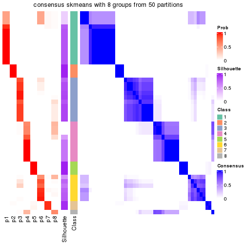</p>

</div>
</div>

Heatmaps for the membership of samples in all partitions to see how consistent they are:


<script>
$( function() {
	$( '#tabs-node-01-membership-heatmap' ).tabs();
} );
</script>
<div id='tabs-node-01-membership-heatmap'>
<ul>
<li><a href='#tab-node-01-membership-heatmap-1'>k = 2</a></li>
<li><a href='#tab-node-01-membership-heatmap-2'>k = 3</a></li>
<li><a href='#tab-node-01-membership-heatmap-3'>k = 4</a></li>
<li><a href='#tab-node-01-membership-heatmap-4'>k = 5</a></li>
<li><a href='#tab-node-01-membership-heatmap-5'>k = 6</a></li>
<li><a href='#tab-node-01-membership-heatmap-6'>k = 7</a></li>
<li><a href='#tab-node-01-membership-heatmap-7'>k = 8</a></li>
</ul>
<div id='tab-node-01-membership-heatmap-1'>
<pre><code class="r">membership_heatmap(res, k = 2)
</code></pre>

<p></p>

</div>
<div id='tab-node-01-membership-heatmap-2'>
<pre><code class="r">membership_heatmap(res, k = 3)
</code></pre>

<p></p>

</div>
<div id='tab-node-01-membership-heatmap-3'>
<pre><code class="r">membership_heatmap(res, k = 4)
</code></pre>

<p></p>

</div>
<div id='tab-node-01-membership-heatmap-4'>
<pre><code class="r">membership_heatmap(res, k = 5)
</code></pre>

<p></p>

</div>
<div id='tab-node-01-membership-heatmap-5'>
<pre><code class="r">membership_heatmap(res, k = 6)
</code></pre>

<p></p>

</div>
<div id='tab-node-01-membership-heatmap-6'>
<pre><code class="r">membership_heatmap(res, k = 7)
</code></pre>

<p></p>

</div>
<div id='tab-node-01-membership-heatmap-7'>
<pre><code class="r">membership_heatmap(res, k = 8)
</code></pre>

<p>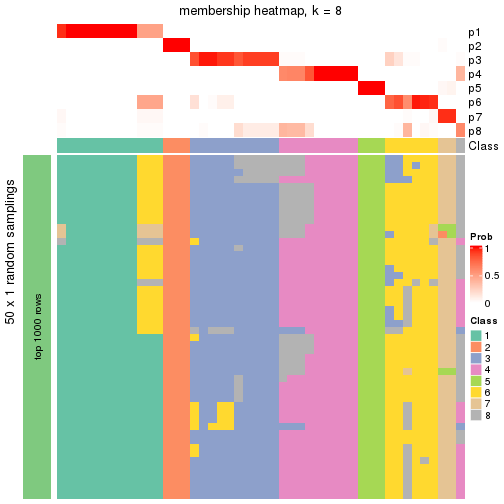</p>

</div>
</div>

As soon as the classes for columns are determined, the signatures
that are significantly different between subgroups can be looked for. 
Following are the heatmaps for signatures.


<script>
$( function() {
	$( '#tabs-node-01-get-signatures' ).tabs();
} );
</script>
<div id='tabs-node-01-get-signatures'>
<ul>
<li><a href='#tab-node-01-get-signatures-1'>k = 2</a></li>
<li><a href='#tab-node-01-get-signatures-2'>k = 3</a></li>
<li><a href='#tab-node-01-get-signatures-3'>k = 4</a></li>
<li><a href='#tab-node-01-get-signatures-4'>k = 5</a></li>
<li><a href='#tab-node-01-get-signatures-5'>k = 6</a></li>
<li><a href='#tab-node-01-get-signatures-6'>k = 7</a></li>
<li><a href='#tab-node-01-get-signatures-7'>k = 8</a></li>
</ul>
<div id='tab-node-01-get-signatures-1'>
<pre><code class="r">get_signatures(res, k = 2)
</code></pre>

<p></p>

</div>
<div id='tab-node-01-get-signatures-2'>
<pre><code class="r">get_signatures(res, k = 3)
</code></pre>

<p></p>

</div>
<div id='tab-node-01-get-signatures-3'>
<pre><code class="r">get_signatures(res, k = 4)
</code></pre>

<p></p>

</div>
<div id='tab-node-01-get-signatures-4'>
<pre><code class="r">get_signatures(res, k = 5)
</code></pre>

<p></p>

</div>
<div id='tab-node-01-get-signatures-5'>
<pre><code class="r">get_signatures(res, k = 6)
</code></pre>

<p></p>

</div>
<div id='tab-node-01-get-signatures-6'>
<pre><code class="r">get_signatures(res, k = 7)
</code></pre>

<p></p>

</div>
<div id='tab-node-01-get-signatures-7'>
<pre><code class="r">get_signatures(res, k = 8)
</code></pre>

<p></p>

</div>
</div>


Compare the overlap of signatures from different k:

```r
compare_signatures(res)
```


`get_signature()` returns a data frame invisibly. To get the list of signatures, the function
call should be assigned to a variable explicitly. In following code, if `plot` argument is set
to `FALSE`, no heatmap is plotted while only the differential analysis is performed.

```r
# code only for demonstration
tb = get_signature(res, k = ..., plot = FALSE)
```

An example of the output of `tb` is:

```
#>   which_row         fdr    mean_1    mean_2 scaled_mean_1 scaled_mean_2 km
#> 1        38 0.042760348  8.373488  9.131774    -0.5533452     0.5164555  1
#> 2        40 0.018707592  7.106213  8.469186    -0.6173731     0.5762149  1
#> 3        55 0.019134737 10.221463 11.207825    -0.6159697     0.5749050  1
#> 4        59 0.006059896  5.921854  7.869574    -0.6899429     0.6439467  1
#> 5        60 0.018055526  8.928898 10.211722    -0.6204761     0.5791110  1
#> 6        98 0.009384629 15.714769 14.887706     0.6635654    -0.6193277  2
...
```

The columns in `tb` are:

1. `which_row`: row indices corresponding to the input matrix.
2. `fdr`: FDR for the differential test. 
3. `mean_x`: The mean value in group x.
4. `scaled_mean_x`: The mean value in group x after rows are scaled.
5. `km`: Row groups if k-means clustering is applied to rows (which is done by automatically selecting number of clusters).

If there are too many signatures, `top_signatures = ...` can be set to only show the 
signatures with the highest FDRs:

```r
# code only for demonstration
# e.g. to show the top 500 most significant rows
tb = get_signature(res, k = ..., top_signatures = 500)
```

If the signatures are defined as these which are uniquely high in current group, `diff_method` argument
can be set to `"uniquely_high_in_one_group"`:

```r
# code only for demonstration
tb = get_signature(res, k = ..., diff_method = "uniquely_high_in_one_group")
```


UMAP plot which shows how samples are separated.


<script>
$( function() {
	$( '#tabs-node-01-dimension-reduction' ).tabs();
} );
</script>
<div id='tabs-node-01-dimension-reduction'>
<ul>
<li><a href='#tab-node-01-dimension-reduction-1'>k = 2</a></li>
<li><a href='#tab-node-01-dimension-reduction-2'>k = 3</a></li>
<li><a href='#tab-node-01-dimension-reduction-3'>k = 4</a></li>
<li><a href='#tab-node-01-dimension-reduction-4'>k = 5</a></li>
<li><a href='#tab-node-01-dimension-reduction-5'>k = 6</a></li>
<li><a href='#tab-node-01-dimension-reduction-6'>k = 7</a></li>
<li><a href='#tab-node-01-dimension-reduction-7'>k = 8</a></li>
</ul>
<div id='tab-node-01-dimension-reduction-1'>
<pre><code class="r">dimension_reduction(res, k = 2, method = &quot;UMAP&quot;)
</code></pre>

<p></p>

</div>
<div id='tab-node-01-dimension-reduction-2'>
<pre><code class="r">dimension_reduction(res, k = 3, method = &quot;UMAP&quot;)
</code></pre>

<p></p>

</div>
<div id='tab-node-01-dimension-reduction-3'>
<pre><code class="r">dimension_reduction(res, k = 4, method = &quot;UMAP&quot;)
</code></pre>

<p></p>

</div>
<div id='tab-node-01-dimension-reduction-4'>
<pre><code class="r">dimension_reduction(res, k = 5, method = &quot;UMAP&quot;)
</code></pre>

<p></p>

</div>
<div id='tab-node-01-dimension-reduction-5'>
<pre><code class="r">dimension_reduction(res, k = 6, method = &quot;UMAP&quot;)
</code></pre>

<p></p>

</div>
<div id='tab-node-01-dimension-reduction-6'>
<pre><code class="r">dimension_reduction(res, k = 7, method = &quot;UMAP&quot;)
</code></pre>

<p></p>

</div>
<div id='tab-node-01-dimension-reduction-7'>
<pre><code class="r">dimension_reduction(res, k = 8, method = &quot;UMAP&quot;)
</code></pre>

<p></p>

</div>
</div>


Following heatmap shows how subgroups are split when increasing `k`:

```r
collect_classes(res)
```


If matrix rows can be associated to genes, consider to use `functional_enrichment(res,
...)` to perform function enrichment for the signature genes. See [this vignette](https://jokergoo.github.io/cola_vignettes/functional_enrichment.html) for more detailed explanations.


 

---------------------------------------------------


### Node013


Parent node: [Node01](#Node01).
Child nodes: 
                Node0131-leaf
        ,
                Node0132-leaf
        ,
                Node0133-leaf
        .


The object with results only for a single top-value method and a single partitioning method 
can be extracted as:

```r
res = res_rh["013"]
```

A summary of `res` and all the functions that can be applied to it:

```r
res
```

```
#> A 'ConsensusPartition' object with k = 2, 3, 4, 5, 6, 7, 8.
#>   On a matrix with 30000 rows and 16 columns.
#>   Top rows (1000) are extracted by 'ATC' method.
#>   Subgroups are detected by 'skmeans' method.
#>   Performed in total 350 partitions by row resampling.
#>   Best k for subgroups seems to be 3.
#> 
#> Following methods can be applied to this 'ConsensusPartition' object:
#>  [1] "cola_report"             "collect_classes"         "collect_plots"          
#>  [4] "collect_stats"           "colnames"                "compare_partitions"     
#>  [7] "compare_signatures"      "consensus_heatmap"       "dimension_reduction"    
#> [10] "functional_enrichment"   "get_anno_col"            "get_anno"               
#> [13] "get_classes"             "get_consensus"           "get_matrix"             
#> [16] "get_membership"          "get_param"               "get_signatures"         
#> [19] "get_stats"               "is_best_k"               "is_stable_k"            
#> [22] "membership_heatmap"      "ncol"                    "nrow"                   
#> [25] "plot_ecdf"               "predict_classes"         "rownames"               
#> [28] "select_partition_number" "show"                    "suggest_best_k"         
#> [31] "test_to_known_factors"   "top_rows_heatmap"
```

`collect_plots()` function collects all the plots made from `res` for all `k` (number of subgroups)
into one single page to provide an easy and fast comparison between different `k`.

```r
collect_plots(res)
```


The plots are:

- The first row: a plot of the eCDF (empirical cumulative distribution
  function) curves of the consensus matrix for each `k` and the heatmap of
  predicted classes for each `k`.
- The second row: heatmaps of the consensus matrix for each `k`.
- The third row: heatmaps of the membership matrix for each `k`.
- The fouth row: heatmaps of the signatures for each `k`.

All the plots in panels can be made by individual functions and they are
plotted later in this section.

`select_partition_number()` produces several plots showing different
statistics for choosing "optimized" `k`. There are following statistics:

- eCDF curves of the consensus matrix for each `k`;
- 1-PAC. [The PAC score](https://en.wikipedia.org/wiki/Consensus_clustering#Over-interpretation_potential_of_consensus_clustering)
  measures the proportion of the ambiguous subgrouping.
- Mean silhouette score.
- Concordance. The mean probability of fiting the consensus subgroup labels in all
  partitions.
- Area increased. Denote $A_k$ as the area under the eCDF curve for current
  `k`, the area increased is defined as $A_k - A_{k-1}$.
- Rand index. The percent of pairs of samples that are both in a same cluster
  or both are not in a same cluster in the partition of k and k-1.
- Jaccard index. The ratio of pairs of samples are both in a same cluster in
  the partition of k and k-1 and the pairs of samples are both in a same
  cluster in the partition k or k-1.

The detailed explanations of these statistics can be found in [the _cola_
vignette](https://jokergoo.github.io/cola_vignettes/cola.html#toc_13).

Generally speaking, higher 1-PAC score, higher mean silhouette score or higher
concordance corresponds to better partition. Rand index and Jaccard index
measure how similar the current partition is compared to partition with `k-1`.
If they are too similar, we won't accept `k` is better than `k-1`.

```r
select_partition_number(res)
```


The numeric values for all these statistics can be obtained by `get_stats()`.

```r
get_stats(res)
```

```
#>   k 1-PAC mean_silhouette concordance area_increased  Rand Jaccard
#> 2 2 1.000           1.000       1.000         0.5338 0.467   0.467
#> 3 3 1.000           0.993       0.995         0.2289 0.875   0.732
#> 4 4 0.925           0.886       0.958         0.0515 0.967   0.902
#> 5 5 0.958           0.807       0.935         0.0348 0.975   0.919
#> 6 6 0.967           0.745       0.955         0.0346 0.983   0.941
#> 7 7 0.850           0.616       0.931         0.0397 0.992   0.969
#> 8 8 0.792           0.417       0.904         0.0688 0.942   0.774
```

`suggest_best_k()` suggests the best $k$ based on these statistics. The rules are as follows:

- All $k$ with Jaccard index larger than 0.95 are removed because increasing
  $k$ does not provide enough extra information. If all $k$ are removed, it is
  marked as no subgroup is detected.
- For all $k$ with 1-PAC score larger than 0.9, the maximal $k$ is taken as
  the best $k$, and other $k$ are marked as optional $k$.
- If it does not fit the second rule. The $k$ with the maximal vote of the
  highest 1-PAC score, highest mean silhouette, and highest concordance is
  taken as the best $k$.

```r
suggest_best_k(res)
```

```
#> [1] 3
#> attr(,"optional")
#> [1] 2
```

There is also optional best $k$ = 2 that is worth to check.

Following is the table of the partitions (You need to click the **show/hide
code output** link to see it). The membership matrix (columns with name `p*`)
is inferred by
[`clue::cl_consensus()`](https://www.rdocumentation.org/link/cl_consensus?package=clue)
function with the `SE` method. Basically the value in the membership matrix
represents the probability to belong to a certain group. The finall subgroup
label for an item is determined with the group with highest probability it
belongs to.

In `get_classes()` function, the entropy is calculated from the membership
matrix and the silhouette score is calculated from the consensus matrix.


<script>
$( function() {
	$( '#tabs-node-013-get-classes' ).tabs();
} );
</script>
<div id='tabs-node-013-get-classes'>
<ul>
<li><a href='#tab-node-013-get-classes-1'>k = 2</a></li>
<li><a href='#tab-node-013-get-classes-2'>k = 3</a></li>
<li><a href='#tab-node-013-get-classes-3'>k = 4</a></li>
<li><a href='#tab-node-013-get-classes-4'>k = 5</a></li>
<li><a href='#tab-node-013-get-classes-5'>k = 6</a></li>
<li><a href='#tab-node-013-get-classes-6'>k = 7</a></li>
<li><a href='#tab-node-013-get-classes-7'>k = 8</a></li>
</ul>

<div id='tab-node-013-get-classes-1'>
<p><a id='tab-node-013-get-classes-1-a' style='color:#0366d6' href='#'>show/hide code output</a></p>
<pre><code class="r">cbind(get_classes(res, k = 2), get_membership(res, k = 2))
</code></pre>

<pre><code>#&gt;                 class entropy silhouette p1 p2
#&gt; TCGA.RL.AAAS.01     2       0          1  0  1
#&gt; TCGA.H6.8124.11     1       0          1  1  0
#&gt; TCGA.IB.AAUW.01     2       0          1  0  1
#&gt; TCGA.IB.8126.01     1       0          1  1  0
#&gt; TCGA.H6.A45N.01     1       0          1  1  0
#&gt; TCGA.US.A774.01     2       0          1  0  1
#&gt; TCGA.HV.A5A5.01     1       0          1  1  0
#&gt; TCGA.HZ.A49H.01     1       0          1  1  0
#&gt; TCGA.IB.A5SQ.01     2       0          1  0  1
#&gt; TCGA.XD.AAUI.01     2       0          1  0  1
#&gt; TCGA.2J.AABT.01     2       0          1  0  1
#&gt; TCGA.XD.AAUG.01     2       0          1  0  1
#&gt; TCGA.IB.7897.01     1       0          1  1  0
#&gt; TCGA.HZ.8003.01     1       0          1  1  0
#&gt; TCGA.2J.AABR.01     2       0          1  0  1
#&gt; TCGA.IB.7891.01     1       0          1  1  0
</code></pre>

<script>
$('#tab-node-013-get-classes-1-a').parent().next().next().hide();
$('#tab-node-013-get-classes-1-a').click(function(){
  $('#tab-node-013-get-classes-1-a').parent().next().next().toggle();
  return(false);
});
</script>
</div>

<div id='tab-node-013-get-classes-2'>
<p><a id='tab-node-013-get-classes-2-a' style='color:#0366d6' href='#'>show/hide code output</a></p>
<pre><code class="r">cbind(get_classes(res, k = 3), get_membership(res, k = 3))
</code></pre>

<pre><code>#&gt;                 class entropy silhouette   p1   p2   p3
#&gt; TCGA.RL.AAAS.01     2  0.0892      0.984 0.02 0.98 0.00
#&gt; TCGA.H6.8124.11     1  0.0000      1.000 1.00 0.00 0.00
#&gt; TCGA.IB.AAUW.01     2  0.0892      0.984 0.02 0.98 0.00
#&gt; TCGA.IB.8126.01     1  0.0000      1.000 1.00 0.00 0.00
#&gt; TCGA.H6.A45N.01     1  0.0000      1.000 1.00 0.00 0.00
#&gt; TCGA.US.A774.01     2  0.0892      0.984 0.02 0.98 0.00
#&gt; TCGA.HV.A5A5.01     1  0.0000      1.000 1.00 0.00 0.00
#&gt; TCGA.HZ.A49H.01     1  0.0000      1.000 1.00 0.00 0.00
#&gt; TCGA.IB.A5SQ.01     2  0.0000      0.976 0.00 1.00 0.00
#&gt; TCGA.XD.AAUI.01     3  0.0000      1.000 0.00 0.00 1.00
#&gt; TCGA.2J.AABT.01     3  0.0000      1.000 0.00 0.00 1.00
#&gt; TCGA.XD.AAUG.01     3  0.0000      1.000 0.00 0.00 1.00
#&gt; TCGA.IB.7897.01     1  0.0000      1.000 1.00 0.00 0.00
#&gt; TCGA.HZ.8003.01     1  0.0000      1.000 1.00 0.00 0.00
#&gt; TCGA.2J.AABR.01     2  0.0892      0.967 0.00 0.98 0.02
#&gt; TCGA.IB.7891.01     1  0.0000      1.000 1.00 0.00 0.00
</code></pre>

<script>
$('#tab-node-013-get-classes-2-a').parent().next().next().hide();
$('#tab-node-013-get-classes-2-a').click(function(){
  $('#tab-node-013-get-classes-2-a').parent().next().next().toggle();
  return(false);
});
</script>
</div>

<div id='tab-node-013-get-classes-3'>
<p><a id='tab-node-013-get-classes-3-a' style='color:#0366d6' href='#'>show/hide code output</a></p>
<pre><code class="r">cbind(get_classes(res, k = 4), get_membership(res, k = 4))
</code></pre>

<pre><code>#&gt;                 class entropy silhouette p1   p2   p3   p4
#&gt; TCGA.RL.AAAS.01     2  0.0000      0.917  0 1.00 0.00 0.00
#&gt; TCGA.H6.8124.11     1  0.0000      1.000  1 0.00 0.00 0.00
#&gt; TCGA.IB.AAUW.01     2  0.0707      0.904  0 0.98 0.00 0.02
#&gt; TCGA.IB.8126.01     1  0.0000      1.000  1 0.00 0.00 0.00
#&gt; TCGA.H6.A45N.01     1  0.0000      1.000  1 0.00 0.00 0.00
#&gt; TCGA.US.A774.01     2  0.0000      0.917  0 1.00 0.00 0.00
#&gt; TCGA.HV.A5A5.01     1  0.0000      1.000  1 0.00 0.00 0.00
#&gt; TCGA.HZ.A49H.01     1  0.0000      1.000  1 0.00 0.00 0.00
#&gt; TCGA.IB.A5SQ.01     2  0.3172      0.767  0 0.84 0.00 0.16
#&gt; TCGA.XD.AAUI.01     3  0.0000      0.912  0 0.00 1.00 0.00
#&gt; TCGA.2J.AABT.01     3  0.3606      0.846  0 0.02 0.84 0.14
#&gt; TCGA.XD.AAUG.01     3  0.1211      0.904  0 0.00 0.96 0.04
#&gt; TCGA.IB.7897.01     1  0.0000      1.000  1 0.00 0.00 0.00
#&gt; TCGA.HZ.8003.01     1  0.0000      1.000  1 0.00 0.00 0.00
#&gt; TCGA.2J.AABR.01     4  0.4406      0.000  0 0.30 0.00 0.70
#&gt; TCGA.IB.7891.01     1  0.0000      1.000  1 0.00 0.00 0.00
</code></pre>

<script>
$('#tab-node-013-get-classes-3-a').parent().next().next().hide();
$('#tab-node-013-get-classes-3-a').click(function(){
  $('#tab-node-013-get-classes-3-a').parent().next().next().toggle();
  return(false);
});
</script>
</div>

<div id='tab-node-013-get-classes-4'>
<p><a id='tab-node-013-get-classes-4-a' style='color:#0366d6' href='#'>show/hide code output</a></p>
<pre><code class="r">cbind(get_classes(res, k = 5), get_membership(res, k = 5))
</code></pre>

<pre><code>#&gt;                 class entropy silhouette p1   p2   p3   p4   p5
#&gt; TCGA.RL.AAAS.01     2  0.0609      0.982  0 0.98 0.00 0.02 0.00
#&gt; TCGA.H6.8124.11     1  0.0000      1.000  1 0.00 0.00 0.00 0.00
#&gt; TCGA.IB.AAUW.01     2  0.0609      0.982  0 0.98 0.00 0.02 0.00
#&gt; TCGA.IB.8126.01     1  0.0000      1.000  1 0.00 0.00 0.00 0.00
#&gt; TCGA.H6.A45N.01     1  0.0000      1.000  1 0.00 0.00 0.00 0.00
#&gt; TCGA.US.A774.01     2  0.0000      0.963  0 1.00 0.00 0.00 0.00
#&gt; TCGA.HV.A5A5.01     1  0.0000      1.000  1 0.00 0.00 0.00 0.00
#&gt; TCGA.HZ.A49H.01     1  0.0000      1.000  1 0.00 0.00 0.00 0.00
#&gt; TCGA.IB.A5SQ.01     5  0.5095      0.000  0 0.40 0.00 0.04 0.56
#&gt; TCGA.XD.AAUI.01     3  0.0609      0.750  0 0.00 0.98 0.02 0.00
#&gt; TCGA.2J.AABT.01     3  0.5131      0.498  0 0.00 0.54 0.04 0.42
#&gt; TCGA.XD.AAUG.01     3  0.1216      0.743  0 0.00 0.96 0.02 0.02
#&gt; TCGA.IB.7897.01     1  0.0000      1.000  1 0.00 0.00 0.00 0.00
#&gt; TCGA.HZ.8003.01     1  0.0000      1.000  1 0.00 0.00 0.00 0.00
#&gt; TCGA.2J.AABR.01     4  0.1410      0.000  0 0.06 0.00 0.94 0.00
#&gt; TCGA.IB.7891.01     1  0.0000      1.000  1 0.00 0.00 0.00 0.00
</code></pre>

<script>
$('#tab-node-013-get-classes-4-a').parent().next().next().hide();
$('#tab-node-013-get-classes-4-a').click(function(){
  $('#tab-node-013-get-classes-4-a').parent().next().next().toggle();
  return(false);
});
</script>
</div>

<div id='tab-node-013-get-classes-5'>
<p><a id='tab-node-013-get-classes-5-a' style='color:#0366d6' href='#'>show/hide code output</a></p>
<pre><code class="r">cbind(get_classes(res, k = 6), get_membership(res, k = 6))
</code></pre>

<pre><code>#&gt;                 class entropy silhouette   p1   p2   p3   p4   p5   p6
#&gt; TCGA.RL.AAAS.01     2  0.0547      0.956 0.00 0.98 0.00 0.00 0.02 0.00
#&gt; TCGA.H6.8124.11     1  0.0000      0.982 1.00 0.00 0.00 0.00 0.00 0.00
#&gt; TCGA.IB.AAUW.01     2  0.0547      0.954 0.00 0.98 0.00 0.02 0.00 0.00
#&gt; TCGA.IB.8126.01     1  0.0000      0.982 1.00 0.00 0.00 0.00 0.00 0.00
#&gt; TCGA.H6.A45N.01     1  0.1480      0.955 0.94 0.00 0.00 0.00 0.02 0.04
#&gt; TCGA.US.A774.01     2  0.1092      0.945 0.00 0.96 0.00 0.02 0.02 0.00
#&gt; TCGA.HV.A5A5.01     1  0.0937      0.965 0.96 0.00 0.00 0.00 0.00 0.04
#&gt; TCGA.HZ.A49H.01     1  0.0547      0.975 0.98 0.00 0.00 0.00 0.02 0.00
#&gt; TCGA.IB.A5SQ.01     5  0.1556      0.000 0.00 0.08 0.00 0.00 0.92 0.00
#&gt; TCGA.XD.AAUI.01     3  0.5256      0.617 0.00 0.00 0.68 0.08 0.06 0.18
#&gt; TCGA.2J.AABT.01     6  0.0937      0.000 0.00 0.00 0.04 0.00 0.00 0.96
#&gt; TCGA.XD.AAUG.01     3  0.0000      0.659 0.00 0.00 1.00 0.00 0.00 0.00
#&gt; TCGA.IB.7897.01     1  0.0547      0.973 0.98 0.00 0.00 0.02 0.00 0.00
#&gt; TCGA.HZ.8003.01     1  0.0000      0.982 1.00 0.00 0.00 0.00 0.00 0.00
#&gt; TCGA.2J.AABR.01     4  0.1480      0.000 0.00 0.04 0.00 0.94 0.02 0.00
#&gt; TCGA.IB.7891.01     1  0.0000      0.982 1.00 0.00 0.00 0.00 0.00 0.00
</code></pre>

<script>
$('#tab-node-013-get-classes-5-a').parent().next().next().hide();
$('#tab-node-013-get-classes-5-a').click(function(){
  $('#tab-node-013-get-classes-5-a').parent().next().next().toggle();
  return(false);
});
</script>
</div>

<div id='tab-node-013-get-classes-6'>
<p><a id='tab-node-013-get-classes-6-a' style='color:#0366d6' href='#'>show/hide code output</a></p>
<pre><code class="r">cbind(get_classes(res, k = 7), get_membership(res, k = 7))
</code></pre>

<pre><code>#&gt;                 class entropy silhouette   p1   p2   p3   p4   p5   p6   p7
#&gt; TCGA.RL.AAAS.01     2  0.1718      0.897 0.00 0.92 0.00 0.00 0.04 0.00 0.04
#&gt; TCGA.H6.8124.11     1  0.0000      0.918 1.00 0.00 0.00 0.00 0.00 0.00 0.00
#&gt; TCGA.IB.AAUW.01     2  0.0000      0.922 0.00 1.00 0.00 0.00 0.00 0.00 0.00
#&gt; TCGA.IB.8126.01     1  0.0000      0.918 1.00 0.00 0.00 0.00 0.00 0.00 0.00
#&gt; TCGA.H6.A45N.01     1  0.3388      0.826 0.76 0.00 0.00 0.00 0.00 0.04 0.20
#&gt; TCGA.US.A774.01     2  0.1860      0.897 0.00 0.92 0.00 0.02 0.04 0.00 0.02
#&gt; TCGA.HV.A5A5.01     1  0.3052      0.841 0.78 0.00 0.00 0.00 0.00 0.02 0.20
#&gt; TCGA.HZ.A49H.01     1  0.2163      0.892 0.88 0.00 0.00 0.00 0.00 0.02 0.10
#&gt; TCGA.IB.A5SQ.01     5  0.0000      0.000 0.00 0.00 0.00 0.00 1.00 0.00 0.00
#&gt; TCGA.XD.AAUI.01     3  0.0000      0.000 0.00 0.00 1.00 0.00 0.00 0.00 0.00
#&gt; TCGA.2J.AABT.01     6  0.0863      0.000 0.00 0.00 0.04 0.00 0.00 0.96 0.00
#&gt; TCGA.XD.AAUG.01     7  0.3186      0.000 0.00 0.00 0.22 0.00 0.00 0.02 0.76
#&gt; TCGA.IB.7897.01     1  0.0504      0.916 0.98 0.00 0.00 0.00 0.00 0.00 0.02
#&gt; TCGA.HZ.8003.01     1  0.0863      0.916 0.96 0.00 0.00 0.00 0.00 0.00 0.04
#&gt; TCGA.2J.AABR.01     4  0.0504      0.000 0.00 0.02 0.00 0.98 0.00 0.00 0.00
#&gt; TCGA.IB.7891.01     1  0.0000      0.918 1.00 0.00 0.00 0.00 0.00 0.00 0.00
</code></pre>

<script>
$('#tab-node-013-get-classes-6-a').parent().next().next().hide();
$('#tab-node-013-get-classes-6-a').click(function(){
  $('#tab-node-013-get-classes-6-a').parent().next().next().toggle();
  return(false);
});
</script>
</div>

<div id='tab-node-013-get-classes-7'>
<p><a id='tab-node-013-get-classes-7-a' style='color:#0366d6' href='#'>show/hide code output</a></p>
<pre><code class="r">cbind(get_classes(res, k = 8), get_membership(res, k = 8))
</code></pre>

<pre><code>#&gt;                 class entropy silhouette   p1   p2   p3 p4   p5 p6   p7   p8
#&gt; TCGA.RL.AAAS.01     2  0.2547      0.731 0.00 0.84 0.00  0 0.04  0 0.00 0.12
#&gt; TCGA.H6.8124.11     1  0.1091      0.758 0.94 0.00 0.00  0 0.00  0 0.00 0.06
#&gt; TCGA.IB.AAUW.01     2  0.0471      0.782 0.00 0.98 0.00  0 0.00  0 0.00 0.02
#&gt; TCGA.IB.8126.01     1  0.0000      0.785 1.00 0.00 0.00  0 0.00  0 0.00 0.00
#&gt; TCGA.H6.A45N.01     8  0.3198      0.000 0.26 0.02 0.00  0 0.00  0 0.00 0.72
#&gt; TCGA.US.A774.01     2  0.3744      0.667 0.00 0.74 0.02  0 0.06  0 0.00 0.18
#&gt; TCGA.HV.A5A5.01     1  0.2938      0.313 0.70 0.00 0.00  0 0.00  0 0.00 0.30
#&gt; TCGA.HZ.A49H.01     1  0.2114      0.648 0.84 0.00 0.00  0 0.00  0 0.00 0.16
#&gt; TCGA.IB.A5SQ.01     5  0.0000      0.000 0.00 0.00 0.00  0 1.00  0 0.00 0.00
#&gt; TCGA.XD.AAUI.01     3  0.0471      0.000 0.00 0.00 0.98  0 0.00  0 0.02 0.00
#&gt; TCGA.2J.AABT.01     6  0.0000      0.000 0.00 0.00 0.00  0 0.00  1 0.00 0.00
#&gt; TCGA.XD.AAUG.01     7  0.0000      0.000 0.00 0.00 0.00  0 0.00  0 1.00 0.00
#&gt; TCGA.IB.7897.01     1  0.2756      0.424 0.74 0.00 0.00  0 0.00  0 0.00 0.26
#&gt; TCGA.HZ.8003.01     1  0.0000      0.785 1.00 0.00 0.00  0 0.00  0 0.00 0.00
#&gt; TCGA.2J.AABR.01     4  0.0000      0.000 0.00 0.00 0.00  1 0.00  0 0.00 0.00
#&gt; TCGA.IB.7891.01     1  0.0471      0.783 0.98 0.00 0.00  0 0.00  0 0.00 0.02
</code></pre>

<script>
$('#tab-node-013-get-classes-7-a').parent().next().next().hide();
$('#tab-node-013-get-classes-7-a').click(function(){
  $('#tab-node-013-get-classes-7-a').parent().next().next().toggle();
  return(false);
});
</script>
</div>
</div>

Heatmaps for the consensus matrix. It visualizes the probability of two
samples to be in a same group.


<script>
$( function() {
	$( '#tabs-node-013-consensus-heatmap' ).tabs();
} );
</script>
<div id='tabs-node-013-consensus-heatmap'>
<ul>
<li><a href='#tab-node-013-consensus-heatmap-1'>k = 2</a></li>
<li><a href='#tab-node-013-consensus-heatmap-2'>k = 3</a></li>
<li><a href='#tab-node-013-consensus-heatmap-3'>k = 4</a></li>
<li><a href='#tab-node-013-consensus-heatmap-4'>k = 5</a></li>
<li><a href='#tab-node-013-consensus-heatmap-5'>k = 6</a></li>
<li><a href='#tab-node-013-consensus-heatmap-6'>k = 7</a></li>
<li><a href='#tab-node-013-consensus-heatmap-7'>k = 8</a></li>
</ul>
<div id='tab-node-013-consensus-heatmap-1'>
<pre><code class="r">consensus_heatmap(res, k = 2)
</code></pre>

<p></p>

</div>
<div id='tab-node-013-consensus-heatmap-2'>
<pre><code class="r">consensus_heatmap(res, k = 3)
</code></pre>

<p></p>

</div>
<div id='tab-node-013-consensus-heatmap-3'>
<pre><code class="r">consensus_heatmap(res, k = 4)
</code></pre>

<p></p>

</div>
<div id='tab-node-013-consensus-heatmap-4'>
<pre><code class="r">consensus_heatmap(res, k = 5)
</code></pre>

<p></p>

</div>
<div id='tab-node-013-consensus-heatmap-5'>
<pre><code class="r">consensus_heatmap(res, k = 6)
</code></pre>

<p></p>

</div>
<div id='tab-node-013-consensus-heatmap-6'>
<pre><code class="r">consensus_heatmap(res, k = 7)
</code></pre>

<p></p>

</div>
<div id='tab-node-013-consensus-heatmap-7'>
<pre><code class="r">consensus_heatmap(res, k = 8)
</code></pre>

<p></p>

</div>
</div>

Heatmaps for the membership of samples in all partitions to see how consistent they are:


<script>
$( function() {
	$( '#tabs-node-013-membership-heatmap' ).tabs();
} );
</script>
<div id='tabs-node-013-membership-heatmap'>
<ul>
<li><a href='#tab-node-013-membership-heatmap-1'>k = 2</a></li>
<li><a href='#tab-node-013-membership-heatmap-2'>k = 3</a></li>
<li><a href='#tab-node-013-membership-heatmap-3'>k = 4</a></li>
<li><a href='#tab-node-013-membership-heatmap-4'>k = 5</a></li>
<li><a href='#tab-node-013-membership-heatmap-5'>k = 6</a></li>
<li><a href='#tab-node-013-membership-heatmap-6'>k = 7</a></li>
<li><a href='#tab-node-013-membership-heatmap-7'>k = 8</a></li>
</ul>
<div id='tab-node-013-membership-heatmap-1'>
<pre><code class="r">membership_heatmap(res, k = 2)
</code></pre>

<p></p>

</div>
<div id='tab-node-013-membership-heatmap-2'>
<pre><code class="r">membership_heatmap(res, k = 3)
</code></pre>

<p></p>

</div>
<div id='tab-node-013-membership-heatmap-3'>
<pre><code class="r">membership_heatmap(res, k = 4)
</code></pre>

<p></p>

</div>
<div id='tab-node-013-membership-heatmap-4'>
<pre><code class="r">membership_heatmap(res, k = 5)
</code></pre>

<p></p>

</div>
<div id='tab-node-013-membership-heatmap-5'>
<pre><code class="r">membership_heatmap(res, k = 6)
</code></pre>

<p></p>

</div>
<div id='tab-node-013-membership-heatmap-6'>
<pre><code class="r">membership_heatmap(res, k = 7)
</code></pre>

<p></p>

</div>
<div id='tab-node-013-membership-heatmap-7'>
<pre><code class="r">membership_heatmap(res, k = 8)
</code></pre>

<p>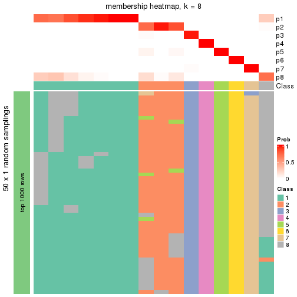</p>

</div>
</div>

As soon as the classes for columns are determined, the signatures
that are significantly different between subgroups can be looked for. 
Following are the heatmaps for signatures.


<script>
$( function() {
	$( '#tabs-node-013-get-signatures' ).tabs();
} );
</script>
<div id='tabs-node-013-get-signatures'>
<ul>
<li><a href='#tab-node-013-get-signatures-1'>k = 2</a></li>
<li><a href='#tab-node-013-get-signatures-2'>k = 3</a></li>
<li><a href='#tab-node-013-get-signatures-3'>k = 4</a></li>
<li><a href='#tab-node-013-get-signatures-4'>k = 5</a></li>
<li><a href='#tab-node-013-get-signatures-5'>k = 6</a></li>
<li><a href='#tab-node-013-get-signatures-6'>k = 7</a></li>
<li><a href='#tab-node-013-get-signatures-7'>k = 8</a></li>
</ul>
<div id='tab-node-013-get-signatures-1'>
<pre><code class="r">get_signatures(res, k = 2)
</code></pre>

<p>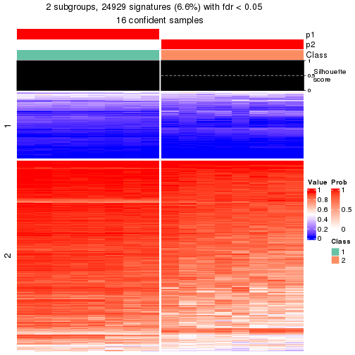</p>

</div>
<div id='tab-node-013-get-signatures-2'>
<pre><code class="r">get_signatures(res, k = 3)
</code></pre>

<p></p>

</div>
<div id='tab-node-013-get-signatures-3'>
<pre><code class="r">get_signatures(res, k = 4)
</code></pre>

<p></p>

</div>
<div id='tab-node-013-get-signatures-4'>
<pre><code class="r">get_signatures(res, k = 5)
</code></pre>

<p></p>

</div>
<div id='tab-node-013-get-signatures-5'>
<pre><code class="r">get_signatures(res, k = 6)
</code></pre>

<p></p>

</div>
<div id='tab-node-013-get-signatures-6'>
<pre><code class="r">get_signatures(res, k = 7)
</code></pre>

<p></p>

</div>
<div id='tab-node-013-get-signatures-7'>
<pre><code class="r">get_signatures(res, k = 8)
</code></pre>

<p></p>

</div>
</div>


Compare the overlap of signatures from different k:

```r
compare_signatures(res)
```

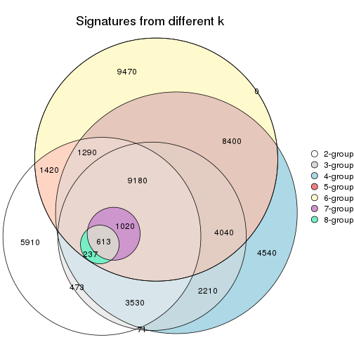

`get_signature()` returns a data frame invisibly. To get the list of signatures, the function
call should be assigned to a variable explicitly. In following code, if `plot` argument is set
to `FALSE`, no heatmap is plotted while only the differential analysis is performed.

```r
# code only for demonstration
tb = get_signature(res, k = ..., plot = FALSE)
```

An example of the output of `tb` is:

```
#>   which_row         fdr    mean_1    mean_2 scaled_mean_1 scaled_mean_2 km
#> 1        38 0.042760348  8.373488  9.131774    -0.5533452     0.5164555  1
#> 2        40 0.018707592  7.106213  8.469186    -0.6173731     0.5762149  1
#> 3        55 0.019134737 10.221463 11.207825    -0.6159697     0.5749050  1
#> 4        59 0.006059896  5.921854  7.869574    -0.6899429     0.6439467  1
#> 5        60 0.018055526  8.928898 10.211722    -0.6204761     0.5791110  1
#> 6        98 0.009384629 15.714769 14.887706     0.6635654    -0.6193277  2
...
```

The columns in `tb` are:

1. `which_row`: row indices corresponding to the input matrix.
2. `fdr`: FDR for the differential test. 
3. `mean_x`: The mean value in group x.
4. `scaled_mean_x`: The mean value in group x after rows are scaled.
5. `km`: Row groups if k-means clustering is applied to rows (which is done by automatically selecting number of clusters).

If there are too many signatures, `top_signatures = ...` can be set to only show the 
signatures with the highest FDRs:

```r
# code only for demonstration
# e.g. to show the top 500 most significant rows
tb = get_signature(res, k = ..., top_signatures = 500)
```

If the signatures are defined as these which are uniquely high in current group, `diff_method` argument
can be set to `"uniquely_high_in_one_group"`:

```r
# code only for demonstration
tb = get_signature(res, k = ..., diff_method = "uniquely_high_in_one_group")
```


UMAP plot which shows how samples are separated.


<script>
$( function() {
	$( '#tabs-node-013-dimension-reduction' ).tabs();
} );
</script>
<div id='tabs-node-013-dimension-reduction'>
<ul>
<li><a href='#tab-node-013-dimension-reduction-1'>k = 2</a></li>
<li><a href='#tab-node-013-dimension-reduction-2'>k = 3</a></li>
<li><a href='#tab-node-013-dimension-reduction-3'>k = 4</a></li>
<li><a href='#tab-node-013-dimension-reduction-4'>k = 5</a></li>
<li><a href='#tab-node-013-dimension-reduction-5'>k = 6</a></li>
<li><a href='#tab-node-013-dimension-reduction-6'>k = 7</a></li>
<li><a href='#tab-node-013-dimension-reduction-7'>k = 8</a></li>
</ul>
<div id='tab-node-013-dimension-reduction-1'>
<pre><code class="r">dimension_reduction(res, k = 2, method = &quot;UMAP&quot;)
</code></pre>

<p></p>

</div>
<div id='tab-node-013-dimension-reduction-2'>
<pre><code class="r">dimension_reduction(res, k = 3, method = &quot;UMAP&quot;)
</code></pre>

<p></p>

</div>
<div id='tab-node-013-dimension-reduction-3'>
<pre><code class="r">dimension_reduction(res, k = 4, method = &quot;UMAP&quot;)
</code></pre>

<p></p>

</div>
<div id='tab-node-013-dimension-reduction-4'>
<pre><code class="r">dimension_reduction(res, k = 5, method = &quot;UMAP&quot;)
</code></pre>

<p></p>

</div>
<div id='tab-node-013-dimension-reduction-5'>
<pre><code class="r">dimension_reduction(res, k = 6, method = &quot;UMAP&quot;)
</code></pre>

<p></p>

</div>
<div id='tab-node-013-dimension-reduction-6'>
<pre><code class="r">dimension_reduction(res, k = 7, method = &quot;UMAP&quot;)
</code></pre>

<p></p>

</div>
<div id='tab-node-013-dimension-reduction-7'>
<pre><code class="r">dimension_reduction(res, k = 8, method = &quot;UMAP&quot;)
</code></pre>

<p></p>

</div>
</div>


Following heatmap shows how subgroups are split when increasing `k`:

```r
collect_classes(res)
```


If matrix rows can be associated to genes, consider to use `functional_enrichment(res,
...)` to perform function enrichment for the signature genes. See [this vignette](https://jokergoo.github.io/cola_vignettes/functional_enrichment.html) for more detailed explanations.


 

---------------------------------------------------


### Node03


Parent node: [Node0](#Node0).
Child nodes: 
                Node011-leaf
        ,
                Node012-leaf
        ,
                [Node013](#Node013)
        ,
                Node014-leaf
        ,
                Node031-leaf
        ,
                Node032-leaf
        ,
                Node033-leaf
        ,
                Node034-leaf
        ,
                Node041-leaf
        ,
                Node042-leaf
        ,
                Node043-leaf
        ,
                Node051-leaf
        ,
                Node052-leaf
        ,
                Node053-leaf
        ,
                Node054-leaf
        .


The object with results only for a single top-value method and a single partitioning method 
can be extracted as:

```r
res = res_rh["03"]
```

A summary of `res` and all the functions that can be applied to it:

```r
res
```

```
#> A 'ConsensusPartition' object with k = 2, 3, 4, 5, 6, 7, 8.
#>   On a matrix with 30000 rows and 29 columns.
#>   Top rows (1000) are extracted by 'SD' method.
#>   Subgroups are detected by 'skmeans' method.
#>   Performed in total 350 partitions by row resampling.
#>   Best k for subgroups seems to be 4.
#> 
#> Following methods can be applied to this 'ConsensusPartition' object:
#>  [1] "cola_report"             "collect_classes"         "collect_plots"          
#>  [4] "collect_stats"           "colnames"                "compare_partitions"     
#>  [7] "compare_signatures"      "consensus_heatmap"       "dimension_reduction"    
#> [10] "functional_enrichment"   "get_anno_col"            "get_anno"               
#> [13] "get_classes"             "get_consensus"           "get_matrix"             
#> [16] "get_membership"          "get_param"               "get_signatures"         
#> [19] "get_stats"               "is_best_k"               "is_stable_k"            
#> [22] "membership_heatmap"      "ncol"                    "nrow"                   
#> [25] "plot_ecdf"               "predict_classes"         "rownames"               
#> [28] "select_partition_number" "show"                    "suggest_best_k"         
#> [31] "test_to_known_factors"   "top_rows_heatmap"
```

`collect_plots()` function collects all the plots made from `res` for all `k` (number of subgroups)
into one single page to provide an easy and fast comparison between different `k`.

```r
collect_plots(res)
```


The plots are:

- The first row: a plot of the eCDF (empirical cumulative distribution
  function) curves of the consensus matrix for each `k` and the heatmap of
  predicted classes for each `k`.
- The second row: heatmaps of the consensus matrix for each `k`.
- The third row: heatmaps of the membership matrix for each `k`.
- The fouth row: heatmaps of the signatures for each `k`.

All the plots in panels can be made by individual functions and they are
plotted later in this section.

`select_partition_number()` produces several plots showing different
statistics for choosing "optimized" `k`. There are following statistics:

- eCDF curves of the consensus matrix for each `k`;
- 1-PAC. [The PAC score](https://en.wikipedia.org/wiki/Consensus_clustering#Over-interpretation_potential_of_consensus_clustering)
  measures the proportion of the ambiguous subgrouping.
- Mean silhouette score.
- Concordance. The mean probability of fiting the consensus subgroup labels in all
  partitions.
- Area increased. Denote $A_k$ as the area under the eCDF curve for current
  `k`, the area increased is defined as $A_k - A_{k-1}$.
- Rand index. The percent of pairs of samples that are both in a same cluster
  or both are not in a same cluster in the partition of k and k-1.
- Jaccard index. The ratio of pairs of samples are both in a same cluster in
  the partition of k and k-1 and the pairs of samples are both in a same
  cluster in the partition k or k-1.

The detailed explanations of these statistics can be found in [the _cola_
vignette](https://jokergoo.github.io/cola_vignettes/cola.html#toc_13).

Generally speaking, higher 1-PAC score, higher mean silhouette score or higher
concordance corresponds to better partition. Rand index and Jaccard index
measure how similar the current partition is compared to partition with `k-1`.
If they are too similar, we won't accept `k` is better than `k-1`.

```r
select_partition_number(res)
```


The numeric values for all these statistics can be obtained by `get_stats()`.

```r
get_stats(res)
```

```
#>   k 1-PAC mean_silhouette concordance area_increased  Rand Jaccard
#> 2 2 1.000           0.984       0.993         0.4488 0.557   0.557
#> 3 3 1.000           0.992       0.996         0.1832 0.892   0.810
#> 4 4 1.000           0.999       0.999         0.3185 0.828   0.635
#> 5 5 0.897           0.894       0.956         0.0419 0.988   0.959
#> 6 6 0.863           0.882       0.925         0.0648 0.919   0.718
#> 7 7 0.803           0.767       0.899         0.0339 0.990   0.952
#> 8 8 0.783           0.777       0.906         0.0185 0.993   0.963
```

`suggest_best_k()` suggests the best $k$ based on these statistics. The rules are as follows:

- All $k$ with Jaccard index larger than 0.95 are removed because increasing
  $k$ does not provide enough extra information. If all $k$ are removed, it is
  marked as no subgroup is detected.
- For all $k$ with 1-PAC score larger than 0.9, the maximal $k$ is taken as
  the best $k$, and other $k$ are marked as optional $k$.
- If it does not fit the second rule. The $k$ with the maximal vote of the
  highest 1-PAC score, highest mean silhouette, and highest concordance is
  taken as the best $k$.

```r
suggest_best_k(res)
```

```
#> [1] 4
#> attr(,"optional")
#> [1] 2 3
```

There is also optional best $k$ = 2 3 that is worth to check.

Following is the table of the partitions (You need to click the **show/hide
code output** link to see it). The membership matrix (columns with name `p*`)
is inferred by
[`clue::cl_consensus()`](https://www.rdocumentation.org/link/cl_consensus?package=clue)
function with the `SE` method. Basically the value in the membership matrix
represents the probability to belong to a certain group. The finall subgroup
label for an item is determined with the group with highest probability it
belongs to.

In `get_classes()` function, the entropy is calculated from the membership
matrix and the silhouette score is calculated from the consensus matrix.


<script>
$( function() {
	$( '#tabs-node-03-get-classes' ).tabs();
} );
</script>
<div id='tabs-node-03-get-classes'>
<ul>
<li><a href='#tab-node-03-get-classes-1'>k = 2</a></li>
<li><a href='#tab-node-03-get-classes-2'>k = 3</a></li>
<li><a href='#tab-node-03-get-classes-3'>k = 4</a></li>
<li><a href='#tab-node-03-get-classes-4'>k = 5</a></li>
<li><a href='#tab-node-03-get-classes-5'>k = 6</a></li>
<li><a href='#tab-node-03-get-classes-6'>k = 7</a></li>
<li><a href='#tab-node-03-get-classes-7'>k = 8</a></li>
</ul>

<div id='tab-node-03-get-classes-1'>
<p><a id='tab-node-03-get-classes-1-a' style='color:#0366d6' href='#'>show/hide code output</a></p>
<pre><code class="r">cbind(get_classes(res, k = 2), get_membership(res, k = 2))
</code></pre>

<pre><code>#&gt;                 class entropy silhouette  p1  p2
#&gt; TCGA.FZ.5923.11     2   0.000      1.000 0.0 1.0
#&gt; TCGA.FZ.5922.11     1   0.000      0.989 1.0 0.0
#&gt; TCGA.FZ.5924.11     1   0.000      0.989 1.0 0.0
#&gt; TCGA.HZ.7918.01     1   0.000      0.989 1.0 0.0
#&gt; TCGA.IB.AAUT.01     1   0.000      0.989 1.0 0.0
#&gt; TCGA.3A.A9IO.01     2   0.000      1.000 0.0 1.0
#&gt; TCGA.IB.AAUM.01     1   0.000      0.989 1.0 0.0
#&gt; TCGA.F2.7276.01     1   0.000      0.989 1.0 0.0
#&gt; TCGA.HZ.8519.01     1   0.722      0.750 0.8 0.2
#&gt; TCGA.FZ.5920.11     2   0.000      1.000 0.0 1.0
#&gt; TCGA.F2.6880.01     2   0.000      1.000 0.0 1.0
#&gt; TCGA.IB.AAUR.01     1   0.000      0.989 1.0 0.0
#&gt; TCGA.F2.7273.01     1   0.000      0.989 1.0 0.0
#&gt; TCGA.2L.AAQM.01     2   0.000      1.000 0.0 1.0
#&gt; TCGA.IB.AAUV.01     1   0.000      0.989 1.0 0.0
#&gt; TCGA.HZ.7923.01     1   0.000      0.989 1.0 0.0
#&gt; TCGA.RB.AA9M.01     1   0.000      0.989 1.0 0.0
#&gt; TCGA.FB.A4P6.01     1   0.000      0.989 1.0 0.0
#&gt; TCGA.HV.A5A3.11     1   0.000      0.989 1.0 0.0
#&gt; TCGA.2J.AABV.01     2   0.000      1.000 0.0 1.0
#&gt; TCGA.3A.A9IV.01     2   0.000      1.000 0.0 1.0
#&gt; TCGA.F2.A44H.01     1   0.000      0.989 1.0 0.0
#&gt; TCGA.Q3.A5QY.01     1   0.000      0.989 1.0 0.0
#&gt; TCGA.HZ.7920.01     1   0.000      0.989 1.0 0.0
#&gt; TCGA.HZ.8002.01     1   0.000      0.989 1.0 0.0
#&gt; TCGA.3A.A9IJ.01     2   0.000      1.000 0.0 1.0
#&gt; TCGA.HV.AA8V.01     1   0.000      0.989 1.0 0.0
#&gt; TCGA.3A.A9IX.01     1   0.000      0.989 1.0 0.0
#&gt; TCGA.3A.A9IS.01     2   0.000      1.000 0.0 1.0
</code></pre>

<script>
$('#tab-node-03-get-classes-1-a').parent().next().next().hide();
$('#tab-node-03-get-classes-1-a').click(function(){
  $('#tab-node-03-get-classes-1-a').parent().next().next().toggle();
  return(false);
});
</script>
</div>

<div id='tab-node-03-get-classes-2'>
<p><a id='tab-node-03-get-classes-2-a' style='color:#0366d6' href='#'>show/hide code output</a></p>
<pre><code class="r">cbind(get_classes(res, k = 3), get_membership(res, k = 3))
</code></pre>

<pre><code>#&gt;                 class entropy silhouette   p1 p2   p3
#&gt; TCGA.FZ.5923.11     3   0.000      1.000 0.00  0 1.00
#&gt; TCGA.FZ.5922.11     1   0.000      0.993 1.00  0 0.00
#&gt; TCGA.FZ.5924.11     1   0.153      0.963 0.96  0 0.04
#&gt; TCGA.HZ.7918.01     1   0.000      0.993 1.00  0 0.00
#&gt; TCGA.IB.AAUT.01     1   0.000      0.993 1.00  0 0.00
#&gt; TCGA.3A.A9IO.01     2   0.000      1.000 0.00  1 0.00
#&gt; TCGA.IB.AAUM.01     1   0.153      0.963 0.96  0 0.04
#&gt; TCGA.F2.7276.01     1   0.000      0.993 1.00  0 0.00
#&gt; TCGA.HZ.8519.01     2   0.000      1.000 0.00  1 0.00
#&gt; TCGA.FZ.5920.11     3   0.000      1.000 0.00  0 1.00
#&gt; TCGA.F2.6880.01     3   0.000      1.000 0.00  0 1.00
#&gt; TCGA.IB.AAUR.01     1   0.000      0.993 1.00  0 0.00
#&gt; TCGA.F2.7273.01     1   0.000      0.993 1.00  0 0.00
#&gt; TCGA.2L.AAQM.01     2   0.000      1.000 0.00  1 0.00
#&gt; TCGA.IB.AAUV.01     1   0.000      0.993 1.00  0 0.00
#&gt; TCGA.HZ.7923.01     1   0.000      0.993 1.00  0 0.00
#&gt; TCGA.RB.AA9M.01     1   0.000      0.993 1.00  0 0.00
#&gt; TCGA.FB.A4P6.01     1   0.000      0.993 1.00  0 0.00
#&gt; TCGA.HV.A5A3.11     1   0.000      0.993 1.00  0 0.00
#&gt; TCGA.2J.AABV.01     3   0.000      1.000 0.00  0 1.00
#&gt; TCGA.3A.A9IV.01     2   0.000      1.000 0.00  1 0.00
#&gt; TCGA.F2.A44H.01     1   0.153      0.963 0.96  0 0.04
#&gt; TCGA.Q3.A5QY.01     1   0.000      0.993 1.00  0 0.00
#&gt; TCGA.HZ.7920.01     1   0.000      0.993 1.00  0 0.00
#&gt; TCGA.HZ.8002.01     1   0.000      0.993 1.00  0 0.00
#&gt; TCGA.3A.A9IJ.01     2   0.000      1.000 0.00  1 0.00
#&gt; TCGA.HV.AA8V.01     1   0.000      0.993 1.00  0 0.00
#&gt; TCGA.3A.A9IX.01     1   0.000      0.993 1.00  0 0.00
#&gt; TCGA.3A.A9IS.01     2   0.000      1.000 0.00  1 0.00
</code></pre>

<script>
$('#tab-node-03-get-classes-2-a').parent().next().next().hide();
$('#tab-node-03-get-classes-2-a').click(function(){
  $('#tab-node-03-get-classes-2-a').parent().next().next().toggle();
  return(false);
});
</script>
</div>

<div id='tab-node-03-get-classes-3'>
<p><a id='tab-node-03-get-classes-3-a' style='color:#0366d6' href='#'>show/hide code output</a></p>
<pre><code class="r">cbind(get_classes(res, k = 4), get_membership(res, k = 4))
</code></pre>

<pre><code>#&gt;                 class entropy silhouette   p1 p2 p3   p4
#&gt; TCGA.FZ.5923.11     3  0.0000      1.000 0.00  0  1 0.00
#&gt; TCGA.FZ.5922.11     1  0.0000      0.998 1.00  0  0 0.00
#&gt; TCGA.FZ.5924.11     1  0.0000      0.998 1.00  0  0 0.00
#&gt; TCGA.HZ.7918.01     1  0.0000      0.998 1.00  0  0 0.00
#&gt; TCGA.IB.AAUT.01     1  0.0000      0.998 1.00  0  0 0.00
#&gt; TCGA.3A.A9IO.01     2  0.0000      1.000 0.00  1  0 0.00
#&gt; TCGA.IB.AAUM.01     1  0.0000      0.998 1.00  0  0 0.00
#&gt; TCGA.F2.7276.01     1  0.0000      0.998 1.00  0  0 0.00
#&gt; TCGA.HZ.8519.01     2  0.0000      1.000 0.00  1  0 0.00
#&gt; TCGA.FZ.5920.11     3  0.0000      1.000 0.00  0  1 0.00
#&gt; TCGA.F2.6880.01     3  0.0000      1.000 0.00  0  1 0.00
#&gt; TCGA.IB.AAUR.01     4  0.0000      1.000 0.00  0  0 1.00
#&gt; TCGA.F2.7273.01     1  0.0000      0.998 1.00  0  0 0.00
#&gt; TCGA.2L.AAQM.01     2  0.0000      1.000 0.00  1  0 0.00
#&gt; TCGA.IB.AAUV.01     4  0.0000      1.000 0.00  0  0 1.00
#&gt; TCGA.HZ.7923.01     4  0.0000      1.000 0.00  0  0 1.00
#&gt; TCGA.RB.AA9M.01     1  0.0000      0.998 1.00  0  0 0.00
#&gt; TCGA.FB.A4P6.01     1  0.0000      0.998 1.00  0  0 0.00
#&gt; TCGA.HV.A5A3.11     1  0.0000      0.998 1.00  0  0 0.00
#&gt; TCGA.2J.AABV.01     3  0.0000      1.000 0.00  0  1 0.00
#&gt; TCGA.3A.A9IV.01     2  0.0000      1.000 0.00  1  0 0.00
#&gt; TCGA.F2.A44H.01     1  0.0000      0.998 1.00  0  0 0.00
#&gt; TCGA.Q3.A5QY.01     4  0.0000      1.000 0.00  0  0 1.00
#&gt; TCGA.HZ.7920.01     4  0.0000      1.000 0.00  0  0 1.00
#&gt; TCGA.HZ.8002.01     1  0.0000      0.998 1.00  0  0 0.00
#&gt; TCGA.3A.A9IJ.01     2  0.0000      1.000 0.00  1  0 0.00
#&gt; TCGA.HV.AA8V.01     1  0.0707      0.979 0.98  0  0 0.02
#&gt; TCGA.3A.A9IX.01     1  0.0000      0.998 1.00  0  0 0.00
#&gt; TCGA.3A.A9IS.01     2  0.0000      1.000 0.00  1  0 0.00
</code></pre>

<script>
$('#tab-node-03-get-classes-3-a').parent().next().next().hide();
$('#tab-node-03-get-classes-3-a').click(function(){
  $('#tab-node-03-get-classes-3-a').parent().next().next().toggle();
  return(false);
});
</script>
</div>

<div id='tab-node-03-get-classes-4'>
<p><a id='tab-node-03-get-classes-4-a' style='color:#0366d6' href='#'>show/hide code output</a></p>
<pre><code class="r">cbind(get_classes(res, k = 5), get_membership(res, k = 5))
</code></pre>

<pre><code>#&gt;                 class entropy silhouette   p1   p2 p3 p4   p5
#&gt; TCGA.FZ.5923.11     3  0.0000      1.000 0.00 0.00  1  0 0.00
#&gt; TCGA.FZ.5922.11     1  0.0000      0.948 1.00 0.00  0  0 0.00
#&gt; TCGA.FZ.5924.11     1  0.3109      0.812 0.80 0.00  0  0 0.20
#&gt; TCGA.HZ.7918.01     1  0.0000      0.948 1.00 0.00  0  0 0.00
#&gt; TCGA.IB.AAUT.01     1  0.0000      0.948 1.00 0.00  0  0 0.00
#&gt; TCGA.3A.A9IO.01     2  0.0000      0.872 0.00 1.00  0  0 0.00
#&gt; TCGA.IB.AAUM.01     1  0.3109      0.812 0.80 0.00  0  0 0.20
#&gt; TCGA.F2.7276.01     1  0.0609      0.943 0.98 0.00  0  0 0.02
#&gt; TCGA.HZ.8519.01     2  0.0000      0.872 0.00 1.00  0  0 0.00
#&gt; TCGA.FZ.5920.11     3  0.0000      1.000 0.00 0.00  1  0 0.00
#&gt; TCGA.F2.6880.01     3  0.0000      1.000 0.00 0.00  1  0 0.00
#&gt; TCGA.IB.AAUR.01     4  0.0000      1.000 0.00 0.00  0  1 0.00
#&gt; TCGA.F2.7273.01     1  0.0609      0.943 0.98 0.00  0  0 0.02
#&gt; TCGA.2L.AAQM.01     5  0.3274      0.000 0.00 0.22  0  0 0.78
#&gt; TCGA.IB.AAUV.01     4  0.0000      1.000 0.00 0.00  0  1 0.00
#&gt; TCGA.HZ.7923.01     4  0.0000      1.000 0.00 0.00  0  1 0.00
#&gt; TCGA.RB.AA9M.01     1  0.0609      0.943 0.98 0.00  0  0 0.02
#&gt; TCGA.FB.A4P6.01     1  0.0000      0.948 1.00 0.00  0  0 0.00
#&gt; TCGA.HV.A5A3.11     1  0.0000      0.948 1.00 0.00  0  0 0.00
#&gt; TCGA.2J.AABV.01     3  0.0000      1.000 0.00 0.00  1  0 0.00
#&gt; TCGA.3A.A9IV.01     2  0.3424      0.655 0.00 0.76  0  0 0.24
#&gt; TCGA.F2.A44H.01     1  0.3109      0.812 0.80 0.00  0  0 0.20
#&gt; TCGA.Q3.A5QY.01     4  0.0000      1.000 0.00 0.00  0  1 0.00
#&gt; TCGA.HZ.7920.01     4  0.0000      1.000 0.00 0.00  0  1 0.00
#&gt; TCGA.HZ.8002.01     1  0.0000      0.948 1.00 0.00  0  0 0.00
#&gt; TCGA.3A.A9IJ.01     2  0.0609      0.874 0.00 0.98  0  0 0.02
#&gt; TCGA.HV.AA8V.01     1  0.0609      0.943 0.98 0.00  0  0 0.02
#&gt; TCGA.3A.A9IX.01     1  0.0000      0.948 1.00 0.00  0  0 0.00
#&gt; TCGA.3A.A9IS.01     2  0.2280      0.821 0.00 0.88  0  0 0.12
</code></pre>

<script>
$('#tab-node-03-get-classes-4-a').parent().next().next().hide();
$('#tab-node-03-get-classes-4-a').click(function(){
  $('#tab-node-03-get-classes-4-a').parent().next().next().toggle();
  return(false);
});
</script>
</div>

<div id='tab-node-03-get-classes-5'>
<p><a id='tab-node-03-get-classes-5-a' style='color:#0366d6' href='#'>show/hide code output</a></p>
<pre><code class="r">cbind(get_classes(res, k = 6), get_membership(res, k = 6))
</code></pre>

<pre><code>#&gt;                 class entropy silhouette   p1   p2 p3 p4   p5   p6
#&gt; TCGA.FZ.5923.11     3  0.0000      1.000 0.00 0.00  1  0 0.00 0.00
#&gt; TCGA.FZ.5922.11     1  0.0000      0.947 1.00 0.00  0  0 0.00 0.00
#&gt; TCGA.FZ.5924.11     6  0.3578      0.966 0.34 0.00  0  0 0.00 0.66
#&gt; TCGA.HZ.7918.01     1  0.2048      0.819 0.88 0.00  0  0 0.00 0.12
#&gt; TCGA.IB.AAUT.01     1  0.1556      0.907 0.92 0.00  0  0 0.00 0.08
#&gt; TCGA.3A.A9IO.01     2  0.0547      0.791 0.00 0.98  0  0 0.02 0.00
#&gt; TCGA.IB.AAUM.01     6  0.3499      0.984 0.32 0.00  0  0 0.00 0.68
#&gt; TCGA.F2.7276.01     1  0.0000      0.947 1.00 0.00  0  0 0.00 0.00
#&gt; TCGA.HZ.8519.01     2  0.2981      0.691 0.00 0.82  0  0 0.02 0.16
#&gt; TCGA.FZ.5920.11     3  0.0000      1.000 0.00 0.00  1  0 0.00 0.00
#&gt; TCGA.F2.6880.01     3  0.0000      1.000 0.00 0.00  1  0 0.00 0.00
#&gt; TCGA.IB.AAUR.01     4  0.0000      1.000 0.00 0.00  0  1 0.00 0.00
#&gt; TCGA.F2.7273.01     1  0.0000      0.947 1.00 0.00  0  0 0.00 0.00
#&gt; TCGA.2L.AAQM.01     5  0.0547      0.000 0.00 0.02  0  0 0.98 0.00
#&gt; TCGA.IB.AAUV.01     4  0.0000      1.000 0.00 0.00  0  1 0.00 0.00
#&gt; TCGA.HZ.7923.01     4  0.0000      1.000 0.00 0.00  0  1 0.00 0.00
#&gt; TCGA.RB.AA9M.01     1  0.0000      0.947 1.00 0.00  0  0 0.00 0.00
#&gt; TCGA.FB.A4P6.01     1  0.1267      0.927 0.94 0.00  0  0 0.00 0.06
#&gt; TCGA.HV.A5A3.11     1  0.1267      0.926 0.94 0.00  0  0 0.00 0.06
#&gt; TCGA.2J.AABV.01     3  0.0000      1.000 0.00 0.00  1  0 0.00 0.00
#&gt; TCGA.3A.A9IV.01     2  0.5354      0.436 0.00 0.58  0  0 0.26 0.16
#&gt; TCGA.F2.A44H.01     6  0.3499      0.984 0.32 0.00  0  0 0.00 0.68
#&gt; TCGA.Q3.A5QY.01     4  0.0000      1.000 0.00 0.00  0  1 0.00 0.00
#&gt; TCGA.HZ.7920.01     4  0.0000      1.000 0.00 0.00  0  1 0.00 0.00
#&gt; TCGA.HZ.8002.01     1  0.0547      0.944 0.98 0.00  0  0 0.00 0.02
#&gt; TCGA.3A.A9IJ.01     2  0.0547      0.787 0.00 0.98  0  0 0.00 0.02
#&gt; TCGA.HV.AA8V.01     1  0.0000      0.947 1.00 0.00  0  0 0.00 0.00
#&gt; TCGA.3A.A9IX.01     1  0.0937      0.938 0.96 0.00  0  0 0.00 0.04
#&gt; TCGA.3A.A9IS.01     2  0.3045      0.745 0.00 0.84  0  0 0.10 0.06
</code></pre>

<script>
$('#tab-node-03-get-classes-5-a').parent().next().next().hide();
$('#tab-node-03-get-classes-5-a').click(function(){
  $('#tab-node-03-get-classes-5-a').parent().next().next().toggle();
  return(false);
});
</script>
</div>

<div id='tab-node-03-get-classes-6'>
<p><a id='tab-node-03-get-classes-6-a' style='color:#0366d6' href='#'>show/hide code output</a></p>
<pre><code class="r">cbind(get_classes(res, k = 7), get_membership(res, k = 7))
</code></pre>

<pre><code>#&gt;                 class entropy silhouette   p1   p2 p3   p4   p5   p6   p7
#&gt; TCGA.FZ.5923.11     3  0.0000      1.000 0.00 0.00  1 0.00 0.00 0.00 0.00
#&gt; TCGA.FZ.5922.11     1  0.0863      0.877 0.96 0.00  0 0.00 0.00 0.04 0.00
#&gt; TCGA.FZ.5924.11     6  0.2572      0.946 0.20 0.00  0 0.00 0.00 0.80 0.00
#&gt; TCGA.HZ.7918.01     1  0.3984      0.525 0.68 0.00  0 0.00 0.02 0.28 0.02
#&gt; TCGA.IB.AAUT.01     1  0.3517      0.598 0.70 0.00  0 0.00 0.00 0.28 0.02
#&gt; TCGA.3A.A9IO.01     2  0.3047      0.378 0.00 0.72  0 0.00 0.00 0.00 0.28
#&gt; TCGA.IB.AAUM.01     6  0.2422      0.956 0.18 0.00  0 0.00 0.00 0.82 0.00
#&gt; TCGA.F2.7276.01     1  0.0000      0.876 1.00 0.00  0 0.00 0.00 0.00 0.00
#&gt; TCGA.HZ.8519.01     7  0.2708      0.000 0.00 0.22  0 0.00 0.00 0.00 0.78
#&gt; TCGA.FZ.5920.11     3  0.0000      1.000 0.00 0.00  1 0.00 0.00 0.00 0.00
#&gt; TCGA.F2.6880.01     3  0.0000      1.000 0.00 0.00  1 0.00 0.00 0.00 0.00
#&gt; TCGA.IB.AAUR.01     4  0.0000      0.989 0.00 0.00  0 1.00 0.00 0.00 0.00
#&gt; TCGA.F2.7273.01     1  0.0504      0.879 0.98 0.00  0 0.00 0.00 0.02 0.00
#&gt; TCGA.2L.AAQM.01     5  0.0504      0.000 0.00 0.02  0 0.00 0.98 0.00 0.00
#&gt; TCGA.IB.AAUV.01     4  0.0000      0.989 0.00 0.00  0 1.00 0.00 0.00 0.00
#&gt; TCGA.HZ.7923.01     4  0.0000      0.989 0.00 0.00  0 1.00 0.00 0.00 0.00
#&gt; TCGA.RB.AA9M.01     1  0.0000      0.876 1.00 0.00  0 0.00 0.00 0.00 0.00
#&gt; TCGA.FB.A4P6.01     1  0.2081      0.824 0.86 0.00  0 0.00 0.00 0.14 0.00
#&gt; TCGA.HV.A5A3.11     1  0.1671      0.853 0.90 0.00  0 0.00 0.00 0.10 0.00
#&gt; TCGA.2J.AABV.01     3  0.0000      1.000 0.00 0.00  1 0.00 0.00 0.00 0.00
#&gt; TCGA.3A.A9IV.01     2  0.5989      0.237 0.00 0.54  0 0.00 0.08 0.18 0.20
#&gt; TCGA.F2.A44H.01     6  0.3722      0.935 0.18 0.00  0 0.00 0.02 0.76 0.04
#&gt; TCGA.Q3.A5QY.01     4  0.0000      0.989 0.00 0.00  0 1.00 0.00 0.00 0.00
#&gt; TCGA.HZ.7920.01     4  0.1006      0.956 0.02 0.00  0 0.96 0.00 0.00 0.02
#&gt; TCGA.HZ.8002.01     1  0.1433      0.872 0.92 0.00  0 0.00 0.00 0.08 0.00
#&gt; TCGA.3A.A9IJ.01     2  0.2572      0.449 0.00 0.80  0 0.00 0.00 0.00 0.20
#&gt; TCGA.HV.AA8V.01     1  0.0000      0.876 1.00 0.00  0 0.00 0.00 0.00 0.00
#&gt; TCGA.3A.A9IX.01     1  0.1166      0.879 0.94 0.00  0 0.00 0.00 0.06 0.00
#&gt; TCGA.3A.A9IS.01     2  0.0863      0.508 0.00 0.96  0 0.00 0.04 0.00 0.00
</code></pre>

<script>
$('#tab-node-03-get-classes-6-a').parent().next().next().hide();
$('#tab-node-03-get-classes-6-a').click(function(){
  $('#tab-node-03-get-classes-6-a').parent().next().next().toggle();
  return(false);
});
</script>
</div>

<div id='tab-node-03-get-classes-7'>
<p><a id='tab-node-03-get-classes-7-a' style='color:#0366d6' href='#'>show/hide code output</a></p>
<pre><code class="r">cbind(get_classes(res, k = 8), get_membership(res, k = 8))
</code></pre>

<pre><code>#&gt;                 class entropy silhouette   p1   p2 p3   p4 p5   p6   p7   p8
#&gt; TCGA.FZ.5923.11     3  0.0000      1.000 0.00 0.00  1 0.00  0 0.00 0.00 0.00
#&gt; TCGA.FZ.5922.11     1  0.1557      0.842 0.92 0.00  0 0.00  0 0.02 0.06 0.00
#&gt; TCGA.FZ.5924.11     6  0.3170      0.847 0.20 0.00  0 0.00  0 0.76 0.04 0.00
#&gt; TCGA.HZ.7918.01     1  0.3537      0.670 0.72 0.00  0 0.00  0 0.24 0.02 0.02
#&gt; TCGA.IB.AAUT.01     1  0.3856      0.689 0.70 0.00  0 0.00  0 0.20 0.10 0.00
#&gt; TCGA.3A.A9IO.01     2  0.2020      0.752 0.00 0.90  0 0.00  0 0.02 0.06 0.02
#&gt; TCGA.IB.AAUM.01     6  0.2719      0.862 0.18 0.00  0 0.00  0 0.80 0.02 0.00
#&gt; TCGA.F2.7276.01     1  0.1091      0.851 0.94 0.00  0 0.00  0 0.00 0.06 0.00
#&gt; TCGA.HZ.8519.01     7  0.2756      0.000 0.00 0.26  0 0.00  0 0.00 0.74 0.00
#&gt; TCGA.FZ.5920.11     3  0.0000      1.000 0.00 0.00  1 0.00  0 0.00 0.00 0.00
#&gt; TCGA.F2.6880.01     3  0.0000      1.000 0.00 0.00  1 0.00  0 0.00 0.00 0.00
#&gt; TCGA.IB.AAUR.01     4  0.0000      0.995 0.00 0.00  0 1.00  0 0.00 0.00 0.00
#&gt; TCGA.F2.7273.01     1  0.1887      0.859 0.90 0.00  0 0.00  0 0.04 0.06 0.00
#&gt; TCGA.2L.AAQM.01     5  0.0000      0.000 0.00 0.00  0 0.00  1 0.00 0.00 0.00
#&gt; TCGA.IB.AAUV.01     4  0.0000      0.995 0.00 0.00  0 1.00  0 0.00 0.00 0.00
#&gt; TCGA.HZ.7923.01     4  0.0000      0.995 0.00 0.00  0 1.00  0 0.00 0.00 0.00
#&gt; TCGA.RB.AA9M.01     1  0.1557      0.845 0.92 0.00  0 0.00  0 0.06 0.02 0.00
#&gt; TCGA.FB.A4P6.01     1  0.2025      0.839 0.88 0.00  0 0.00  0 0.10 0.02 0.00
#&gt; TCGA.HV.A5A3.11     1  0.2807      0.830 0.84 0.00  0 0.00  0 0.10 0.04 0.02
#&gt; TCGA.2J.AABV.01     3  0.0000      1.000 0.00 0.00  1 0.00  0 0.00 0.00 0.00
#&gt; TCGA.3A.A9IV.01     8  0.0808      0.000 0.00 0.04  0 0.00  0 0.00 0.00 0.96
#&gt; TCGA.F2.A44H.01     6  0.2265      0.755 0.08 0.00  0 0.00  0 0.88 0.02 0.02
#&gt; TCGA.Q3.A5QY.01     4  0.0000      0.995 0.00 0.00  0 1.00  0 0.00 0.00 0.00
#&gt; TCGA.HZ.7920.01     4  0.0471      0.981 0.00 0.00  0 0.98  0 0.00 0.02 0.00
#&gt; TCGA.HZ.8002.01     1  0.2132      0.853 0.88 0.00  0 0.00  0 0.08 0.04 0.00
#&gt; TCGA.3A.A9IJ.01     2  0.0000      0.760 0.00 1.00  0 0.00  0 0.00 0.00 0.00
#&gt; TCGA.HV.AA8V.01     1  0.1741      0.832 0.92 0.00  0 0.00  0 0.04 0.02 0.02
#&gt; TCGA.3A.A9IX.01     1  0.1804      0.852 0.90 0.00  0 0.00  0 0.08 0.00 0.02
#&gt; TCGA.3A.A9IS.01     2  0.3873      0.634 0.00 0.72  0 0.00  0 0.02 0.06 0.20
</code></pre>

<script>
$('#tab-node-03-get-classes-7-a').parent().next().next().hide();
$('#tab-node-03-get-classes-7-a').click(function(){
  $('#tab-node-03-get-classes-7-a').parent().next().next().toggle();
  return(false);
});
</script>
</div>
</div>

Heatmaps for the consensus matrix. It visualizes the probability of two
samples to be in a same group.


<script>
$( function() {
	$( '#tabs-node-03-consensus-heatmap' ).tabs();
} );
</script>
<div id='tabs-node-03-consensus-heatmap'>
<ul>
<li><a href='#tab-node-03-consensus-heatmap-1'>k = 2</a></li>
<li><a href='#tab-node-03-consensus-heatmap-2'>k = 3</a></li>
<li><a href='#tab-node-03-consensus-heatmap-3'>k = 4</a></li>
<li><a href='#tab-node-03-consensus-heatmap-4'>k = 5</a></li>
<li><a href='#tab-node-03-consensus-heatmap-5'>k = 6</a></li>
<li><a href='#tab-node-03-consensus-heatmap-6'>k = 7</a></li>
<li><a href='#tab-node-03-consensus-heatmap-7'>k = 8</a></li>
</ul>
<div id='tab-node-03-consensus-heatmap-1'>
<pre><code class="r">consensus_heatmap(res, k = 2)
</code></pre>

<p></p>

</div>
<div id='tab-node-03-consensus-heatmap-2'>
<pre><code class="r">consensus_heatmap(res, k = 3)
</code></pre>

<p></p>

</div>
<div id='tab-node-03-consensus-heatmap-3'>
<pre><code class="r">consensus_heatmap(res, k = 4)
</code></pre>

<p></p>

</div>
<div id='tab-node-03-consensus-heatmap-4'>
<pre><code class="r">consensus_heatmap(res, k = 5)
</code></pre>

<p></p>

</div>
<div id='tab-node-03-consensus-heatmap-5'>
<pre><code class="r">consensus_heatmap(res, k = 6)
</code></pre>

<p></p>

</div>
<div id='tab-node-03-consensus-heatmap-6'>
<pre><code class="r">consensus_heatmap(res, k = 7)
</code></pre>

<p></p>

</div>
<div id='tab-node-03-consensus-heatmap-7'>
<pre><code class="r">consensus_heatmap(res, k = 8)
</code></pre>

<p></p>

</div>
</div>

Heatmaps for the membership of samples in all partitions to see how consistent they are:


<script>
$( function() {
	$( '#tabs-node-03-membership-heatmap' ).tabs();
} );
</script>
<div id='tabs-node-03-membership-heatmap'>
<ul>
<li><a href='#tab-node-03-membership-heatmap-1'>k = 2</a></li>
<li><a href='#tab-node-03-membership-heatmap-2'>k = 3</a></li>
<li><a href='#tab-node-03-membership-heatmap-3'>k = 4</a></li>
<li><a href='#tab-node-03-membership-heatmap-4'>k = 5</a></li>
<li><a href='#tab-node-03-membership-heatmap-5'>k = 6</a></li>
<li><a href='#tab-node-03-membership-heatmap-6'>k = 7</a></li>
<li><a href='#tab-node-03-membership-heatmap-7'>k = 8</a></li>
</ul>
<div id='tab-node-03-membership-heatmap-1'>
<pre><code class="r">membership_heatmap(res, k = 2)
</code></pre>

<p></p>

</div>
<div id='tab-node-03-membership-heatmap-2'>
<pre><code class="r">membership_heatmap(res, k = 3)
</code></pre>

<p></p>

</div>
<div id='tab-node-03-membership-heatmap-3'>
<pre><code class="r">membership_heatmap(res, k = 4)
</code></pre>

<p></p>

</div>
<div id='tab-node-03-membership-heatmap-4'>
<pre><code class="r">membership_heatmap(res, k = 5)
</code></pre>

<p></p>

</div>
<div id='tab-node-03-membership-heatmap-5'>
<pre><code class="r">membership_heatmap(res, k = 6)
</code></pre>

<p></p>

</div>
<div id='tab-node-03-membership-heatmap-6'>
<pre><code class="r">membership_heatmap(res, k = 7)
</code></pre>

<p></p>

</div>
<div id='tab-node-03-membership-heatmap-7'>
<pre><code class="r">membership_heatmap(res, k = 8)
</code></pre>

<p></p>

</div>
</div>

As soon as the classes for columns are determined, the signatures
that are significantly different between subgroups can be looked for. 
Following are the heatmaps for signatures.


<script>
$( function() {
	$( '#tabs-node-03-get-signatures' ).tabs();
} );
</script>
<div id='tabs-node-03-get-signatures'>
<ul>
<li><a href='#tab-node-03-get-signatures-1'>k = 2</a></li>
<li><a href='#tab-node-03-get-signatures-2'>k = 3</a></li>
<li><a href='#tab-node-03-get-signatures-3'>k = 4</a></li>
<li><a href='#tab-node-03-get-signatures-4'>k = 5</a></li>
<li><a href='#tab-node-03-get-signatures-5'>k = 6</a></li>
<li><a href='#tab-node-03-get-signatures-6'>k = 7</a></li>
<li><a href='#tab-node-03-get-signatures-7'>k = 8</a></li>
</ul>
<div id='tab-node-03-get-signatures-1'>
<pre><code class="r">get_signatures(res, k = 2)
</code></pre>

<p></p>

</div>
<div id='tab-node-03-get-signatures-2'>
<pre><code class="r">get_signatures(res, k = 3)
</code></pre>

<p></p>

</div>
<div id='tab-node-03-get-signatures-3'>
<pre><code class="r">get_signatures(res, k = 4)
</code></pre>

<p></p>

</div>
<div id='tab-node-03-get-signatures-4'>
<pre><code class="r">get_signatures(res, k = 5)
</code></pre>

<p></p>

</div>
<div id='tab-node-03-get-signatures-5'>
<pre><code class="r">get_signatures(res, k = 6)
</code></pre>

<p></p>

</div>
<div id='tab-node-03-get-signatures-6'>
<pre><code class="r">get_signatures(res, k = 7)
</code></pre>

<p></p>

</div>
<div id='tab-node-03-get-signatures-7'>
<pre><code class="r">get_signatures(res, k = 8)
</code></pre>

<p></p>

</div>
</div>


Compare the overlap of signatures from different k:

```r
compare_signatures(res)
```


`get_signature()` returns a data frame invisibly. To get the list of signatures, the function
call should be assigned to a variable explicitly. In following code, if `plot` argument is set
to `FALSE`, no heatmap is plotted while only the differential analysis is performed.

```r
# code only for demonstration
tb = get_signature(res, k = ..., plot = FALSE)
```

An example of the output of `tb` is:

```
#>   which_row         fdr    mean_1    mean_2 scaled_mean_1 scaled_mean_2 km
#> 1        38 0.042760348  8.373488  9.131774    -0.5533452     0.5164555  1
#> 2        40 0.018707592  7.106213  8.469186    -0.6173731     0.5762149  1
#> 3        55 0.019134737 10.221463 11.207825    -0.6159697     0.5749050  1
#> 4        59 0.006059896  5.921854  7.869574    -0.6899429     0.6439467  1
#> 5        60 0.018055526  8.928898 10.211722    -0.6204761     0.5791110  1
#> 6        98 0.009384629 15.714769 14.887706     0.6635654    -0.6193277  2
...
```

The columns in `tb` are:

1. `which_row`: row indices corresponding to the input matrix.
2. `fdr`: FDR for the differential test. 
3. `mean_x`: The mean value in group x.
4. `scaled_mean_x`: The mean value in group x after rows are scaled.
5. `km`: Row groups if k-means clustering is applied to rows (which is done by automatically selecting number of clusters).

If there are too many signatures, `top_signatures = ...` can be set to only show the 
signatures with the highest FDRs:

```r
# code only for demonstration
# e.g. to show the top 500 most significant rows
tb = get_signature(res, k = ..., top_signatures = 500)
```

If the signatures are defined as these which are uniquely high in current group, `diff_method` argument
can be set to `"uniquely_high_in_one_group"`:

```r
# code only for demonstration
tb = get_signature(res, k = ..., diff_method = "uniquely_high_in_one_group")
```


UMAP plot which shows how samples are separated.


<script>
$( function() {
	$( '#tabs-node-03-dimension-reduction' ).tabs();
} );
</script>
<div id='tabs-node-03-dimension-reduction'>
<ul>
<li><a href='#tab-node-03-dimension-reduction-1'>k = 2</a></li>
<li><a href='#tab-node-03-dimension-reduction-2'>k = 3</a></li>
<li><a href='#tab-node-03-dimension-reduction-3'>k = 4</a></li>
<li><a href='#tab-node-03-dimension-reduction-4'>k = 5</a></li>
<li><a href='#tab-node-03-dimension-reduction-5'>k = 6</a></li>
<li><a href='#tab-node-03-dimension-reduction-6'>k = 7</a></li>
<li><a href='#tab-node-03-dimension-reduction-7'>k = 8</a></li>
</ul>
<div id='tab-node-03-dimension-reduction-1'>
<pre><code class="r">dimension_reduction(res, k = 2, method = &quot;UMAP&quot;)
</code></pre>

<p></p>

</div>
<div id='tab-node-03-dimension-reduction-2'>
<pre><code class="r">dimension_reduction(res, k = 3, method = &quot;UMAP&quot;)
</code></pre>

<p></p>

</div>
<div id='tab-node-03-dimension-reduction-3'>
<pre><code class="r">dimension_reduction(res, k = 4, method = &quot;UMAP&quot;)
</code></pre>

<p></p>

</div>
<div id='tab-node-03-dimension-reduction-4'>
<pre><code class="r">dimension_reduction(res, k = 5, method = &quot;UMAP&quot;)
</code></pre>

<p></p>

</div>
<div id='tab-node-03-dimension-reduction-5'>
<pre><code class="r">dimension_reduction(res, k = 6, method = &quot;UMAP&quot;)
</code></pre>

<p></p>

</div>
<div id='tab-node-03-dimension-reduction-6'>
<pre><code class="r">dimension_reduction(res, k = 7, method = &quot;UMAP&quot;)
</code></pre>

<p></p>

</div>
<div id='tab-node-03-dimension-reduction-7'>
<pre><code class="r">dimension_reduction(res, k = 8, method = &quot;UMAP&quot;)
</code></pre>

<p></p>

</div>
</div>


Following heatmap shows how subgroups are split when increasing `k`:

```r
collect_classes(res)
```

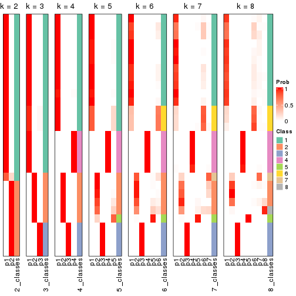


If matrix rows can be associated to genes, consider to use `functional_enrichment(res,
...)` to perform function enrichment for the signature genes. See [this vignette](https://jokergoo.github.io/cola_vignettes/functional_enrichment.html) for more detailed explanations.


 

---------------------------------------------------


### Node04


Parent node: [Node0](#Node0).
Child nodes: 
                Node011-leaf
        ,
                Node012-leaf
        ,
                [Node013](#Node013)
        ,
                Node014-leaf
        ,
                Node031-leaf
        ,
                Node032-leaf
        ,
                Node033-leaf
        ,
                Node034-leaf
        ,
                Node041-leaf
        ,
                Node042-leaf
        ,
                Node043-leaf
        ,
                Node051-leaf
        ,
                Node052-leaf
        ,
                Node053-leaf
        ,
                Node054-leaf
        .


The object with results only for a single top-value method and a single partitioning method 
can be extracted as:

```r
res = res_rh["04"]
```

A summary of `res` and all the functions that can be applied to it:

```r
res
```

```
#> A 'ConsensusPartition' object with k = 2, 3, 4, 5, 6, 7, 8.
#>   On a matrix with 30000 rows and 39 columns.
#>   Top rows (1000) are extracted by 'SD' method.
#>   Subgroups are detected by 'kmeans' method.
#>   Performed in total 350 partitions by row resampling.
#>   Best k for subgroups seems to be 3.
#> 
#> Following methods can be applied to this 'ConsensusPartition' object:
#>  [1] "cola_report"             "collect_classes"         "collect_plots"          
#>  [4] "collect_stats"           "colnames"                "compare_partitions"     
#>  [7] "compare_signatures"      "consensus_heatmap"       "dimension_reduction"    
#> [10] "functional_enrichment"   "get_anno_col"            "get_anno"               
#> [13] "get_classes"             "get_consensus"           "get_matrix"             
#> [16] "get_membership"          "get_param"               "get_signatures"         
#> [19] "get_stats"               "is_best_k"               "is_stable_k"            
#> [22] "membership_heatmap"      "ncol"                    "nrow"                   
#> [25] "plot_ecdf"               "predict_classes"         "rownames"               
#> [28] "select_partition_number" "show"                    "suggest_best_k"         
#> [31] "test_to_known_factors"   "top_rows_heatmap"
```

`collect_plots()` function collects all the plots made from `res` for all `k` (number of subgroups)
into one single page to provide an easy and fast comparison between different `k`.

```r
collect_plots(res)
```

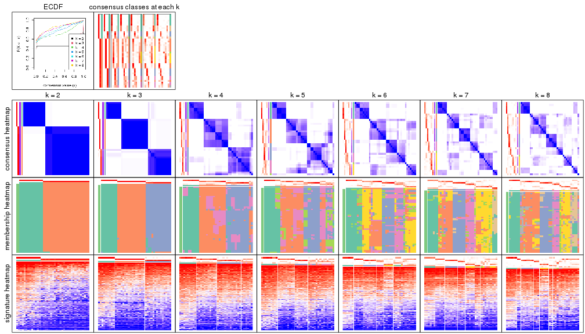

The plots are:

- The first row: a plot of the eCDF (empirical cumulative distribution
  function) curves of the consensus matrix for each `k` and the heatmap of
  predicted classes for each `k`.
- The second row: heatmaps of the consensus matrix for each `k`.
- The third row: heatmaps of the membership matrix for each `k`.
- The fouth row: heatmaps of the signatures for each `k`.

All the plots in panels can be made by individual functions and they are
plotted later in this section.

`select_partition_number()` produces several plots showing different
statistics for choosing "optimized" `k`. There are following statistics:

- eCDF curves of the consensus matrix for each `k`;
- 1-PAC. [The PAC score](https://en.wikipedia.org/wiki/Consensus_clustering#Over-interpretation_potential_of_consensus_clustering)
  measures the proportion of the ambiguous subgrouping.
- Mean silhouette score.
- Concordance. The mean probability of fiting the consensus subgroup labels in all
  partitions.
- Area increased. Denote $A_k$ as the area under the eCDF curve for current
  `k`, the area increased is defined as $A_k - A_{k-1}$.
- Rand index. The percent of pairs of samples that are both in a same cluster
  or both are not in a same cluster in the partition of k and k-1.
- Jaccard index. The ratio of pairs of samples are both in a same cluster in
  the partition of k and k-1 and the pairs of samples are both in a same
  cluster in the partition k or k-1.

The detailed explanations of these statistics can be found in [the _cola_
vignette](https://jokergoo.github.io/cola_vignettes/cola.html#toc_13).

Generally speaking, higher 1-PAC score, higher mean silhouette score or higher
concordance corresponds to better partition. Rand index and Jaccard index
measure how similar the current partition is compared to partition with `k-1`.
If they are too similar, we won't accept `k` is better than `k-1`.

```r
select_partition_number(res)
```


The numeric values for all these statistics can be obtained by `get_stats()`.

```r
get_stats(res)
```

```
#>   k 1-PAC mean_silhouette concordance area_increased  Rand Jaccard
#> 2 2 1.000           0.996       0.998         0.4576 0.544   0.544
#> 3 3 1.000           0.979       0.984         0.4517 0.682   0.467
#> 4 4 0.692           0.659       0.822         0.1062 0.961   0.883
#> 5 5 0.666           0.434       0.728         0.0632 0.891   0.657
#> 6 6 0.677           0.534       0.610         0.0381 0.862   0.502
#> 7 7 0.715           0.650       0.773         0.0341 0.919   0.613
#> 8 8 0.725           0.536       0.768         0.0196 0.927   0.614
```

`suggest_best_k()` suggests the best $k$ based on these statistics. The rules are as follows:

- All $k$ with Jaccard index larger than 0.95 are removed because increasing
  $k$ does not provide enough extra information. If all $k$ are removed, it is
  marked as no subgroup is detected.
- For all $k$ with 1-PAC score larger than 0.9, the maximal $k$ is taken as
  the best $k$, and other $k$ are marked as optional $k$.
- If it does not fit the second rule. The $k$ with the maximal vote of the
  highest 1-PAC score, highest mean silhouette, and highest concordance is
  taken as the best $k$.

```r
suggest_best_k(res)
```

```
#> [1] 3
#> attr(,"optional")
#> [1] 2
```

There is also optional best $k$ = 2 that is worth to check.

Following is the table of the partitions (You need to click the **show/hide
code output** link to see it). The membership matrix (columns with name `p*`)
is inferred by
[`clue::cl_consensus()`](https://www.rdocumentation.org/link/cl_consensus?package=clue)
function with the `SE` method. Basically the value in the membership matrix
represents the probability to belong to a certain group. The finall subgroup
label for an item is determined with the group with highest probability it
belongs to.

In `get_classes()` function, the entropy is calculated from the membership
matrix and the silhouette score is calculated from the consensus matrix.


<script>
$( function() {
	$( '#tabs-node-04-get-classes' ).tabs();
} );
</script>
<div id='tabs-node-04-get-classes'>
<ul>
<li><a href='#tab-node-04-get-classes-1'>k = 2</a></li>
<li><a href='#tab-node-04-get-classes-2'>k = 3</a></li>
<li><a href='#tab-node-04-get-classes-3'>k = 4</a></li>
<li><a href='#tab-node-04-get-classes-4'>k = 5</a></li>
<li><a href='#tab-node-04-get-classes-5'>k = 6</a></li>
<li><a href='#tab-node-04-get-classes-6'>k = 7</a></li>
<li><a href='#tab-node-04-get-classes-7'>k = 8</a></li>
</ul>

<div id='tab-node-04-get-classes-1'>
<p><a id='tab-node-04-get-classes-1-a' style='color:#0366d6' href='#'>show/hide code output</a></p>
<pre><code class="r">cbind(get_classes(res, k = 2), get_membership(res, k = 2))
</code></pre>

<pre><code>#&gt;                 class entropy silhouette   p1   p2
#&gt; TCGA.S4.A8RP.01     2   0.000      0.997 0.00 1.00
#&gt; TCGA.HZ.8636.01     2   0.000      0.997 0.00 1.00
#&gt; TCGA.IB.AAUO.01     2   0.141      0.982 0.02 0.98
#&gt; TCGA.Q3.AA2A.01     2   0.000      0.997 0.00 1.00
#&gt; TCGA.YY.A8LH.01     1   0.000      1.000 1.00 0.00
#&gt; TCGA.IB.7651.01     1   0.000      1.000 1.00 0.00
#&gt; TCGA.HZ.7922.01     2   0.000      0.997 0.00 1.00
#&gt; TCGA.IB.7644.01     2   0.000      0.997 0.00 1.00
#&gt; TCGA.IB.AAUN.01     1   0.000      1.000 1.00 0.00
#&gt; TCGA.S4.A8RO.01     1   0.000      1.000 1.00 0.00
#&gt; TCGA.3A.A9IC.01     2   0.000      0.997 0.00 1.00
#&gt; TCGA.IB.7889.01     1   0.000      1.000 1.00 0.00
#&gt; TCGA.HZ.7919.01     2   0.000      0.997 0.00 1.00
#&gt; TCGA.HZ.8315.01     2   0.000      0.997 0.00 1.00
#&gt; TCGA.RB.A7B8.01     2   0.000      0.997 0.00 1.00
#&gt; TCGA.H6.8124.01     2   0.000      0.997 0.00 1.00
#&gt; TCGA.L1.A7W4.01     2   0.000      0.997 0.00 1.00
#&gt; TCGA.LB.A7SX.01     2   0.000      0.997 0.00 1.00
#&gt; TCGA.HZ.A77Q.01     2   0.000      0.997 0.00 1.00
#&gt; TCGA.IB.7652.01     2   0.000      0.997 0.00 1.00
#&gt; TCGA.YH.A8SY.01     2   0.000      0.997 0.00 1.00
#&gt; TCGA.LB.A8F3.01     2   0.141      0.982 0.02 0.98
#&gt; TCGA.2J.AABI.01     1   0.000      1.000 1.00 0.00
#&gt; TCGA.IB.A5SS.01     2   0.000      0.997 0.00 1.00
#&gt; TCGA.HV.AA8X.01     1   0.000      1.000 1.00 0.00
#&gt; TCGA.2L.AAQJ.01     1   0.000      1.000 1.00 0.00
#&gt; TCGA.3A.A9IB.01     2   0.000      0.997 0.00 1.00
#&gt; TCGA.HV.A5A6.01     2   0.000      0.997 0.00 1.00
#&gt; TCGA.PZ.A5RE.01     2   0.000      0.997 0.00 1.00
#&gt; TCGA.FB.A545.01     1   0.000      1.000 1.00 0.00
#&gt; TCGA.FB.AAPU.01     2   0.141      0.982 0.02 0.98
#&gt; TCGA.F2.A44G.01     2   0.000      0.997 0.00 1.00
#&gt; TCGA.FB.AAQ3.01     2   0.141      0.982 0.02 0.98
#&gt; TCGA.FB.AAQ2.01     1   0.000      1.000 1.00 0.00
#&gt; TCGA.FB.A78T.01     1   0.000      1.000 1.00 0.00
#&gt; TCGA.US.A779.01     2   0.000      0.997 0.00 1.00
#&gt; TCGA.3A.A9IH.01     1   0.000      1.000 1.00 0.00
#&gt; TCGA.M8.A5N4.01     2   0.000      0.997 0.00 1.00
#&gt; TCGA.HV.A5A4.01     1   0.000      1.000 1.00 0.00
</code></pre>

<script>
$('#tab-node-04-get-classes-1-a').parent().next().next().hide();
$('#tab-node-04-get-classes-1-a').click(function(){
  $('#tab-node-04-get-classes-1-a').parent().next().next().toggle();
  return(false);
});
</script>
</div>

<div id='tab-node-04-get-classes-2'>
<p><a id='tab-node-04-get-classes-2-a' style='color:#0366d6' href='#'>show/hide code output</a></p>
<pre><code class="r">cbind(get_classes(res, k = 3), get_membership(res, k = 3))
</code></pre>

<pre><code>#&gt;                 class entropy silhouette   p1   p2   p3
#&gt; TCGA.S4.A8RP.01     3  0.0892      0.968 0.00 0.02 0.98
#&gt; TCGA.HZ.8636.01     2  0.0000      0.999 0.00 1.00 0.00
#&gt; TCGA.IB.AAUO.01     3  0.0892      0.968 0.00 0.02 0.98
#&gt; TCGA.Q3.AA2A.01     2  0.0000      0.999 0.00 1.00 0.00
#&gt; TCGA.YY.A8LH.01     1  0.0000      0.998 1.00 0.00 0.00
#&gt; TCGA.IB.7651.01     3  0.2537      0.918 0.08 0.00 0.92
#&gt; TCGA.HZ.7922.01     2  0.0000      0.999 0.00 1.00 0.00
#&gt; TCGA.IB.7644.01     2  0.0000      0.999 0.00 1.00 0.00
#&gt; TCGA.IB.AAUN.01     1  0.0000      0.998 1.00 0.00 0.00
#&gt; TCGA.S4.A8RO.01     1  0.0000      0.998 1.00 0.00 0.00
#&gt; TCGA.3A.A9IC.01     2  0.0000      0.999 0.00 1.00 0.00
#&gt; TCGA.IB.7889.01     3  0.0892      0.954 0.02 0.00 0.98
#&gt; TCGA.HZ.7919.01     3  0.0892      0.968 0.00 0.02 0.98
#&gt; TCGA.HZ.8315.01     2  0.0000      0.999 0.00 1.00 0.00
#&gt; TCGA.RB.A7B8.01     3  0.0892      0.968 0.00 0.02 0.98
#&gt; TCGA.H6.8124.01     2  0.0000      0.999 0.00 1.00 0.00
#&gt; TCGA.L1.A7W4.01     2  0.0000      0.999 0.00 1.00 0.00
#&gt; TCGA.LB.A7SX.01     2  0.0000      0.999 0.00 1.00 0.00
#&gt; TCGA.HZ.A77Q.01     3  0.0892      0.968 0.00 0.02 0.98
#&gt; TCGA.IB.7652.01     3  0.2537      0.915 0.00 0.08 0.92
#&gt; TCGA.YH.A8SY.01     2  0.0000      0.999 0.00 1.00 0.00
#&gt; TCGA.LB.A8F3.01     3  0.0892      0.968 0.00 0.02 0.98
#&gt; TCGA.2J.AABI.01     1  0.0892      0.984 0.98 0.00 0.02
#&gt; TCGA.IB.A5SS.01     2  0.0000      0.999 0.00 1.00 0.00
#&gt; TCGA.HV.AA8X.01     3  0.4002      0.823 0.16 0.00 0.84
#&gt; TCGA.2L.AAQJ.01     1  0.0000      0.998 1.00 0.00 0.00
#&gt; TCGA.3A.A9IB.01     2  0.0000      0.999 0.00 1.00 0.00
#&gt; TCGA.HV.A5A6.01     2  0.0000      0.999 0.00 1.00 0.00
#&gt; TCGA.PZ.A5RE.01     2  0.0000      0.999 0.00 1.00 0.00
#&gt; TCGA.FB.A545.01     1  0.0000      0.998 1.00 0.00 0.00
#&gt; TCGA.FB.AAPU.01     3  0.0892      0.968 0.00 0.02 0.98
#&gt; TCGA.F2.A44G.01     2  0.0892      0.978 0.00 0.98 0.02
#&gt; TCGA.FB.AAQ3.01     3  0.0892      0.968 0.00 0.02 0.98
#&gt; TCGA.FB.AAQ2.01     1  0.0000      0.998 1.00 0.00 0.00
#&gt; TCGA.FB.A78T.01     1  0.0000      0.998 1.00 0.00 0.00
#&gt; TCGA.US.A779.01     3  0.0892      0.968 0.00 0.02 0.98
#&gt; TCGA.3A.A9IH.01     3  0.2537      0.918 0.08 0.00 0.92
#&gt; TCGA.M8.A5N4.01     2  0.0000      0.999 0.00 1.00 0.00
#&gt; TCGA.HV.A5A4.01     1  0.0000      0.998 1.00 0.00 0.00
</code></pre>

<script>
$('#tab-node-04-get-classes-2-a').parent().next().next().hide();
$('#tab-node-04-get-classes-2-a').click(function(){
  $('#tab-node-04-get-classes-2-a').parent().next().next().toggle();
  return(false);
});
</script>
</div>

<div id='tab-node-04-get-classes-3'>
<p><a id='tab-node-04-get-classes-3-a' style='color:#0366d6' href='#'>show/hide code output</a></p>
<pre><code class="r">cbind(get_classes(res, k = 4), get_membership(res, k = 4))
</code></pre>

<pre><code>#&gt;                 class entropy silhouette   p1   p2   p3   p4
#&gt; TCGA.S4.A8RP.01     3  0.2647      0.782 0.00 0.00 0.88 0.12
#&gt; TCGA.HZ.8636.01     2  0.3801      0.648 0.00 0.78 0.00 0.22
#&gt; TCGA.IB.AAUO.01     3  0.1637      0.799 0.00 0.00 0.94 0.06
#&gt; TCGA.Q3.AA2A.01     2  0.4907      0.392 0.00 0.58 0.00 0.42
#&gt; TCGA.YY.A8LH.01     1  0.0707      0.948 0.98 0.00 0.00 0.02
#&gt; TCGA.IB.7651.01     3  0.3606      0.726 0.14 0.00 0.84 0.02
#&gt; TCGA.HZ.7922.01     2  0.3198      0.617 0.00 0.88 0.04 0.08
#&gt; TCGA.IB.7644.01     2  0.4977      0.304 0.00 0.54 0.00 0.46
#&gt; TCGA.IB.AAUN.01     1  0.2921      0.914 0.86 0.00 0.00 0.14
#&gt; TCGA.S4.A8RO.01     1  0.1211      0.938 0.96 0.00 0.00 0.04
#&gt; TCGA.3A.A9IC.01     2  0.3801      0.648 0.00 0.78 0.00 0.22
#&gt; TCGA.IB.7889.01     3  0.0000      0.808 0.00 0.00 1.00 0.00
#&gt; TCGA.HZ.7919.01     3  0.1211      0.806 0.00 0.00 0.96 0.04
#&gt; TCGA.HZ.8315.01     2  0.3801      0.648 0.00 0.78 0.00 0.22
#&gt; TCGA.RB.A7B8.01     3  0.4624      0.564 0.00 0.00 0.66 0.34
#&gt; TCGA.H6.8124.01     2  0.2921      0.570 0.00 0.86 0.00 0.14
#&gt; TCGA.L1.A7W4.01     2  0.3172      0.582 0.00 0.84 0.00 0.16
#&gt; TCGA.LB.A7SX.01     2  0.0000      0.656 0.00 1.00 0.00 0.00
#&gt; TCGA.HZ.A77Q.01     3  0.2011      0.788 0.00 0.00 0.92 0.08
#&gt; TCGA.IB.7652.01     4  0.6843     -0.124 0.00 0.10 0.44 0.46
#&gt; TCGA.YH.A8SY.01     2  0.3975      0.636 0.00 0.76 0.00 0.24
#&gt; TCGA.LB.A8F3.01     3  0.2345      0.790 0.00 0.00 0.90 0.10
#&gt; TCGA.2J.AABI.01     1  0.3172      0.908 0.84 0.00 0.00 0.16
#&gt; TCGA.IB.A5SS.01     2  0.5062      0.568 0.00 0.68 0.02 0.30
#&gt; TCGA.HV.AA8X.01     3  0.5962      0.591 0.08 0.00 0.66 0.26
#&gt; TCGA.2L.AAQJ.01     1  0.0707      0.948 0.98 0.00 0.00 0.02
#&gt; TCGA.3A.A9IB.01     2  0.4948      0.354 0.00 0.56 0.00 0.44
#&gt; TCGA.HV.A5A6.01     2  0.0000      0.656 0.00 1.00 0.00 0.00
#&gt; TCGA.PZ.A5RE.01     2  0.0707      0.648 0.00 0.98 0.00 0.02
#&gt; TCGA.FB.A545.01     1  0.1211      0.938 0.96 0.00 0.00 0.04
#&gt; TCGA.FB.AAPU.01     3  0.3975      0.719 0.00 0.00 0.76 0.24
#&gt; TCGA.F2.A44G.01     4  0.7047     -0.393 0.00 0.44 0.12 0.44
#&gt; TCGA.FB.AAQ3.01     3  0.0707      0.809 0.00 0.00 0.98 0.02
#&gt; TCGA.FB.AAQ2.01     1  0.2647      0.916 0.88 0.00 0.00 0.12
#&gt; TCGA.FB.A78T.01     1  0.0707      0.948 0.98 0.00 0.00 0.02
#&gt; TCGA.US.A779.01     3  0.4277      0.633 0.00 0.00 0.72 0.28
#&gt; TCGA.3A.A9IH.01     3  0.3606      0.726 0.14 0.00 0.84 0.02
#&gt; TCGA.M8.A5N4.01     2  0.4948      0.354 0.00 0.56 0.00 0.44
#&gt; TCGA.HV.A5A4.01     1  0.0000      0.947 1.00 0.00 0.00 0.00
</code></pre>

<script>
$('#tab-node-04-get-classes-3-a').parent().next().next().hide();
$('#tab-node-04-get-classes-3-a').click(function(){
  $('#tab-node-04-get-classes-3-a').parent().next().next().toggle();
  return(false);
});
</script>
</div>

<div id='tab-node-04-get-classes-4'>
<p><a id='tab-node-04-get-classes-4-a' style='color:#0366d6' href='#'>show/hide code output</a></p>
<pre><code class="r">cbind(get_classes(res, k = 5), get_membership(res, k = 5))
</code></pre>

<pre><code>#&gt;                 class entropy silhouette   p1   p2   p3   p4   p5
#&gt; TCGA.S4.A8RP.01     3  0.5979    0.01878 0.00 0.00 0.52 0.36 0.12
#&gt; TCGA.HZ.8636.01     2  0.3424    0.59544 0.00 0.76 0.00 0.24 0.00
#&gt; TCGA.IB.AAUO.01     3  0.1043    0.67376 0.00 0.00 0.96 0.04 0.00
#&gt; TCGA.Q3.AA2A.01     2  0.5447    0.25283 0.00 0.50 0.00 0.44 0.06
#&gt; TCGA.YY.A8LH.01     1  0.0000    0.85660 1.00 0.00 0.00 0.00 0.00
#&gt; TCGA.IB.7651.01     3  0.3291    0.54559 0.04 0.00 0.84 0.00 0.12
#&gt; TCGA.HZ.7922.01     2  0.3641    0.58632 0.00 0.82 0.06 0.00 0.12
#&gt; TCGA.IB.7644.01     2  0.5447    0.25283 0.00 0.50 0.00 0.44 0.06
#&gt; TCGA.IB.AAUN.01     1  0.3895    0.66213 0.68 0.00 0.00 0.00 0.32
#&gt; TCGA.S4.A8RO.01     1  0.0609    0.85530 0.98 0.00 0.00 0.00 0.02
#&gt; TCGA.3A.A9IC.01     2  0.3852    0.59776 0.00 0.76 0.00 0.22 0.02
#&gt; TCGA.IB.7889.01     3  0.0000    0.69018 0.00 0.00 1.00 0.00 0.00
#&gt; TCGA.HZ.7919.01     3  0.0000    0.69018 0.00 0.00 1.00 0.00 0.00
#&gt; TCGA.HZ.8315.01     2  0.3424    0.59544 0.00 0.76 0.00 0.24 0.00
#&gt; TCGA.RB.A7B8.01     4  0.3983   -0.00538 0.00 0.00 0.34 0.66 0.00
#&gt; TCGA.H6.8124.01     2  0.4398    0.52252 0.00 0.72 0.00 0.04 0.24
#&gt; TCGA.L1.A7W4.01     2  0.5048    0.45670 0.00 0.58 0.00 0.04 0.38
#&gt; TCGA.LB.A7SX.01     2  0.1410    0.63100 0.00 0.94 0.00 0.00 0.06
#&gt; TCGA.HZ.A77Q.01     3  0.2020    0.61577 0.00 0.00 0.90 0.10 0.00
#&gt; TCGA.IB.7652.01     4  0.4671    0.11534 0.00 0.02 0.20 0.74 0.04
#&gt; TCGA.YH.A8SY.01     2  0.4588    0.57398 0.00 0.72 0.00 0.22 0.06
#&gt; TCGA.LB.A8F3.01     3  0.5979    0.01878 0.00 0.00 0.52 0.36 0.12
#&gt; TCGA.2J.AABI.01     1  0.4748    0.66737 0.66 0.00 0.00 0.04 0.30
#&gt; TCGA.IB.A5SS.01     2  0.7397    0.37869 0.00 0.44 0.04 0.26 0.26
#&gt; TCGA.HV.AA8X.01     5  0.7992    0.00000 0.10 0.00 0.28 0.22 0.40
#&gt; TCGA.2L.AAQJ.01     1  0.0000    0.85660 1.00 0.00 0.00 0.00 0.00
#&gt; TCGA.3A.A9IB.01     4  0.5178   -0.36348 0.00 0.48 0.00 0.48 0.04
#&gt; TCGA.HV.A5A6.01     2  0.1410    0.63100 0.00 0.94 0.00 0.00 0.06
#&gt; TCGA.PZ.A5RE.01     2  0.1732    0.62354 0.00 0.92 0.00 0.00 0.08
#&gt; TCGA.FB.A545.01     1  0.0609    0.85530 0.98 0.00 0.00 0.00 0.02
#&gt; TCGA.FB.AAPU.01     4  0.6447   -0.43628 0.00 0.00 0.38 0.44 0.18
#&gt; TCGA.F2.A44G.01     4  0.7203   -0.14428 0.00 0.32 0.18 0.46 0.04
#&gt; TCGA.FB.AAQ3.01     3  0.0000    0.69018 0.00 0.00 1.00 0.00 0.00
#&gt; TCGA.FB.AAQ2.01     1  0.3895    0.66213 0.68 0.00 0.00 0.00 0.32
#&gt; TCGA.FB.A78T.01     1  0.0000    0.85660 1.00 0.00 0.00 0.00 0.00
#&gt; TCGA.US.A779.01     4  0.5861   -0.19425 0.00 0.00 0.40 0.50 0.10
#&gt; TCGA.3A.A9IH.01     3  0.3291    0.54559 0.04 0.00 0.84 0.00 0.12
#&gt; TCGA.M8.A5N4.01     4  0.5178   -0.36348 0.00 0.48 0.00 0.48 0.04
#&gt; TCGA.HV.A5A4.01     1  0.0609    0.85530 0.98 0.00 0.00 0.00 0.02
</code></pre>

<script>
$('#tab-node-04-get-classes-4-a').parent().next().next().hide();
$('#tab-node-04-get-classes-4-a').click(function(){
  $('#tab-node-04-get-classes-4-a').parent().next().next().toggle();
  return(false);
});
</script>
</div>

<div id='tab-node-04-get-classes-5'>
<p><a id='tab-node-04-get-classes-5-a' style='color:#0366d6' href='#'>show/hide code output</a></p>
<pre><code class="r">cbind(get_classes(res, k = 6), get_membership(res, k = 6))
</code></pre>

<pre><code>#&gt;                 class entropy silhouette   p1   p2   p3   p4   p5   p6
#&gt; TCGA.S4.A8RP.01     4  0.3851     0.6687 0.00 0.00 0.46 0.54 0.00 0.00
#&gt; TCGA.HZ.8636.01     2  0.4576     0.0330 0.00 0.56 0.00 0.04 0.00 0.40
#&gt; TCGA.IB.AAUO.01     3  0.1267     0.7985 0.00 0.06 0.94 0.00 0.00 0.00
#&gt; TCGA.Q3.AA2A.01     2  0.1092     0.5807 0.00 0.96 0.00 0.02 0.02 0.00
#&gt; TCGA.YY.A8LH.01     1  0.0937     0.7679 0.96 0.00 0.00 0.00 0.04 0.00
#&gt; TCGA.IB.7651.01     3  0.3351     0.6620 0.04 0.00 0.80 0.00 0.16 0.00
#&gt; TCGA.HZ.7922.01     6  0.5603     0.5815 0.00 0.24 0.04 0.06 0.02 0.64
#&gt; TCGA.IB.7644.01     2  0.2020     0.5750 0.00 0.92 0.00 0.02 0.04 0.02
#&gt; TCGA.IB.AAUN.01     1  0.4651     0.3508 0.48 0.00 0.04 0.00 0.48 0.00
#&gt; TCGA.S4.A8RO.01     1  0.1092     0.7605 0.96 0.00 0.00 0.00 0.02 0.02
#&gt; TCGA.3A.A9IC.01     2  0.5087    -0.0629 0.00 0.52 0.00 0.04 0.02 0.42
#&gt; TCGA.IB.7889.01     3  0.0000     0.8109 0.00 0.00 1.00 0.00 0.00 0.00
#&gt; TCGA.HZ.7919.01     3  0.0547     0.8025 0.00 0.00 0.98 0.02 0.00 0.00
#&gt; TCGA.HZ.8315.01     2  0.4576     0.0330 0.00 0.56 0.00 0.04 0.00 0.40
#&gt; TCGA.RB.A7B8.01     2  0.6305    -0.3427 0.00 0.46 0.30 0.22 0.02 0.00
#&gt; TCGA.H6.8124.01     6  0.4468     0.6924 0.00 0.12 0.00 0.06 0.06 0.76
#&gt; TCGA.L1.A7W4.01     6  0.6474     0.4804 0.00 0.10 0.00 0.12 0.24 0.54
#&gt; TCGA.LB.A7SX.01     6  0.3460     0.7359 0.00 0.22 0.00 0.00 0.02 0.76
#&gt; TCGA.HZ.A77Q.01     3  0.2790     0.6974 0.00 0.14 0.84 0.02 0.00 0.00
#&gt; TCGA.IB.7652.01     4  0.6119     0.2804 0.00 0.36 0.16 0.46 0.02 0.00
#&gt; TCGA.YH.A8SY.01     2  0.4574     0.2983 0.00 0.68 0.00 0.02 0.04 0.26
#&gt; TCGA.LB.A8F3.01     4  0.3864     0.6610 0.00 0.00 0.48 0.52 0.00 0.00
#&gt; TCGA.2J.AABI.01     1  0.5235     0.4214 0.52 0.00 0.00 0.10 0.38 0.00
#&gt; TCGA.IB.A5SS.01     2  0.6641     0.2789 0.00 0.58 0.06 0.12 0.04 0.20
#&gt; TCGA.HV.AA8X.01     5  0.7182     0.0000 0.04 0.00 0.20 0.26 0.46 0.04
#&gt; TCGA.2L.AAQJ.01     1  0.0547     0.7713 0.98 0.00 0.00 0.00 0.02 0.00
#&gt; TCGA.3A.A9IB.01     2  0.0000     0.5865 0.00 1.00 0.00 0.00 0.00 0.00
#&gt; TCGA.HV.A5A6.01     6  0.4690     0.7276 0.00 0.22 0.00 0.04 0.04 0.70
#&gt; TCGA.PZ.A5RE.01     6  0.3460     0.7413 0.00 0.22 0.00 0.02 0.00 0.76
#&gt; TCGA.FB.A545.01     1  0.1092     0.7605 0.96 0.00 0.00 0.00 0.02 0.02
#&gt; TCGA.FB.AAPU.01     4  0.4002     0.5227 0.00 0.00 0.32 0.66 0.02 0.00
#&gt; TCGA.F2.A44G.01     2  0.2048     0.5285 0.00 0.88 0.12 0.00 0.00 0.00
#&gt; TCGA.FB.AAQ3.01     3  0.0000     0.8109 0.00 0.00 1.00 0.00 0.00 0.00
#&gt; TCGA.FB.AAQ2.01     1  0.4646     0.3628 0.50 0.00 0.04 0.00 0.46 0.00
#&gt; TCGA.FB.A78T.01     1  0.1267     0.7613 0.94 0.00 0.00 0.00 0.06 0.00
#&gt; TCGA.US.A779.01     4  0.5288     0.6551 0.00 0.06 0.38 0.54 0.02 0.00
#&gt; TCGA.3A.A9IH.01     3  0.3351     0.6620 0.04 0.00 0.80 0.00 0.16 0.00
#&gt; TCGA.M8.A5N4.01     2  0.0000     0.5865 0.00 1.00 0.00 0.00 0.00 0.00
#&gt; TCGA.HV.A5A4.01     1  0.0000     0.7709 1.00 0.00 0.00 0.00 0.00 0.00
</code></pre>

<script>
$('#tab-node-04-get-classes-5-a').parent().next().next().hide();
$('#tab-node-04-get-classes-5-a').click(function(){
  $('#tab-node-04-get-classes-5-a').parent().next().next().toggle();
  return(false);
});
</script>
</div>

<div id='tab-node-04-get-classes-6'>
<p><a id='tab-node-04-get-classes-6-a' style='color:#0366d6' href='#'>show/hide code output</a></p>
<pre><code class="r">cbind(get_classes(res, k = 7), get_membership(res, k = 7))
</code></pre>

<pre><code>#&gt;                 class entropy silhouette   p1   p2   p3   p4   p5   p6   p7
#&gt; TCGA.S4.A8RP.01     4  0.1886     0.6775 0.00 0.00 0.12 0.88 0.00 0.00 0.00
#&gt; TCGA.HZ.8636.01     6  0.4524     0.4120 0.00 0.34 0.00 0.02 0.04 0.60 0.00
#&gt; TCGA.IB.AAUO.01     3  0.1363     0.8798 0.00 0.04 0.94 0.00 0.02 0.00 0.00
#&gt; TCGA.Q3.AA2A.01     2  0.2259     0.6686 0.00 0.84 0.00 0.00 0.00 0.16 0.00
#&gt; TCGA.YY.A8LH.01     1  0.3755     0.9000 0.64 0.02 0.00 0.00 0.00 0.00 0.34
#&gt; TCGA.IB.7651.01     3  0.2081     0.8348 0.00 0.00 0.86 0.00 0.00 0.00 0.14
#&gt; TCGA.HZ.7922.01     6  0.4878     0.5235 0.00 0.08 0.08 0.02 0.10 0.72 0.00
#&gt; TCGA.IB.7644.01     2  0.3887     0.6213 0.04 0.80 0.00 0.06 0.02 0.08 0.00
#&gt; TCGA.IB.AAUN.01     7  0.2509     0.7768 0.06 0.04 0.02 0.00 0.00 0.00 0.88
#&gt; TCGA.S4.A8RO.01     1  0.3221     0.9215 0.68 0.00 0.00 0.00 0.00 0.00 0.32
#&gt; TCGA.3A.A9IC.01     6  0.3606     0.4744 0.00 0.30 0.00 0.02 0.00 0.68 0.00
#&gt; TCGA.IB.7889.01     3  0.1664     0.8871 0.00 0.00 0.92 0.02 0.00 0.00 0.06
#&gt; TCGA.HZ.7919.01     3  0.0504     0.8991 0.00 0.00 0.98 0.02 0.00 0.00 0.00
#&gt; TCGA.HZ.8315.01     6  0.4778     0.4140 0.00 0.34 0.00 0.02 0.06 0.58 0.00
#&gt; TCGA.RB.A7B8.01     2  0.5748     0.0309 0.04 0.52 0.16 0.28 0.00 0.00 0.00
#&gt; TCGA.H6.8124.01     6  0.3388     0.6046 0.04 0.00 0.00 0.00 0.20 0.76 0.00
#&gt; TCGA.L1.A7W4.01     6  0.4820     0.4379 0.10 0.00 0.00 0.00 0.38 0.52 0.00
#&gt; TCGA.LB.A7SX.01     6  0.3404     0.6285 0.08 0.04 0.00 0.00 0.06 0.82 0.00
#&gt; TCGA.HZ.A77Q.01     3  0.1363     0.8798 0.00 0.04 0.94 0.00 0.02 0.00 0.00
#&gt; TCGA.IB.7652.01     4  0.5223     0.4086 0.04 0.32 0.04 0.58 0.02 0.00 0.00
#&gt; TCGA.YH.A8SY.01     2  0.5551     0.2805 0.10 0.56 0.00 0.00 0.06 0.28 0.00
#&gt; TCGA.LB.A8F3.01     4  0.2259     0.6437 0.00 0.00 0.16 0.84 0.00 0.00 0.00
#&gt; TCGA.2J.AABI.01     7  0.3485     0.7151 0.04 0.02 0.00 0.02 0.10 0.00 0.82
#&gt; TCGA.IB.A5SS.01     2  0.6509     0.2610 0.00 0.46 0.12 0.00 0.22 0.20 0.00
#&gt; TCGA.HV.AA8X.01     5  0.6022     0.0000 0.02 0.00 0.00 0.32 0.36 0.00 0.30
#&gt; TCGA.2L.AAQJ.01     1  0.3358     0.9197 0.64 0.00 0.00 0.00 0.00 0.00 0.36
#&gt; TCGA.3A.A9IB.01     2  0.2259     0.6686 0.00 0.84 0.00 0.00 0.00 0.16 0.00
#&gt; TCGA.HV.A5A6.01     6  0.4295     0.6019 0.14 0.06 0.00 0.00 0.06 0.74 0.00
#&gt; TCGA.PZ.A5RE.01     6  0.1006     0.6454 0.00 0.02 0.00 0.00 0.02 0.96 0.00
#&gt; TCGA.FB.A545.01     1  0.4003     0.8949 0.64 0.04 0.00 0.00 0.00 0.00 0.32
#&gt; TCGA.FB.AAPU.01     4  0.2016     0.5866 0.00 0.00 0.04 0.90 0.06 0.00 0.00
#&gt; TCGA.F2.A44G.01     2  0.3744     0.6167 0.00 0.78 0.12 0.00 0.02 0.08 0.00
#&gt; TCGA.FB.AAQ3.01     3  0.0504     0.8991 0.00 0.00 0.98 0.02 0.00 0.00 0.00
#&gt; TCGA.FB.AAQ2.01     7  0.1505     0.8085 0.02 0.00 0.02 0.00 0.02 0.00 0.94
#&gt; TCGA.FB.A78T.01     1  0.4127     0.8575 0.60 0.04 0.00 0.00 0.00 0.00 0.36
#&gt; TCGA.US.A779.01     4  0.4311     0.6339 0.04 0.12 0.06 0.76 0.02 0.00 0.00
#&gt; TCGA.3A.A9IH.01     3  0.2081     0.8348 0.00 0.00 0.86 0.00 0.00 0.00 0.14
#&gt; TCGA.M8.A5N4.01     2  0.2259     0.6686 0.00 0.84 0.00 0.00 0.00 0.16 0.00
#&gt; TCGA.HV.A5A4.01     1  0.3221     0.9215 0.68 0.00 0.00 0.00 0.00 0.00 0.32
</code></pre>

<script>
$('#tab-node-04-get-classes-6-a').parent().next().next().hide();
$('#tab-node-04-get-classes-6-a').click(function(){
  $('#tab-node-04-get-classes-6-a').parent().next().next().toggle();
  return(false);
});
</script>
</div>

<div id='tab-node-04-get-classes-7'>
<p><a id='tab-node-04-get-classes-7-a' style='color:#0366d6' href='#'>show/hide code output</a></p>
<pre><code class="r">cbind(get_classes(res, k = 8), get_membership(res, k = 8))
</code></pre>

<pre><code>#&gt;                 class entropy silhouette   p1   p2   p3   p4   p5   p6   p7   p8
#&gt; TCGA.S4.A8RP.01     4  0.2267     0.6934 0.00 0.00 0.18 0.82 0.00 0.00 0.00 0.00
#&gt; TCGA.HZ.8636.01     2  0.4964     0.4363 0.00 0.60 0.00 0.00 0.04 0.24 0.00 0.12
#&gt; TCGA.IB.AAUO.01     3  0.3002     0.7287 0.00 0.12 0.82 0.00 0.04 0.00 0.00 0.02
#&gt; TCGA.Q3.AA2A.01     2  0.2224     0.4826 0.00 0.86 0.00 0.00 0.00 0.02 0.00 0.12
#&gt; TCGA.YY.A8LH.01     1  0.0000     0.9411 1.00 0.00 0.00 0.00 0.00 0.00 0.00 0.00
#&gt; TCGA.IB.7651.01     3  0.2569     0.7660 0.00 0.00 0.82 0.00 0.00 0.00 0.16 0.02
#&gt; TCGA.HZ.7922.01     6  0.5281     0.5554 0.00 0.08 0.06 0.00 0.00 0.60 0.02 0.24
#&gt; TCGA.IB.7644.01     2  0.4004    -0.3016 0.00 0.50 0.00 0.04 0.00 0.00 0.00 0.46
#&gt; TCGA.IB.AAUN.01     7  0.4276     0.6190 0.28 0.00 0.06 0.00 0.00 0.00 0.64 0.02
#&gt; TCGA.S4.A8RO.01     1  0.0471     0.9407 0.98 0.00 0.00 0.00 0.00 0.02 0.00 0.00
#&gt; TCGA.3A.A9IC.01     2  0.5025     0.3692 0.00 0.56 0.00 0.00 0.04 0.30 0.00 0.10
#&gt; TCGA.IB.7889.01     3  0.1741     0.8133 0.00 0.00 0.92 0.02 0.00 0.00 0.04 0.02
#&gt; TCGA.HZ.7919.01     3  0.0471     0.8241 0.00 0.00 0.98 0.02 0.00 0.00 0.00 0.00
#&gt; TCGA.HZ.8315.01     2  0.4964     0.4363 0.00 0.60 0.00 0.00 0.04 0.24 0.00 0.12
#&gt; TCGA.RB.A7B8.01     2  0.7004    -0.5635 0.00 0.32 0.16 0.18 0.04 0.00 0.00 0.30
#&gt; TCGA.H6.8124.01     6  0.3452     0.6568 0.00 0.04 0.00 0.00 0.06 0.82 0.04 0.04
#&gt; TCGA.L1.A7W4.01     5  0.2719     0.0000 0.00 0.02 0.00 0.00 0.80 0.18 0.00 0.00
#&gt; TCGA.LB.A7SX.01     6  0.1557     0.7350 0.00 0.06 0.00 0.00 0.02 0.92 0.00 0.00
#&gt; TCGA.HZ.A77Q.01     3  0.3002     0.7287 0.00 0.12 0.82 0.00 0.04 0.00 0.00 0.02
#&gt; TCGA.IB.7652.01     8  0.6109     0.0000 0.00 0.24 0.04 0.28 0.02 0.00 0.00 0.42
#&gt; TCGA.YH.A8SY.01     2  0.3843     0.4692 0.00 0.70 0.00 0.00 0.02 0.24 0.00 0.04
#&gt; TCGA.LB.A8F3.01     4  0.2534     0.6729 0.00 0.00 0.22 0.78 0.00 0.00 0.00 0.00
#&gt; TCGA.2J.AABI.01     7  0.5807     0.4759 0.34 0.00 0.00 0.06 0.06 0.02 0.50 0.02
#&gt; TCGA.IB.A5SS.01     2  0.6188     0.2727 0.00 0.56 0.12 0.00 0.10 0.08 0.00 0.14
#&gt; TCGA.HV.AA8X.01     7  0.5999     0.0461 0.00 0.00 0.04 0.26 0.04 0.00 0.50 0.16
#&gt; TCGA.2L.AAQJ.01     1  0.0000     0.9411 1.00 0.00 0.00 0.00 0.00 0.00 0.00 0.00
#&gt; TCGA.3A.A9IB.01     2  0.0808     0.5048 0.00 0.96 0.00 0.00 0.00 0.00 0.00 0.04
#&gt; TCGA.HV.A5A6.01     6  0.4155     0.6202 0.00 0.12 0.00 0.00 0.02 0.74 0.02 0.10
#&gt; TCGA.PZ.A5RE.01     6  0.2864     0.7278 0.00 0.06 0.00 0.00 0.00 0.84 0.02 0.08
#&gt; TCGA.FB.A545.01     1  0.2132     0.8539 0.88 0.00 0.00 0.00 0.04 0.00 0.00 0.08
#&gt; TCGA.FB.AAPU.01     4  0.1091     0.6240 0.00 0.00 0.06 0.94 0.00 0.00 0.00 0.00
#&gt; TCGA.F2.A44G.01     2  0.2265     0.4726 0.00 0.88 0.08 0.00 0.02 0.00 0.00 0.02
#&gt; TCGA.FB.AAQ3.01     3  0.0471     0.8241 0.00 0.00 0.98 0.02 0.00 0.00 0.00 0.00
#&gt; TCGA.FB.AAQ2.01     7  0.3594     0.6291 0.28 0.00 0.04 0.00 0.00 0.00 0.68 0.00
#&gt; TCGA.FB.A78T.01     1  0.1557     0.8616 0.92 0.00 0.00 0.00 0.00 0.00 0.06 0.02
#&gt; TCGA.US.A779.01     4  0.5189    -0.1613 0.00 0.04 0.10 0.48 0.00 0.00 0.00 0.38
#&gt; TCGA.3A.A9IH.01     3  0.2569     0.7660 0.00 0.00 0.82 0.00 0.00 0.00 0.16 0.02
#&gt; TCGA.M8.A5N4.01     2  0.0000     0.5191 0.00 1.00 0.00 0.00 0.00 0.00 0.00 0.00
#&gt; TCGA.HV.A5A4.01     1  0.0471     0.9407 0.98 0.00 0.00 0.00 0.00 0.02 0.00 0.00
</code></pre>

<script>
$('#tab-node-04-get-classes-7-a').parent().next().next().hide();
$('#tab-node-04-get-classes-7-a').click(function(){
  $('#tab-node-04-get-classes-7-a').parent().next().next().toggle();
  return(false);
});
</script>
</div>
</div>

Heatmaps for the consensus matrix. It visualizes the probability of two
samples to be in a same group.


<script>
$( function() {
	$( '#tabs-node-04-consensus-heatmap' ).tabs();
} );
</script>
<div id='tabs-node-04-consensus-heatmap'>
<ul>
<li><a href='#tab-node-04-consensus-heatmap-1'>k = 2</a></li>
<li><a href='#tab-node-04-consensus-heatmap-2'>k = 3</a></li>
<li><a href='#tab-node-04-consensus-heatmap-3'>k = 4</a></li>
<li><a href='#tab-node-04-consensus-heatmap-4'>k = 5</a></li>
<li><a href='#tab-node-04-consensus-heatmap-5'>k = 6</a></li>
<li><a href='#tab-node-04-consensus-heatmap-6'>k = 7</a></li>
<li><a href='#tab-node-04-consensus-heatmap-7'>k = 8</a></li>
</ul>
<div id='tab-node-04-consensus-heatmap-1'>
<pre><code class="r">consensus_heatmap(res, k = 2)
</code></pre>

<p></p>

</div>
<div id='tab-node-04-consensus-heatmap-2'>
<pre><code class="r">consensus_heatmap(res, k = 3)
</code></pre>

<p></p>

</div>
<div id='tab-node-04-consensus-heatmap-3'>
<pre><code class="r">consensus_heatmap(res, k = 4)
</code></pre>

<p></p>

</div>
<div id='tab-node-04-consensus-heatmap-4'>
<pre><code class="r">consensus_heatmap(res, k = 5)
</code></pre>

<p></p>

</div>
<div id='tab-node-04-consensus-heatmap-5'>
<pre><code class="r">consensus_heatmap(res, k = 6)
</code></pre>

<p></p>

</div>
<div id='tab-node-04-consensus-heatmap-6'>
<pre><code class="r">consensus_heatmap(res, k = 7)
</code></pre>

<p></p>

</div>
<div id='tab-node-04-consensus-heatmap-7'>
<pre><code class="r">consensus_heatmap(res, k = 8)
</code></pre>

<p></p>

</div>
</div>

Heatmaps for the membership of samples in all partitions to see how consistent they are:


<script>
$( function() {
	$( '#tabs-node-04-membership-heatmap' ).tabs();
} );
</script>
<div id='tabs-node-04-membership-heatmap'>
<ul>
<li><a href='#tab-node-04-membership-heatmap-1'>k = 2</a></li>
<li><a href='#tab-node-04-membership-heatmap-2'>k = 3</a></li>
<li><a href='#tab-node-04-membership-heatmap-3'>k = 4</a></li>
<li><a href='#tab-node-04-membership-heatmap-4'>k = 5</a></li>
<li><a href='#tab-node-04-membership-heatmap-5'>k = 6</a></li>
<li><a href='#tab-node-04-membership-heatmap-6'>k = 7</a></li>
<li><a href='#tab-node-04-membership-heatmap-7'>k = 8</a></li>
</ul>
<div id='tab-node-04-membership-heatmap-1'>
<pre><code class="r">membership_heatmap(res, k = 2)
</code></pre>

<p></p>

</div>
<div id='tab-node-04-membership-heatmap-2'>
<pre><code class="r">membership_heatmap(res, k = 3)
</code></pre>

<p></p>

</div>
<div id='tab-node-04-membership-heatmap-3'>
<pre><code class="r">membership_heatmap(res, k = 4)
</code></pre>

<p></p>

</div>
<div id='tab-node-04-membership-heatmap-4'>
<pre><code class="r">membership_heatmap(res, k = 5)
</code></pre>

<p></p>

</div>
<div id='tab-node-04-membership-heatmap-5'>
<pre><code class="r">membership_heatmap(res, k = 6)
</code></pre>

<p></p>

</div>
<div id='tab-node-04-membership-heatmap-6'>
<pre><code class="r">membership_heatmap(res, k = 7)
</code></pre>

<p></p>

</div>
<div id='tab-node-04-membership-heatmap-7'>
<pre><code class="r">membership_heatmap(res, k = 8)
</code></pre>

<p></p>

</div>
</div>

As soon as the classes for columns are determined, the signatures
that are significantly different between subgroups can be looked for. 
Following are the heatmaps for signatures.


<script>
$( function() {
	$( '#tabs-node-04-get-signatures' ).tabs();
} );
</script>
<div id='tabs-node-04-get-signatures'>
<ul>
<li><a href='#tab-node-04-get-signatures-1'>k = 2</a></li>
<li><a href='#tab-node-04-get-signatures-2'>k = 3</a></li>
<li><a href='#tab-node-04-get-signatures-3'>k = 4</a></li>
<li><a href='#tab-node-04-get-signatures-4'>k = 5</a></li>
<li><a href='#tab-node-04-get-signatures-5'>k = 6</a></li>
<li><a href='#tab-node-04-get-signatures-6'>k = 7</a></li>
<li><a href='#tab-node-04-get-signatures-7'>k = 8</a></li>
</ul>
<div id='tab-node-04-get-signatures-1'>
<pre><code class="r">get_signatures(res, k = 2)
</code></pre>

<p></p>

</div>
<div id='tab-node-04-get-signatures-2'>
<pre><code class="r">get_signatures(res, k = 3)
</code></pre>

<p></p>

</div>
<div id='tab-node-04-get-signatures-3'>
<pre><code class="r">get_signatures(res, k = 4)
</code></pre>

<p></p>

</div>
<div id='tab-node-04-get-signatures-4'>
<pre><code class="r">get_signatures(res, k = 5)
</code></pre>

<p></p>

</div>
<div id='tab-node-04-get-signatures-5'>
<pre><code class="r">get_signatures(res, k = 6)
</code></pre>

<p></p>

</div>
<div id='tab-node-04-get-signatures-6'>
<pre><code class="r">get_signatures(res, k = 7)
</code></pre>

<p></p>

</div>
<div id='tab-node-04-get-signatures-7'>
<pre><code class="r">get_signatures(res, k = 8)
</code></pre>

<p></p>

</div>
</div>


Compare the overlap of signatures from different k:

```r
compare_signatures(res)
```


`get_signature()` returns a data frame invisibly. To get the list of signatures, the function
call should be assigned to a variable explicitly. In following code, if `plot` argument is set
to `FALSE`, no heatmap is plotted while only the differential analysis is performed.

```r
# code only for demonstration
tb = get_signature(res, k = ..., plot = FALSE)
```

An example of the output of `tb` is:

```
#>   which_row         fdr    mean_1    mean_2 scaled_mean_1 scaled_mean_2 km
#> 1        38 0.042760348  8.373488  9.131774    -0.5533452     0.5164555  1
#> 2        40 0.018707592  7.106213  8.469186    -0.6173731     0.5762149  1
#> 3        55 0.019134737 10.221463 11.207825    -0.6159697     0.5749050  1
#> 4        59 0.006059896  5.921854  7.869574    -0.6899429     0.6439467  1
#> 5        60 0.018055526  8.928898 10.211722    -0.6204761     0.5791110  1
#> 6        98 0.009384629 15.714769 14.887706     0.6635654    -0.6193277  2
...
```

The columns in `tb` are:

1. `which_row`: row indices corresponding to the input matrix.
2. `fdr`: FDR for the differential test. 
3. `mean_x`: The mean value in group x.
4. `scaled_mean_x`: The mean value in group x after rows are scaled.
5. `km`: Row groups if k-means clustering is applied to rows (which is done by automatically selecting number of clusters).

If there are too many signatures, `top_signatures = ...` can be set to only show the 
signatures with the highest FDRs:

```r
# code only for demonstration
# e.g. to show the top 500 most significant rows
tb = get_signature(res, k = ..., top_signatures = 500)
```

If the signatures are defined as these which are uniquely high in current group, `diff_method` argument
can be set to `"uniquely_high_in_one_group"`:

```r
# code only for demonstration
tb = get_signature(res, k = ..., diff_method = "uniquely_high_in_one_group")
```


UMAP plot which shows how samples are separated.


<script>
$( function() {
	$( '#tabs-node-04-dimension-reduction' ).tabs();
} );
</script>
<div id='tabs-node-04-dimension-reduction'>
<ul>
<li><a href='#tab-node-04-dimension-reduction-1'>k = 2</a></li>
<li><a href='#tab-node-04-dimension-reduction-2'>k = 3</a></li>
<li><a href='#tab-node-04-dimension-reduction-3'>k = 4</a></li>
<li><a href='#tab-node-04-dimension-reduction-4'>k = 5</a></li>
<li><a href='#tab-node-04-dimension-reduction-5'>k = 6</a></li>
<li><a href='#tab-node-04-dimension-reduction-6'>k = 7</a></li>
<li><a href='#tab-node-04-dimension-reduction-7'>k = 8</a></li>
</ul>
<div id='tab-node-04-dimension-reduction-1'>
<pre><code class="r">dimension_reduction(res, k = 2, method = &quot;UMAP&quot;)
</code></pre>

<p></p>

</div>
<div id='tab-node-04-dimension-reduction-2'>
<pre><code class="r">dimension_reduction(res, k = 3, method = &quot;UMAP&quot;)
</code></pre>

<p>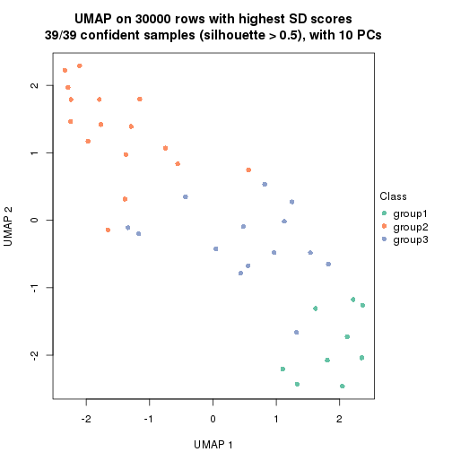</p>

</div>
<div id='tab-node-04-dimension-reduction-3'>
<pre><code class="r">dimension_reduction(res, k = 4, method = &quot;UMAP&quot;)
</code></pre>

<p></p>

</div>
<div id='tab-node-04-dimension-reduction-4'>
<pre><code class="r">dimension_reduction(res, k = 5, method = &quot;UMAP&quot;)
</code></pre>

<p></p>

</div>
<div id='tab-node-04-dimension-reduction-5'>
<pre><code class="r">dimension_reduction(res, k = 6, method = &quot;UMAP&quot;)
</code></pre>

<p></p>

</div>
<div id='tab-node-04-dimension-reduction-6'>
<pre><code class="r">dimension_reduction(res, k = 7, method = &quot;UMAP&quot;)
</code></pre>

<p></p>

</div>
<div id='tab-node-04-dimension-reduction-7'>
<pre><code class="r">dimension_reduction(res, k = 8, method = &quot;UMAP&quot;)
</code></pre>

<p></p>

</div>
</div>


Following heatmap shows how subgroups are split when increasing `k`:

```r
collect_classes(res)
```


If matrix rows can be associated to genes, consider to use `functional_enrichment(res,
...)` to perform function enrichment for the signature genes. See [this vignette](https://jokergoo.github.io/cola_vignettes/functional_enrichment.html) for more detailed explanations.


 

---------------------------------------------------


### Node05


Parent node: [Node0](#Node0).
Child nodes: 
                Node011-leaf
        ,
                Node012-leaf
        ,
                [Node013](#Node013)
        ,
                Node014-leaf
        ,
                Node031-leaf
        ,
                Node032-leaf
        ,
                Node033-leaf
        ,
                Node034-leaf
        ,
                Node041-leaf
        ,
                Node042-leaf
        ,
                Node043-leaf
        ,
                Node051-leaf
        ,
                Node052-leaf
        ,
                Node053-leaf
        ,
                Node054-leaf
        .


The object with results only for a single top-value method and a single partitioning method 
can be extracted as:

```r
res = res_rh["05"]
```

A summary of `res` and all the functions that can be applied to it:

```r
res
```

```
#> A 'ConsensusPartition' object with k = 2, 3, 4, 5, 6, 7, 8.
#>   On a matrix with 30000 rows and 39 columns.
#>   Top rows (1000) are extracted by 'ATC' method.
#>   Subgroups are detected by 'kmeans' method.
#>   Performed in total 350 partitions by row resampling.
#>   Best k for subgroups seems to be 4.
#> 
#> Following methods can be applied to this 'ConsensusPartition' object:
#>  [1] "cola_report"             "collect_classes"         "collect_plots"          
#>  [4] "collect_stats"           "colnames"                "compare_partitions"     
#>  [7] "compare_signatures"      "consensus_heatmap"       "dimension_reduction"    
#> [10] "functional_enrichment"   "get_anno_col"            "get_anno"               
#> [13] "get_classes"             "get_consensus"           "get_matrix"             
#> [16] "get_membership"          "get_param"               "get_signatures"         
#> [19] "get_stats"               "is_best_k"               "is_stable_k"            
#> [22] "membership_heatmap"      "ncol"                    "nrow"                   
#> [25] "plot_ecdf"               "predict_classes"         "rownames"               
#> [28] "select_partition_number" "show"                    "suggest_best_k"         
#> [31] "test_to_known_factors"   "top_rows_heatmap"
```

`collect_plots()` function collects all the plots made from `res` for all `k` (number of subgroups)
into one single page to provide an easy and fast comparison between different `k`.

```r
collect_plots(res)
```


The plots are:

- The first row: a plot of the eCDF (empirical cumulative distribution
  function) curves of the consensus matrix for each `k` and the heatmap of
  predicted classes for each `k`.
- The second row: heatmaps of the consensus matrix for each `k`.
- The third row: heatmaps of the membership matrix for each `k`.
- The fouth row: heatmaps of the signatures for each `k`.

All the plots in panels can be made by individual functions and they are
plotted later in this section.

`select_partition_number()` produces several plots showing different
statistics for choosing "optimized" `k`. There are following statistics:

- eCDF curves of the consensus matrix for each `k`;
- 1-PAC. [The PAC score](https://en.wikipedia.org/wiki/Consensus_clustering#Over-interpretation_potential_of_consensus_clustering)
  measures the proportion of the ambiguous subgrouping.
- Mean silhouette score.
- Concordance. The mean probability of fiting the consensus subgroup labels in all
  partitions.
- Area increased. Denote $A_k$ as the area under the eCDF curve for current
  `k`, the area increased is defined as $A_k - A_{k-1}$.
- Rand index. The percent of pairs of samples that are both in a same cluster
  or both are not in a same cluster in the partition of k and k-1.
- Jaccard index. The ratio of pairs of samples are both in a same cluster in
  the partition of k and k-1 and the pairs of samples are both in a same
  cluster in the partition k or k-1.

The detailed explanations of these statistics can be found in [the _cola_
vignette](https://jokergoo.github.io/cola_vignettes/cola.html#toc_13).

Generally speaking, higher 1-PAC score, higher mean silhouette score or higher
concordance corresponds to better partition. Rand index and Jaccard index
measure how similar the current partition is compared to partition with `k-1`.
If they are too similar, we won't accept `k` is better than `k-1`.

```r
select_partition_number(res)
```


The numeric values for all these statistics can be obtained by `get_stats()`.

```r
get_stats(res)
```

```
#>   k 1-PAC mean_silhouette concordance area_increased  Rand Jaccard
#> 2 2 1.000           1.000       1.000         0.2679 0.733   0.733
#> 3 3 0.994           0.977       0.989         1.3062 0.605   0.476
#> 4 4 0.917           0.962       0.962         0.1904 0.789   0.503
#> 5 5 0.803           0.769       0.855         0.0604 1.000   1.000
#> 6 6 0.751           0.528       0.753         0.0363 0.880   0.586
#> 7 7 0.794           0.748       0.831         0.0397 0.912   0.608
#> 8 8 0.796           0.764       0.829         0.0270 0.922   0.567
```

`suggest_best_k()` suggests the best $k$ based on these statistics. The rules are as follows:

- All $k$ with Jaccard index larger than 0.95 are removed because increasing
  $k$ does not provide enough extra information. If all $k$ are removed, it is
  marked as no subgroup is detected.
- For all $k$ with 1-PAC score larger than 0.9, the maximal $k$ is taken as
  the best $k$, and other $k$ are marked as optional $k$.
- If it does not fit the second rule. The $k$ with the maximal vote of the
  highest 1-PAC score, highest mean silhouette, and highest concordance is
  taken as the best $k$.

```r
suggest_best_k(res)
```

```
#> [1] 4
#> attr(,"optional")
#> [1] 2 3
```

There is also optional best $k$ = 2 3 that is worth to check.

Following is the table of the partitions (You need to click the **show/hide
code output** link to see it). The membership matrix (columns with name `p*`)
is inferred by
[`clue::cl_consensus()`](https://www.rdocumentation.org/link/cl_consensus?package=clue)
function with the `SE` method. Basically the value in the membership matrix
represents the probability to belong to a certain group. The finall subgroup
label for an item is determined with the group with highest probability it
belongs to.

In `get_classes()` function, the entropy is calculated from the membership
matrix and the silhouette score is calculated from the consensus matrix.


<script>
$( function() {
	$( '#tabs-node-05-get-classes' ).tabs();
} );
</script>
<div id='tabs-node-05-get-classes'>
<ul>
<li><a href='#tab-node-05-get-classes-1'>k = 2</a></li>
<li><a href='#tab-node-05-get-classes-2'>k = 3</a></li>
<li><a href='#tab-node-05-get-classes-3'>k = 4</a></li>
<li><a href='#tab-node-05-get-classes-4'>k = 5</a></li>
<li><a href='#tab-node-05-get-classes-5'>k = 6</a></li>
<li><a href='#tab-node-05-get-classes-6'>k = 7</a></li>
<li><a href='#tab-node-05-get-classes-7'>k = 8</a></li>
</ul>

<div id='tab-node-05-get-classes-1'>
<p><a id='tab-node-05-get-classes-1-a' style='color:#0366d6' href='#'>show/hide code output</a></p>
<pre><code class="r">cbind(get_classes(res, k = 2), get_membership(res, k = 2))
</code></pre>

<pre><code>#&gt;                 class entropy silhouette p1 p2
#&gt; TCGA.US.A776.01     2       0          1  0  1
#&gt; TCGA.YB.A89D.01     1       0          1  1  0
#&gt; TCGA.YB.A89D.11     1       0          1  1  0
#&gt; TCGA.IB.7654.01     1       0          1  1  0
#&gt; TCGA.3A.A9I9.01     1       0          1  1  0
#&gt; TCGA.FB.A7DR.01     1       0          1  1  0
#&gt; TCGA.HZ.7289.01     2       0          1  0  1
#&gt; TCGA.3A.A9I7.01     1       0          1  1  0
#&gt; TCGA.F2.A7TX.01     2       0          1  0  1
#&gt; TCGA.IB.7647.01     1       0          1  1  0
#&gt; TCGA.IB.AAUP.01     1       0          1  1  0
#&gt; TCGA.XN.A8T3.01     1       0          1  1  0
#&gt; TCGA.3A.A9I5.01     1       0          1  1  0
#&gt; TCGA.HZ.A77P.01     1       0          1  1  0
#&gt; TCGA.3E.AAAY.01     1       0          1  1  0
#&gt; TCGA.FZ.5922.01     1       0          1  1  0
#&gt; TCGA.HZ.7926.01     1       0          1  1  0
#&gt; TCGA.HZ.A8P0.01     1       0          1  1  0
#&gt; TCGA.FZ.5924.01     1       0          1  1  0
#&gt; TCGA.HZ.7925.01     1       0          1  1  0
#&gt; TCGA.HZ.8001.01     1       0          1  1  0
#&gt; TCGA.H8.A6C1.01     1       0          1  1  0
#&gt; TCGA.3A.A9IU.01     2       0          1  0  1
#&gt; TCGA.2J.AABU.01     2       0          1  0  1
#&gt; TCGA.IB.AAUQ.01     1       0          1  1  0
#&gt; TCGA.IB.A5SO.01     1       0          1  1  0
#&gt; TCGA.FB.AAPY.01     1       0          1  1  0
#&gt; TCGA.2J.AAB4.01     1       0          1  1  0
#&gt; TCGA.HZ.A4BK.01     1       0          1  1  0
#&gt; TCGA.2J.AABK.01     1       0          1  1  0
#&gt; TCGA.XD.AAUL.01     1       0          1  1  0
#&gt; TCGA.2J.AABF.01     1       0          1  1  0
#&gt; TCGA.2J.AABA.01     1       0          1  1  0
#&gt; TCGA.HZ.A4BH.01     1       0          1  1  0
#&gt; TCGA.3A.A9IZ.01     2       0          1  0  1
#&gt; TCGA.HZ.A49I.01     1       0          1  1  0
#&gt; TCGA.2L.AAQI.01     1       0          1  1  0
#&gt; TCGA.2J.AABE.01     1       0          1  1  0
#&gt; TCGA.IB.7893.01     1       0          1  1  0
</code></pre>

<script>
$('#tab-node-05-get-classes-1-a').parent().next().next().hide();
$('#tab-node-05-get-classes-1-a').click(function(){
  $('#tab-node-05-get-classes-1-a').parent().next().next().toggle();
  return(false);
});
</script>
</div>

<div id='tab-node-05-get-classes-2'>
<p><a id='tab-node-05-get-classes-2-a' style='color:#0366d6' href='#'>show/hide code output</a></p>
<pre><code class="r">cbind(get_classes(res, k = 3), get_membership(res, k = 3))
</code></pre>

<pre><code>#&gt;                 class entropy silhouette   p1 p2   p3
#&gt; TCGA.US.A776.01     2  0.0000      1.000 0.00  1 0.00
#&gt; TCGA.YB.A89D.01     1  0.2537      0.916 0.92  0 0.08
#&gt; TCGA.YB.A89D.11     1  0.0000      0.975 1.00  0 0.00
#&gt; TCGA.IB.7654.01     3  0.0000      0.992 0.00  0 1.00
#&gt; TCGA.3A.A9I9.01     3  0.0000      0.992 0.00  0 1.00
#&gt; TCGA.FB.A7DR.01     1  0.0000      0.975 1.00  0 0.00
#&gt; TCGA.HZ.7289.01     2  0.0000      1.000 0.00  1 0.00
#&gt; TCGA.3A.A9I7.01     1  0.2537      0.916 0.92  0 0.08
#&gt; TCGA.F2.A7TX.01     3  0.0000      0.992 0.00  0 1.00
#&gt; TCGA.IB.7647.01     1  0.0000      0.975 1.00  0 0.00
#&gt; TCGA.IB.AAUP.01     1  0.0000      0.975 1.00  0 0.00
#&gt; TCGA.XN.A8T3.01     3  0.0000      0.992 0.00  0 1.00
#&gt; TCGA.3A.A9I5.01     1  0.0000      0.975 1.00  0 0.00
#&gt; TCGA.HZ.A77P.01     1  0.0000      0.975 1.00  0 0.00
#&gt; TCGA.3E.AAAY.01     1  0.0000      0.975 1.00  0 0.00
#&gt; TCGA.FZ.5922.01     1  0.0000      0.975 1.00  0 0.00
#&gt; TCGA.HZ.7926.01     1  0.0000      0.975 1.00  0 0.00
#&gt; TCGA.HZ.A8P0.01     3  0.0000      0.992 0.00  0 1.00
#&gt; TCGA.FZ.5924.01     3  0.0000      0.992 0.00  0 1.00
#&gt; TCGA.HZ.7925.01     1  0.0000      0.975 1.00  0 0.00
#&gt; TCGA.HZ.8001.01     1  0.0000      0.975 1.00  0 0.00
#&gt; TCGA.H8.A6C1.01     3  0.0000      0.992 0.00  0 1.00
#&gt; TCGA.3A.A9IU.01     2  0.0000      1.000 0.00  1 0.00
#&gt; TCGA.2J.AABU.01     2  0.0000      1.000 0.00  1 0.00
#&gt; TCGA.IB.AAUQ.01     3  0.0000      0.992 0.00  0 1.00
#&gt; TCGA.IB.A5SO.01     1  0.0000      0.975 1.00  0 0.00
#&gt; TCGA.FB.AAPY.01     3  0.0000      0.992 0.00  0 1.00
#&gt; TCGA.2J.AAB4.01     3  0.0000      0.992 0.00  0 1.00
#&gt; TCGA.HZ.A4BK.01     1  0.2537      0.916 0.92  0 0.08
#&gt; TCGA.2J.AABK.01     3  0.2537      0.898 0.08  0 0.92
#&gt; TCGA.XD.AAUL.01     3  0.0000      0.992 0.00  0 1.00
#&gt; TCGA.2J.AABF.01     1  0.2537      0.916 0.92  0 0.08
#&gt; TCGA.2J.AABA.01     3  0.0000      0.992 0.00  0 1.00
#&gt; TCGA.HZ.A4BH.01     3  0.0000      0.992 0.00  0 1.00
#&gt; TCGA.3A.A9IZ.01     2  0.0000      1.000 0.00  1 0.00
#&gt; TCGA.HZ.A49I.01     1  0.0000      0.975 1.00  0 0.00
#&gt; TCGA.2L.AAQI.01     3  0.0892      0.972 0.02  0 0.98
#&gt; TCGA.2J.AABE.01     3  0.0000      0.992 0.00  0 1.00
#&gt; TCGA.IB.7893.01     3  0.0000      0.992 0.00  0 1.00
</code></pre>

<script>
$('#tab-node-05-get-classes-2-a').parent().next().next().hide();
$('#tab-node-05-get-classes-2-a').click(function(){
  $('#tab-node-05-get-classes-2-a').parent().next().next().toggle();
  return(false);
});
</script>
</div>

<div id='tab-node-05-get-classes-3'>
<p><a id='tab-node-05-get-classes-3-a' style='color:#0366d6' href='#'>show/hide code output</a></p>
<pre><code class="r">cbind(get_classes(res, k = 4), get_membership(res, k = 4))
</code></pre>

<pre><code>#&gt;                 class entropy silhouette   p1   p2   p3   p4
#&gt; TCGA.US.A776.01     2  0.2335      0.958 0.00 0.92 0.02 0.06
#&gt; TCGA.YB.A89D.01     4  0.1637      0.913 0.06 0.00 0.00 0.94
#&gt; TCGA.YB.A89D.11     1  0.0000      0.995 1.00 0.00 0.00 0.00
#&gt; TCGA.IB.7654.01     4  0.1637      0.942 0.00 0.00 0.06 0.94
#&gt; TCGA.3A.A9I9.01     3  0.0707      0.984 0.00 0.00 0.98 0.02
#&gt; TCGA.FB.A7DR.01     1  0.0000      0.995 1.00 0.00 0.00 0.00
#&gt; TCGA.HZ.7289.01     2  0.2335      0.958 0.00 0.92 0.02 0.06
#&gt; TCGA.3A.A9I7.01     4  0.1637      0.913 0.06 0.00 0.00 0.94
#&gt; TCGA.F2.A7TX.01     3  0.2011      0.893 0.00 0.08 0.92 0.00
#&gt; TCGA.IB.7647.01     1  0.0000      0.995 1.00 0.00 0.00 0.00
#&gt; TCGA.IB.AAUP.01     1  0.0000      0.995 1.00 0.00 0.00 0.00
#&gt; TCGA.XN.A8T3.01     3  0.0707      0.984 0.00 0.00 0.98 0.02
#&gt; TCGA.3A.A9I5.01     1  0.0000      0.995 1.00 0.00 0.00 0.00
#&gt; TCGA.HZ.A77P.01     1  0.0000      0.995 1.00 0.00 0.00 0.00
#&gt; TCGA.3E.AAAY.01     1  0.0000      0.995 1.00 0.00 0.00 0.00
#&gt; TCGA.FZ.5922.01     1  0.1637      0.932 0.94 0.00 0.00 0.06
#&gt; TCGA.HZ.7926.01     1  0.0000      0.995 1.00 0.00 0.00 0.00
#&gt; TCGA.HZ.A8P0.01     3  0.0707      0.984 0.00 0.00 0.98 0.02
#&gt; TCGA.FZ.5924.01     3  0.0707      0.984 0.00 0.00 0.98 0.02
#&gt; TCGA.HZ.7925.01     1  0.0000      0.995 1.00 0.00 0.00 0.00
#&gt; TCGA.HZ.8001.01     1  0.0000      0.995 1.00 0.00 0.00 0.00
#&gt; TCGA.H8.A6C1.01     3  0.1211      0.964 0.00 0.00 0.96 0.04
#&gt; TCGA.3A.A9IU.01     2  0.0707      0.959 0.00 0.98 0.02 0.00
#&gt; TCGA.2J.AABU.01     2  0.0000      0.968 0.00 1.00 0.00 0.00
#&gt; TCGA.IB.AAUQ.01     3  0.0707      0.984 0.00 0.00 0.98 0.02
#&gt; TCGA.IB.A5SO.01     1  0.0000      0.995 1.00 0.00 0.00 0.00
#&gt; TCGA.FB.AAPY.01     4  0.2647      0.922 0.00 0.00 0.12 0.88
#&gt; TCGA.2J.AAB4.01     4  0.1637      0.942 0.00 0.00 0.06 0.94
#&gt; TCGA.HZ.A4BK.01     4  0.1913      0.927 0.04 0.00 0.02 0.94
#&gt; TCGA.2J.AABK.01     4  0.1637      0.942 0.00 0.00 0.06 0.94
#&gt; TCGA.XD.AAUL.01     3  0.0707      0.984 0.00 0.00 0.98 0.02
#&gt; TCGA.2J.AABF.01     4  0.1637      0.913 0.06 0.00 0.00 0.94
#&gt; TCGA.2J.AABA.01     3  0.0707      0.984 0.00 0.00 0.98 0.02
#&gt; TCGA.HZ.A4BH.01     4  0.2921      0.908 0.00 0.00 0.14 0.86
#&gt; TCGA.3A.A9IZ.01     2  0.0000      0.968 0.00 1.00 0.00 0.00
#&gt; TCGA.HZ.A49I.01     1  0.0000      0.995 1.00 0.00 0.00 0.00
#&gt; TCGA.2L.AAQI.01     4  0.1637      0.942 0.00 0.00 0.06 0.94
#&gt; TCGA.2J.AABE.01     4  0.2647      0.922 0.00 0.00 0.12 0.88
#&gt; TCGA.IB.7893.01     4  0.2921      0.908 0.00 0.00 0.14 0.86
</code></pre>

<script>
$('#tab-node-05-get-classes-3-a').parent().next().next().hide();
$('#tab-node-05-get-classes-3-a').click(function(){
  $('#tab-node-05-get-classes-3-a').parent().next().next().toggle();
  return(false);
});
</script>
</div>

<div id='tab-node-05-get-classes-4'>
<p><a id='tab-node-05-get-classes-4-a' style='color:#0366d6' href='#'>show/hide code output</a></p>
<pre><code class="r">cbind(get_classes(res, k = 5), get_membership(res, k = 5))
</code></pre>

<pre><code>#&gt;                 class entropy silhouette   p1   p2   p3   p4   p5
#&gt; TCGA.US.A776.01     2  0.4302      0.731 0.48 0.52 0.00 0.00 0.00
#&gt; TCGA.YB.A89D.01     4  0.0000      0.832 0.00 0.00 0.00 1.00 0.00
#&gt; TCGA.YB.A89D.11     5  0.3561      0.816 0.26 0.00 0.00 0.00 0.74
#&gt; TCGA.IB.7654.01     4  0.0609      0.827 0.02 0.00 0.00 0.98 0.00
#&gt; TCGA.3A.A9I9.01     3  0.0000      0.895 0.00 0.00 1.00 0.00 0.00
#&gt; TCGA.FB.A7DR.01     5  0.3561      0.816 0.26 0.00 0.00 0.00 0.74
#&gt; TCGA.HZ.7289.01     2  0.4302      0.731 0.48 0.52 0.00 0.00 0.00
#&gt; TCGA.3A.A9I7.01     4  0.0000      0.832 0.00 0.00 0.00 1.00 0.00
#&gt; TCGA.F2.A7TX.01     3  0.4126      0.339 0.00 0.38 0.62 0.00 0.00
#&gt; TCGA.IB.7647.01     5  0.3561      0.816 0.26 0.00 0.00 0.00 0.74
#&gt; TCGA.IB.AAUP.01     5  0.3561      0.816 0.26 0.00 0.00 0.00 0.74
#&gt; TCGA.XN.A8T3.01     3  0.0000      0.895 0.00 0.00 1.00 0.00 0.00
#&gt; TCGA.3A.A9I5.01     5  0.2280      0.750 0.12 0.00 0.00 0.00 0.88
#&gt; TCGA.HZ.A77P.01     5  0.0000      0.797 0.00 0.00 0.00 0.00 1.00
#&gt; TCGA.3E.AAAY.01     5  0.0000      0.797 0.00 0.00 0.00 0.00 1.00
#&gt; TCGA.FZ.5922.01     5  0.5484      0.470 0.12 0.00 0.00 0.24 0.64
#&gt; TCGA.HZ.7926.01     5  0.2280      0.750 0.12 0.00 0.00 0.00 0.88
#&gt; TCGA.HZ.A8P0.01     3  0.2280      0.862 0.12 0.00 0.88 0.00 0.00
#&gt; TCGA.FZ.5924.01     3  0.0609      0.893 0.02 0.00 0.98 0.00 0.00
#&gt; TCGA.HZ.7925.01     5  0.2280      0.814 0.12 0.00 0.00 0.00 0.88
#&gt; TCGA.HZ.8001.01     5  0.3561      0.816 0.26 0.00 0.00 0.00 0.74
#&gt; TCGA.H8.A6C1.01     3  0.2516      0.852 0.14 0.00 0.86 0.00 0.00
#&gt; TCGA.3A.A9IU.01     2  0.0000      0.822 0.00 1.00 0.00 0.00 0.00
#&gt; TCGA.2J.AABU.01     2  0.0000      0.822 0.00 1.00 0.00 0.00 0.00
#&gt; TCGA.IB.AAUQ.01     3  0.0000      0.895 0.00 0.00 1.00 0.00 0.00
#&gt; TCGA.IB.A5SO.01     5  0.3561      0.816 0.26 0.00 0.00 0.00 0.74
#&gt; TCGA.FB.AAPY.01     4  0.4818      0.673 0.10 0.00 0.18 0.72 0.00
#&gt; TCGA.2J.AAB4.01     4  0.0609      0.827 0.02 0.00 0.00 0.98 0.00
#&gt; TCGA.HZ.A4BK.01     4  0.0000      0.832 0.00 0.00 0.00 1.00 0.00
#&gt; TCGA.2J.AABK.01     4  0.0000      0.832 0.00 0.00 0.00 1.00 0.00
#&gt; TCGA.XD.AAUL.01     3  0.2280      0.862 0.12 0.00 0.88 0.00 0.00
#&gt; TCGA.2J.AABF.01     4  0.0000      0.832 0.00 0.00 0.00 1.00 0.00
#&gt; TCGA.2J.AABA.01     3  0.0000      0.895 0.00 0.00 1.00 0.00 0.00
#&gt; TCGA.HZ.A4BH.01     4  0.6019      0.321 0.12 0.00 0.38 0.50 0.00
#&gt; TCGA.3A.A9IZ.01     2  0.0000      0.822 0.00 1.00 0.00 0.00 0.00
#&gt; TCGA.HZ.A49I.01     5  0.2280      0.750 0.12 0.00 0.00 0.00 0.88
#&gt; TCGA.2L.AAQI.01     4  0.0609      0.827 0.02 0.00 0.00 0.98 0.00
#&gt; TCGA.2J.AABE.01     4  0.4818      0.673 0.10 0.00 0.18 0.72 0.00
#&gt; TCGA.IB.7893.01     4  0.6019      0.321 0.12 0.00 0.38 0.50 0.00
</code></pre>

<script>
$('#tab-node-05-get-classes-4-a').parent().next().next().hide();
$('#tab-node-05-get-classes-4-a').click(function(){
  $('#tab-node-05-get-classes-4-a').parent().next().next().toggle();
  return(false);
});
</script>
</div>

<div id='tab-node-05-get-classes-5'>
<p><a id='tab-node-05-get-classes-5-a' style='color:#0366d6' href='#'>show/hide code output</a></p>
<pre><code class="r">cbind(get_classes(res, k = 6), get_membership(res, k = 6))
</code></pre>

<pre><code>#&gt;                 class entropy silhouette   p1   p2   p3   p4   p5   p6
#&gt; TCGA.US.A776.01     1  0.6088    -0.1338 0.38 0.28 0.00 0.34 0.00 0.00
#&gt; TCGA.YB.A89D.01     6  0.0547     0.8632 0.02 0.00 0.00 0.00 0.00 0.98
#&gt; TCGA.YB.A89D.11     5  0.0000     0.7343 0.00 0.00 0.00 0.00 1.00 0.00
#&gt; TCGA.IB.7654.01     6  0.1807     0.8545 0.02 0.00 0.00 0.06 0.00 0.92
#&gt; TCGA.3A.A9I9.01     3  0.3647     0.6424 0.00 0.00 0.64 0.36 0.00 0.00
#&gt; TCGA.FB.A7DR.01     5  0.0000     0.7343 0.00 0.00 0.00 0.00 1.00 0.00
#&gt; TCGA.HZ.7289.01     1  0.6039    -0.1338 0.42 0.28 0.00 0.30 0.00 0.00
#&gt; TCGA.3A.A9I7.01     6  0.0547     0.8632 0.02 0.00 0.00 0.00 0.00 0.98
#&gt; TCGA.F2.A7TX.01     2  0.6116    -0.1465 0.00 0.36 0.30 0.34 0.00 0.00
#&gt; TCGA.IB.7647.01     5  0.0547     0.7320 0.00 0.00 0.00 0.02 0.98 0.00
#&gt; TCGA.IB.AAUP.01     5  0.0547     0.7320 0.00 0.00 0.00 0.02 0.98 0.00
#&gt; TCGA.XN.A8T3.01     3  0.3409     0.6643 0.00 0.00 0.70 0.30 0.00 0.00
#&gt; TCGA.3A.A9I5.01     1  0.3851    -0.3684 0.54 0.00 0.00 0.00 0.46 0.00
#&gt; TCGA.HZ.A77P.01     5  0.3647     0.5334 0.36 0.00 0.00 0.00 0.64 0.00
#&gt; TCGA.3E.AAAY.01     5  0.3647     0.5334 0.36 0.00 0.00 0.00 0.64 0.00
#&gt; TCGA.FZ.5922.01     1  0.7247     0.0727 0.42 0.00 0.00 0.14 0.18 0.26
#&gt; TCGA.HZ.7926.01     1  0.3828    -0.3366 0.56 0.00 0.00 0.00 0.44 0.00
#&gt; TCGA.HZ.A8P0.01     3  0.0547     0.6589 0.00 0.00 0.98 0.02 0.00 0.00
#&gt; TCGA.FZ.5924.01     3  0.3499     0.6292 0.00 0.00 0.68 0.32 0.00 0.00
#&gt; TCGA.HZ.7925.01     5  0.3578     0.5542 0.34 0.00 0.00 0.00 0.66 0.00
#&gt; TCGA.HZ.8001.01     5  0.0547     0.7320 0.00 0.00 0.00 0.02 0.98 0.00
#&gt; TCGA.H8.A6C1.01     3  0.0937     0.6563 0.00 0.00 0.96 0.04 0.00 0.00
#&gt; TCGA.3A.A9IU.01     2  0.0000     0.7276 0.00 1.00 0.00 0.00 0.00 0.00
#&gt; TCGA.2J.AABU.01     2  0.0000     0.7276 0.00 1.00 0.00 0.00 0.00 0.00
#&gt; TCGA.IB.AAUQ.01     3  0.3578     0.6478 0.00 0.00 0.66 0.34 0.00 0.00
#&gt; TCGA.IB.A5SO.01     5  0.1814     0.7073 0.10 0.00 0.00 0.00 0.90 0.00
#&gt; TCGA.FB.AAPY.01     6  0.3647     0.4805 0.00 0.00 0.36 0.00 0.00 0.64
#&gt; TCGA.2J.AAB4.01     6  0.1807     0.8545 0.02 0.00 0.00 0.06 0.00 0.92
#&gt; TCGA.HZ.A4BK.01     6  0.0547     0.8632 0.02 0.00 0.00 0.00 0.00 0.98
#&gt; TCGA.2J.AABK.01     6  0.1807     0.8545 0.02 0.00 0.00 0.06 0.00 0.92
#&gt; TCGA.XD.AAUL.01     3  0.0937     0.6623 0.00 0.00 0.96 0.04 0.00 0.00
#&gt; TCGA.2J.AABF.01     6  0.0547     0.8632 0.02 0.00 0.00 0.00 0.00 0.98
#&gt; TCGA.2J.AABA.01     3  0.3578     0.6478 0.00 0.00 0.66 0.34 0.00 0.00
#&gt; TCGA.HZ.A4BH.01     3  0.3706     0.1734 0.00 0.00 0.62 0.00 0.00 0.38
#&gt; TCGA.3A.A9IZ.01     2  0.0000     0.7276 0.00 1.00 0.00 0.00 0.00 0.00
#&gt; TCGA.HZ.A49I.01     5  0.5586     0.0807 0.42 0.00 0.00 0.14 0.44 0.00
#&gt; TCGA.2L.AAQI.01     6  0.1807     0.8545 0.02 0.00 0.00 0.06 0.00 0.92
#&gt; TCGA.2J.AABE.01     6  0.3647     0.4805 0.00 0.00 0.36 0.00 0.00 0.64
#&gt; TCGA.IB.7893.01     3  0.3706     0.1734 0.00 0.00 0.62 0.00 0.00 0.38
</code></pre>

<script>
$('#tab-node-05-get-classes-5-a').parent().next().next().hide();
$('#tab-node-05-get-classes-5-a').click(function(){
  $('#tab-node-05-get-classes-5-a').parent().next().next().toggle();
  return(false);
});
</script>
</div>

<div id='tab-node-05-get-classes-6'>
<p><a id='tab-node-05-get-classes-6-a' style='color:#0366d6' href='#'>show/hide code output</a></p>
<pre><code class="r">cbind(get_classes(res, k = 7), get_membership(res, k = 7))
</code></pre>

<pre><code>#&gt;                 class entropy silhouette   p1   p2   p3   p4   p5   p6   p7
#&gt; TCGA.US.A776.01     4  0.1166      1.000 0.00 0.06 0.00 0.94 0.00 0.00 0.00
#&gt; TCGA.YB.A89D.01     6  0.4264      0.617 0.06 0.00 0.00 0.00 0.00 0.62 0.32
#&gt; TCGA.YB.A89D.11     5  0.0000      0.817 0.00 0.00 0.00 0.00 1.00 0.00 0.00
#&gt; TCGA.IB.7654.01     6  0.0000      0.710 0.00 0.00 0.00 0.00 0.00 1.00 0.00
#&gt; TCGA.3A.A9I9.01     3  0.0000      0.735 0.00 0.00 1.00 0.00 0.00 0.00 0.00
#&gt; TCGA.FB.A7DR.01     5  0.0000      0.817 0.00 0.00 0.00 0.00 1.00 0.00 0.00
#&gt; TCGA.HZ.7289.01     4  0.1166      1.000 0.00 0.06 0.00 0.94 0.00 0.00 0.00
#&gt; TCGA.3A.A9I7.01     6  0.4264      0.617 0.06 0.00 0.00 0.00 0.00 0.62 0.32
#&gt; TCGA.F2.A7TX.01     3  0.3199      0.628 0.06 0.14 0.80 0.00 0.00 0.00 0.00
#&gt; TCGA.IB.7647.01     5  0.0000      0.817 0.00 0.00 0.00 0.00 1.00 0.00 0.00
#&gt; TCGA.IB.AAUP.01     5  0.0000      0.817 0.00 0.00 0.00 0.00 1.00 0.00 0.00
#&gt; TCGA.XN.A8T3.01     3  0.0504      0.741 0.00 0.00 0.98 0.00 0.00 0.00 0.02
#&gt; TCGA.3A.A9I5.01     1  0.2422      0.798 0.82 0.00 0.00 0.00 0.18 0.00 0.00
#&gt; TCGA.HZ.A77P.01     5  0.3459      0.427 0.40 0.00 0.00 0.00 0.60 0.00 0.00
#&gt; TCGA.3E.AAAY.01     5  0.3459      0.427 0.40 0.00 0.00 0.00 0.60 0.00 0.00
#&gt; TCGA.FZ.5922.01     1  0.4786      0.762 0.74 0.00 0.00 0.06 0.06 0.08 0.06
#&gt; TCGA.HZ.7926.01     1  0.2081      0.842 0.86 0.00 0.00 0.00 0.14 0.00 0.00
#&gt; TCGA.HZ.A8P0.01     3  0.3943      0.486 0.02 0.00 0.56 0.00 0.00 0.00 0.42
#&gt; TCGA.FZ.5924.01     3  0.3667      0.645 0.06 0.00 0.74 0.00 0.00 0.00 0.20
#&gt; TCGA.HZ.7925.01     5  0.3139      0.595 0.30 0.00 0.00 0.00 0.70 0.00 0.00
#&gt; TCGA.HZ.8001.01     5  0.0000      0.817 0.00 0.00 0.00 0.00 1.00 0.00 0.00
#&gt; TCGA.H8.A6C1.01     3  0.4356      0.474 0.02 0.00 0.56 0.00 0.00 0.02 0.40
#&gt; TCGA.3A.A9IU.01     2  0.0504      0.981 0.02 0.98 0.00 0.00 0.00 0.00 0.00
#&gt; TCGA.2J.AABU.01     2  0.0000      0.990 0.00 1.00 0.00 0.00 0.00 0.00 0.00
#&gt; TCGA.IB.AAUQ.01     3  0.2313      0.736 0.06 0.00 0.88 0.00 0.00 0.00 0.06
#&gt; TCGA.IB.A5SO.01     5  0.1433      0.786 0.08 0.00 0.00 0.00 0.92 0.00 0.00
#&gt; TCGA.FB.AAPY.01     7  0.3052      0.915 0.00 0.00 0.02 0.00 0.00 0.20 0.78
#&gt; TCGA.2J.AAB4.01     6  0.0000      0.710 0.00 0.00 0.00 0.00 0.00 1.00 0.00
#&gt; TCGA.HZ.A4BK.01     6  0.4191      0.630 0.06 0.00 0.00 0.00 0.00 0.64 0.30
#&gt; TCGA.2J.AABK.01     6  0.0504      0.711 0.00 0.00 0.00 0.00 0.00 0.98 0.02
#&gt; TCGA.XD.AAUL.01     3  0.3496      0.490 0.00 0.00 0.58 0.00 0.00 0.00 0.42
#&gt; TCGA.2J.AABF.01     6  0.4264      0.617 0.06 0.00 0.00 0.00 0.00 0.62 0.32
#&gt; TCGA.2J.AABA.01     3  0.2313      0.736 0.06 0.00 0.88 0.00 0.00 0.00 0.06
#&gt; TCGA.HZ.A4BH.01     7  0.3449      0.921 0.00 0.00 0.08 0.00 0.00 0.14 0.78
#&gt; TCGA.3A.A9IZ.01     2  0.0000      0.990 0.00 1.00 0.00 0.00 0.00 0.00 0.00
#&gt; TCGA.HZ.A49I.01     1  0.4295      0.842 0.74 0.00 0.00 0.06 0.14 0.00 0.06
#&gt; TCGA.2L.AAQI.01     6  0.0000      0.710 0.00 0.00 0.00 0.00 0.00 1.00 0.00
#&gt; TCGA.2J.AABE.01     7  0.3052      0.915 0.00 0.00 0.02 0.00 0.00 0.20 0.78
#&gt; TCGA.IB.7893.01     7  0.3449      0.921 0.00 0.00 0.08 0.00 0.00 0.14 0.78
</code></pre>

<script>
$('#tab-node-05-get-classes-6-a').parent().next().next().hide();
$('#tab-node-05-get-classes-6-a').click(function(){
  $('#tab-node-05-get-classes-6-a').parent().next().next().toggle();
  return(false);
});
</script>
</div>

<div id='tab-node-05-get-classes-7'>
<p><a id='tab-node-05-get-classes-7-a' style='color:#0366d6' href='#'>show/hide code output</a></p>
<pre><code class="r">cbind(get_classes(res, k = 8), get_membership(res, k = 8))
</code></pre>

<pre><code>#&gt;                 class entropy silhouette   p1   p2   p3   p4   p5   p6   p7   p8
#&gt; TCGA.US.A776.01     4  0.1091      1.000 0.00 0.06 0.00 0.94 0.00 0.00 0.00 0.00
#&gt; TCGA.YB.A89D.01     6  0.3589      0.818 0.10 0.00 0.00 0.00 0.00 0.74 0.16 0.00
#&gt; TCGA.YB.A89D.11     5  0.0000      0.887 0.00 0.00 0.00 0.00 1.00 0.00 0.00 0.00
#&gt; TCGA.IB.7654.01     6  0.0471      0.832 0.00 0.00 0.00 0.02 0.00 0.98 0.00 0.00
#&gt; TCGA.3A.A9I9.01     3  0.0000      0.751 0.00 0.00 1.00 0.00 0.00 0.00 0.00 0.00
#&gt; TCGA.FB.A7DR.01     5  0.0000      0.887 0.00 0.00 0.00 0.00 1.00 0.00 0.00 0.00
#&gt; TCGA.HZ.7289.01     4  0.1091      1.000 0.00 0.06 0.00 0.94 0.00 0.00 0.00 0.00
#&gt; TCGA.3A.A9I7.01     6  0.3589      0.818 0.10 0.00 0.00 0.00 0.00 0.74 0.16 0.00
#&gt; TCGA.F2.A7TX.01     3  0.4224      0.653 0.00 0.14 0.70 0.02 0.00 0.00 0.00 0.14
#&gt; TCGA.IB.7647.01     5  0.0808      0.893 0.00 0.00 0.00 0.00 0.96 0.00 0.04 0.00
#&gt; TCGA.IB.AAUP.01     5  0.0808      0.893 0.00 0.00 0.00 0.00 0.96 0.00 0.04 0.00
#&gt; TCGA.XN.A8T3.01     3  0.0000      0.751 0.00 0.00 1.00 0.00 0.00 0.00 0.00 0.00
#&gt; TCGA.3A.A9I5.01     8  0.4995      0.602 0.36 0.00 0.00 0.00 0.08 0.00 0.04 0.52
#&gt; TCGA.HZ.A77P.01     8  0.5450      0.719 0.24 0.00 0.00 0.00 0.20 0.00 0.04 0.52
#&gt; TCGA.3E.AAAY.01     8  0.4757      0.716 0.20 0.00 0.00 0.00 0.24 0.00 0.00 0.56
#&gt; TCGA.FZ.5922.01     1  0.0808      1.000 0.96 0.00 0.00 0.00 0.04 0.00 0.00 0.00
#&gt; TCGA.HZ.7926.01     8  0.3943      0.537 0.40 0.00 0.00 0.00 0.04 0.00 0.00 0.56
#&gt; TCGA.HZ.A8P0.01     7  0.4358      0.539 0.00 0.00 0.40 0.02 0.00 0.00 0.54 0.04
#&gt; TCGA.FZ.5924.01     3  0.5093      0.396 0.02 0.00 0.58 0.02 0.00 0.00 0.10 0.28
#&gt; TCGA.HZ.7925.01     8  0.5264      0.482 0.08 0.00 0.00 0.00 0.40 0.00 0.06 0.46
#&gt; TCGA.HZ.8001.01     5  0.0808      0.893 0.00 0.00 0.00 0.00 0.96 0.00 0.04 0.00
#&gt; TCGA.H8.A6C1.01     7  0.4702      0.552 0.02 0.00 0.36 0.02 0.00 0.00 0.56 0.04
#&gt; TCGA.3A.A9IU.01     2  0.0471      0.983 0.00 0.98 0.00 0.00 0.00 0.00 0.00 0.02
#&gt; TCGA.2J.AABU.01     2  0.0000      0.992 0.00 1.00 0.00 0.00 0.00 0.00 0.00 0.00
#&gt; TCGA.IB.AAUQ.01     3  0.3444      0.762 0.00 0.00 0.78 0.02 0.00 0.00 0.06 0.14
#&gt; TCGA.IB.A5SO.01     5  0.3594      0.322 0.00 0.00 0.00 0.00 0.68 0.00 0.04 0.28
#&gt; TCGA.FB.AAPY.01     7  0.3036      0.635 0.00 0.00 0.04 0.00 0.00 0.18 0.78 0.00
#&gt; TCGA.2J.AAB4.01     6  0.0471      0.832 0.00 0.00 0.00 0.02 0.00 0.98 0.00 0.00
#&gt; TCGA.HZ.A4BK.01     6  0.3263      0.827 0.10 0.00 0.00 0.00 0.00 0.78 0.12 0.00
#&gt; TCGA.2J.AABK.01     6  0.0000      0.835 0.00 0.00 0.00 0.00 0.00 1.00 0.00 0.00
#&gt; TCGA.XD.AAUL.01     7  0.3299      0.520 0.00 0.00 0.44 0.00 0.00 0.00 0.56 0.00
#&gt; TCGA.2J.AABF.01     6  0.3589      0.818 0.10 0.00 0.00 0.00 0.00 0.74 0.16 0.00
#&gt; TCGA.2J.AABA.01     3  0.3444      0.762 0.00 0.00 0.78 0.02 0.00 0.00 0.06 0.14
#&gt; TCGA.HZ.A4BH.01     7  0.2350      0.705 0.00 0.00 0.10 0.00 0.00 0.04 0.86 0.00
#&gt; TCGA.3A.A9IZ.01     2  0.0000      0.992 0.00 1.00 0.00 0.00 0.00 0.00 0.00 0.00
#&gt; TCGA.HZ.A49I.01     1  0.0808      1.000 0.96 0.00 0.00 0.00 0.04 0.00 0.00 0.00
#&gt; TCGA.2L.AAQI.01     6  0.0471      0.832 0.00 0.00 0.00 0.02 0.00 0.98 0.00 0.00
#&gt; TCGA.2J.AABE.01     7  0.3337      0.653 0.02 0.00 0.04 0.00 0.00 0.16 0.78 0.00
#&gt; TCGA.IB.7893.01     7  0.2350      0.705 0.00 0.00 0.10 0.00 0.00 0.04 0.86 0.00
</code></pre>

<script>
$('#tab-node-05-get-classes-7-a').parent().next().next().hide();
$('#tab-node-05-get-classes-7-a').click(function(){
  $('#tab-node-05-get-classes-7-a').parent().next().next().toggle();
  return(false);
});
</script>
</div>
</div>

Heatmaps for the consensus matrix. It visualizes the probability of two
samples to be in a same group.


<script>
$( function() {
	$( '#tabs-node-05-consensus-heatmap' ).tabs();
} );
</script>
<div id='tabs-node-05-consensus-heatmap'>
<ul>
<li><a href='#tab-node-05-consensus-heatmap-1'>k = 2</a></li>
<li><a href='#tab-node-05-consensus-heatmap-2'>k = 3</a></li>
<li><a href='#tab-node-05-consensus-heatmap-3'>k = 4</a></li>
<li><a href='#tab-node-05-consensus-heatmap-4'>k = 5</a></li>
<li><a href='#tab-node-05-consensus-heatmap-5'>k = 6</a></li>
<li><a href='#tab-node-05-consensus-heatmap-6'>k = 7</a></li>
<li><a href='#tab-node-05-consensus-heatmap-7'>k = 8</a></li>
</ul>
<div id='tab-node-05-consensus-heatmap-1'>
<pre><code class="r">consensus_heatmap(res, k = 2)
</code></pre>

<p></p>

</div>
<div id='tab-node-05-consensus-heatmap-2'>
<pre><code class="r">consensus_heatmap(res, k = 3)
</code></pre>

<p></p>

</div>
<div id='tab-node-05-consensus-heatmap-3'>
<pre><code class="r">consensus_heatmap(res, k = 4)
</code></pre>

<p></p>

</div>
<div id='tab-node-05-consensus-heatmap-4'>
<pre><code class="r">consensus_heatmap(res, k = 5)
</code></pre>

<p></p>

</div>
<div id='tab-node-05-consensus-heatmap-5'>
<pre><code class="r">consensus_heatmap(res, k = 6)
</code></pre>

<p></p>

</div>
<div id='tab-node-05-consensus-heatmap-6'>
<pre><code class="r">consensus_heatmap(res, k = 7)
</code></pre>

<p></p>

</div>
<div id='tab-node-05-consensus-heatmap-7'>
<pre><code class="r">consensus_heatmap(res, k = 8)
</code></pre>

<p></p>

</div>
</div>

Heatmaps for the membership of samples in all partitions to see how consistent they are:


<script>
$( function() {
	$( '#tabs-node-05-membership-heatmap' ).tabs();
} );
</script>
<div id='tabs-node-05-membership-heatmap'>
<ul>
<li><a href='#tab-node-05-membership-heatmap-1'>k = 2</a></li>
<li><a href='#tab-node-05-membership-heatmap-2'>k = 3</a></li>
<li><a href='#tab-node-05-membership-heatmap-3'>k = 4</a></li>
<li><a href='#tab-node-05-membership-heatmap-4'>k = 5</a></li>
<li><a href='#tab-node-05-membership-heatmap-5'>k = 6</a></li>
<li><a href='#tab-node-05-membership-heatmap-6'>k = 7</a></li>
<li><a href='#tab-node-05-membership-heatmap-7'>k = 8</a></li>
</ul>
<div id='tab-node-05-membership-heatmap-1'>
<pre><code class="r">membership_heatmap(res, k = 2)
</code></pre>

<p>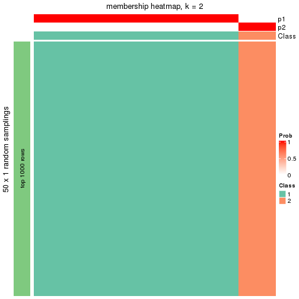</p>

</div>
<div id='tab-node-05-membership-heatmap-2'>
<pre><code class="r">membership_heatmap(res, k = 3)
</code></pre>

<p></p>

</div>
<div id='tab-node-05-membership-heatmap-3'>
<pre><code class="r">membership_heatmap(res, k = 4)
</code></pre>

<p></p>

</div>
<div id='tab-node-05-membership-heatmap-4'>
<pre><code class="r">membership_heatmap(res, k = 5)
</code></pre>

<p></p>

</div>
<div id='tab-node-05-membership-heatmap-5'>
<pre><code class="r">membership_heatmap(res, k = 6)
</code></pre>

<p>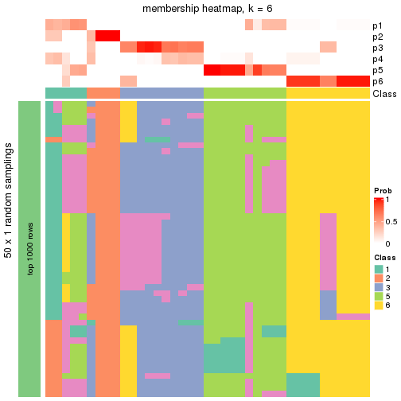</p>

</div>
<div id='tab-node-05-membership-heatmap-6'>
<pre><code class="r">membership_heatmap(res, k = 7)
</code></pre>

<p></p>

</div>
<div id='tab-node-05-membership-heatmap-7'>
<pre><code class="r">membership_heatmap(res, k = 8)
</code></pre>

<p></p>

</div>
</div>

As soon as the classes for columns are determined, the signatures
that are significantly different between subgroups can be looked for. 
Following are the heatmaps for signatures.


<script>
$( function() {
	$( '#tabs-node-05-get-signatures' ).tabs();
} );
</script>
<div id='tabs-node-05-get-signatures'>
<ul>
<li><a href='#tab-node-05-get-signatures-1'>k = 2</a></li>
<li><a href='#tab-node-05-get-signatures-2'>k = 3</a></li>
<li><a href='#tab-node-05-get-signatures-3'>k = 4</a></li>
<li><a href='#tab-node-05-get-signatures-4'>k = 5</a></li>
<li><a href='#tab-node-05-get-signatures-5'>k = 6</a></li>
<li><a href='#tab-node-05-get-signatures-6'>k = 7</a></li>
<li><a href='#tab-node-05-get-signatures-7'>k = 8</a></li>
</ul>
<div id='tab-node-05-get-signatures-1'>
<pre><code class="r">get_signatures(res, k = 2)
</code></pre>

<p></p>

</div>
<div id='tab-node-05-get-signatures-2'>
<pre><code class="r">get_signatures(res, k = 3)
</code></pre>

<p></p>

</div>
<div id='tab-node-05-get-signatures-3'>
<pre><code class="r">get_signatures(res, k = 4)
</code></pre>

<p>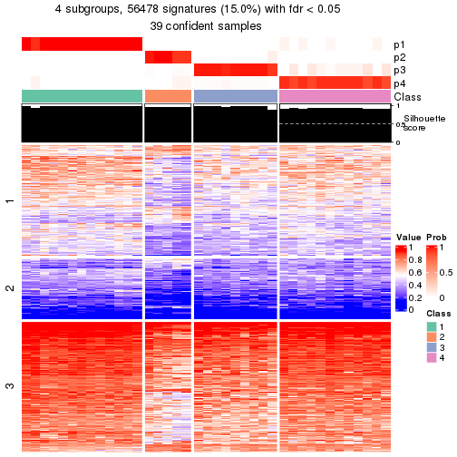</p>

</div>
<div id='tab-node-05-get-signatures-4'>
<pre><code class="r">get_signatures(res, k = 5)
</code></pre>

<p>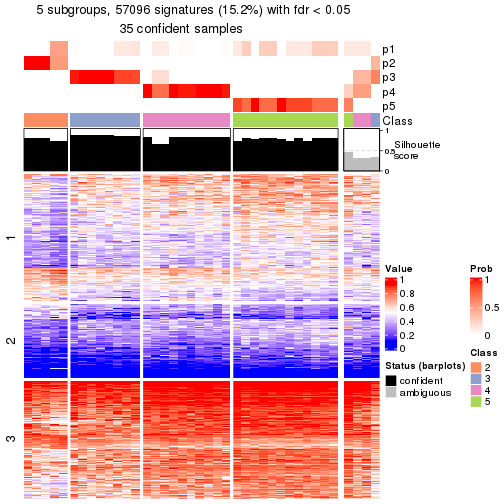</p>

</div>
<div id='tab-node-05-get-signatures-5'>
<pre><code class="r">get_signatures(res, k = 6)
</code></pre>

<p></p>

</div>
<div id='tab-node-05-get-signatures-6'>
<pre><code class="r">get_signatures(res, k = 7)
</code></pre>

<p></p>

</div>
<div id='tab-node-05-get-signatures-7'>
<pre><code class="r">get_signatures(res, k = 8)
</code></pre>

<p></p>

</div>
</div>


Compare the overlap of signatures from different k:

```r
compare_signatures(res)
```


`get_signature()` returns a data frame invisibly. To get the list of signatures, the function
call should be assigned to a variable explicitly. In following code, if `plot` argument is set
to `FALSE`, no heatmap is plotted while only the differential analysis is performed.

```r
# code only for demonstration
tb = get_signature(res, k = ..., plot = FALSE)
```

An example of the output of `tb` is:

```
#>   which_row         fdr    mean_1    mean_2 scaled_mean_1 scaled_mean_2 km
#> 1        38 0.042760348  8.373488  9.131774    -0.5533452     0.5164555  1
#> 2        40 0.018707592  7.106213  8.469186    -0.6173731     0.5762149  1
#> 3        55 0.019134737 10.221463 11.207825    -0.6159697     0.5749050  1
#> 4        59 0.006059896  5.921854  7.869574    -0.6899429     0.6439467  1
#> 5        60 0.018055526  8.928898 10.211722    -0.6204761     0.5791110  1
#> 6        98 0.009384629 15.714769 14.887706     0.6635654    -0.6193277  2
...
```

The columns in `tb` are:

1. `which_row`: row indices corresponding to the input matrix.
2. `fdr`: FDR for the differential test. 
3. `mean_x`: The mean value in group x.
4. `scaled_mean_x`: The mean value in group x after rows are scaled.
5. `km`: Row groups if k-means clustering is applied to rows (which is done by automatically selecting number of clusters).

If there are too many signatures, `top_signatures = ...` can be set to only show the 
signatures with the highest FDRs:

```r
# code only for demonstration
# e.g. to show the top 500 most significant rows
tb = get_signature(res, k = ..., top_signatures = 500)
```

If the signatures are defined as these which are uniquely high in current group, `diff_method` argument
can be set to `"uniquely_high_in_one_group"`:

```r
# code only for demonstration
tb = get_signature(res, k = ..., diff_method = "uniquely_high_in_one_group")
```


UMAP plot which shows how samples are separated.


<script>
$( function() {
	$( '#tabs-node-05-dimension-reduction' ).tabs();
} );
</script>
<div id='tabs-node-05-dimension-reduction'>
<ul>
<li><a href='#tab-node-05-dimension-reduction-1'>k = 2</a></li>
<li><a href='#tab-node-05-dimension-reduction-2'>k = 3</a></li>
<li><a href='#tab-node-05-dimension-reduction-3'>k = 4</a></li>
<li><a href='#tab-node-05-dimension-reduction-4'>k = 5</a></li>
<li><a href='#tab-node-05-dimension-reduction-5'>k = 6</a></li>
<li><a href='#tab-node-05-dimension-reduction-6'>k = 7</a></li>
<li><a href='#tab-node-05-dimension-reduction-7'>k = 8</a></li>
</ul>
<div id='tab-node-05-dimension-reduction-1'>
<pre><code class="r">dimension_reduction(res, k = 2, method = &quot;UMAP&quot;)
</code></pre>

<p></p>

</div>
<div id='tab-node-05-dimension-reduction-2'>
<pre><code class="r">dimension_reduction(res, k = 3, method = &quot;UMAP&quot;)
</code></pre>

<p></p>

</div>
<div id='tab-node-05-dimension-reduction-3'>
<pre><code class="r">dimension_reduction(res, k = 4, method = &quot;UMAP&quot;)
</code></pre>

<p></p>

</div>
<div id='tab-node-05-dimension-reduction-4'>
<pre><code class="r">dimension_reduction(res, k = 5, method = &quot;UMAP&quot;)
</code></pre>

<p></p>

</div>
<div id='tab-node-05-dimension-reduction-5'>
<pre><code class="r">dimension_reduction(res, k = 6, method = &quot;UMAP&quot;)
</code></pre>

<p></p>

</div>
<div id='tab-node-05-dimension-reduction-6'>
<pre><code class="r">dimension_reduction(res, k = 7, method = &quot;UMAP&quot;)
</code></pre>

<p></p>

</div>
<div id='tab-node-05-dimension-reduction-7'>
<pre><code class="r">dimension_reduction(res, k = 8, method = &quot;UMAP&quot;)
</code></pre>

<p></p>

</div>
</div>


Following heatmap shows how subgroups are split when increasing `k`:

```r
collect_classes(res)
```


If matrix rows can be associated to genes, consider to use `functional_enrichment(res,
...)` to perform function enrichment for the signature genes. See [this vignette](https://jokergoo.github.io/cola_vignettes/functional_enrichment.html) for more detailed explanations.


 

## Session info


```r
sessionInfo()
```

```
#> R version 4.1.0 (2021-05-18)
#> Platform: x86_64-pc-linux-gnu (64-bit)
#> Running under: CentOS Linux 7 (Core)
#> 
#> Matrix products: default
#> BLAS/LAPACK: /usr/lib64/libopenblas-r0.3.3.so
#> 
#> locale:
#>  [1] LC_CTYPE=en_US.UTF-8       LC_NUMERIC=C               LC_TIME=en_US.UTF-8       
#>  [4] LC_COLLATE=en_US.UTF-8     LC_MONETARY=en_US.UTF-8    LC_MESSAGES=en_US.UTF-8   
#>  [7] LC_PAPER=en_US.UTF-8       LC_NAME=C                  LC_ADDRESS=C              
#> [10] LC_TELEPHONE=C             LC_MEASUREMENT=en_US.UTF-8 LC_IDENTIFICATION=C       
#> 
#> attached base packages:
#> [1] grid      stats     graphics  grDevices utils     datasets  methods   base     
#> 
#> other attached packages:
#> [1] genefilter_1.74.0    ComplexHeatmap_2.8.0 markdown_1.1         knitr_1.33          
#> [5] matrixStats_0.59.0   cola_1.9.4          
#> 
#> loaded via a namespace (and not attached):
#>   [1] bitops_1.0-7           bit64_4.0.5            doParallel_1.0.16      RColorBrewer_1.1-2    
#>   [5] httr_1.4.2             GenomeInfoDb_1.28.1    data.tree_1.0.0        tools_4.1.0           
#>   [9] utf8_1.2.1             R6_2.5.0               irlba_2.3.3            DBI_1.1.1             
#>  [13] BiocGenerics_0.38.0    colorspace_2.0-2       GetoptLong_1.0.5       gridExtra_2.3         
#>  [17] tidyselect_1.1.1       bit_4.0.4              compiler_4.1.0         Biobase_2.52.0        
#>  [21] Cairo_1.5-12.2         xml2_1.3.2             microbenchmark_1.4-7   slam_0.1-48           
#>  [25] scales_1.1.1           askpass_1.1            stringr_1.4.0          digest_0.6.27         
#>  [29] XVector_0.32.0         pkgconfig_2.0.3        umap_0.2.7.0           fastmap_1.1.0         
#>  [33] highr_0.9              rlang_0.4.11           GlobalOptions_0.1.2    rstudioapi_0.13       
#>  [37] RSQLite_2.2.7          impute_1.66.0          generics_0.1.0         shape_1.4.6           
#>  [41] jsonlite_1.7.2         mclust_5.4.7           dplyr_1.0.7            dendextend_1.15.1     
#>  [45] RCurl_1.98-1.3         magrittr_2.0.1         GenomeInfoDbData_1.2.6 Matrix_1.3-4          
#>  [49] fansi_0.5.0            Rcpp_1.0.7             munsell_0.5.0          S4Vectors_0.30.0      
#>  [53] viridis_0.6.1          reticulate_1.20        lifecycle_1.0.0        scatterplot3d_0.3-41  
#>  [57] stringi_1.7.3          zlibbioc_1.38.0        blob_1.2.1             parallel_4.1.0        
#>  [61] crayon_1.4.1           lattice_0.20-44        Biostrings_2.60.1      splines_4.1.0         
#>  [65] annotate_1.70.0        circlize_0.4.13        KEGGREST_1.32.0        polylabelr_0.2.0      
#>  [69] pillar_1.6.1           rjson_0.2.20           codetools_0.2-18       stats4_4.1.0          
#>  [73] XML_3.99-0.6           glue_1.4.2             evaluate_0.14          png_0.1-7             
#>  [77] vctrs_0.3.8            foreach_1.5.1          polyclip_1.10-0        purrr_0.3.4           
#>  [81] gtable_0.3.0           openssl_1.4.4          assertthat_0.2.1       clue_0.3-59           
#>  [85] cachem_1.0.5           ggplot2_3.3.5          xfun_0.24              eulerr_6.1.0          
#>  [89] xtable_1.8-4           skmeans_0.2-13         RSpectra_0.16-0        viridisLite_0.4.0     
#>  [93] survival_3.2-11        tibble_3.1.2           Polychrome_1.3.1       iterators_1.0.13      
#>  [97] AnnotationDbi_1.54.1   memoise_2.0.0          IRanges_2.26.0         cluster_2.1.2         
#> [101] ellipsis_0.3.2         brew_1.0-6
```


